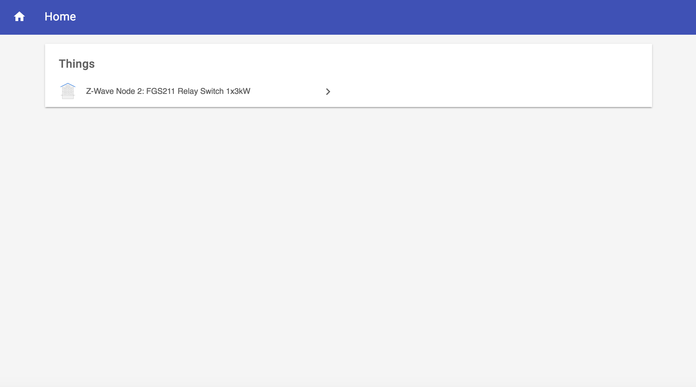
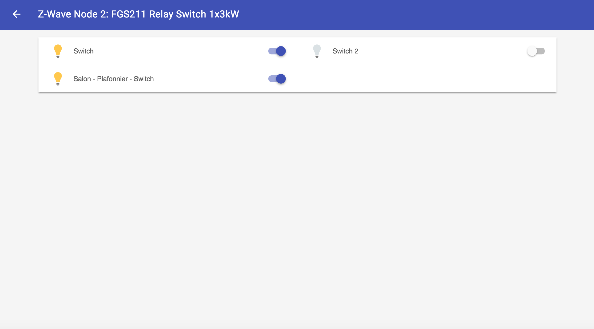

# Sitemap

## What is *sitemap* for ?

<<< TO BE COMPLETED >>>

## The *home* *sitemap*

A default *sitemap* is autogenerated by OpenHab (or HABmin ?). You can use it from **BasicUI** and from **ClassicUI**, but it cannot be modified directly.

The first level of the *sitemap* lists the *Things*. The following screenshot illustrates this level seen from the *BasicUI*.

The second level lists the *Items* of the selected *Things*.

> The *Thing* name that is displayed is the autogenerated name.

> The *Item* name that is displayed is the label that you are able to modify (see *Configuring a thing* chapter for more)

## Personalised *sitemap*

<<< MY CURRENT WORK >>>