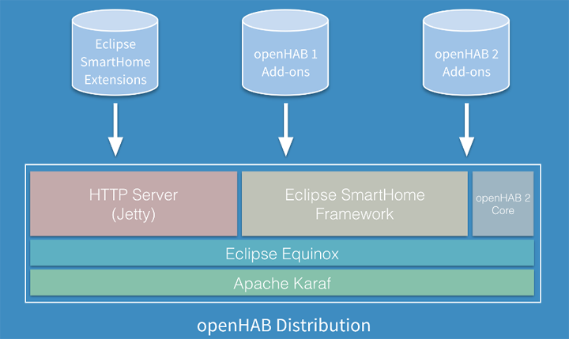



# A bit more about openHAB 2

OpenHAB is a __software__ for integrating different home automation systems and technologies into one single solution that allows over-arching automation rules and that offers uniform user interfaces.

But openHAB is also a __community__ of users, contributors and maintainers.

In this chapter, we are going to see a little bit more of these two aspects.

# OpenHAB structure

OpenHAB 2 is an open-source solution based on the [Eclipse SmartHome]() framework. It is fully written in Java and uses [Apache Karaf](http://karaf.apache.org/) together with [Eclipse Equinox](https://www.eclipse.org/equinox/) as an OSGi runtime and bundles this with [Jetty](https://www.eclipse.org/jetty/) as an HTTP server.

OpenHAB is a highly modular software, which means that the base installation (the "runtime") can be extended through different kinds of "add-ons", either to communicate with new home automation solution or to offer a new kind of user interface.

The structure of openHAB can be summarised this way :

Add-ons can come from three different origins :

* add-ons coming from the Eclipse SmartHome project, as Eclipse SmartHome is the base of OpenHAB 2,

* add-ons coming from the OpenHAB version 1 package, as OpenHAB 2 includes a compatibility layer,

* add-ons made for OpenHAB 2.

We will learn more about add-ons in the following chapters.

# The OpenHAB community

OpenHAB is not only a solution but also a community.

The center of this community is the [openHAB forum](https://community.openhab.org).

If you have questions about the use of openHAB, before reporting an issue, or for comments and contributions about the documentation, please check the [openHAB forum](https://community.openhab.org) for solutions and help. More people will see your issue when it is posted in the forum and community members may be able to help you find known solutions/workarounds for your issue.

Rules about posting an issue and __contributions guidelines__ are in the _Reference Guide_.