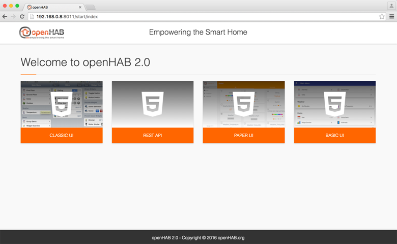



Setting up openHAB
-------------------------------

Warnings
=====

In this chapter:

- We have chosen to download the latest night build, as openHAB 2 is in a beta phase,
- We have decided to use the online version of openHAB.

Installing openHAB
=========

To do this :

* Go to the following site (it contains the latest version) : [https://openhab.ci.cloudbees.com/job/openHAB-Distribution](https://openhab.ci.cloudbees.com/job/openHAB-Distribution).
* Click on the link: `openhab-online-2.0.0-SNAPSHOT.zip`, to download it in your "download" folder.
* Open the terminal window.
* Choose a folder name to host your install. The directory will be created in your home folder. Be aware that the path to this folder, and the name of the folder itself, __must not contain any space character__ in order to prevent this classical cause of crash. The name chosen here is `openHAB`.
* Use the `ls` command in order to check that your directory does not exists yet.

```
cal:~ callas$ ls
Desktop			Movies
Documents		Music
Downloads		Pictures
Library			Public
```

* Move the downloaded file. Assuming that you have downloaded the file in your download folder, the command will be:

```
cal:~ admin$ mv Downloads/openhab-online-2 OpenHab
```

* Use the "ls" command in order to check that your directory exists now.

```
cal:~ callas$ ls
Desktop			Movies	Public
Documents		Music
Downloads		openHAB
Library			Pictures
```

Tweaking the install
================================

We have great chances that the standard openHAB port, the port 80, is already used by some Mac Os tools or software. To avoid any issue, we will change the default port used in openHAB install.

* Move inside the openHAB folder using the "cd" command.

```
cal:~ callas$ cd openHAB/
```

* Use the "ls" command in order to check what is inside.

```
cal:openHAB admin$ ls
LICENSE.TXT	conf		start.bat	start_debug.bat	userdata
addons		runtime		start.sh	start_debug.sh
```

* Edit the start batch (start.sh), using the text editor `nano`

```
cal:openHAB admin$ nano start.sh
```

* Your screen should display the following.


```
GNU nano 2.0.6                    File: start.sh
#!/bin/sh

echo Launching the openHAB runtime...

DIRNAME=`dirname "$0"`
exec "${DIRNAME}/runtime/karaf/bin/karaf" "${@}"


[ Read 6 lines ]
^G Get Help     ^O WriteOut     ^R Read File    ^Y Prev Page    ^K Cut Text     ^C Cur Pos
^X Exit         ^J Justify      ^W Where Is     ^V Next Page    ^U UnCut Text   ^T To Spell
```

* Use the cursor key in order to move down just the line before `DIRNAME='dirname "$0"'`.
* Type the two following line (use the enter key at the end of the first line):

```
export OPENHAB_HTTP_PORT=8011
export OPENHAB_HTTPS_PORT=8444
```

* Your screen should now display something like :


```
GNU nano 2.0.6                    File: start.sh                                    Modified

#!/bin/sh

export OPENHAB_HTTP_PORT=8011
export OPENHAB_HTTPS_PORT=8444

echo Launching the openHAB runtime...

DIRNAME=`dirname "$0"`
exec "${DIRNAME}/runtime/karaf/bin/karaf" "${@}"


^G Get Help     ^O WriteOut     ^R Read File    ^Y Prev Page    ^K Cut Text     ^C Cur Pos
^X Exit         ^J Justify      ^W Where Is     ^V Next Page    ^U UnCut Text   ^T To Spell
```

* Save your modification by pressing `control-o`, and then `enter`. The `Modified` mention that appeared at the top right of the screen after your first modifications has now disappeared.

* Close nano by pressing `control-x`.

* Your terminal window should looks like:

```
cal:~ admin$ cd openHAB/
cal:openHAB callas$ ls
LICENSE.TXT	conf		start.bat	start_debug.bat	userdata
addons		runtime		start.sh	start_debug.sh
cal:openHAB callas$ nano start.sh
cal:openHAB callas$
```

Launching openHAB for the first time
====================================

We are going to launch openHAB for the first time, in order to check that our install is successful.

* In the terminal window, type ./start.sh

```
cal:~ admin$ cd openHAB/
cal:openHAB callas$ ls
LICENSE.TXT	conf		start.bat	start_debug.bat	userdata
addons		runtime		start.sh	start_debug.sh
cal:openHAB callas$ nano start.sh
cal:openHAB callas$ __./start.sh__
```

* Messages are displayed, wait until the "openhab>" prompt appears.

```
cal:openHAB admin$ ./start.sh
Launching the openHAB runtime...

__  _____    ____
____  ____  ___  ____  / / / /   |  / __ )
/ __ \/ __ \/ _ \/ __ \/ /_/ / /| | / __  |
/ /_/ / /_/ /  __/ / / / __  / ___ |/ /_/ /
\____/ .___/\___/_/ /_/_/ /_/_/  |_/_____/
/_/                        2.0.0-SNAPSHOT

Hit '<tab>' for a list of available commands
and '[cmd] --help' for help on a specific command.
Hit '<ctrl-d>' or type 'system:shutdown' or 'logout' to shutdown openHAB.

openhab>
```

* Without closing the terminal, open your favorite web browser and type the following url : [http://localhost:8011](http://localhost:8011), you should see the openHab welcome screen.




> **Which browser should I use?**
>
> Safari is supported by openHAB, but the fact is the browser used by the openHAB developer community - and by the owner of the ZWave plugin - is Google Chrome.
> We recommend then Google Chrome, as openHAB 2 is in a beta phase.

