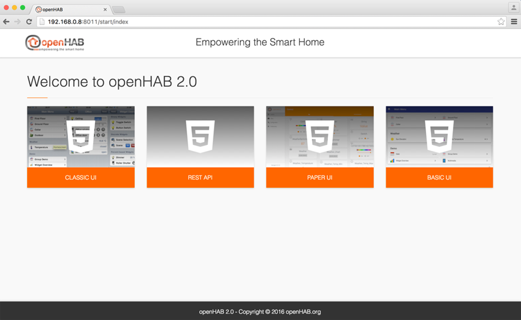
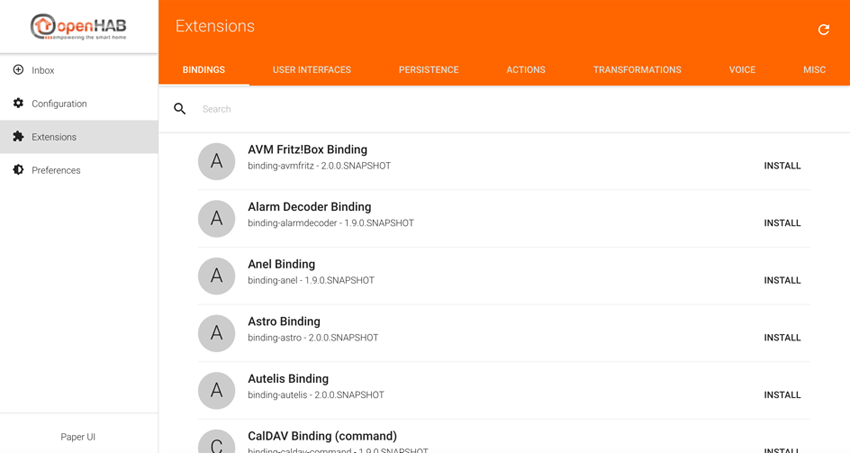
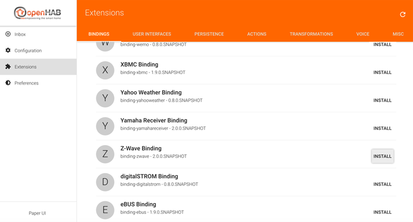
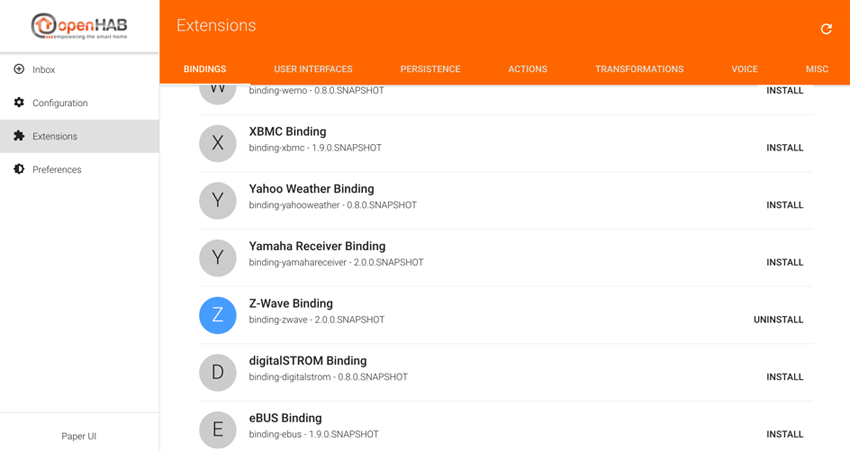
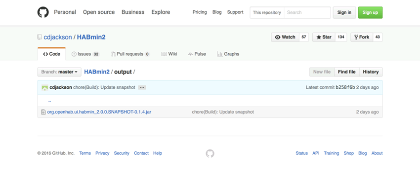
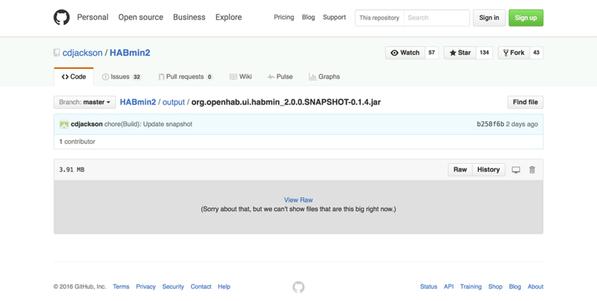
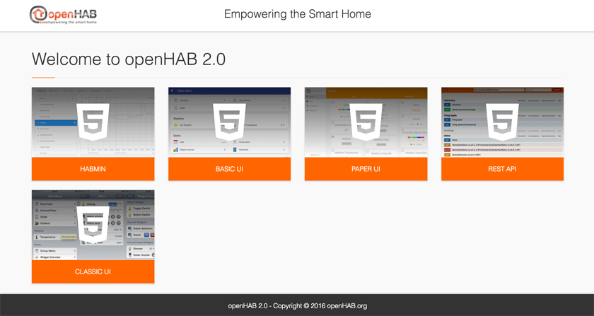



# Installing the extensions

Introduction
==============

Setting up the Z-Wave protocol inside OpenHab 2 requires two steps :
- Z-Wave binding install
- HABmin install

In this chapter:
- I have chosen to download the latest nigth build, as HABmin2 2 is in a beta phase,


Z-Wave binding install
======================

We install Z-Wave binding _before_ HABmin as HABmin relies on the first one.

Installing this binding is quite straightforward. It is to be done through the Paper UI of OpenHab.

* Open your browser web at `http://localhost:8011`, you should see the following screen :



* Click on __Paper UI__ tile, you should see the following screen :


* In the left column, select __Extensions__. The list of the bindings appears.



* Scroll down to Z-Wave binding, click on __install__ (at the right).



* After some times, the Z-Wave binding is installed and the display has changed. The logo of the binding is now blue, and "uninstall" has replaced "install".



> After a reasonable wait, if the progress bar is still on the screen and nothing else has changed on the display, try to refresh the page.


HABmin install
======================

---

*Guidelines : this section is so far centered on Mac OS. It must be modified in order to cover Linux and Windows.*


---

We install HABmin _after_ the Z-Wave binding as HABmin relies on the last one.

HABmin is not yet integrated to the Karaf architecture. So, we have to install it manually.

* Search for the latest build of HABmin 2 at the adress [https://github.com/cdjackson/HABmin2/tree/master/output](https://github.com/cdjackson/HABmin2/tree/master/output)

* Click on the org.openhab.ui.habmin_2.0.0.SNAPSHOT-0.1.4.jar link, this screen appears:



* At the left on the screen __click on the RAW__ button. Other way of downloading HABmin2 will corrupt the software.



* The download finished, back to the terminal, at the OpenHab> prompt :

```
	cal:OpenHab admin$ ./start.sh
	Launching the openHAB runtime...

                              __  _____    ____
	  ____  ____  ___  ____  / / / /   |  / __ )
	 / __ \/ __ \/ _ \/ __ \/ /_/ / /| | / __  |
	/ /_/ / /_/ /  __/ / / / __  / ___ |/ /_/ /
	\____/ .___/\___/_/ /_/_/ /_/_/  |_/_____/
	    /_/                        2.0.0-SNAPSHOT

	Hit '<tab>' for a list of available commands
	and '[cmd] --help' for help on a specific command.
	Hit '<ctrl-d>' or type 'system:shutdown' or 'logout' to shutdown openHAB.

	openhab>
```

* stop OpenHab by keyboarding logout and enter :
```
	openhab> logout
```

* A few seconds after, the terminal prompt is displayed :
```
	openhab> logout
	cal:OpenHab callas$
```

* Move the HABmin software from the _download_ folder to the _addon_ folder
```
	cal:OpenHab callas$ mv ../Downloads/org.openhab.ui.habmin_2.0.0.SNAPSHOT-0.1.4.jar addons
```


> Time for a trick
>
> _org.openhab.ui.habmin 2.0.0.SNAPSHOT-0.1.4.jar_  can be a little difficult to type. Terminal allows us to use auto completion to avoid that :
> just type the beginning, i.e. : `mv ../Downloads/org.op` and press the tab key. Terminal will complete the name for you.

Launching OpenHab for the second time
====================================

We are going to launch OpenHab for the first time, in order to check that our install is successful.

* In the terminal window, type ./start.sh
```
cal:OpenHab callas$ ./start.sh
```

* Messages are displayed, wait until the "openhab>" prompt appears.

```
cal:OpenHab admin$ ./start.sh
Launching the openHAB runtime...

   	                      __  _____    ____
  ____  ____  ___  ____  / / / /   |  / __ )
 / __ \/ __ \/ _ \/ __ \/ /_/ / /| | / __  |
/ /_/ / /_/ /  __/ / / / __  / ___ |/ /_/ /
\____/ .___/\___/_/ /_/_/ /_/_/  |_/_____/
    /_/                        2.0.0-SNAPSHOT

Hit '<tab>' for a list of available commands
and '[cmd] --help' for help on a specific command.
Hit '<ctrl-d>' or type 'system:shutdown' or 'logout' to shutdown openHAB.

openhab>
```

* Without closing the terminal, open your favorite web browser and type the following url : `http://localhost:8011`, you should see the openHab welcome screen, __with a new UI__ : __HABMIN__.




> Which browser should I use ?

> Safari is supported by OpenHab, but the fact is that browser used by the OpenHab developer community - and by the owner of the ZWave plugin - is Google Chrome.
> I recommend then Google Chrome, as OpenHab 2 is in a beta phase.


