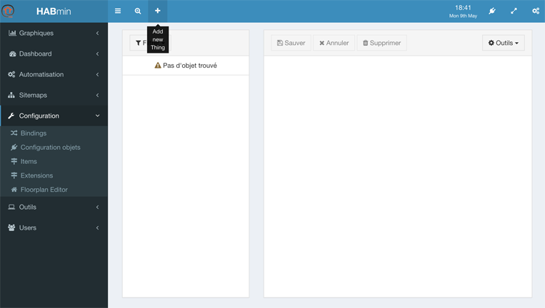
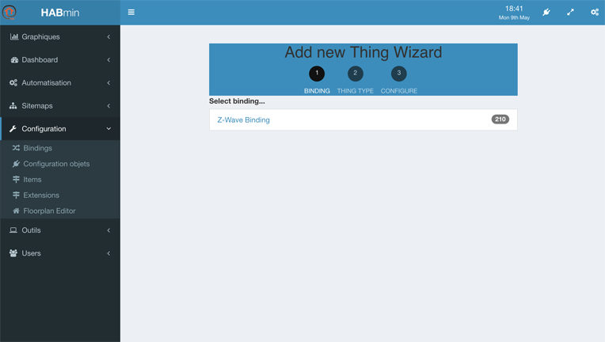
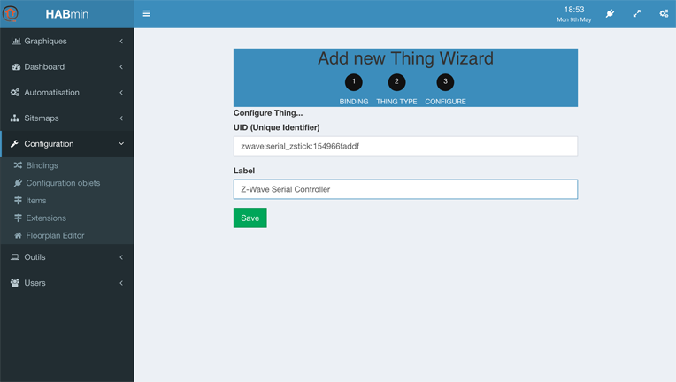
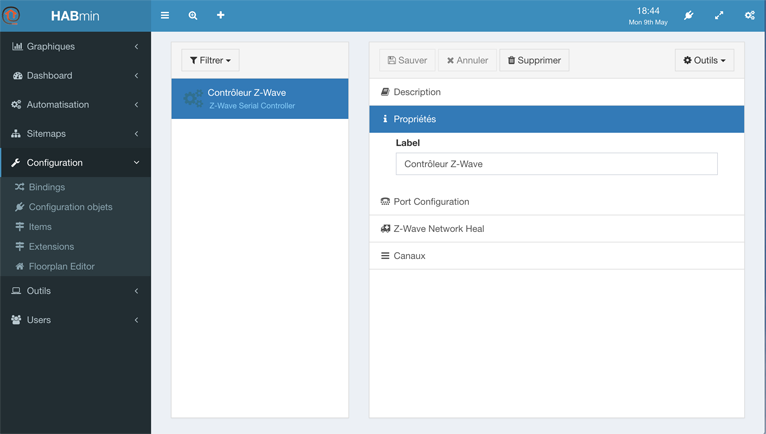
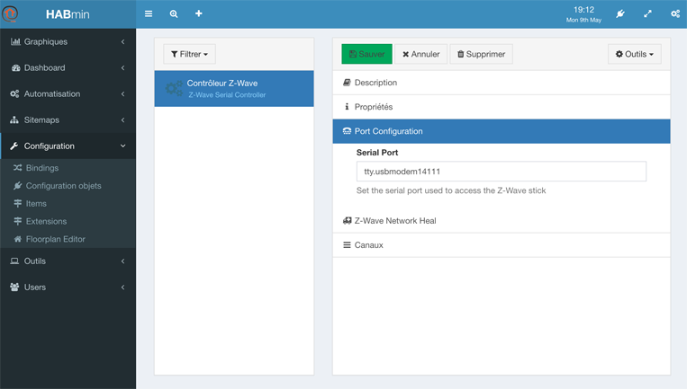
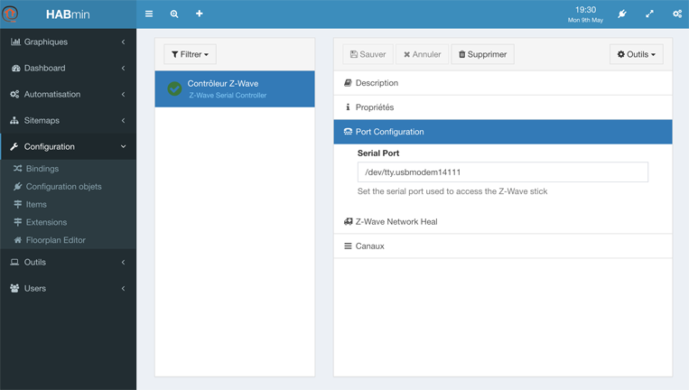



# Connecting to the Z-Wave controller

## What is the controller ?

The Z-wave controller is the masterpiece of the Z-Wave network.

The Z-Wave bindings relies on it to dialog with the Z-Wave devices. Adding it is made from the __HABmin__.

Working with the Z-Wave devices will be done in __HABmin__.


## Adding the Thing

* From OpenHab welcome screen, choose the __HABmin__ tile.
* On the left menu, click on __Configuration__ and __Things configuration__.
* The controller must be added manually. Click on the __+__ sign, at the top of the screen.



* In the following screen, choose __Z-Wave Binding__ :



* You can then select : __Z-Wave Serial Controller__ :


* In the following screen, you can change the __label__ value to the name you want to give to the controller.



* Click on save, and you are ready to configure it.

> When click on __Save__, nothing change on the screen, but the log file confirms that a next thing has been defined.
> The log files looks like:

```
2016-05-09 18:53:33.987 [INFO ] [smarthome.event.ThingAddedEvent     ] - Thing 'zwave:serial_zstick:154966faddf' has been added.
2016-05-09 18:53:33.990 [ERROR] [ing.zwave.handler.ZWaveSerialHandler] - ZWave port is not set.
2016-05-09 18:53:33.990 [INFO ] [me.event.ThingStatusInfoChangedEvent] - 'zwave:serial_zstick:154966faddf' changed from UNINITIALIZED to INITIALIZING
```

## Configuring it

* On the left menu, click again on  __Things configuration__, the controller is now in the list :


* Click on the Controller
* The following screen allows you to configure the Thing.



## Configuring the port
---
*Guidelines : this section is so far centered on Mac OS. It must be modified in order to cover Linux and Windows.*
---

### Finding the port name

* Open the terminal window
* Type the following command `ls \dev\tty*`
* Depending on your USB device, the name can look like `/dev/tty.SLAB_USBtoUART` or `/dev/tty.usbmodem14111`

The port name that is displayed is the parameter needed 

### Setting the port name

* Click on Port configuration
* Fill the serial port with the port name



* Click on save
* After a few seconds, the thing icon becomes greens



> If you made any kind of mistake in the port configuration, the icon will become red.
> The log file will contain this kind of lines:
>
```
2016-05-09 19:14:27.162 [INFO ] [ing.zwave.handler.ZWaveSerialHandler] - Stopped ZWave serial handler
2016-05-09 19:14:27.163 [INFO ] [ing.zwave.handler.ZWaveSerialHandler] - Connecting to serial port 'usbmodem14111'
2016-05-09 19:14:27.163 [INFO ] [smarthome.event.ThingUpdatedEvent   ] - Thing 'zwave:serial_zstick:154966faddf' has been updated.
2016-05-09 19:14:27.165 [INFO ] [me.event.ThingStatusInfoChangedEvent] - 'zwave:serial_zstick:154966faddf' changed from OFFLINE (COMMUNICATION_ERROR): Serial Error: Port tty.usbmodem14111 does not exist to OFFLINE
2016-05-09 19:14:27.166 [INFO ] [me.event.ThingStatusInfoChangedEvent] - 'zwave:serial_zstick:154966faddf' changed from OFFLINE to OFFLINE (COMMUNICATION_ERROR): Serial Error: Port usbmodem14111 does not exist
```

### Looking to the logs

The console will display messages related to the binding initialisation.`

> A "clean" startup looks this way in the log file :
>
```
2016-05-09 21:29:33.195 [INFO ] [arthome.ui.paper.internal.PaperUIApp] - Started Paper UI at /ui
2016-05-09 21:29:33.252 [INFO ] [.dashboard.internal.DashboardService] - Started dashboard at /start
2016-05-09 21:29:33.567 [INFO ] [ing.zwave.handler.ZWaveSerialHandler] - Serial port is initialized
2016-05-09 21:29:33.626 [INFO ] [ui.habmin.internal.servlet.HABminApp] - Started HABmin servlet at /habmin
2016-05-09 21:29:33.478 [INFO ] [me.event.ThingStatusInfoChangedEvent] - 'zwave:serial_zstick:154966faddf' changed from UNINITIALIZED to INITIALIZING
2016-05-09 21:29:33.479 [INFO ] [me.event.ThingStatusInfoChangedEvent] - 'zwave:serial_zstick:154966faddf' changed from INITIALIZING to OFFLINE
2016-05-09 21:29:33.490 [INFO ] [ing.zwave.handler.ZWaveSerialHandler] - Connecting to serial port '/dev/tty.usbmodem14111'
2016-05-09 21:29:33.682 [INFO ] [ve.internal.protocol.ZWaveController] - Starting ZWave controller
2016-05-09 21:29:33.683 [INFO ] [ve.internal.protocol.ZWaveController] - ZWave timeout is set to 5000ms. Soft reset is false.
2016-05-09 21:29:33.802 [INFO ] [basic.internal.servlet.WebAppServlet] - Started Basic UI at /basicui/app
2016-05-09 21:29:31.896 [INFO ] [smarthome.event.ThingAddedEvent     ] - Thing 'zwave:serial_zstick:154966faddf' has been added.
2016-05-09 21:29:33.823 [INFO ] [assic.internal.servlet.WebAppServlet] - Started Classic UI at /classicui/app
2016-05-09 21:29:36.875 [INFO ] [age.SerialApiGetInitDataMessageClass] - NODE 1: Node found
2016-05-09 21:29:36.876 [INFO ] [age.SerialApiGetInitDataMessageClass] - ZWave Controller using Controller API
2016-05-09 21:29:36.876 [INFO ] [age.SerialApiGetInitDataMessageClass] - ZWave Controller is Primary Controller
2016-05-09 21:29:36.876 [INFO ] [age.SerialApiGetInitDataMessageClass] - ------------Number of Nodes Found Registered to ZWave Controller------------
2016-05-09 21:29:36.876 [INFO ] [age.SerialApiGetInitDataMessageClass] - # Nodes = 1
2016-05-09 21:29:36.877 [INFO ] [age.SerialApiGetInitDataMessageClass] - ----------------------------------------------------------------------------
2016-05-09 21:29:36.881 [INFO ] [me.event.ThingStatusInfoChangedEvent] - 'zwave:serial_zstick:154966faddf' changed from OFFLINE to ONLINE
``` 


