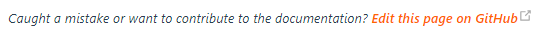

# openHAB 2.x Documentation Project

## Introduction

This repository contains the documentation for openHAB.

The result is available at [https://www.openhab.org/docs/](https://www.openhab.org/docs/) and [https://www.openhab.org/addons/](https://www.openhab.org/addons/).

## How it works

In this repo you can find and improve all *general* documentation contents.
In fact that is all you can see in the `master` branch.
There are also other *read-only* branches, which hold external content like the *add-ons* and *concepts* documentation.
We will read about them later.

### So I can't improve an add-on article here?

Correct, this is done in the original repository of the add-on.
You may want to know how to find the right file in all of those repos?
This is fairly easy: 
on most of the documentation pages on https://www.openhab.org/, 
you will find the following link at the bottom, which will point you directly to the file you want to improve.

When your improvement has been made and merged, we will get the updated article automatically through our build mechanism.
This happens mostly once a day. Afterwards your change is included in the next build of the openHAB website.

## Contributing to the Documentation

The documentation is a community effort, so everyone is welcome to suggest changes, add new sections and fix bugs.
This is done exactly the same way as for the code repositories, simply through pull requests against this repo.
When editing a page through the _"Edit this page on GitHub"_ link on the website, you will be given the opportunity to
create a pull request directly from GitHub. 
Please read our [contribution guidelines](CONTRIBUTING.md) and try to follow
them as best as you can before submitting a change for review - but don't worry if you don't understand all of them, we
will help you to get it right.

## So what are the other branches for?

We use them to bring together all relevant articles or to archive versioned content.
Mostly those branches will get updated automatically through our continuous integration builds.
You can read a bit more below about our external ressources and how we get them.

### Automatically Generated Parts

Those parts include __all__ add-on documentation files, no matter if they are from the Eclipse SmartHome repo, the
`openhab1-addons` repo, the `openhab2-addons` repo or any special binding repo like *habmin*, *zwave* or the *alexa skill*.
The "Concepts" articles also come from Eclipse SmartHome and are maintained there.

We are keeping all those files at their original location, because it simply doesn't make sense to keep them here.
Imagine you want to do an improvement of the zwave binding and have to update the readme file in a completely different place.
That's twice the effort and also we would have to coordinate two Pull Requests.
So we are saving time for everyone by keeping those files at their original location along with the code.

### How the documentation build works

We have set up our [build server](https://ci.openhab.org/view/Documentation/) to do the magic automatically.
There are several triggers (mostly time based), which will then *gather the external contents* and move them to our *final* branch.
You can find this migrated external content in the *final* branch under:

- `_addons_*`
- `concepts`

You can even have a look at how this works in detail.
The external content is updated by the following toolchain:

- `update-external-resources.sh` → `pom.xml` → `process_addons.groovy`

Everything that gets updated in the *master* branch will be also merged over to the *final* branch automatically.
Afterwards we will redeploy the website with the latest content from the *final* branch at regular intervals.

## Documentation Versioning

Just as openHAB is released in versions, the documentation website provides fixed versions of the documentation articles, e.g., [https://www.openhab.org/v2.2/installation/linux.html](https://www.openhab.org/v2.2/installation/linux.html)

Please see [this issue](https://github.com/openhab/openhab-docs/issues/520#issuecomment-339741820) for all details regarding the tagging and branching approach.
In short, the following has to be considered:

- Versions like "2.1.0" are marked by git tags.
- Based on tags branches like "2.1-patch" are created, to include later discovered changes (like fixed links).

When a version is tagged (or updated), a static version of the website has to be generated and copied into the correct sub-folder, this is currently a manual operation described succinctly here: https://github.com/openhab/website/issues/72
