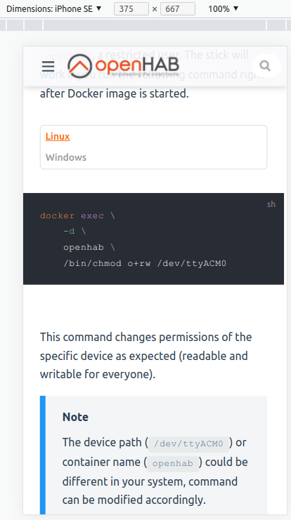

# openHAB Documentation Project

## Introduction

This repository contains the documentation for openHAB.x.

The result is available at [https://openhab.org/docs/](https://www.openhab.org/docs/) and [https://openhab.org/addons/](https://www.openhab.org/addons/).

## How it works

In this repo you can find and improve all _general_ documentation contents.
In fact, that is all you can see in the `main` branch.
There are other _read-only_ branches, which hold external content like the _add-ons_ and _concepts_ documentation, which is explained in more details below.

### So I cannot improve an add-on article here?

Correct, this is done in the original repository of the add-on.
You may want to know how to find the right file in all of those repos?
This is fairly easy:
on most of the documentation pages on <https://openhab.org/>,
you will find the following link at the bottom, which will point you directly to the file you want to improve.


When your improvement has been made and merged, we will get the updated article automatically through our build mechanism.
This happens mostly once a day. Afterwards your change is included in the next build of the openHAB website.

## Contributing to the Documentation

The documentation is a community effort, so everyone is welcome to suggest changes, add new sections and fix bugs.
This is done exactly the same way as for the code repositories, simply through pull requests against this repo.
When editing a page through the _"Edit this page on GitHub"_ link on the website, you will be given the opportunity to create a pull request directly from GitHub.
Please read our [contribution guidelines](.github/CONTRIBUTING.md) and try to follow them as best as you can before submitting a change for review —
but don't worry if you don't understand all of them, we will help you to get it right.

### A few words on animated GIFs

Animated GIFs are a great way to show how something works, but they can also be quite large in file size.
To keep the documentation website fast and responsive, we have a few recommendations regarding animated GIFs:

- **Keep them short**: Try to limit the duration of the GIF to a few seconds. If you need to show a longer process, consider breaking it into multiple shorter GIFs.
- **Optimize the file size**: Use tools like [Licecap](https://www.cockos.com/licecap/) to capture animated GIFs on Windows, or [Gifsicle](https://www.lcdf.org/gifsicle/) to optimize existing GIFs.
  Usually, you can reduce file size significantly by reducing the number of colors to a palette of 256 colours: `gifsicle -O3 --colors 256 -i input.gif -o output.gif`
- **Use them sparingly**: Only use animated GIFs when they add significant value to the documentation. If a static image can convey the same information, prefer the image.

### Inline images

Regular markdown images work well for things like screenshots, but when documenting e.g. UIs, and you want to focus on a particular component on the screen, this might not be ideal.
You have to explain for example "the button to the far right, second from the top", and this might not even be true on all devices and layouts.
In situations like this, it can be better to make a small image of just the component, a button for example, and then use that inline in the text.

To achieve this, a small Vue component called `InlineImage` has been created.
Using it is outside "regular Markdown syntax", which is why it is explained here.
Here is an example of the syntax:

```vue
<InlineImage alt="Select button" height="1.2em" :src="require('./images/select-button.png')" />
```

This component will transform into a regular HTML `` element, so any valid `` attributes can be used here too.
`alt` should be defined to have something to show if the image doesn't load for some reason.
`:src` must be specified using `require('./<relative path to image')`, and it must have the leading `:` to make sure that it's processed as code, not text.
Files are shuffled around when the documentation is built, and this is a way to make sure that the source link remains valid after the documentation has been build.
The component has two "custom" attributes/properties: `height` and `vertical-align`.
These can take any valid CSS values, and default to `1.5em` and `text-bottom` respectively, meaning that if not specified, the image will be scaled to 1.5 time the height of the text with the bottom of the image aligned to the bottom of the text.
Adjust as required.

Use of the component can be found in `tutorials/getting_started/rules_basic.md`, if you find it easier to refer to an example.

### How to build the documentation locally

It is possible to build a preview version of the documentation on your local machine.
The following software is required:

- [`NodeJS = 16.20.1`](https://nodejs.org/en)
- [`Ruby >= 3.3.2`](https://www.ruby-lang.org/en/)

We recommend to use [Node Version Manager](https://github.com/nvm-sh/nvm) as well as [Ruby Version Manager](https://rvm.io/) to easily allow using multiple versions of NodeJS and Ruby for multiple projects.
If you don't do that, you can simply start by only installing the above mentioned versions.

When using `nvm` and/or `rvm`, setup the NodeJS and/or Ruby version:

```shell script
nvm use
rvm use
```

If `nvm` and/or `rvm` complain about the required versions not being installed, you can install them as following:

```shell script
nvm install 16.20.1
rvm install ruby-3.3.2
```

Next, you can build & serve the documentation preview:

```shell script
npm run serve-preview
```

The local preview is available under the following URLs:

- <http://0.0.0.0:8080/docs>
- <http://localhost:8080/docs>

This will also allow you to preview how the page renders on different devices using the respective browser tools:



## So what are the other branches for?

We use them to bring together all relevant articles or to archive versioned content.
Mostly, those branches will get updated automatically through our continuous integration builds.
You can read a bit more below about our external resources and how we get them.

### Automatically Generated Parts

Those parts include **all** add-on documentation files, no matter if they are from the [openhab-core](https://github.com/openhab/openhab-core) repo, the [openhab-addons](https://github.com/openhab/openhab-core) repo,
any special binding repos like [org.openhab.binding.zwave](https://github.com/openhab/org.openhab.binding.zwave) or other repos like [openhab-android](https://github.com/openhab/openhab-android).

We are keeping all those files at their original location, because it simply doesn't make sense to keep them here.
Imagine you want to do an improvement of the Z-Wave binding and have to update the readme file in a completely different place.
That's twice the effort, and also we would have to coordinate two Pull Requests.
So we are saving time for everyone by keeping those files at their original location along with the code.

### How the documentation build works

#### Snapshot Documentation: [next.openhab.org](https://next.openhab.org/docs/)

We have set up our [build server](https://ci.openhab.org/view/Documentation/) to do the magic automatically.
There are several triggers (mostly time-based), which will then _gather the external contents_ and move them to our [final](https://github.com/openhab/openhab-docs/tree/final) branch.
You can find this migrated external content in the _final_ branch for example under the following paths:

- `_addons_*`
- `_ecosystem`
- `addons/uis/apps/*`

You can even have a look at how this works in detail.
The external content is updated by the following toolchain:

- `update-external-resources.sh` → `pom.xml` → `process_addons.groovy` + `process_thing_types.groovy`

Everything that gets updated in the _main_ branch will be also merged over to the _final_ branch automatically.
Afterwards, we will redeploy the website with the latest content from the _final_ branch at regular intervals.

##### Build triggers investigated

There are two triggers available currently.
The `merge docs` job is triggered after something has been added to the _main_ branch of this repository.
The `gather external docs` job is started with a **successful** build of the openhab-distribution.
A successful distribution build will include all the latest changes that have been made to external sources like add-ons.
So when a distribution build is successful, it will trigger the gathering of all external sources.

When one of these jobs is finished, it will then notify our website hosting service to start a new website build.
This is recognised due to new commits in the final branch of this repository.
The new build will include all the latest changes in the code repository and in all external repositories.

#### Stable Documentation: [www.openhab.org](https://www.openhab.org/docs/)

Our stable documentation is built from the _final-stable_ branch of this repository.
It normally does not need to be updated, as there are no changes made to openHAB after a release that would require a change in the documentation.
But as you might have already noticed, the _final-stable_ branch does also include documentation for software from the openHAB ecosystem with its independent release cycles, e.g. openHABian or our mobile apps.

When a new release of such software is made, the _final-stable_ documentation branch needs to be updated to reflect the changes.
This is done through the `fetch_external_docs` GitHub action workflows residing in the [`.github/workflows`](.github/workflows) folder of the _main_ branch.
The `fetch_external_docs` workflows are triggered by a new release of the software in question, and it will then create a PR to the _final-stable_ branch with the latest documentation from the respective repository.

When one of these PRs is merged, the change to the _final-stable_ branch will trigger a new build of the website, which will then be deployed to [www.openhab.org](https://www.openhab.org/docs/).

## Documentation Versioning

Just as openHAB is released in versions, the documentation website provides fixed versions of the documentation articles, e.g., [https://www.openhab.org/v2.2/installation/linux.html](https://www.openhab.org/v2.2/installation/linux.html)

Please see [this issue](https://github.com/openhab/openhab-docs/issues/520#issuecomment-339741820) for all details regarding the tagging and branching approach.
In short, the following has to be considered:

- Versions like "2.1.0" are marked by git tags.
- Based on tags branches like "2.1-patch" are created, to include later discovered changes (like fixed links).

When a version is tagged (or updated), a static version of the website has to be generated and copied into the correct sub-folder, this is currently a manual operation described succinctly here: <https://github.com/openhab/website/issues/72>
