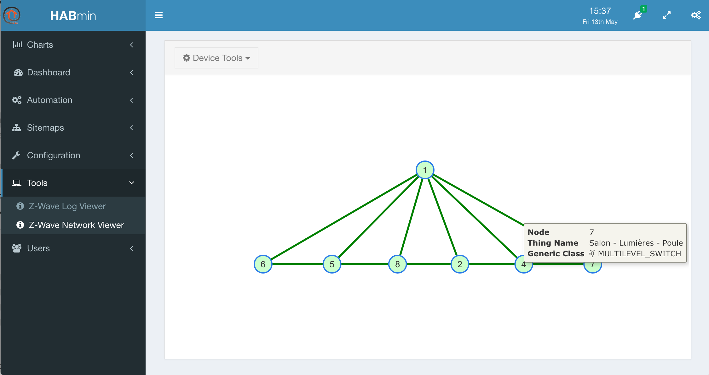
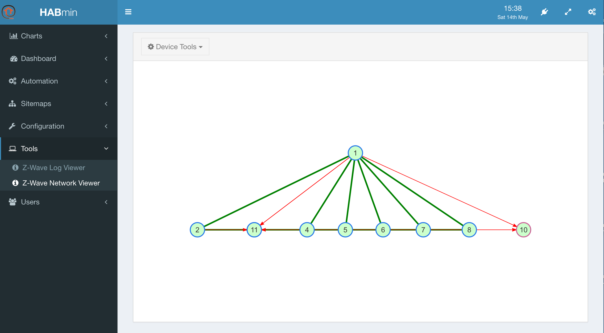

# Other tools of Habmin

## The Sitemap viewer

<<< WAITING FOR BEING FUNCTIONNAL IN HABMIN >>>

## The Z-Wave network viewer

In the left menu, click on *Tools*, *Z-Wave network viewer*.

The viewer display a graph of the network. You can have information about the node by clicking on it.

When a node has any kind of error, it is displayed in red.

> 
A typical error is the one displayed when a battery powered device is added to the network. Habmin has to wait for the next waking time of the device in order to complete the setup of the device. Meanwhile, the node will display as "unknown"
device and in error.

