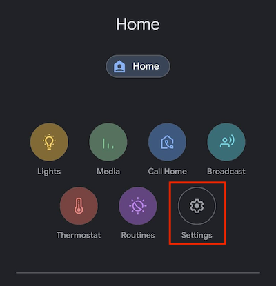
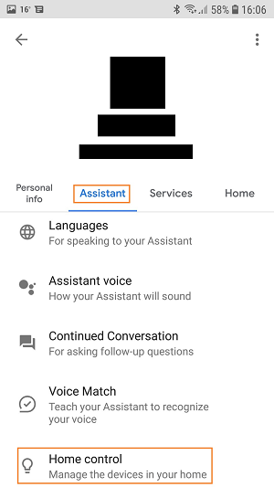
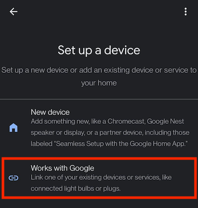
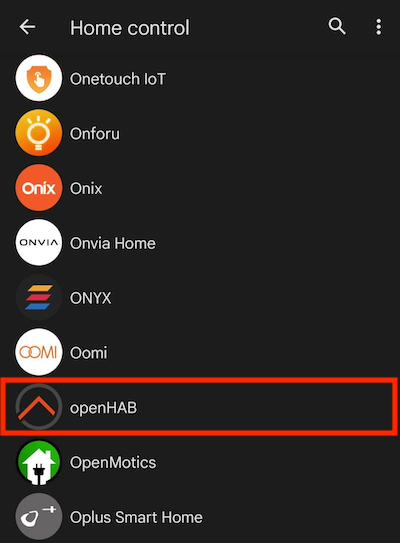
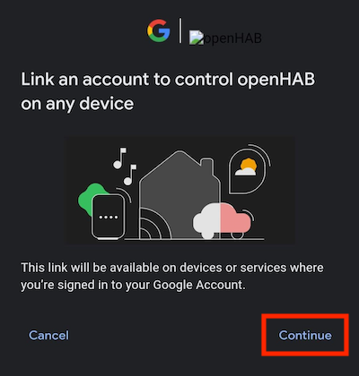
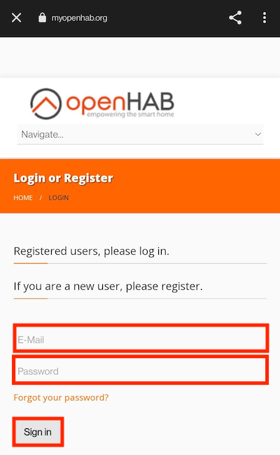
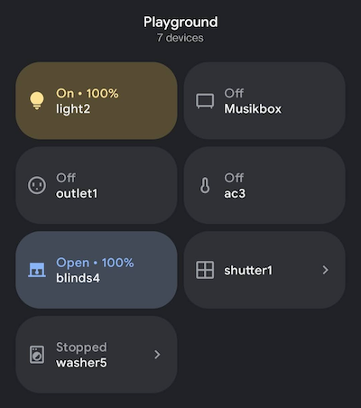
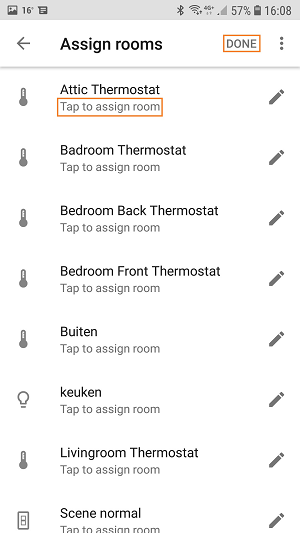
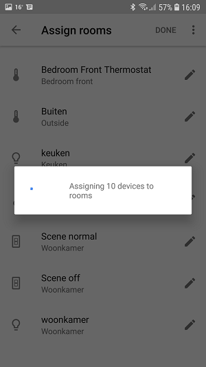

# Google Assistant Action

Google Assistant is Google’s virtual personal assistant and uses Actions on Google as the platform for "Actions" (software applications) to extend the functionality of the Google Assistant. Users engage Google Assistant in conversation to get things done, like controlling their devices and things at home. You can use the officially certified openHAB Action for Google Assistant to easily manage and control your smart home by conversational experiences between you and your openHAB smart home powered by voiced commands.

This guide describes step by step how to use the [openHAB Google Assistant Smart Home Action](https://assistant.google.com/services/a/uid/000000f5c61c627e?hl=en-US&source=web). The openHAB Action links your openHAB setup through the [myopenHAB.org](https://www.myopenhab.org) cloud service to the Google Assistant platform (for technical insights, please refer to this [guide](https://github.com/openhab/openhab-google-assistant/blob/master/README.md) to read more about setup options and development information).

With the Action you can voice control your openHAB items and it supports lights, plugs, switches and thermostats. The openHAB Action comes with multiple language support like English, German or French language.

# General Configuration Instructions

## Requirements

* [openHAB Cloud Connector](http://docs.openhab.org/addons/ios/openhabcloud/readme.html) configured using myopenHAB.org. (Items DO NOT need to be exposed to and will not show up on myopenHAB.org, this is only needed for the IFTTT service!)
* Google account.
* Google Home or Google Home mini.

## Item configuration
In openHAB 2 Items are exposed via [tags](https://www.openhab.org/docs/configuration/items.html#item-definition-and-syntax). Currently the following Tags are supported (also depending on Googles API capabilities):

* Switch / Dimmer / Color ["Lighting"]
* Switch ["Switchable"]
* Switch ["Outlet"]
* Switch ["Fan"]
* Switch ["CoffeeMaker"]
* Switch ["WaterHeater"]
* Switch ["Fireplace"]
* Switch ["Valve"]
* Switch ["Sprinkler"]
* Switch ["Vacuum"]
* Switch ["Scene"]
* Switch ["Lock"]
* Rollershutter ["Awning"]
* Rollershutter ["Blinds"]
* Rollershutter ["Curtain"]
* Rollershutter ["Door"]
* Rollershutter ["Garage"]
* Rollershutter ["Gate"]
* Rollershutter ["Pergola"]
* Rollershutter ["Shutter"]
* Rollershutter ["Window"]
* Group ["Thermostat"]
* Number ["CurrentTemperature"] as part of Thermostat.
* Number ["CurrentHumidity"] as part of Thermostat.
* Number ["homekit:TargetTemperature"] as part of Thermostat.
* Number / String ["homekit:TargetHeatingCoolingMode"] as part of Thermostat.

  ```
  Switch KitchenLights "Kitchen Lights" <light> (gKitchen) [ "Switchable" ]
  Dimmer BedroomLights "Bedroom Lights" <light> (gBedroom) [ "Lighting" ]
  Color LivingroomLights "Livingroom Lights" <light> (gLivingroom) [ "Lighting" ]
  Switch SceneMovie "Scene Movie" (gLivingroom) [ "Scene" ]
  Switch CristmasTree "Cristmas Tree" (gLivingroom) [ "Outlet" ]
  Switch DoorLock "Door Lock" [ "Lock" ]

  //Thermostat Setup (Google requires a mode, even if you manually set it up in openHAB)
  Group g_HK_Basement_TSTAT "Basement Thermostat" [ "Thermostat", "Fahrenheit" ]
  Number HK_Basement_Mode "Basement Heating/Cooling Mode" (g_HK_Basement_TSTAT) [ "homekit:TargetHeatingCoolingMode" ]
  Number HK_Basement_Temp "Basement Temperature" (g_HK_Basement_TSTAT) [ "CurrentTemperature" ]
  Number HK_Basement_Humid "Basement Humidity" (g_HK_Basement_TSTAT) [ "CurrentHumidity" ]
  Number HK_Basement_Setpoint "Basement Setpoint" (g_HK_Basement_TSTAT) [ "homekit:TargetTemperature" ]
  ```

Item labels are not mandatory in openHAB, but for the Google Assistant Action they are absolutely necessary!

It is the "label text" (e.g. "Kitchen Lights" for example above) and not the item's name that will be available to you via vocal commands or in the Google Home app, so make it unique and easy to say!

NOTA : tags are not (yet?) available via paperUI. Either you create your items via ".items" files, or you can:
- assign tags via REST api :
 ```
 curl -X PUT --header “Content-Type: application/json” --header “Accept: application/json” “http://localhost:8080/rest/items/[itemname]/tags/Lighting
  ```
- assign tags via console :
 ```
 smarthome:items addTag MickTest Lighting
 ```

Notes Regarding Thermostat Items:
- Thermostat requires a group to be properly setup with Google Assistant, default format is Celsius.
- There must be at least 3 elements:
  * (Mandatory) Mode: Number (Zwave THERMOSTAT_MODE Format) or String (off, heat, cool, on).
  * (Mandatory) Current Temperature: Number.
  * (Mandatory) Target Temperature: Number.
  * (Optional) Current Humidity: Number.
- If your thermostat does not have a mode, you should create one and manually assign a value (e.g. heat, cool, on, etc.) to have proper functionality.
- See also HomeKit Addon for further formatting details.

## Setup & Usage on Google Assistant App
* Make sure Google Play Services is up to date.
* Visit "Google Home" app entry in Google Play Store on Android.
* Set up the voice-activated speaker, Pixel, or Android phone (version 6+) with the same  account.
* Make sure you're the correct user.
* Start the updated Google Home app on your phone.
* Go to the settings part: `Account > Settings`.



* Go to the home control part: `Assistant > Home control`.



* Press the `+` button.



* Select `openHAB`.



* Login at myopenhab.org with your username and password.



* Allow Google access to your account.




* You will now be able to see your previously tagged items and devices. Assign them to a room. Press Done.




* You can now control those devices from the Google Assistant.


## Example Voice Commands

Here are some example voice commands:

 * Turn on Office Lights.
 * Dim/Brighten Office Lights (increments 15%).
 * Set Office Lights to 35%.
 * Open/Close the blinds
 * Turn off Pool Waterfall.
 * Turn on House Fan.
 * Turn on Home Theater Scene.
 * Set Basement Thermostat to 15 degrees.
 * What is the current Basement Thermostat Temperature?

 ## Frequently Asked Question

 My New items did not appear in the Google Home app.

 * Say: Hey Google, sync my devices.

 I'm not able to connect openHAB to Google Home.

* Check, recheck and after that check again your items!
* The items that you want to expose to Google Assistant should have the right tags.
* The items that you want to expose to Google Assistant must have a item label! [Item Definition and Syntax](https://www.openhab.org/docs/configuration/items.html#item-definition-and-syntax)
* If you expose thermostats make sure than you have:
  * A group item with the tag [ "Thermostat" ]
  * A number or string item with the tag [ "homekit:TargetHeatingCoolingMode" ]
  * A number item with the tag [ "CurrentTemperature" ]
  * A number item with the tag [ "homekit:TargetTemperature" ]
  ```
  Group g_HK_Basement_TSTAT "Basement Thermostat" [ "Thermostat", "Fahrenheit" ]
  Number HK_Basement_Mode "Basement Heating/Cooling Mode" (g_HK_Basement_TSTAT) [ "homekit:TargetHeatingCoolingMode" ]
  Number HK_Basement_Temp "Basement Temperature" (g_HK_Basement_TSTAT) [ "CurrentTemperature" ]
  Number HK_Basement_Setpoint "Basement Setpoint" (g_HK_Basement_TSTAT) [ "homekit:TargetTemperature" ]
  ```
* If none of the above solutions works for you:
  * Remove all the tags.
  * Make a new .item file with 1 item to expose.
  ```
  Switch TestLight "Test Light" [ "Switchable" ]
  ```
  * Relink your account.

