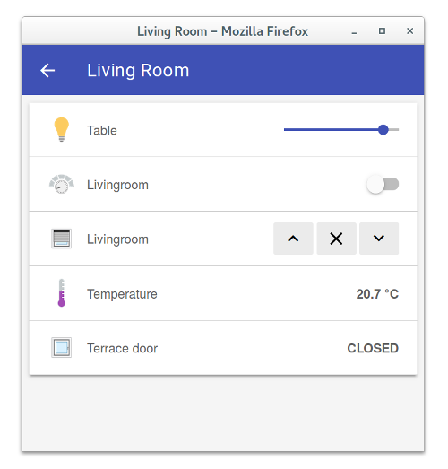

<!-- Attention authors: Do not edit directly. Please add your changes to the appropriate source repository -->



# Basic UI

The Basic UI is a web interface based on Material Design Lite from Google.

## Features

- Responsive layout suitable for various screen sizes
- AJAX navigation
- Live update

## Configuration

```
org.openhab.basicui:defaultSitemap=demo
# Icons can be disabled
org.openhab.basicui:enableIcons=true
# Icons can be shown as PNG or SVG images
# Default: PNG
org.openhab.basicui:iconType=svg
```

## Accessing Sitemaps

The Basic UI has a default layout showing all things and their corresponding items. You may create your own sitemaps and access them through the basic UI in 2 ways.

1. Set the default sitemap via the UI via Settings -> Basic UI -> Configure, and set the Default Sitemap name.

2. Passing the "sitemap" parameter to the URL used to access the server.

Examples:

1. http://hostname:8080/basicui/app is a valid URL to load your default sitemap or to get a page listing all defined sitemaps when no default sitemap is configured.
2. http://hostname:8080/basicui/app?sitemap=sitemapname is a valid URL to load a particular sitemap.
3. http://hostname:8080/basicui/app/ is an invalid URL due to trailing slash.
4. http://hostname:8080/basicui/app?sitemap=sitemapname/ is an invalid URL due to trailing slash.

## Screenshots:

[](doc/screenshot-1-full.png)
[](doc/screenshot-2-full.png)

