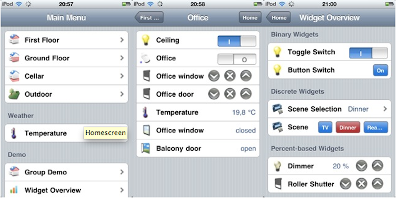

<!-- Attention authors: Do not edit directly. Please add your changes to the appropriate source repository -->



## Classic UI

The Classic UI is the original web user interface of openHAB 1 and thus is the most stable and widely used UI as of today.
Nonetheless, the look and feel does not match modern standards anymore, the [Basic UI](../basic/readme.html) is meant to be its successor.

The Classic UI is based on the [WebApp.Net](http://webapp-net.com/) framework and can be used by any (webkit-based) web browser. 

WebApp.Net consists mainly of Javascript and CSS files and thus has low expectations about the hardware capabilities of the client. In fact, it even works rather smoothly on an iPod 1st gen from 2008.

### Configuration

The Classic UI has a few configuration options, which can also be set through the [Paper UI](../paper/readme.html):

```
# Defining the default sitemap to use
org.eclipse.smarthome.classicui:defaultSitemap=demo

# The icon type to use, either png or svg
org.eclipse.smarthome.classicui:iconType=png

# Disable in-memory caching of html fragments
# If this is true, on every request the html files are loaded from disk (default is false)
org.eclipse.smarthome.classicui:disableHtmlCache=false
```

### Accessing Sitemaps

The Classic UI has a default layout showing all things and their corresponding items. You may create your own sitemaps and access them through the basic UI in 2 ways.

1. Set the default sitemap via the Paper UI via Configuration -> Services -> Classic UI -> Configure, and set the Default Sitemap name.

2. Passing the "sitemap" parameter to the URL used to access the server.

      Example: http://hostname:8080/classicui/app?sitemap=sitemapname

### Screenshots:



