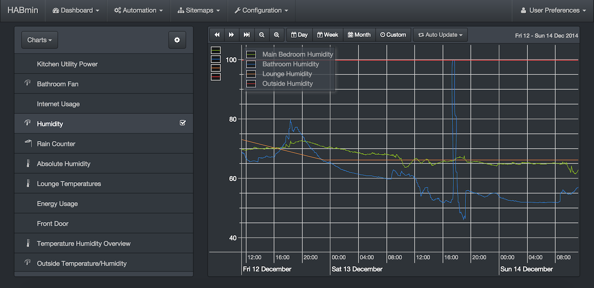
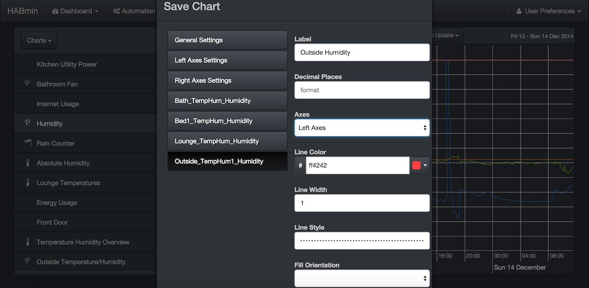
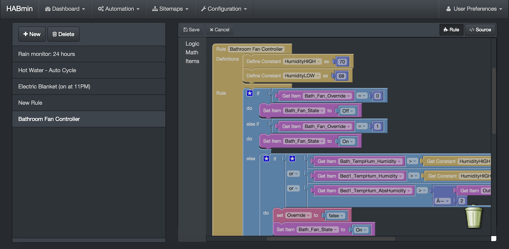
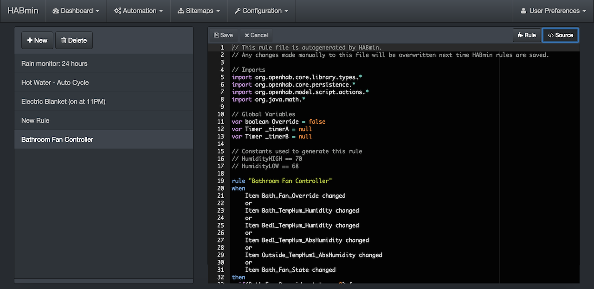
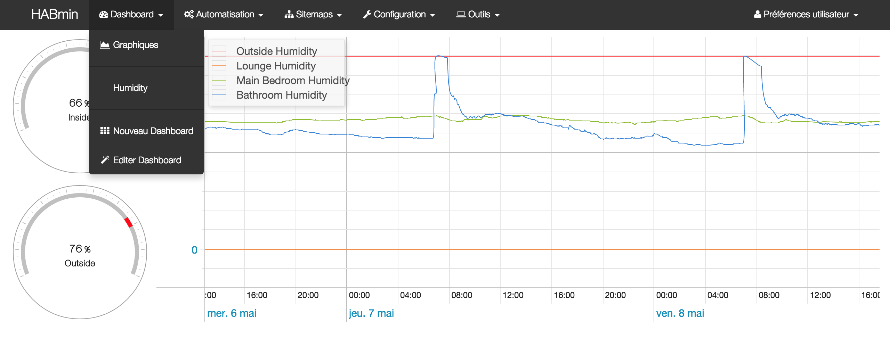
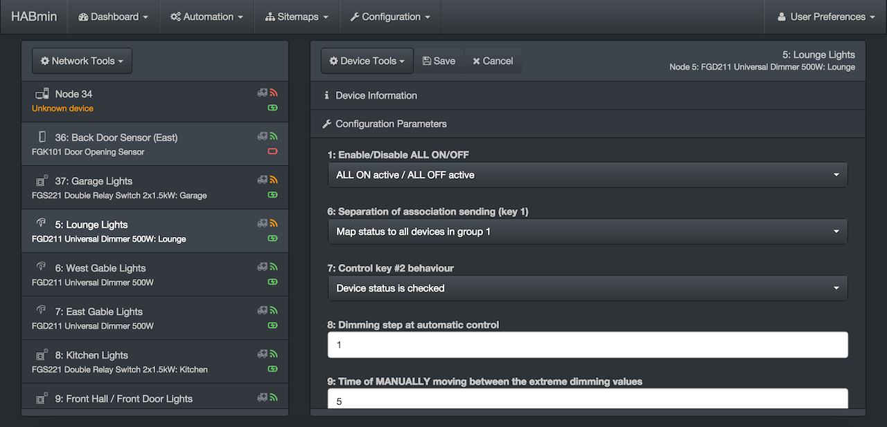
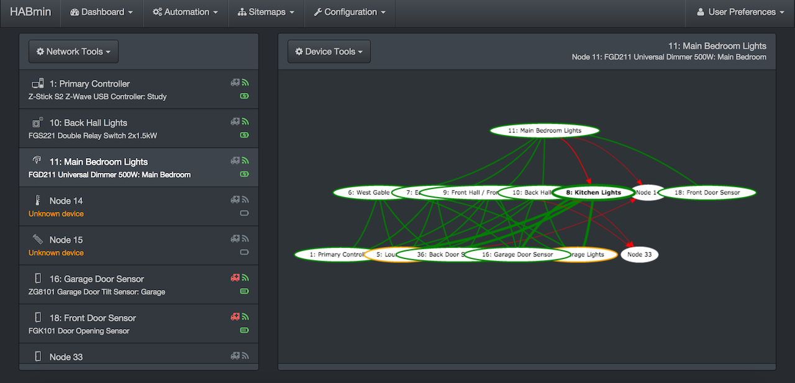
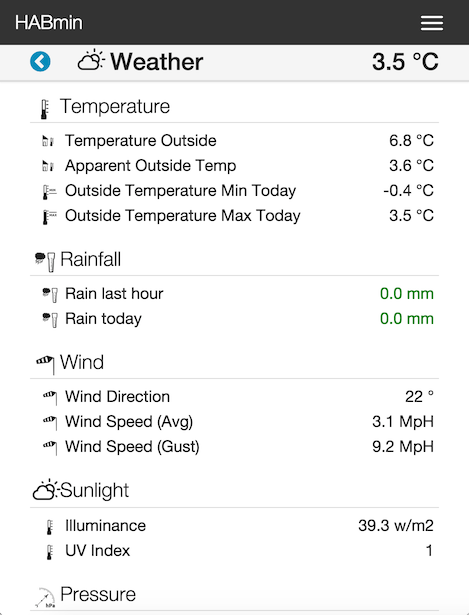

<!-- Attention authors: Do not edit directly. Please add your changes to the appropriate source repository -->



# HABmin

HABmin is a modern, professional and portable user interface for openHAB, providing both user and administrative functions (e.g., sitemaps for users, and configuration utilities to aid setup). 

## Features

* **Responsive**. Should work well on all devices. Of course some functions may be removed or be difficult to use on small devices (e.g., the graphical rule editor).
* **Theme-able**. Multiple themes are available - take your pick (currently 3 themes). If you want a different look, we're using [bootswatch](http://www.bootswatch.com) themes - vote for your favourite by [raising an issue](https://github.com/openhab/org.openhab.ui.habmin/issues/new).
* **Charting**. Modern, fast charting of historical data.
* **Graphical rule editor**. No need to learn rule syntax.
* **International support**. Currently translated in English, Deutsch, Français. Add support for your language...
* Available as native app for **Android**.

## Screenshots

The following images show a selection of screenshots. Note that the theme is user selectable, although most images are shown with a dark (*slate*) theme (except the mobile sitemap image).

Graphing a saved chart...

Editing a saved chart...

Editing rules (graphical editor)...

Editing rules (text editor)...

Dashboard view (Paper theme, French localisation)...

ZWave device configuration...

ZWave network routing diagram...

Sitemaps (mobile view using *yeti* theme)...

