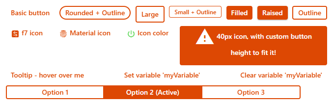
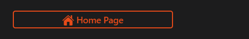
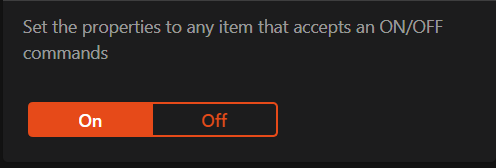
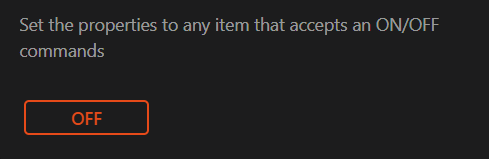
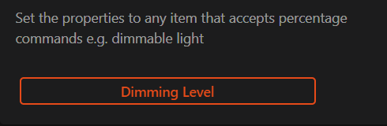
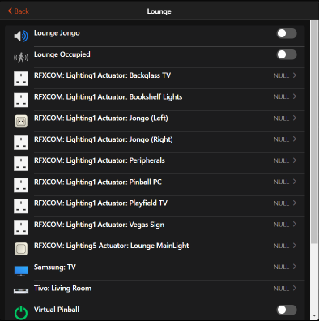
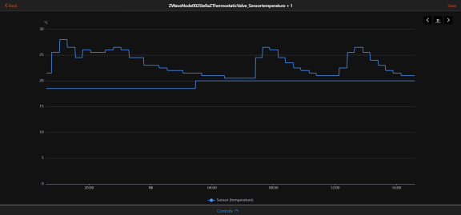
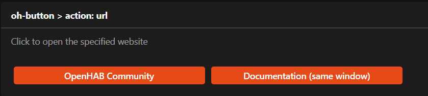
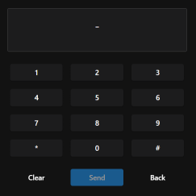
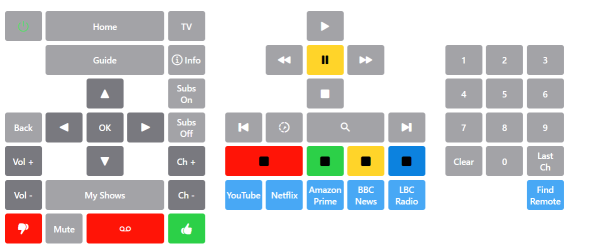

# oh-button - Button

<!-- GENERATED componentDescription -->
Button performing an action
<!-- GENERATED /componentDescription -->

[](#header)</a>

[[toc]]

## Usage / reference documents

* The `oh-button` component is based upon the [Framework 7 Vue button control (`f7-button`)](https://v5.framework7.io/vue/button.html).
* Component styles are applied by the [Framework 7 CSS variables](https://v5.framework7.io/docs/button.html#css-variables).  For guidance on how to customise styles see the [CSS Styles](https://openhab.org/docs/ui/building-pages.html#css-variables) section.
* Use the [`f7-segmented`](#f7-segmented) wrapper component to group buttons together.  Buttons with the property  `active: true` set will be highlighted/marked as selected.

## Configuration

<!-- GENERATED props -->
### General
<div class="props">
<PropGroup label="General">
<PropBlock type="TEXT" name="text" label="Text">
  <PropDescription>
    Button label
  </PropDescription>
</PropBlock>
<PropBlock type="BOOLEAN" name="round" label="Round">
  <PropDescription>
    Makes button round
  </PropDescription>
</PropBlock>
<PropBlock type="BOOLEAN" name="large" label="Large">
  <PropDescription>
    Makes button large
  </PropDescription>
</PropBlock>
<PropBlock type="BOOLEAN" name="small" label="Small">
  <PropDescription>
    Makes button small
  </PropDescription>
</PropBlock>
<PropBlock type="BOOLEAN" name="fill" label="Fill">
  <PropDescription>
    Makes button filled with color
  </PropDescription>
</PropBlock>
<PropBlock type="BOOLEAN" name="raised" label="Raised">
  <PropDescription>
    Makes button raised
  </PropDescription>
</PropBlock>
<PropBlock type="BOOLEAN" name="outline" label="Outline">
  <PropDescription>
    Makes button outline
  </PropDescription>
</PropBlock>
<PropBlock type="TEXT" name="active" label="Active">
  <PropDescription>
    Button is active (when part of a f7-segmented
  </PropDescription>
</PropBlock>
<PropBlock type="TEXT" name="iconF7" label="Icon">
  <PropDescription>
    Framework7 icon to display (<a class="external text-color-blue" target="_blank" href="https://framework7.io/icons/">Framework7 icon</a>)
  </PropDescription>
</PropBlock>
<PropBlock type="TEXT" name="iconMaterial" label="Icon">
  <PropDescription>
    Material design icon to display
  </PropDescription>
</PropBlock>
<PropBlock type="TEXT" name="iconColor" label="Icon Color">
  <PropDescription>
    Not applicable to openHAB icons
  </PropDescription>
</PropBlock>
<PropBlock type="INTEGER" name="iconSize" label="Icon Size">
  <PropDescription>
    Size of the icon in px
  </PropDescription>
</PropBlock>
<PropBlock type="TEXT" name="tooltip" label="Tooltip">
  <PropDescription>
    Button tooltip text to show on button hover/press
  </PropDescription>
</PropBlock>
<PropBlock type="TEXT" name="variable" label="Variable">
  <PropDescription>
    Name of the variable to set on input change
  </PropDescription>
</PropBlock>
<PropBlock type="TEXT" name="variableKey" label="Variable Key">
  <PropDescription>
    Consider the variable value is an object and set the corresponding deep property within that object using a key syntax. Examples: <code>user.name</code>, <code>user[0].address[1].street</code>, <code>[0]</code>, <code>[0].label</code>. The inner property and its parent hierarchy will be created if missing.
  </PropDescription>
</PropBlock>
<PropBlock type="BOOLEAN" name="clearVariable" label="Clear Variable After Action">
  <PropDescription>
    Name of the variable to clear after performing the action
  </PropDescription>
</PropBlock>
<PropBlock type="BOOLEAN" name="clearVariableKey" label="Clear Object Variable Property After Action">
  <PropDescription>
    Consider the variable value is an object and remove a corresponding deep property within that object using a key syntax. Examples: <code>user.name</code>, <code>user[0].address[1].street</code>, <code>[0]</code>, <code>[0].label</code>. The property will be removed after performing the action.
  </PropDescription>
</PropBlock>
</PropGroup>
</div>

### Action
<div class="props">
<PropGroup name="actions" label="Action">
  Action to perform when the element is clicked
<PropBlock type="TEXT" name="action" label="Action">
  <PropDescription>
    Type of action to perform
  </PropDescription>
  <PropOptions>
    <PropOption value="navigate" label="Navigate to page" />
    <PropOption value="command" label="Send command" />
    <PropOption value="toggle" label="Toggle Item" />
    <PropOption value="options" label="Command options" />
    <PropOption value="rule" label="Run scene, script or rule" />
    <PropOption value="popup" label="Open popup" />
    <PropOption value="popover" label="Open popover" />
    <PropOption value="sheet" label="Open sheet" />
    <PropOption value="photos" label="Open photo browser" />
    <PropOption value="group" label="Group details" />
    <PropOption value="analyzer" label="Analyze item(s)" />
    <PropOption value="url" label="External URL" />
    <PropOption value="variable" label="Set Variable" />
  </PropOptions>
</PropBlock>
<PropBlock type="TEXT" name="actionUrl" label="Action URL" context="url">
  <PropDescription>
    URL to navigate to
  </PropDescription>
</PropBlock>
<PropBlock type="BOOLEAN" name="actionUrlSameWindow" label="Open in same tab/window">
  <PropDescription>
    Open the URL in the same tab/window instead of a new one. This will exit the app.
  </PropDescription>
</PropBlock>
<PropBlock type="TEXT" name="actionItem" label="Action Item" context="item">
  <PropDescription>
    Item to perform the action on
  </PropDescription>
</PropBlock>
<PropBlock type="TEXT" name="actionCommand" label="Action Command">
  <PropDescription>
    Command to send to the Item. If "Toogle Item" is selected as the action, only send the command when the state is different
  </PropDescription>
</PropBlock>
<PropBlock type="TEXT" name="actionCommandAlt" label="Action Toggle Command">
  <PropDescription>
    Command to send to the Item when "Toggle Item" is selected as the action, and the Item's state is equal to the command above
  </PropDescription>
</PropBlock>
<PropBlock type="TEXT" name="actionOptions" label="Command Options">
  <PropDescription>
    Comma-separated list of options; if omitted, retrieve the command options from the Item dynamically. Use <code>value=label</code> format to provide a label different than the option.
  </PropDescription>
</PropBlock>
<PropBlock type="TEXT" name="actionRule" label="Scene, Script or Rule" context="rule">
  <PropDescription>
    Scene, Script or Rule to run
  </PropDescription>
</PropBlock>
<PropBlock type="TEXT" name="actionRuleContext" label="Context" context="script">
  <PropDescription>
    Object representing the optional context to pass. Edit in YAML or provide a JSON object, e.g. <code>{ "param1": "value1", "param2": { "subkey1": "testing", "subkey2": 123 } }</code>.
  </PropDescription>
</PropBlock>
<PropBlock type="TEXT" name="actionPage" label="Page" context="page">
  <PropDescription>
    Page to navigate to
  </PropDescription>
</PropBlock>
<PropBlock type="TEXT" name="actionPageTransition" label="Transition Effect">
  <PropDescription>
    Use a specific <a class="external text-color-blue" target="_blank" href="https://framework7.io/docs/view.html#custom-page-transitions">page transition animation</a>
  </PropDescription>
  <PropOptions>
    <PropOption value="f7-circle" label="Circle" />
    <PropOption value="f7-cover" label="Cover" />
    <PropOption value="f7-cover-v" label="Cover from bottom" />
    <PropOption value="f7-dive" label="Dive" />
    <PropOption value="f7-fade" label="Fade" />
    <PropOption value="f7-flip" label="Flip" />
    <PropOption value="f7-parallax" label="Parallax" />
    <PropOption value="f7-push" label="Push" />
  </PropOptions>
</PropBlock>
<PropBlock type="TEXT" name="actionModal" label="Modal Page or Widget" context="pagewidget">
  <PropDescription>
    Page or widget to display in the modal
  </PropDescription>
</PropBlock>
<PropBlock type="TEXT" name="actionModalConfig" label="Modal component configuration" context="props">
  <PropDescription>
    Configuration (prop values) for the target modal page or widget
  </PropDescription>
</PropBlock>
<PropBlock type="TEXT" name="actionPhotos" label="Images to show">
  <PropDescription>
    Array of URLs or objects representing the images. Auto-refresh is not supported.<br />Edit in YAML, e.g.<br /><code><pre>- item: ImageItem1<br />  caption: Camera</pre></code>or provide a JSON array, e.g.<br /><code>[ "url1", { "item": "ImageItem1", "caption": "Camera" } ]</code><br />Objects are in the <a class="external text-color-blue" target="_blank" href="https://framework7.io/docs/photo-browser.html#photos-array">photos array format</a> with an additional <code>item</code> property to specify an item to view.
  </PropDescription>
</PropBlock>
<PropBlock type="TEXT" name="actionPhotoBrowserConfig" label="Photo browser configuration">
  <PropDescription>
    Configuration for the photo browser.<br />Edit in YAML or provide a JSON object, e.g.<br /><code>{ "exposition": false, "type": "popup", "theme": "dark" }</code><br /> See <a class="external text-color-blue" target="_blank" href="https://framework7.io/docs/photo-browser.html#photo-browser-parameters">photo browser parameters</a> (not all are supported).
  </PropDescription>
</PropBlock>
<PropBlock type="TEXT" name="actionGroupPopupItem" label="Group Popup Item" context="item">
  <PropDescription>
    Group Item whose members to show in a popup
  </PropDescription>
</PropBlock>
<PropBlock type="TEXT" name="actionAnalyzerItems" label="Item(s) to Analyze" context="item">
  <PropDescription>
    Start analyzing with the specified (set of) Item(s)
  </PropDescription>
</PropBlock>
<PropBlock type="TEXT" name="actionAnalyzerChartType" label="Chart Type">
  <PropDescription>
    The initial analyzing period - dynamic or a predefined fixed period: day, week, month or year
  </PropDescription>
  <PropOptions>
    <PropOption value="(empty)" label="Dynamic" />
    <PropOption value="day" label="Day" />
    <PropOption value="isoWeek" label="Week (starting on Mondays)" />
    <PropOption value="month" label="Month" />
    <PropOption value="year" label="Year" />
  </PropOptions>
</PropBlock>
<PropBlock type="TEXT" name="actionAnalyzerCoordSystem" label="Initial Coordinate System">
  <PropDescription>
    The initial coordinate system of the analyzer - time, aggregate or calendar (only time is supported for dynamic periods)
  </PropDescription>
  <PropOptions>
    <PropOption value="time" label="Time" />
    <PropOption value="aggregate" label="Aggregate" />
    <PropOption value="calendar" label="Calendar" />
  </PropOptions>
</PropBlock>
<PropBlock type="TEXT" name="actionFeedback" label="Action feedback">
  <PropDescription>
    Shows a toast popup when the action has been executed. Can either be a text to show or a JSON object including some of the <a class="external text-color-blue" target="_blank" href="https://framework7.io/docs/toast.html#toast-parameters">supported parameters</a>
  </PropDescription>
</PropBlock>
<PropBlock type="TEXT" name="actionVariable" label="Variable">
  <PropDescription>
    The variable name to set
  </PropDescription>
</PropBlock>
<PropBlock type="TEXT" name="actionVariableValue" label="Variable Value">
  <PropDescription>
    The value to set the variable to
  </PropDescription>
</PropBlock>
<PropBlock type="TEXT" name="actionVariableKey" label="Variable Key">
  <PropDescription>
    Consider the variable value is an object and set the corresponding deep property within that object using a key syntax. Examples: <code>user.name</code>, <code>user[0].address[1].street</code>, <code>[0]</code>, <code>[0].label</code>. The inner property and its parent hierarchy will be created if missing.
  </PropDescription>
</PropBlock>
</PropGroup>
</div>

### Tap Hold
<div class="props">
<PropGroup name="taphold_actions" label="Tap Hold">
  Action performed when tapping and holding card (or calling contextual menu on desktop)
<PropBlock type="TEXT" name="taphold_action" label="Action">
  <PropDescription>
    Type of action to perform
  </PropDescription>
  <PropOptions>
    <PropOption value="navigate" label="Navigate to page" />
    <PropOption value="command" label="Send command" />
    <PropOption value="toggle" label="Toggle Item" />
    <PropOption value="options" label="Command options" />
    <PropOption value="rule" label="Run scene, script or rule" />
    <PropOption value="popup" label="Open popup" />
    <PropOption value="popover" label="Open popover" />
    <PropOption value="sheet" label="Open sheet" />
    <PropOption value="photos" label="Open photo browser" />
    <PropOption value="group" label="Group details" />
    <PropOption value="analyzer" label="Analyze item(s)" />
    <PropOption value="url" label="External URL" />
    <PropOption value="variable" label="Set Variable" />
  </PropOptions>
</PropBlock>
<PropBlock type="TEXT" name="taphold_actionUrl" label="Action URL" context="url">
  <PropDescription>
    URL to navigate to
  </PropDescription>
</PropBlock>
<PropBlock type="BOOLEAN" name="taphold_actionUrlSameWindow" label="Open in same tab/window">
  <PropDescription>
    Open the URL in the same tab/window instead of a new one. This will exit the app.
  </PropDescription>
</PropBlock>
<PropBlock type="TEXT" name="taphold_actionItem" label="Action Item" context="item">
  <PropDescription>
    Item to perform the action on
  </PropDescription>
</PropBlock>
<PropBlock type="TEXT" name="taphold_actionCommand" label="Action Command">
  <PropDescription>
    Command to send to the Item. If "Toogle Item" is selected as the action, only send the command when the state is different
  </PropDescription>
</PropBlock>
<PropBlock type="TEXT" name="taphold_actionCommandAlt" label="Action Toggle Command">
  <PropDescription>
    Command to send to the Item when "Toggle Item" is selected as the action, and the Item's state is equal to the command above
  </PropDescription>
</PropBlock>
<PropBlock type="TEXT" name="taphold_actionOptions" label="Command Options">
  <PropDescription>
    Comma-separated list of options; if omitted, retrieve the command options from the Item dynamically. Use <code>value=label</code> format to provide a label different than the option.
  </PropDescription>
</PropBlock>
<PropBlock type="TEXT" name="taphold_actionRule" label="Scene, Script or Rule" context="rule">
  <PropDescription>
    Scene, Script or Rule to run
  </PropDescription>
</PropBlock>
<PropBlock type="TEXT" name="taphold_actionRuleContext" label="Context" context="script">
  <PropDescription>
    Object representing the optional context to pass. Edit in YAML or provide a JSON object, e.g. <code>{ "param1": "value1", "param2": { "subkey1": "testing", "subkey2": 123 } }</code>.
  </PropDescription>
</PropBlock>
<PropBlock type="TEXT" name="taphold_actionPage" label="Page" context="page">
  <PropDescription>
    Page to navigate to
  </PropDescription>
</PropBlock>
<PropBlock type="TEXT" name="taphold_actionPageTransition" label="Transition Effect">
  <PropDescription>
    Use a specific <a class="external text-color-blue" target="_blank" href="https://framework7.io/docs/view.html#custom-page-transitions">page transition animation</a>
  </PropDescription>
  <PropOptions>
    <PropOption value="f7-circle" label="Circle" />
    <PropOption value="f7-cover" label="Cover" />
    <PropOption value="f7-cover-v" label="Cover from bottom" />
    <PropOption value="f7-dive" label="Dive" />
    <PropOption value="f7-fade" label="Fade" />
    <PropOption value="f7-flip" label="Flip" />
    <PropOption value="f7-parallax" label="Parallax" />
    <PropOption value="f7-push" label="Push" />
  </PropOptions>
</PropBlock>
<PropBlock type="TEXT" name="taphold_actionModal" label="Modal Page or Widget" context="pagewidget">
  <PropDescription>
    Page or widget to display in the modal
  </PropDescription>
</PropBlock>
<PropBlock type="TEXT" name="taphold_actionModalConfig" label="Modal component configuration" context="props">
  <PropDescription>
    Configuration (prop values) for the target modal page or widget
  </PropDescription>
</PropBlock>
<PropBlock type="TEXT" name="taphold_actionPhotos" label="Images to show">
  <PropDescription>
    Array of URLs or objects representing the images. Auto-refresh is not supported.<br />Edit in YAML, e.g.<br /><code><pre>- item: ImageItem1<br />  caption: Camera</pre></code>or provide a JSON array, e.g.<br /><code>[ "url1", { "item": "ImageItem1", "caption": "Camera" } ]</code><br />Objects are in the <a class="external text-color-blue" target="_blank" href="https://framework7.io/docs/photo-browser.html#photos-array">photos array format</a> with an additional <code>item</code> property to specify an item to view.
  </PropDescription>
</PropBlock>
<PropBlock type="TEXT" name="taphold_actionPhotoBrowserConfig" label="Photo browser configuration">
  <PropDescription>
    Configuration for the photo browser.<br />Edit in YAML or provide a JSON object, e.g.<br /><code>{ "exposition": false, "type": "popup", "theme": "dark" }</code><br /> See <a class="external text-color-blue" target="_blank" href="https://framework7.io/docs/photo-browser.html#photo-browser-parameters">photo browser parameters</a> (not all are supported).
  </PropDescription>
</PropBlock>
<PropBlock type="TEXT" name="taphold_actionGroupPopupItem" label="Group Popup Item" context="item">
  <PropDescription>
    Group Item whose members to show in a popup
  </PropDescription>
</PropBlock>
<PropBlock type="TEXT" name="taphold_actionAnalyzerItems" label="Item(s) to Analyze" context="item">
  <PropDescription>
    Start analyzing with the specified (set of) Item(s)
  </PropDescription>
</PropBlock>
<PropBlock type="TEXT" name="taphold_actionAnalyzerChartType" label="Chart Type">
  <PropDescription>
    The initial analyzing period - dynamic or a predefined fixed period: day, week, month or year
  </PropDescription>
  <PropOptions>
    <PropOption value="(empty)" label="Dynamic" />
    <PropOption value="day" label="Day" />
    <PropOption value="isoWeek" label="Week (starting on Mondays)" />
    <PropOption value="month" label="Month" />
    <PropOption value="year" label="Year" />
  </PropOptions>
</PropBlock>
<PropBlock type="TEXT" name="taphold_actionAnalyzerCoordSystem" label="Initial Coordinate System">
  <PropDescription>
    The initial coordinate system of the analyzer - time, aggregate or calendar (only time is supported for dynamic periods)
  </PropDescription>
  <PropOptions>
    <PropOption value="time" label="Time" />
    <PropOption value="aggregate" label="Aggregate" />
    <PropOption value="calendar" label="Calendar" />
  </PropOptions>
</PropBlock>
<PropBlock type="TEXT" name="taphold_actionFeedback" label="Action feedback">
  <PropDescription>
    Shows a toast popup when the action has been executed. Can either be a text to show or a JSON object including some of the <a class="external text-color-blue" target="_blank" href="https://framework7.io/docs/toast.html#toast-parameters">supported parameters</a>
  </PropDescription>
</PropBlock>
<PropBlock type="TEXT" name="taphold_actionVariable" label="Variable">
  <PropDescription>
    The variable name to set
  </PropDescription>
</PropBlock>
<PropBlock type="TEXT" name="taphold_actionVariableValue" label="Variable Value">
  <PropDescription>
    The value to set the variable to
  </PropDescription>
</PropBlock>
<PropBlock type="TEXT" name="taphold_actionVariableKey" label="Variable Key">
  <PropDescription>
    Consider the variable value is an object and set the corresponding deep property within that object using a key syntax. Examples: <code>user.name</code>, <code>user[0].address[1].street</code>, <code>[0]</code>, <code>[0].label</code>. The inner property and its parent hierarchy will be created if missing.
  </PropDescription>
</PropBlock>
</PropGroup>
</div>


<!-- GENERATED /props -->

### Inherited Properties

The configuration is passed to the underlying `f7-button` component from Framework7 v5.
All compatible scalar [properties](https://v5.framework7.io/vue/button.html#button-properties) (except functions) not listed above are available for use.

### Slots

#### `default`

The contents of the button.

## Examples

### Header Image Source Code

This example code generates the button image used at the top of this page:

::: details YAML

```yaml
uid: oh-button
tags: []
timestamp: Feb 9, 2021, 5:42:56 PM
component: f7-card
config:
  title: oh-button
slots:
  default:
    - component: f7-block
      config:
        class: bog
        style:
          display: flex
          flex-wrap: wrap
          justify-content: space-between
          align-content: space-between
          height: 230px
          padding-bottom: 20px
      slots:
        default:
          - component: oh-button
            config:
              width: 400px
              text: Basic button
          - component: oh-button
            config:
              width: 400px
              text: Rounded + Outline
              round: true
              outline: true
          - component: oh-button
            config:
              text: Large
              outline: true
              large: true
              grid-colum: 3
              grid-row: 1
          - component: oh-button
            config:
              text: Small + Outline
              outline: true
              small: true
          - component: oh-button
            config:
              text: Filled
              fill: true
          - component: oh-button
            config:
              text: Raised
              fill: true
              raised: true
          - component: oh-button
            config:
              text: Outline
              outline: true
          - component: oh-button
            config:
              text: f7 icon
              iconF7: arrow_right_arrow_left_square_fill
              tooltip: Click to view f7 icons
              action: url
              actionUrl: https://framework7.io/icons/
          - component: oh-button
            config:
              text: Material icon
              iconMaterial: fingerprint
              tooltip: Click to view Material icons
              action: url
              actionUrl: https://material.io/resources/icons/
          - component: oh-button
            config:
              text: Icon color
              iconMaterial: power_settings_new
              iconColor: green
          - component: oh-button
            config:
              text: 40px icon, with custom button height to fit it!
              outline: true
              fill: true
              iconMaterial: report_problem
              iconSize: 40
              style:
                height: 80px
                width: 300px
                white-space: normal
          - component: oh-button
            config:
              text: Tooltip - hover over me
              tooltip: Don't Panic
          - component: oh-button
            config:
              text: Set variable 'myVariable'
              variable: myVariable
              action: variable
              actionVariable: myVariable
              actionVariableValue: 1
          - component: oh-button
            config:
              text: Clear variable 'myVariable'
              clearVariable: myVariable
              action: variable
              actionVariable: myVariable
          - component: f7-segmented
            slots:
              default:
                - component: oh-button
                  config:
                    text: Option 1
                    outline: true
                    style:
                      width: 200px
                - component: oh-button
                  config:
                    text: Option 2 (Active)
                    outline: true
                    active: true
                    style:
                      width: 200px
                - component: oh-button
                  config:
                    text: Option 3
                    outline: true
                    style:
                      width: 200px
```
:::

### action: navigate



`action: navigate` allows you to navigate to another page (Administration -> Settings -> Pages) within the openHAB application.
The target page is specified with the name of the page in the `actionPage` property.
For example to create a button to take users to the main overview (home) page, set `actionPage: page:overview`.
The value after the `page:` is the page **ID** not the page **Label**.

::: details YAML

``` yaml{26-27}
uid: oh-button-action-navigate
tags: []
timestamp: Feb 15, 2021, 8:32:44 PM
component: f7-card
config:
  title: "oh-button > action: navigate"
slots:
  default:
    - component: f7-block
      config:
        class: bog
        style:
          display: flex
          flex-wrap: wrap
          justify-content: space-between
          align-content: space-between
          padding: 20px
      slots:
        default:
          - component: oh-button
            config:
              width: 400px
              iconF7: house_fill
              text: Home Page
              outline: true
              action: navigate
              actionPage: page:overview
              style:
                width: 250px
```
:::

### action: command



`action: command` allows you to send a command `actionCommand` to an item, specified in the `actionItem`.
This example shows how to send ON and OFF commands to an item e.g. a light, using two buttons.

::: details YAML

``` yaml{40-43,50-53}
uid: oh-button-action-command
tags: []
props:
  parameters:
    - context: item
      description: Select the item to use with these buttons.
      label: Item
      name: item
      required: true
      type: TEXT
      groupName: general
  parameterGroups:
    - name: general
      label: Display options
timestamp: Feb 15, 2021, 9:21:10 PM
component: f7-card
config:
  title: "oh-button > action: command"
  footer: Set the properties to any item that accepts an ON/OFF commands
slots:
  default:
    - component: f7-block
      config:
        class: bog
        style:
          display: flex
          flex-wrap: wrap
          justify-content: space-between
          align-content: space-between
          padding: 20px
      slots:
        default:
          - component: f7-segmented
            slots:
              default:
                - component: oh-button
                  config:
                    text: On
                    outline: true
                    action: command
                    actionItem: =props.item
                    actionCommand: ON
                    active: "=(items[props.item].state === 'ON') ? true : false"
                    style:
                      width: 100px
                - component: oh-button
                  config:
                    text: Off
                    outline: true
                    action: command
                    actionItem: =props.item
                    actionCommand: OFF
                    active: "=(items[props.item].state === 'OFF') ? true : false"
                    style:
                      width: 100px
```
:::

### action: toggle



`action: toggle` is used to change any item that supports two states e.g. a lamp that is either ON or OFF or blinds that are OPEN or CLOSED.
Use `actionCommand` and `actionCommandAlt` to specify the commands to switch between.

If you need the item to change to more than two states e.g. a dimmable light, see the [previous example](#action-command) and specify a button for each of the dimming levels required e.g. 0%, 25%, 50% 75%, 100% or use [`actionOptions`](#action-options) to select the required option.

::: details YAML

``` yaml{37-40}
uid: oh-button-action-toggle
tags: []
props:
  parameters:
    - context: item
      description: Select the item to use with these buttons.
      label: Item
      name: item
      required: true
      type: TEXT
      groupName: general
  parameterGroups:
    - name: general
      label: Display options
timestamp: Feb 15, 2021, 9:55:56 PM
component: f7-card
config:
  title: "oh-button > action: toggle"
  footer: Set the properties to any item that accepts an ON/OFF commands
slots:
  default:
    - component: f7-block
      config:
        class: bog
        style:
          display: flex
          flex-wrap: wrap
          justify-content: space-between
          align-content: space-between
          padding: 20px
      slots:
        default:
          - component: oh-button
            config:
              text: Off
              outline: true
              action: toggle
              actionItem: =props.item
              actionCommand: ON
              actionCommandAlt: OFF
              style:
                width: 100px
```
:::

### action: options
<!-- BOOKMARKS to this exam<<< @/filepath{highlightLines}ple -->
<div id="action-options"></div>
<div id="actionOptions"></div>



`action: options` provides the ability to send a command from a list of options.  Options are displayed at the bottom of the screen when the button is clicked.  Options are specified either in the `actionOptions` property or if this is omitted from the `Command Options` metadata specified on the item.

::: details YAML

``` yaml
uid: oh-button-action-options
tags: []
props:
  parameters:
    - context: item
      description: Select the item to use with these buttons.
      label: Item
      name: item
      required: true
      type: TEXT
      groupName: general
  parameterGroups:
    - name: general
      label: Display options
timestamp: Feb 15, 2021, 11:57:34 PM
component: f7-card
config:
  title: "oh-button > action: options"
  footer: Set the properties to any item that accepts percentage commands e.g. dimmable light
slots:
  default:
    - component: f7-block
      config:
        class: bog
        style:
          display: flex
          flex-wrap: wrap
          justify-content: left
          padding: 20px
      slots:
        default:
          - component: f7-segmented
            slots:
              default:
                - component: oh-button
                  config:
                    text: Dimming Level
                    outline: true
                    action: options
                    actionOptions: 0=Off, 25=25%, 50=50%, 75=75%, 100=Full
                    actionItem: =props.item
                    style:
                      width: 300px
```
:::

### action: rule

`action: rule` is used with the `actionRule` property to run a rule (Administration > Settings > Rules).

::: details YAML

``` yaml {5,39-40}
uid: oh-button-action-rule
tags: []
props:
  parameters:
    - context: rule
      description: Click the button to run a rule.
      label: Rule Name
      name: rule
      required: true
      type: TEXT
      groupName: general
  parameterGroups:
    - name: general
      label: Display options
timestamp: Feb 16, 2021, 12:10:45 AM
component: f7-card
config:
  title: "oh-button > action: rule"
  footer: Set the properties to a rule to run.
slots:
  default:
    - component: f7-block
      config:
        class: bog
        style:
          display: flex
          flex-wrap: wrap
          justify-content: left
          padding: 20px
      slots:
        default:
          - component: f7-segmented
            slots:
              default:
                - component: oh-button
                  config:
                    text: Run automation rule
                    fill: true
                    action: rule
                    actionRule: =props.rule
                    style:
                      width: 300px
```
:::

### action: popup / action: popover / action: sheet

The popup, popover and sheet actions provide a way to display user interface pages in specific window formats.
Typically these screens are used to display additional detail or access additional settings that have been omitted for brevity from the parent page.

Pages should normally be specifically designed for your chosen display method.
The popover area favours organisation of widgets in columns, but the sheet window occupies the full width of the lower part of the screen and therefore a horizontal layout is preferable.

The example code simply displays a copy of your main 'Overview' page (as all users have this page) in each window style.
As this page is rarely designed with this purpose in mind the design challenge is usually clear!

* `action: popup` is used with the `actionModal` property to open a page as a modal popup window in the centre of the screen.
Clicking on the `Back` button or anywhere else on the screen will close the popup window.
* `action: popover` is used with the `actionModal` property to open a page as a modal popup window as a vertical rectangle to the left of the screen (over the menu area, if displayed).
* `action: sheet` is used with the `actionModal`  property to open a page as a modal popup windows as a horizontal rectangle across the bottom of the screen.

::: details YAML
``` yaml
uid: oh-button-action-popup-popover-sheet
tags: []
timestamp: Feb 16, 2021, 1:01:08 AM
component: f7-card
config:
  title: "oh-button > action: popup | action: popover | action: sheet"
  footer: Set the properties to any item that accepts percentage commands e.g. dimmable light
slots:
  default:
    - component: f7-block
      config:
        class: bog
        style:
          display: flex
          justify-content: left
          padding: 20px
      slots:
        default:
          - component: oh-button
            config:
              text: Open PopUp
              outline: true
              action: popup
              actionModal: page:overview
              style:
                width: 300px
                margin-right: 10px
          - component: oh-button
            config:
              text: Open PopOver
              outline: true
              action: popover
              actionModal: page:overview
              style:
                width: 300px
                margin-right: 10px
          - component: oh-button
            config:
              text: Open Sheet
              outline: true
              action: sheet
              actionModal: page:overview
              style:
                width: 300px
```
:::

### action: photos


`action: photos` allows you to open a [Framework 7 (v5) Photo Browser object](https://v5.framework7.io/vue/photo-browser.html).
This component displays a collection of photos and video images.
Photos can be zoomed and panned.
Typical applications for this control include the display of security camera images or videos.

`actionPhotos` accepts a YAML or JSON object that specifies the URL or HTML and captions for your images and videos.

``` yaml
  actionPhotos:
    - url: http://openhabian:8080/static/photos/image1.jpg
      caption: Image 1
    - url: http://openhabian:8080/static/photos/image2.jpg
    - html: <video src="http://openhabian:8080/static/videos/video1.mp4"></video>
      caption: Garden Camera
```

The `actionPhotoBrowserConfig` accepts a YAML or JSON array that specifies the configuration properties for the Photo Browser object.

``` yaml
  actionPhotoBrowserConfig:
    exposition: false
    type: popup
    theme: dark
```

::: details YAML

Amend the file names / URL to your image file names before testing!
Nothing will be displayed if the image/video locations are not valid.

``` yaml
uid: oh-button-action-photos
tags: []
timestamp: Feb 16, 2021, 3:17:05 PM
component: f7-card
config:
  title: "oh-button > action: photos"
  footer: Click to open the Photo Browser dialogue
slots:
  default:
    - component: f7-block
      config:
        class: bog
        style:
          display: flex
          flex-wrap: wrap
          justify-content: space-between
          align-content: space-between
          padding: 20px
      slots:
        default:
          - component: oh-button
            config:
              text: Camera 1
              outline: true
              action: photos
              actionItem: =props.item
              actionPhotos:
                - url: http://openhabian:8080/static/photos/image1.jpg
                  caption: Image 1
                - url: http://openhabian:8080/static/photos/image2.jpg
                - html: <video src="http://openhabian:8080/static/videos/video1.mp4"></video>
                  caption: Garden Camera
              actionPhotoBrowserConfig:
                exposition: false
                type: popup
                theme: dark
```
:::

### action: group



`action: group` opens a popup which displays the items that are members of the group specified by the `actionGroupPopupItem`.

::: details YAML

Change `actionGroupPopupItem` property to a value that matches a group defined in your own configuration.

``` yaml
uid: oh-button-action-group
tags: []
timestamp: Feb 16, 2021, 4:20:16 PM
component: f7-card
config:
  title: "oh-button > action: group"
  footer: Click to show the items in the Lounge
slots:
  default:
    - component: f7-block
      config:
        class: bog
        style:
          display: flex
          flex-wrap: wrap
          justify-content: space-between
          align-content: space-between
          padding: 20px
      slots:
        default:
          - component: oh-button
            config:
              text: Lounge
              outline: true
              action: group
              actionGroupPopupItem: gLounge
```
:::

### action: analyzer



`action: analyzer` opens a popup which displays a graph based on the values of the items listed in `actionAnalyzerItems`.
Multiple items can be specified in `actionAnalyzerItems` using the YAML list format i.e. `[item1,item2,item3]`.

`actionAnalyzerChartType` specifies the initial period to analyze.
If no value is specified initial period is dynamic.
Periods can be adjusted after the graph is displayed, using the standard controls.

`actionAnalyzerCoordSystem` specifies the initial coordinate system of the analyzer.
Only time is supported for dynamic periods.

::: warning Beware NULL values
If your graph does not display any data, check that none of items added to the graph are NULL.
A single NULL item prevents all data from being displayed.
:::

::: details YAML
Change `actionAnalyzerItems` property to a value that matches an item defined in your own configuration.

``` yaml
uid: oh-button-action-analyzer
tags: []
timestamp: Feb 16, 2021, 5:37:45 PM
component: f7-card
config:
  title: "oh-button > action: analyzer"
  footer: Click to analyze ground floor HVAC temperatures
slots:
  default:
    - component: f7-block
      config:
        class: bog
        style:
          display: flex
          flex-wrap: wrap
          justify-content: space-between
          align-content: space-between
          padding: 20px
      slots:
        default:
          - component: oh-button
            config:
              text: HVAC Ground Floor
              fill: true
              action: analyzer
              actionAnalyzerItems: [ZWaveNode002StellaZThermostaticValve_Sensortemperature, ZWaveNode005StellaZThermostaticValve_Sensortemperature]
```
:::

### action: url



`action: url` navigates to the web page specified in the `actionUrl` property. `actionUrlSameWindow` set to `true` to open in the same window, or `false` to open in a seperate window\tab.

::: details YAML
``` yaml
uid: oh-button-action-url
tags: []
timestamp: Feb 16, 2021, 6:52:30 PM
component: f7-card
config:
  title: "oh-button > action: url"
  footer: Click to open the specified website
slots:
  default:
    - component: f7-block
      config:
        class: bog
        style:
          display: flex
          justify-content: left
          padding: 20px
      slots:
        default:
          - component: oh-button
            config:
              text: OpenHAB Community
              fill: true
              action: url
              actionUrl: https://community.openhab.org/
              actionUrlSameWindow: false
              style:
                width: 300px
                margin-right: 10px
          - component: oh-button
            config:
              text: Documentation (same window)
              fill: true
              action: url
              actionUrl: https://www.openhab.org/docs/
              actionUrlSameWindow: treu
              style:
                width: 300px
                margin-right: 10px
```
:::

### action: variable

<!--  -->

`action: variable` creates and/or sets the variable specified in `actionVariable` to the value specified in `actionVariableValue`.  Variables are stored in the `vars` object and can be accessed by other objects using `vars.[your variable name]`.

::: details YAML
``` yaml
TBA
```
:::

## Community Resources



[UI Widget: Keypad](https://community.openhab.org/t/ui-widget-keypad/106820) -  using `action: command` and `action: variable`, this widget will allow users to enter a numerical PIN code (plus * and #) and send a command with the result to a predefined item when pressing the Send button.



[BoGoB: Big Ol' Grid O' Buttons](https://community.openhab.org/t/bogob-big-ol-grid-o-buttons-is-this-even-possible-yes-yes-it-is/115343/7) - using the `oh-button` and `oh-repeater` objects together with YAML arrays to create large grids of buttons (emulating remote control operation).

<EditPageLink/>
