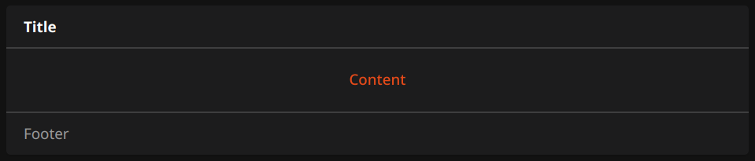

# oh-card - Card

<!-- Put a screenshot here if relevant:

-->

[[toc]]

The `oh-card` component provides the basic structure for all other card widgets.
It is providing a default implementation for both title and footer, and requires the content to be defined in the `content` slot.
Optionally, header and footer can be overwritten by providing the `header` and `footer` slots (see [Slots](#slots)).
`oh-card` also provides full control over its style as well as header, content and footer style (see [Style](#style)).

## Configuration

<!-- DO NOT REMOVE the following comments -->
<!-- GENERATED props -->
### Card
<div class="props">
<PropGroup name="card" label="Card">
  Parameters of the card
<PropBlock type="TEXT" name="title" label="Title">
  <PropDescription>
    Title of the card
  </PropDescription>
</PropBlock>
<PropBlock type="TEXT" name="footer" label="Footer text">
  <PropDescription>
    Footer of the card
  </PropDescription>
</PropBlock>
<PropBlock type="BOOLEAN" name="noBorder" label="No Border">
  <PropDescription>
    Do not render the card border
  </PropDescription>
</PropBlock>
<PropBlock type="BOOLEAN" name="noShadow" label="No Shadow">
  <PropDescription>
    Do not render a shadow effect to the card
  </PropDescription>
</PropBlock>
<PropBlock type="BOOLEAN" name="outline" label="Outline">
  <PropDescription>
    Show the card outline
  </PropDescription>
</PropBlock>
</PropGroup>
</div>

### Action
<div class="props">
<PropGroup name="actions" label="Action">
  Action to perform when the element is clicked
<PropBlock type="TEXT" name="action" label="Action">
  <PropDescription>
    Type of action to perform
  </PropDescription>
  <PropOptions>
    <PropOption value="navigate" label="Navigate to page" />
    <PropOption value="command" label="Send command" />
    <PropOption value="toggle" label="Toggle Item" />
    <PropOption value="options" label="Command options" />
    <PropOption value="rule" label="Run scene, script or rule" />
    <PropOption value="popup" label="Open popup" />
    <PropOption value="popover" label="Open popover" />
    <PropOption value="sheet" label="Open sheet" />
    <PropOption value="photos" label="Open photo browser" />
    <PropOption value="group" label="Group details" />
    <PropOption value="analyzer" label="Analyze item(s)" />
    <PropOption value="url" label="Navigate to external URL" />
    <PropOption value="http" label="Send HTTP request" />
    <PropOption value="variable" label="Set Variable" />
  </PropOptions>
</PropBlock>
<PropBlock type="TEXT" name="actionUrl" label="Action URL" context="url">
  <PropDescription>
    URL to navigate to or to send HTTP request to
  </PropDescription>
</PropBlock>
<PropBlock type="BOOLEAN" name="actionUrlSameWindow" label="Open in same tab/window">
  <PropDescription>
    Open the URL in the same tab/window instead of a new one. This will exit the app.
  </PropDescription>
</PropBlock>
<PropBlock type="TEXT" name="actionHttpMethod" label="HTTP Method">
  <PropDescription>
    HTTP method to use for the request
  </PropDescription>
  <PropOptions>
    <PropOption value="GET" label="GET" />
    <PropOption value="POST" label="POST" />
    <PropOption value="PUT" label="PUT" />
    <PropOption value="DELETE" label="DELETE" />
  </PropOptions>
</PropBlock>
<PropBlock type="TEXT" name="actionHttpBody" label="HTTP Body">
  <PropDescription>
    Body to send with the request
  </PropDescription>
</PropBlock>
<PropBlock type="TEXT" name="actionItem" label="Action Item" context="item">
  <PropDescription>
    Item to perform the action on
  </PropDescription>
</PropBlock>
<PropBlock type="TEXT" name="actionCommand" label="Action Command">
  <PropDescription>
    Command to send to the Item. If "Toogle Item" is selected as the action, only send the command when the state is different
  </PropDescription>
</PropBlock>
<PropBlock type="TEXT" name="actionCommandAlt" label="Action Toggle Command">
  <PropDescription>
    Command to send to the Item when "Toggle Item" is selected as the action, and the Item's state is equal to the command above
  </PropDescription>
</PropBlock>
<PropBlock type="TEXT" name="actionOptions" label="Command Options">
  <PropDescription>
    Comma-separated list of options; if omitted, retrieve the command options from the Item dynamically. Use <code>value=label</code> format to provide a label different than the option.
  </PropDescription>
</PropBlock>
<PropBlock type="TEXT" name="actionRule" label="Scene, Script or Rule" context="rule">
  <PropDescription>
    Scene, Script or Rule to run
  </PropDescription>
</PropBlock>
<PropBlock type="TEXT" name="actionRuleContext" label="Context" context="script">
  <PropDescription>
    Object representing the optional context to pass. Edit in YAML or provide a JSON object, e.g. <code>{ "param1": "value1", "param2": { "subkey1": "testing", "subkey2": 123 } }</code>.
  </PropDescription>
</PropBlock>
<PropBlock type="TEXT" name="actionPage" label="Page" context="page">
  <PropDescription>
    Page to navigate to
  </PropDescription>
</PropBlock>
<PropBlock type="TEXT" name="actionPageTransition" label="Transition Effect">
  <PropDescription>
    Use a specific <a class="external text-color-blue" target="_blank" href="https://framework7.io/docs/view.html#custom-page-transitions">page transition animation</a>
  </PropDescription>
  <PropOptions>
    <PropOption value="f7-circle" label="Circle" />
    <PropOption value="f7-cover" label="Cover" />
    <PropOption value="f7-cover-v" label="Cover from bottom" />
    <PropOption value="f7-dive" label="Dive" />
    <PropOption value="f7-fade" label="Fade" />
    <PropOption value="f7-flip" label="Flip" />
    <PropOption value="f7-parallax" label="Parallax" />
    <PropOption value="f7-push" label="Push" />
  </PropOptions>
</PropBlock>
<PropBlock type="TEXT" name="actionModal" label="Modal Page or Widget" context="pagewidget">
  <PropDescription>
    Page or widget to display in the modal
  </PropDescription>
</PropBlock>
<PropBlock type="TEXT" name="actionModalConfig" label="Modal component configuration" context="props">
  <PropDescription>
    Configuration (prop values) for the target modal page or widget
  </PropDescription>
</PropBlock>
<PropBlock type="TEXT" name="actionPhotos" label="Images to show">
  <PropDescription>
    Array of URLs or objects representing the images. Auto-refresh is not supported.<br />Edit in YAML, e.g.<br /><code><pre>- item: ImageItem1<br />  caption: Camera</pre></code>or provide a JSON array, e.g.<br /><code>[ "url1", { "item": "ImageItem1", "caption": "Camera" } ]</code><br />Objects are in the <a class="external text-color-blue" target="_blank" href="https://framework7.io/docs/photo-browser.html#photos-array">photos array format</a> with an additional <code>item</code> property to specify an item to view.
  </PropDescription>
</PropBlock>
<PropBlock type="TEXT" name="actionPhotoBrowserConfig" label="Photo browser configuration">
  <PropDescription>
    Configuration for the photo browser.<br />Edit in YAML or provide a JSON object, e.g.<br /><code>{ "exposition": false, "type": "popup", "theme": "dark" }</code><br /> See <a class="external text-color-blue" target="_blank" href="https://framework7.io/docs/photo-browser.html#photo-browser-parameters">photo browser parameters</a> (not all are supported).
  </PropDescription>
</PropBlock>
<PropBlock type="TEXT" name="actionGroupPopupItem" label="Group Popup Item" context="item">
  <PropDescription>
    Group Item whose members to show in a popup
  </PropDescription>
</PropBlock>
<PropBlock type="TEXT" name="actionAnalyzerItems" label="Item(s) to Analyze" required="true" context="item">
  <PropDescription>
    Start analyzing with the specified (set of) Item(s)
  </PropDescription>
</PropBlock>
<PropBlock type="TEXT" name="actionAnalyzerChartType" label="Chart Type">
  <PropDescription>
    The initial analyzing period - dynamic or a predefined fixed period: day, week, month or year
  </PropDescription>
  <PropOptions>
    <PropOption value="(empty)" label="Dynamic" />
    <PropOption value="day" label="Day" />
    <PropOption value="isoWeek" label="Week (starting on Mondays)" />
    <PropOption value="month" label="Month" />
    <PropOption value="year" label="Year" />
  </PropOptions>
</PropBlock>
<PropBlock type="TEXT" name="actionAnalyzerCoordSystem" label="Initial Coordinate System">
  <PropDescription>
    The initial coordinate system of the analyzer - time, aggregate or calendar (only time is supported for dynamic periods)
  </PropDescription>
  <PropOptions>
    <PropOption value="time" label="Time" />
    <PropOption value="aggregate" label="Aggregate" />
    <PropOption value="calendar" label="Calendar" />
  </PropOptions>
</PropBlock>
<PropBlock type="TEXT" name="actionConfirmation" label="Action Confirmation">
  <PropDescription>
    Shows a dialog or sheet to ask for confirmation before the action is executed. Can either be a text to show in the dialog or a JSON object <code>{ type: "dialog", title: "Confirm", text: "Are you sure?" }</code> or <code>{ type: "sheet", text: "Confirm", color: "green" }</code>
  </PropDescription>
</PropBlock>
<PropBlock type="TEXT" name="actionFeedback" label="Action Feedback">
  <PropDescription>
    Shows a toast popup when the action has been executed. Can either be a text to show or a JSON object including some of the <a class="external text-color-blue" target="_blank" href="https://framework7.io/docs/toast.html#toast-parameters">supported parameters</a>
  </PropDescription>
</PropBlock>
<PropBlock type="TEXT" name="actionVariable" label="Variable">
  <PropDescription>
    The variable name to set
  </PropDescription>
</PropBlock>
<PropBlock type="TEXT" name="actionVariableValue" label="Variable Value">
  <PropDescription>
    The value to set the variable to
  </PropDescription>
</PropBlock>
<PropBlock type="TEXT" name="actionVariableKey" label="Variable Key">
  <PropDescription>
    Consider the variable value is an object and set the corresponding deep property within that object using a key syntax. Examples: <code>user.name</code>, <code>user[0].address[1].street</code>, <code>[0]</code>, <code>[0].label</code>. The inner property and its parent hierarchy will be created if missing.
  </PropDescription>
</PropBlock>
</PropGroup>
</div>

### Tap Hold
<div class="props">
<PropGroup name="taphold_actions" label="Tap Hold">
  Action performed when tapping and holding card (or calling contextual menu on desktop)
<PropBlock type="TEXT" name="taphold_action" label="Action">
  <PropDescription>
    Type of action to perform
  </PropDescription>
  <PropOptions>
    <PropOption value="navigate" label="Navigate to page" />
    <PropOption value="command" label="Send command" />
    <PropOption value="toggle" label="Toggle Item" />
    <PropOption value="options" label="Command options" />
    <PropOption value="rule" label="Run scene, script or rule" />
    <PropOption value="popup" label="Open popup" />
    <PropOption value="popover" label="Open popover" />
    <PropOption value="sheet" label="Open sheet" />
    <PropOption value="photos" label="Open photo browser" />
    <PropOption value="group" label="Group details" />
    <PropOption value="analyzer" label="Analyze item(s)" />
    <PropOption value="url" label="Navigate to external URL" />
    <PropOption value="http" label="Send HTTP request" />
    <PropOption value="variable" label="Set Variable" />
  </PropOptions>
</PropBlock>
<PropBlock type="TEXT" name="taphold_actionUrl" label="Action URL" context="url">
  <PropDescription>
    URL to navigate to or to send HTTP request to
  </PropDescription>
</PropBlock>
<PropBlock type="BOOLEAN" name="taphold_actionUrlSameWindow" label="Open in same tab/window">
  <PropDescription>
    Open the URL in the same tab/window instead of a new one. This will exit the app.
  </PropDescription>
</PropBlock>
<PropBlock type="TEXT" name="taphold_actionHttpMethod" label="HTTP Method">
  <PropDescription>
    HTTP method to use for the request
  </PropDescription>
  <PropOptions>
    <PropOption value="GET" label="GET" />
    <PropOption value="POST" label="POST" />
    <PropOption value="PUT" label="PUT" />
    <PropOption value="DELETE" label="DELETE" />
  </PropOptions>
</PropBlock>
<PropBlock type="TEXT" name="taphold_actionHttpBody" label="HTTP Body">
  <PropDescription>
    Body to send with the request
  </PropDescription>
</PropBlock>
<PropBlock type="TEXT" name="taphold_actionItem" label="Action Item" context="item">
  <PropDescription>
    Item to perform the action on
  </PropDescription>
</PropBlock>
<PropBlock type="TEXT" name="taphold_actionCommand" label="Action Command">
  <PropDescription>
    Command to send to the Item. If "Toogle Item" is selected as the action, only send the command when the state is different
  </PropDescription>
</PropBlock>
<PropBlock type="TEXT" name="taphold_actionCommandAlt" label="Action Toggle Command">
  <PropDescription>
    Command to send to the Item when "Toggle Item" is selected as the action, and the Item's state is equal to the command above
  </PropDescription>
</PropBlock>
<PropBlock type="TEXT" name="taphold_actionOptions" label="Command Options">
  <PropDescription>
    Comma-separated list of options; if omitted, retrieve the command options from the Item dynamically. Use <code>value=label</code> format to provide a label different than the option.
  </PropDescription>
</PropBlock>
<PropBlock type="TEXT" name="taphold_actionRule" label="Scene, Script or Rule" context="rule">
  <PropDescription>
    Scene, Script or Rule to run
  </PropDescription>
</PropBlock>
<PropBlock type="TEXT" name="taphold_actionRuleContext" label="Context" context="script">
  <PropDescription>
    Object representing the optional context to pass. Edit in YAML or provide a JSON object, e.g. <code>{ "param1": "value1", "param2": { "subkey1": "testing", "subkey2": 123 } }</code>.
  </PropDescription>
</PropBlock>
<PropBlock type="TEXT" name="taphold_actionPage" label="Page" context="page">
  <PropDescription>
    Page to navigate to
  </PropDescription>
</PropBlock>
<PropBlock type="TEXT" name="taphold_actionPageTransition" label="Transition Effect">
  <PropDescription>
    Use a specific <a class="external text-color-blue" target="_blank" href="https://framework7.io/docs/view.html#custom-page-transitions">page transition animation</a>
  </PropDescription>
  <PropOptions>
    <PropOption value="f7-circle" label="Circle" />
    <PropOption value="f7-cover" label="Cover" />
    <PropOption value="f7-cover-v" label="Cover from bottom" />
    <PropOption value="f7-dive" label="Dive" />
    <PropOption value="f7-fade" label="Fade" />
    <PropOption value="f7-flip" label="Flip" />
    <PropOption value="f7-parallax" label="Parallax" />
    <PropOption value="f7-push" label="Push" />
  </PropOptions>
</PropBlock>
<PropBlock type="TEXT" name="taphold_actionModal" label="Modal Page or Widget" context="pagewidget">
  <PropDescription>
    Page or widget to display in the modal
  </PropDescription>
</PropBlock>
<PropBlock type="TEXT" name="taphold_actionModalConfig" label="Modal component configuration" context="props">
  <PropDescription>
    Configuration (prop values) for the target modal page or widget
  </PropDescription>
</PropBlock>
<PropBlock type="TEXT" name="taphold_actionPhotos" label="Images to show">
  <PropDescription>
    Array of URLs or objects representing the images. Auto-refresh is not supported.<br />Edit in YAML, e.g.<br /><code><pre>- item: ImageItem1<br />  caption: Camera</pre></code>or provide a JSON array, e.g.<br /><code>[ "url1", { "item": "ImageItem1", "caption": "Camera" } ]</code><br />Objects are in the <a class="external text-color-blue" target="_blank" href="https://framework7.io/docs/photo-browser.html#photos-array">photos array format</a> with an additional <code>item</code> property to specify an item to view.
  </PropDescription>
</PropBlock>
<PropBlock type="TEXT" name="taphold_actionPhotoBrowserConfig" label="Photo browser configuration">
  <PropDescription>
    Configuration for the photo browser.<br />Edit in YAML or provide a JSON object, e.g.<br /><code>{ "exposition": false, "type": "popup", "theme": "dark" }</code><br /> See <a class="external text-color-blue" target="_blank" href="https://framework7.io/docs/photo-browser.html#photo-browser-parameters">photo browser parameters</a> (not all are supported).
  </PropDescription>
</PropBlock>
<PropBlock type="TEXT" name="taphold_actionGroupPopupItem" label="Group Popup Item" context="item">
  <PropDescription>
    Group Item whose members to show in a popup
  </PropDescription>
</PropBlock>
<PropBlock type="TEXT" name="taphold_actionAnalyzerItems" label="Item(s) to Analyze" required="true" context="item">
  <PropDescription>
    Start analyzing with the specified (set of) Item(s)
  </PropDescription>
</PropBlock>
<PropBlock type="TEXT" name="taphold_actionAnalyzerChartType" label="Chart Type">
  <PropDescription>
    The initial analyzing period - dynamic or a predefined fixed period: day, week, month or year
  </PropDescription>
  <PropOptions>
    <PropOption value="(empty)" label="Dynamic" />
    <PropOption value="day" label="Day" />
    <PropOption value="isoWeek" label="Week (starting on Mondays)" />
    <PropOption value="month" label="Month" />
    <PropOption value="year" label="Year" />
  </PropOptions>
</PropBlock>
<PropBlock type="TEXT" name="taphold_actionAnalyzerCoordSystem" label="Initial Coordinate System">
  <PropDescription>
    The initial coordinate system of the analyzer - time, aggregate or calendar (only time is supported for dynamic periods)
  </PropDescription>
  <PropOptions>
    <PropOption value="time" label="Time" />
    <PropOption value="aggregate" label="Aggregate" />
    <PropOption value="calendar" label="Calendar" />
  </PropOptions>
</PropBlock>
<PropBlock type="TEXT" name="taphold_actionConfirmation" label="Action Confirmation">
  <PropDescription>
    Shows a dialog or sheet to ask for confirmation before the action is executed. Can either be a text to show in the dialog or a JSON object <code>{ type: "dialog", title: "Confirm", text: "Are you sure?" }</code> or <code>{ type: "sheet", text: "Confirm", color: "green" }</code>
  </PropDescription>
</PropBlock>
<PropBlock type="TEXT" name="taphold_actionFeedback" label="Action Feedback">
  <PropDescription>
    Shows a toast popup when the action has been executed. Can either be a text to show or a JSON object including some of the <a class="external text-color-blue" target="_blank" href="https://framework7.io/docs/toast.html#toast-parameters">supported parameters</a>
  </PropDescription>
</PropBlock>
<PropBlock type="TEXT" name="taphold_actionVariable" label="Variable">
  <PropDescription>
    The variable name to set
  </PropDescription>
</PropBlock>
<PropBlock type="TEXT" name="taphold_actionVariableValue" label="Variable Value">
  <PropDescription>
    The value to set the variable to
  </PropDescription>
</PropBlock>
<PropBlock type="TEXT" name="taphold_actionVariableKey" label="Variable Key">
  <PropDescription>
    Consider the variable value is an object and set the corresponding deep property within that object using a key syntax. Examples: <code>user.name</code>, <code>user[0].address[1].street</code>, <code>[0]</code>, <code>[0].label</code>. The inner property and its parent hierarchy will be created if missing.
  </PropDescription>
</PropBlock>
</PropGroup>
</div>


<!-- GENERATED /props -->

## Slots

You need to define either one of these two slots:

- `content`: The default slot for content, which will then be rendered inside a `f7-card-content` element.
- `content-root`: The slot for content that should be rendered directly inside the card, without any additional wrapping element.

Optionally, you can define these slots:

- `header`: The slot for the header content, which will replace the default header.
- `footer`: The slot for the footer content, which will replace the default footer.

## Style

`oh-card` provides full control over the style of itself as well as the header, content and footer.

The card itself can be styled through the `style` and `class` config properties,
while the header, content and footer can be styled through the `headerStyle`, `headerClass`, `contentStyle`, `contentClass`, `footerStyle` and `footerClass` properties.

## Example



This card can be created using the following YAML definition:

```yaml
component: oh-card
config:
  title: Title
  footer: Footer
  style: {} # Card style
  class: [] # Card classes
  headerStyle: {} # Header style
  headerClass: [] # Header classes
  contentStyle: {} # Content style
  contentClass: [] # Content classes
  footerStyle: {} # Footer style
  footerClass: [] # Footer classes
slots:
  content:
    - component: oh-button
      config:
        text: Content
```

Without using the `oh-card` component, the same card can be created by directly using the Framework7 components:

```yaml
component: f7-card
config:
  style: {} # Card style
  class: [] # Card classes
slots:
  default:
    - component: f7-card-header
      config:
        style: {} # Header style
        class: [] # Header classes
      slots:
        default:
          - component: Label
            config:
              text: Title
    - component: f7-card-content
      config:
        style: {} # Content style
        class: [] # Content classes
      slots:
        default:
          - component: oh-button
            config:
              text: Content
    - component: f7-card-footer
      config:
        style: {} # Footer style
        class: [] # Footer classes
      slots:
        default:
          - component: Label
            config:
              text: Footer
```
