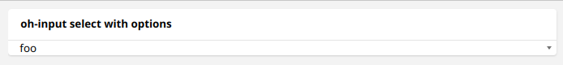

# oh-input - Input

<!-- Put a screenshot here if relevant:

-->

[[toc]]

<!-- Note: you can overwrite the definition-provided description and add your own intro/additional sections instead -->
<!-- DO NOT REMOVE the following comments if you intend to keep the definition-provided description -->
<!-- GENERATED componentDescription -->
Displays an input field, used to set a variable
<!-- GENERATED /componentDescription -->

## Configuration

<!-- DO NOT REMOVE the following comments -->
<!-- GENERATED props -->
### General
<div class="props">
<PropGroup label="General">
<PropBlock type="TEXT" name="name" label="Name">
  <PropDescription>
    Input name
  </PropDescription>
</PropBlock>
<PropBlock type="TEXT" name="type" label="Type">
  <PropDescription>
    Type of input (see <a class="external text-color-blue" target="_blank" href="https://framework7.io/docs/inputs.html#supported-inputs">f7 input docs</a>, <code>date</code> or <code>datepicker</code>)
  </PropDescription>
</PropBlock>
<PropBlock type="TEXT" name="inputmode" label="Input Mode">
  <PropDescription>
    Type of data that might be entered (see <a class="external text-color-blue" target="_blank" href="https://developer.mozilla.org/en-US/docs/Web/HTML/Global_attributes/inputmode">MDN docs</a>)
  </PropDescription>
</PropBlock>
<PropBlock type="TEXT" name="placeholder" label="Placeholder">
  <PropDescription>
    Placeholder text
  </PropDescription>
</PropBlock>
<PropBlock type="BOOLEAN" name="sendButton" label="Send button">
  <PropDescription>
    Display Send button to update the state with a command (needs a configured item)
  </PropDescription>
</PropBlock>
<PropBlock type="BOOLEAN" name="clearButton" label="Clear button">
  <PropDescription>
    Display input clear button when applicable
  </PropDescription>
</PropBlock>
<PropBlock type="BOOLEAN" name="outline" label="Outline">
  <PropDescription>
    Makes input outline
  </PropDescription>
</PropBlock>
<PropBlock type="BOOLEAN" name="required" label="Required">
  <PropDescription>
    Display an error message if left empty
  </PropDescription>
</PropBlock>
<PropBlock type="BOOLEAN" name="validate" label="Validate">
  <PropDescription>
    When enabled, input value will be validated based on input type
  </PropDescription>
</PropBlock>
<PropBlock type="BOOLEAN" name="validate-on-blur" label="Validate on blur">
  <PropDescription>
    Only validate when focus moves away from input field
  </PropDescription>
</PropBlock>
<PropBlock type="TEXT" name="item" label="Item" context="item">
  <PropDescription>
    Link the input value to the state of this item
  </PropDescription>
</PropBlock>
<PropBlock type="BOOLEAN" name="useDisplayState" label="Use Display State">
  <PropDescription>
    Use the formatted state as the value for the input control
  </PropDescription>
</PropBlock>
<PropBlock type="DECIMAL" name="step" label="Step">
  <PropDescription>
    Step value when type set to number, any if left empty
  </PropDescription>
</PropBlock>
<PropBlock type="BOOLEAN" name="showTime" label="Show time">
  <PropDescription>
    Display time when type set to datepicker
  </PropDescription>
</PropBlock>
<PropBlock type="TEXT" name="defaultValue" label="Default value">
  <PropDescription>
    Default value when not found in item state or variable
  </PropDescription>
</PropBlock>
<PropBlock type="TEXT" name="variable" label="Variable">
  <PropDescription>
    Name of the variable to set when the input changes
  </PropDescription>
</PropBlock>
<PropBlock type="TEXT" name="variableKey" label="Variable Key">
  <PropDescription>
    Consider the variable value is an object and set the corresponding deep property within that object using a key syntax. Examples: <code>user.name</code>, <code>user[0].address[1].street</code>, <code>[0]</code>, <code>[0].label</code>. The inner property and its parent hierarchy will be created if missing.
  </PropDescription>
</PropBlock>
</PropGroup>
</div>


<!-- GENERATED /props -->

<!-- If applicable describe how properties are forwarded to a underlying component from Framework7, ECharts, etc.:
### Inherited Properties

-->

<!-- If applicable describe the slots recognized by the component and what they represent:
### Slots

#### `default`

The contents of the oh-input.

-->

## Examples

### Select with Options



```yaml
component: oh-input
config:
  type: select
  style:
    margin-left: 15px
slots:
  default:
    - component: option
      config:
        value: foo
      slots:
        default:
          - component: Content
            config:
              text: foo
    - component: option
      config:
        value: bar
      slots:
        default:
          - component: Content
            config:
              text: bar
```

<!-- Try to clean up URLs to the forum (https://community.openhab.org/t/<threadID>[/<postID>] should suffice)
## Community Resources

- [Community Post 1](https://community.openhab.org/t/12345)
- [Community Post 2](https://community.openhab.org/t/23456)
-->
