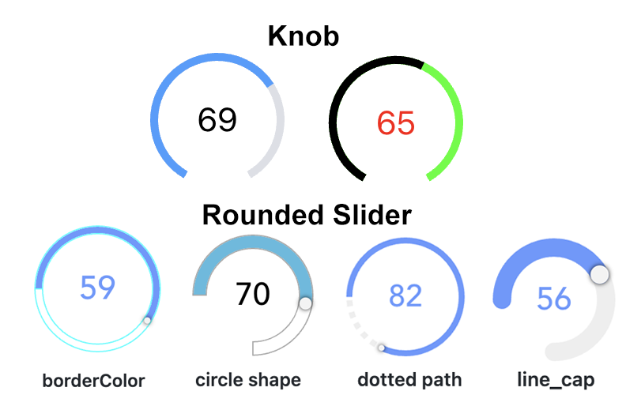

# oh-knob-cell - Knob & Rounded Slider Cell



[[toc]]

<!-- Note: you can overwrite the definition-provided description and add your own intro/additional sections instead -->
<!-- DO NOT REMOVE the following comments if you intend to keep the definition-provided description -->
<!-- GENERATED componentDescription -->
A cell expanding to a knob or rounded slider control
<!-- GENERATED /componentDescription -->

## Configuration

Use the advanced properties to change the appearance from a knob to a rounded slider.

<!-- DO NOT REMOVE the following comments -->
<!-- GENERATED props -->
### Cell
<div class="props">
<PropGroup name="cell" label="Cell">
  General settings of the cell
<PropBlock type="TEXT" name="header" label="Header">
  <PropDescription>
    Header of the cell
  </PropDescription>
</PropBlock>
<PropBlock type="TEXT" name="title" label="Title">
  <PropDescription>
    Title of the cell
  </PropDescription>
</PropBlock>
<PropBlock type="TEXT" name="subtitle" label="Subtitle">
  <PropDescription>
    Subtitle of the cell
  </PropDescription>
</PropBlock>
<PropBlock type="TEXT" name="footer" label="Footer">
  <PropDescription>
    Footer of the cell
  </PropDescription>
</PropBlock>
<PropBlock type="TEXT" name="icon" label="Icon">
  <PropDescription>
    Use <code>oh:iconName</code> (<a class="external text-color-blue" target="_blank" href="https://www.openhab.org/link/icons">openHAB icon</a>), <code>f7:iconName</code> (<a class="external text-color-blue" target="_blank" href="https://framework7.io/icons/">Framework7 icon</a>), <code>material:iconName</code> (<a class="external text-color-blue" target="_blank" href="https://jossef.github.io/material-design-icons-iconfont/">Material icon</a>) or <code>iconify:iconSet:iconName</code> (<a class="external text-color-blue" target="_blank" href="https://icon-sets.iconify.design">Iconify icon</a>, requires being online if not in cache)
  </PropDescription>
</PropBlock>
<PropBlock type="TEXT" name="color" label="Highlight Color">
  <PropDescription>
    Color to use when highlighted
  </PropDescription>
</PropBlock>
<PropBlock type="TEXT" name="on" label="&quot;On&quot; expression">
  <PropDescription>
    Expression to determine when the card should be highlighted. If blank, determine automatically from the primary bound item if applicable.
  </PropDescription>
</PropBlock>
</PropGroup>
</div>

### Knob
<div class="props">
<PropGroup name="knob" label="Knob">
<PropBlock type="TEXT" name="item" label="Item" context="item">
  <PropDescription>
    Item to control
  </PropDescription>
</PropBlock>
<PropBlock type="INTEGER" name="min" label="Min">
  <PropDescription>
    Minimum value (default 0)
  </PropDescription>
</PropBlock>
<PropBlock type="INTEGER" name="max" label="Max">
  <PropDescription>
    Maximum value (default 100)
  </PropDescription>
</PropBlock>
<PropBlock type="DECIMAL" name="step" label="Step">
  <PropDescription>
    Minimum interval between values (default 1)
  </PropDescription>
</PropBlock>
<PropBlock type="DECIMAL" name="offset" label="Offset">
  <PropDescription>
    Offset to be applied to the Item's state (e.g. Item state = 2; offset = 20; knob/rounded slider behaves as Item state would be 22)
  </PropDescription>
</PropBlock>
<PropBlock type="BOOLEAN" name="ignoreDisplayState" label="Ignore Display State">
  <PropDescription>
    Ignore the display state if available and always use the raw state.
  </PropDescription>
</PropBlock>
<PropBlock type="BOOLEAN" name="releaseOnly" label="Send command only on release">
  <PropDescription>
    If enabled, no commands are sent during sliding
  </PropDescription>
</PropBlock>
<PropBlock type="INTEGER" name="commandInterval" label="Command Interval">
  <PropDescription>
    Time to wait between subsequent commands in ms (default 200)
  </PropDescription>
</PropBlock>
<PropBlock type="INTEGER" name="delayStateDisplay" label="Delay State Display">
  <PropDescription>
    Time to wait before switching from displaying user input to displaying Item state in ms (default 2000)
  </PropDescription>
</PropBlock>
<PropBlock type="BOOLEAN" name="disabled" label="Disabled">
  <PropDescription>
    Disable the slider (usually set via an expression since the value will not be displayed when disabled)
  </PropDescription>
</PropBlock>
<PropBlock type="INTEGER" name="size" label="Size">
  <PropDescription>
    Visual size of the control in px (or % if responsive is true)
  </PropDescription>
</PropBlock>
<PropBlock type="BOOLEAN" name="responsive" label="Responsive">
  <PropDescription>
    Size the control using percentages instead of pixels
  </PropDescription>
</PropBlock>
<PropBlock type="INTEGER" name="strokeWidth" label="Stroke Width">
  <PropDescription>
    Thickness of the arcs (default 18)
  </PropDescription>
</PropBlock>
<PropBlock type="INTEGER" name="startAngle" label="Start Angle">
  <PropDescription>
    Angle of circle where the round slider should start (default -50); 0 is 9 o'clock; only if circleShape is not set
  </PropDescription>
</PropBlock>
<PropBlock type="INTEGER" name="endAngle" label="End Angle">
  <PropDescription>
    Angle of circle where the round slider should start (default -130); 360 is 9 o'clock; only if circleShape is not set
  </PropDescription>
</PropBlock>
<PropBlock type="TEXT" name="circleShape" label="Circle Shape">
  <PropDescription>
    Indicates the circle shape to be render
  </PropDescription>
  <PropOptions>
    <PropOption value="full" label="full" />
    <PropOption value="half-top" label="half top" />
    <PropOption value="half-bottom" label="half bottom" />
    <PropOption value="half-left" label="half left" />
    <PropOption value="half-right" label="half right" />
    <PropOption value="quarter-top-left" label="quarter top left" />
    <PropOption value="quarter-top-right" label="quarter top right" />
    <PropOption value="quarter-bottom-left" label="quarter bottom left" />
    <PropOption value="quarter-bottom-right" label="quarter bottom right" />
    <PropOption value="pie" label="pie" />
  </PropOptions>
</PropBlock>
<PropBlock type="TEXT" name="lineCap" label="Line Cap">
  <PropDescription>
    Sets the shape of the end of the path; dotted path and line cap cannot be used together.
  </PropDescription>
  <PropOptions>
    <PropOption value="square" label="square" />
    <PropOption value="round" label="round" />
  </PropOptions>
</PropBlock>
<PropBlock type="TEXT" name="dottedPath" label="Dotted Path">
  <PropDescription>
    Length of dotted path segments (using css stroke-dasharray); dotted path and line cap cannot be used together.
  </PropDescription>
</PropBlock>
<PropBlock type="INTEGER" name="borderWidth" label="Border Width">
  <PropDescription>
    Sets the border width of the slider (px value)
  </PropDescription>
</PropBlock>
<PropBlock type="TEXT" name="handleSize" label="Handle Size">
  <PropDescription>
    Sets the size of the slider handle (px value)
  </PropDescription>
</PropBlock>
<PropBlock type="TEXT" name="handleShape" label="Handle Shape">
  <PropDescription>
    Sets the shape of the slider handle
  </PropDescription>
  <PropOptions>
    <PropOption value="square" label="square" />
    <PropOption value="round" label="round" />
    <PropOption value="dot" label="dot" />
  </PropOptions>
</PropBlock>
<PropBlock type="TEXT" name="borderColor" label="Border Color">
  <PropDescription>
    Sets the border color of the slider; set borderWidth as well! (HTML value)
  </PropDescription>
</PropBlock>
<PropBlock type="TEXT" name="pathColor" label="Path Color">
  <PropDescription>
    Sets the path color of the slider (HTML value)
  </PropDescription>
</PropBlock>
<PropBlock type="TEXT" name="rangeColor" label="Range Color">
  <PropDescription>
    Sets the range color of the slider (HTML value)
  </PropDescription>
</PropBlock>
<PropBlock type="TEXT" name="tooltipColor" label="Tooltip Color">
  <PropDescription>
    Sets the tooltip color of the slider (HTML value)
  </PropDescription>
</PropBlock>
</PropGroup>
</div>

### Action
<div class="props">
<PropGroup name="actions" label="Action">
  Action to perform when the element is clicked
<PropBlock type="TEXT" name="action" label="Action">
  <PropDescription>
    Type of action to perform
  </PropDescription>
  <PropOptions>
    <PropOption value="navigate" label="Navigate to page" />
    <PropOption value="command" label="Send command" />
    <PropOption value="toggle" label="Toggle Item" />
    <PropOption value="options" label="Command options" />
    <PropOption value="rule" label="Run scene, script or rule" />
    <PropOption value="popup" label="Open popup" />
    <PropOption value="popover" label="Open popover" />
    <PropOption value="sheet" label="Open sheet" />
    <PropOption value="photos" label="Open photo browser" />
    <PropOption value="group" label="Group details" />
    <PropOption value="analyzer" label="Analyze item(s)" />
    <PropOption value="url" label="External URL" />
    <PropOption value="variable" label="Set Variable" />
  </PropOptions>
</PropBlock>
<PropBlock type="TEXT" name="actionUrl" label="Action URL" context="url">
  <PropDescription>
    URL to navigate to
  </PropDescription>
</PropBlock>
<PropBlock type="BOOLEAN" name="actionUrlSameWindow" label="Open in same tab/window">
  <PropDescription>
    Open the URL in the same tab/window instead of a new one. This will exit the app.
  </PropDescription>
</PropBlock>
<PropBlock type="TEXT" name="actionItem" label="Action Item" context="item">
  <PropDescription>
    Item to perform the action on
  </PropDescription>
</PropBlock>
<PropBlock type="TEXT" name="actionCommand" label="Action Command">
  <PropDescription>
    Command to send to the Item. If "Toogle Item" is selected as the action, only send the command when the state is different
  </PropDescription>
</PropBlock>
<PropBlock type="TEXT" name="actionCommandAlt" label="Action Toggle Command">
  <PropDescription>
    Command to send to the Item when "Toggle Item" is selected as the action, and the Item's state is equal to the command above
  </PropDescription>
</PropBlock>
<PropBlock type="TEXT" name="actionOptions" label="Command Options">
  <PropDescription>
    Comma-separated list of options; if omitted, retrieve the command options from the Item dynamically. Use <code>value=label</code> format to provide a label different than the option.
  </PropDescription>
</PropBlock>
<PropBlock type="TEXT" name="actionRule" label="Scene, Script or Rule" context="rule">
  <PropDescription>
    Scene, Script or Rule to run
  </PropDescription>
</PropBlock>
<PropBlock type="TEXT" name="actionRuleContext" label="Context" context="script">
  <PropDescription>
    Object representing the optional context to pass. Edit in YAML or provide a JSON object, e.g. <code>{ "param1": "value1", "param2": { "subkey1": "testing", "subkey2": 123 } }</code>.
  </PropDescription>
</PropBlock>
<PropBlock type="TEXT" name="actionPage" label="Page" context="page">
  <PropDescription>
    Page to navigate to
  </PropDescription>
</PropBlock>
<PropBlock type="TEXT" name="actionPageTransition" label="Transition Effect">
  <PropDescription>
    Use a specific <a class="external text-color-blue" target="_blank" href="https://framework7.io/docs/view.html#custom-page-transitions">page transition animation</a>
  </PropDescription>
  <PropOptions>
    <PropOption value="f7-circle" label="Circle" />
    <PropOption value="f7-cover" label="Cover" />
    <PropOption value="f7-cover-v" label="Cover from bottom" />
    <PropOption value="f7-dive" label="Dive" />
    <PropOption value="f7-fade" label="Fade" />
    <PropOption value="f7-flip" label="Flip" />
    <PropOption value="f7-parallax" label="Parallax" />
    <PropOption value="f7-push" label="Push" />
  </PropOptions>
</PropBlock>
<PropBlock type="TEXT" name="actionModal" label="Modal Page or Widget" context="pagewidget">
  <PropDescription>
    Page or widget to display in the modal
  </PropDescription>
</PropBlock>
<PropBlock type="TEXT" name="actionModalConfig" label="Modal component configuration" context="props">
  <PropDescription>
    Configuration (prop values) for the target modal page or widget
  </PropDescription>
</PropBlock>
<PropBlock type="TEXT" name="actionPhotos" label="Images to show">
  <PropDescription>
    Array of URLs or objects representing the images. Auto-refresh is not supported.<br />Edit in YAML, e.g.<br /><code><pre>- item: ImageItem1<br />  caption: Camera</pre></code>or provide a JSON array, e.g.<br /><code>[ "url1", { "item": "ImageItem1", "caption": "Camera" } ]</code><br />Objects are in the <a class="external text-color-blue" target="_blank" href="https://framework7.io/docs/photo-browser.html#photos-array">photos array format</a> with an additional <code>item</code> property to specify an item to view.
  </PropDescription>
</PropBlock>
<PropBlock type="TEXT" name="actionPhotoBrowserConfig" label="Photo browser configuration">
  <PropDescription>
    Configuration for the photo browser.<br />Edit in YAML or provide a JSON object, e.g.<br /><code>{ "exposition": false, "type": "popup", "theme": "dark" }</code><br /> See <a class="external text-color-blue" target="_blank" href="https://framework7.io/docs/photo-browser.html#photo-browser-parameters">photo browser parameters</a> (not all are supported).
  </PropDescription>
</PropBlock>
<PropBlock type="TEXT" name="actionGroupPopupItem" label="Group Popup Item" context="item">
  <PropDescription>
    Group Item whose members to show in a popup
  </PropDescription>
</PropBlock>
<PropBlock type="TEXT" name="actionAnalyzerItems" label="Item(s) to Analyze" context="item">
  <PropDescription>
    Start analyzing with the specified (set of) Item(s)
  </PropDescription>
</PropBlock>
<PropBlock type="TEXT" name="actionAnalyzerChartType" label="Chart Type">
  <PropDescription>
    The initial analyzing period - dynamic or a predefined fixed period: day, week, month or year
  </PropDescription>
  <PropOptions>
    <PropOption value="(empty)" label="Dynamic" />
    <PropOption value="day" label="Day" />
    <PropOption value="isoWeek" label="Week (starting on Mondays)" />
    <PropOption value="month" label="Month" />
    <PropOption value="year" label="Year" />
  </PropOptions>
</PropBlock>
<PropBlock type="TEXT" name="actionAnalyzerCoordSystem" label="Initial Coordinate System">
  <PropDescription>
    The initial coordinate system of the analyzer - time, aggregate or calendar (only time is supported for dynamic periods)
  </PropDescription>
  <PropOptions>
    <PropOption value="time" label="Time" />
    <PropOption value="aggregate" label="Aggregate" />
    <PropOption value="calendar" label="Calendar" />
  </PropOptions>
</PropBlock>
<PropBlock type="TEXT" name="actionFeedback" label="Action feedback">
  <PropDescription>
    Shows a toast popup when the action has been executed. Can either be a text to show or a JSON object including some of the <a class="external text-color-blue" target="_blank" href="https://framework7.io/docs/toast.html#toast-parameters">supported parameters</a>
  </PropDescription>
</PropBlock>
<PropBlock type="TEXT" name="actionVariable" label="Variable">
  <PropDescription>
    The variable name to set
  </PropDescription>
</PropBlock>
<PropBlock type="TEXT" name="actionVariableValue" label="Variable Value">
  <PropDescription>
    The value to set the variable to
  </PropDescription>
</PropBlock>
<PropBlock type="TEXT" name="actionVariableKey" label="Variable Key">
  <PropDescription>
    Consider the variable value is an object and set the corresponding deep property within that object using a key syntax. Examples: <code>user.name</code>, <code>user[0].address[1].street</code>, <code>[0]</code>, <code>[0].label</code>. The inner property and its parent hierarchy will be created if missing.
  </PropDescription>
</PropBlock>
</PropGroup>
</div>


<!-- GENERATED /props -->

### Inherited Properties

Properties are forwarded to the underlying [vue-round-slider](https://vue.roundsliderui.com/) component, which means you can set [these parameters](https://roundsliderui.com/document.html#options).
A compatibility layer ensures backward compatibility with the [vue-knob-control](https://github.com/kramer99/vue-knob-control#readme) component that was initially used.

<!-- If applicable describe the slots recognized by the component and what they represent:
### Slots

#### `default`

The contents of the oh-knob-cell.

-->

<!-- Add as many examples as desired - put the YAML in a details container when it becomes too long (~150/200+ lines):
## Examples

### Example 1


```yaml
component: oh-knob-cell
config:
  prop1: value1
  prop2: value2
```

### Example 2


::: details YAML
```yaml
component: oh-knob-cell
config:
  prop1: value1
  prop2: value2
slots
```
:::

-->

<!-- Try to clean up URLs to the forum (https://community.openhab.org/t/<threadID>[/<postID>] should suffice)
## Community Resources

- [Community Post 1](https://community.openhab.org/t/12345)
- [Community Post 2](https://community.openhab.org/t/23456)
-->
