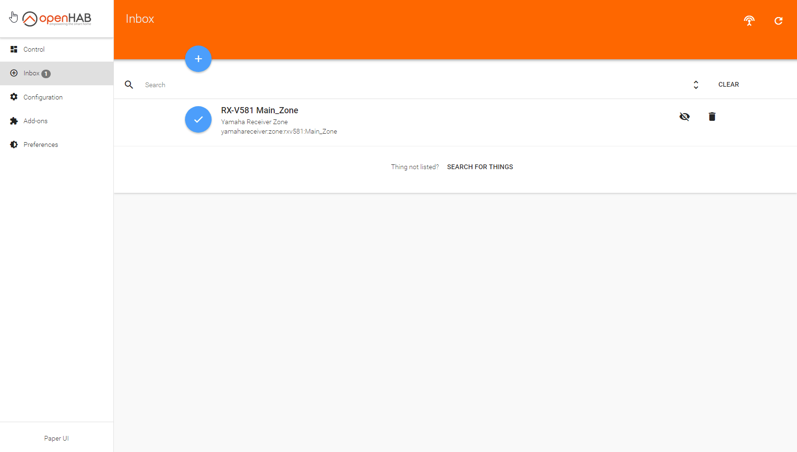



# Add-ons

All add-ons for openHAB 2 are part of the distribution.
This includes all 2.x Bindings as well as all 1.x add-ons that were reported to be compatible.
There are several ways you can install an add-on. 
These are described under *Installation of Add-ons* below

| Add-on Type                             | Description                                                                                                               |
|-----------------------------------------|---------------------------------------------------------------------------------------------------------------------------|
| [Bindings](bindings.html)               | Bindings integrate physical hardware, external systems and web services in openHAB                                        |
| [User Interfaces](uis.html)             | User interfaces are either native smartphone apps or web applications that access the openHAB server through the REST API |
| [Persistence](persistence.html)         | Persistence services allow openHAB to store time series data for history-based actions or statistics                      |
| [Actions](actions.html)                 | Actions are predefined methods for openHAB rules and scripts                                                              |
| [Transformations](transformations.html) | Transformations are used to translate between technical and human-readable values for Items                               |
| [Voice Services](voices.html)           | Services that provide voice enabling features, such as text-to-speech, speech-to-text etc.                                |
| [3rd Party System Integration](io.html) | Expose openHAB to external systems                                                                                        |

## Installation of Add-ons

Depending on the [package]({{base}}/configuration/packages.html) you have choosen during your first time setup, there are already some pre-installed add-ons.
Additional add-ons can be installed in the different ways, described below.

### Through Paper UI

Navigate to the add-ons section.
Search for the desired add-on in the categories and press install.



### Through Configuration Files

For this installation option you need to know the `id` of the desired add-on, e.g., network or mqtt1.

You can find it out with the following command within [openHAB console]({{base}}/administration/console.html):

```sh
feature:list | grep ^openhab
```

A list of all available add-ons starting with "openhab" will be returned.
It could look similar to this example:

```text
...
openhab-transformation-xslt               | 0.9.0.SNAPSHOT   |          | Uninstalled | openhab-aggregate-xml   | XSLT Transformation
openhab-voice-mactts                      | 0.9.0.SNAPSHOT   |          | Uninstalled | openhab-aggregate-xml   | macOS Text-to-Speech
openhab-binding-amazondashbutton          | 2.0.0.SNAPSHOT   |          | Uninstalled | openhab-aggregate-xml   | Amazon Dash Button Binding
openhab-binding-astro                     | 2.0.0.SNAPSHOT   |          | Uninstalled | openhab-aggregate-xml   | Astro Binding
openhab-binding-autelis                   | 2.0.0.SNAPSHOT   |          | Uninstalled | openhab-aggregate-xml   | Autelis Binding
openhab-binding-avmfritz                  | 2.0.0.SNAPSHOT   |          | Uninstalled | openhab-aggregate-xml   | AVM Fritz!Box Binding
...
openhab-binding-network                   │ 2.2.0            │          │ Uninstalled │ openhab-addons-2.2.0    │ Network Binding
...
```

According to the [naming convention for bundles]({{base}}/administration/bundles.html#naming-convention-for-bundles) the *id* for the shown example is *network*.

Another way to find the correct `id` is to look at the URL of the add-on documentation page.
For example the url for the [mqtt Binding documentation]({{base}}/addons/bindings/mqtt1/readme.html) is

```text
https://docs.openhab.org/addons/bindings/mqtt1/readme.html
```

In this case, the `id` would be "mqtt1".
Did you notice the trailing *1* in this id?
This is because the mqtt Binding is a 1.x add-on.

The trailing `1` has to be appended for `binding`- and `misc`-addons.
It is *not needed* for other addon types like `persistence`.

With this information we can now edit the *addons.cfg* file in the `config/services` folder on the machine you are running openHAB on.
The path is depending on your installation.
You can find out the correct locations on the corresponding documentation pages, e.g. [Linux]({{base}}/installation/linux.html#file-locations) or [Windows]({{base}}/installation/windows.html#file-locations).

The file could look like this (depending on your choosen package and already installed add-ons):

```text
package = standard
ui = basic,paper,habpanel
action = pushover
binding = astro,mqtt1
transformation = jsonpath
persistence = influxdb
misc = restdocs
```

To install the network Binding like we want in this example, we just need to add the id *network* to the Binding section.

```text
binding = astro,mqtt1,network
```

After saving the file, the add-on will be installed.


### Through manually provided add-ons

> Attention:
> This option is adressed to advanced users.
> Installing add-os with a `.jar`file can lead to problems, because add-on dependencies may not be installed.
> Please make sure to use this option only in special cases (like add-on testing for an upcoming version) or when you know what you are doing.

For this installation option you need a bundles `.jar` file.
One way of retrieving those files is mentiones above in the openHAB console part.

Place the `.jar` file in the `add-ons` folder on the machine you are running openHAB on.
As described already for the addons.cfg option, the path is depending on your installation.
Place the .jar file in the folder Additional add-on files as described in File Locations ([Linux]({{base}}/installation/linux.html#file-locations), [Windows]({{base}}/installation/windows.html#file-locations) or [macOS]({{base}}/installation/macosx.html#file-locations)).
