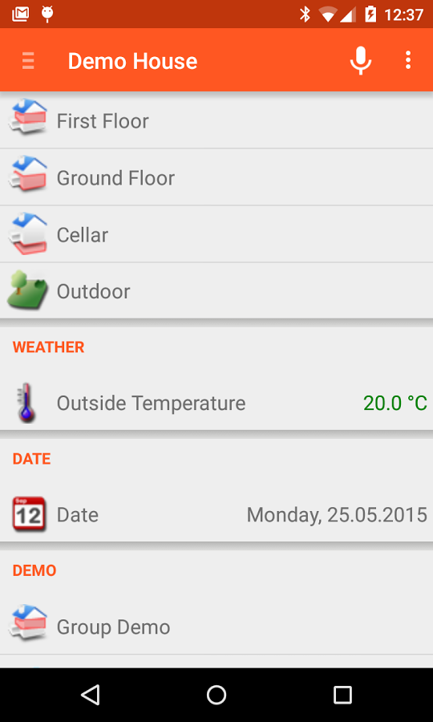
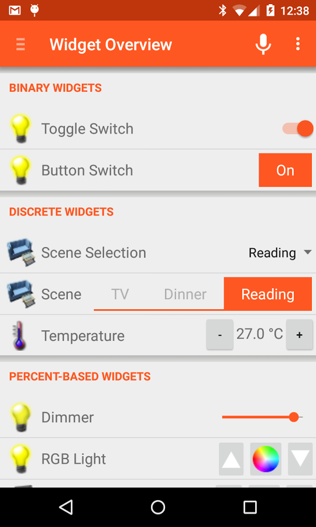



# Android openHAB App

We provide a native Android app for openHAB.
It uses the REST API of openHAB to render sitemaps of your openHAB installation.
It also supports [myopenhab.org](http://www.myopenhab.org) including push notifications.
The latest release version of the app is always available through Google Play.

**Features:**

* View openHAB sitemaps
* Control openHAB remotely
* Multiple themes available
* Push notifications
* Voice commands
* Thing discovery via app
* Support for Username/password or SSL client authentication
* Selection of a default sitemap

[{:width="250px"}](https://play.google.com/store/apps/details?id=org.openhab.habdroid)

**Screenshots:**

  

  

**Getting Started:**

When first installed the app is in "Demo Mode".
To connect it to your own openHAB server, first navigate to Settings and uncheck the "Demo Mode" option.
Normally, after unchecking the Demo Mode, the app will be able to use multicast DNS to autodetect to your openHAB server if it is on the same network.

You also have the option to manually set the server URL in the settings.
Please enter the base URL to your openHAB server as you would enter it in the browser to reach the openHAB dashboard.
The URL might look like one of the following examples.

* IP address: `http://192.168.1.3:8080`
* Local DNS name: `http://openhabianpi:8080` respectively `http://openhabianpi.local:8080` (depending on your network)

Once the URL is set correctly, the display of the app will be determined by the sitemaps defined on your server. 

The option to set a "Remote URL" allows the app to be used when you are away from home.
There are a number of strategies available to provide [secure remote access]({{base}}/installation/security.html) to your openHAB server.

**Help and technical details:**

Please refer to the [openhab/android project on GitHub](https://github.com/openhab/openhab.android) for more details.
