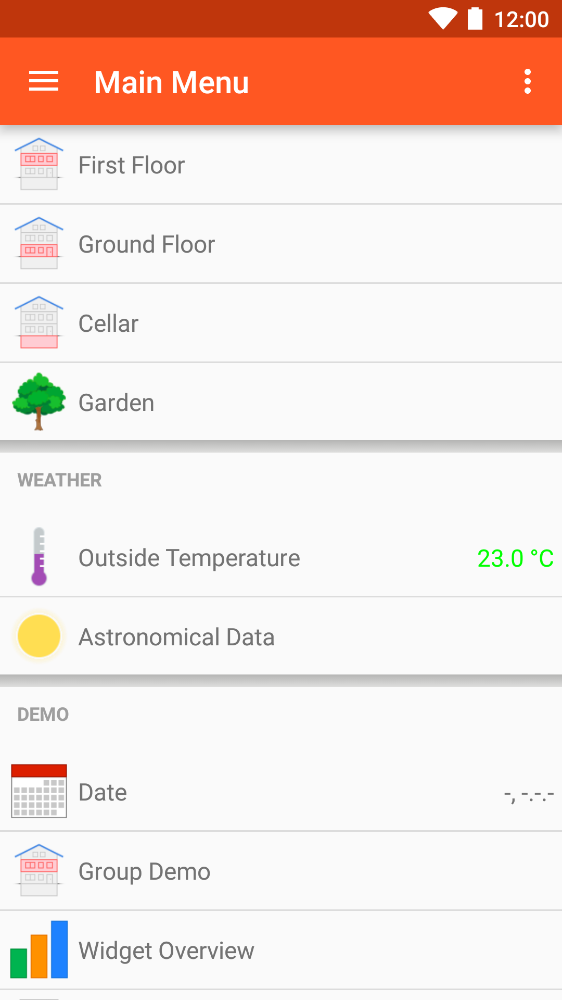



# Android openHAB App

We provide a native Android app for openHAB.
It uses the REST API of openHAB to render sitemaps of your openHAB installation.
It also supports [myopenhab.org](http://www.myopenhab.org) including push notifications.
The latest release version of the app is always available through Google Play.

**Features:**

* View openHAB sitemaps
* Control openHAB remotely
* Multiple themes available
* Push notifications
* Voice commands
* Thing discovery via app
* Support for Username/password or SSL client authentication
* Selection of a default sitemap

[{:width="250px"}](https://play.google.com/store/apps/details?id=org.openhab.habdroid)

{:width="25%"} {:width="25%"}

Please refer to the [openhab.android project](https://github.com/openhab/openhab.android) on GitHub for more technical details.

