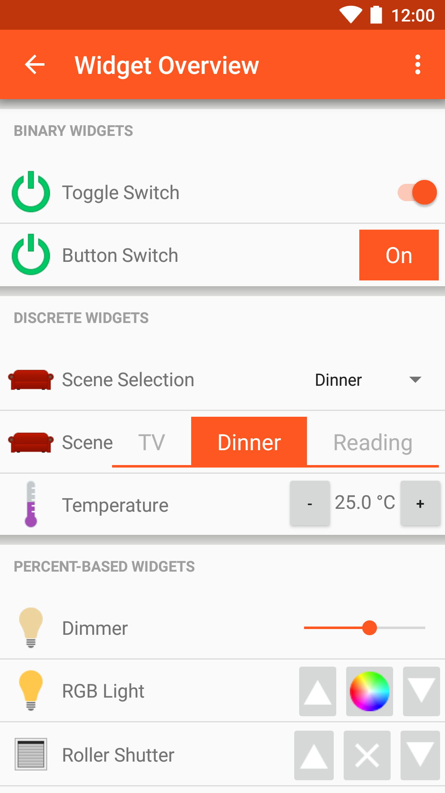



# Android openHAB App

We provide a native Android app for openHAB.
It uses the REST API of openHAB to render sitemaps of your openHAB installation.
It also supports [myopenhab.org](http://www.myopenhab.org) including push notifications.
The latest release version of the app is always available through Google Play.

**Features:**

* View openHAB sitemaps
* Control openHAB remotely
* Multiple themes available
* Push notifications
* Voice commands
* Thing discovery via app
* Support for Username/password or SSL client authentication
* Selection of a default sitemap

[{:width="250px"}](https://play.google.com/store/apps/details?id=org.openhab.habdroid)

**Screenshots:**

  

  

**Getting Started:**

When first installed the app is in demo mode. To connect the android app to your openhab server, first navigate to Settings and uncheck the Demo mode option.
Then set the openHAB URL to the URL of your server. For example: `http://192.168.1.3:8080`. The display will now be determined by the sitemaps defined on your server. 

**Help and technical details:**

Please refer to the [openhab/android project on GitHub](https://github.com/openhab/openhab.android) for more details.
