<style>
.garmin-screenshot-container {
  display: flex;
  flex-direction: row;
  flex-wrap: wrap;
  justify-content: center;

  img {
    max-width: 300px !important;
    padding: 0.325em;
    background: white;
  }
}
</style>

<!-- markdownlint-disable no-alt-text -->

# Garmin App

The **openHAB Garmin** app connects your Garmin wearable to your openHAB server, giving you convenient access to essential devices and real-time information.

<br>

<div style="display: flex; flex-direction: row; flex-wrap: wrap;">
  <a href="https://apps.garmin.com/apps/d83b5e1b-4a12-4eda-bbad-26f88952a959" target="_blank" class="external" style="margin-top: auto; margin-bottom: auto; margin-right: 20px;">
    
  </a>
  <div>
    <p>
      ➡️ <a href="https://community.openhab.org/c/apps-services/garmin-app/" target="_blank">openHAB Community Topic</a><br>
      ➡️ <a href="https://github.com/openhab/openhab-garmin/issues" target="_blank" class="external">Report an Issue on GitHub</a>
    </p>
  </div>
</div>

[[toc]]

## Introduction

This app is built on the foundation of **openHAB sitemaps**, which define an interactive view of your openHAB model.
A sitemap allows you to specify which devices are accessible through the app and how they are organized and presented.

The app consists of two components: the **Glance** and the **Widget**.
The **Glance** displays the name of the sitemap and acts as the entry point into the full-screen **Widget**, which shows the sitemap's content.

<div class="garmin-screenshot-container">
  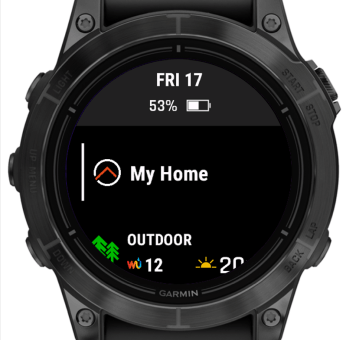
  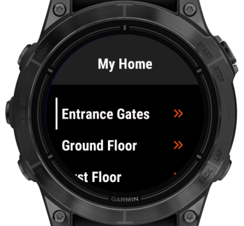
</div>

Once opened, the **Widget** polls the sitemap at a configurable interval to fetch updates.
Commands are sent to openHAB via its JSON-based REST API. If your openHAB setup does not support this API, you can alternatively configure a custom Webhook.

Inside the **Widget**, sitemap elements are displayed as **Sitemap Widgets**.

::: tip
The term "widget" is used by both Garmin and openHAB to mean different things, which can be a source of confusion.
In this manual, "Widget" refers to the Garmin app component, while "Sitemap Widget" refers to individual elements defined in the openHAB sitemap.
:::

The following sections provide detailed guidance on configuring the app, supported Sitemap Widgets, user interface behavior, and troubleshooting tips.

## Configuration

Once the app is installed, you can configure the following settings by opening it in the Garmin Connect IQ smartphone app.

| Setting                           | Description                                                                                                                                                                                                                                                                                                                                                                                                                                                           |
|-----------------------------------|-----------------------------------------------------------------------------------------------------------------------------------------------------------------------------------------------------------------------------------------------------------------------------------------------------------------------------------------------------------------------------------------------------------------------------------------------------------------------|
| **URL**                           | Your openHAB URL in the format `https://host:port` or `http://host:port`. Note: HTTP only works with iOS. See [Connectivity](#connectivity) and [Using myopenHAB](#using-myopenhab) for details.                                                                                                                                                                                                                                                                      |
| **Sitemap Name**                  | Name of the sitemap to display. See [Sitemap Setup](#sitemap-setup) for details.                                                                                                                                                                                                                                                                                                                                                                                      |
| **Native REST API Support**       | Enabled by default. When enabled, the app uses the JSON-based REST API to send commands. See [Sending Commands](#sending-commands) for details.                                                                                                                                                                                                                                                                                                                              |
| **Webhook Identifier**            | If your openHAB version does not support the JSON-based REST API (see above), you can disable the setting above and configure a custom webhook instead to send commands. See [Sending Commands](#sending-commands) for details.                                                                                                                                                                                                                                                                              |
| **Username**                      | For basic authentication (used for [myopenHAB](#using-myopenhab), see below)                                                                                                                                                                                                                                                                                                                                                                                          |
| **Password**                      | Password for basic authentication                                                                                                                                                                                                                                                                                                                                                                                                                                     |
| **Supress empty response errors** | Suppress errors for empty sitemap responses. Recommended when using myopenhab.org, which occasionally returns empty results. See the related [openhab-cloud issue #496](https://github.com/openhab/openhab-cloud/issues/496) for details.                                                                                                                                                                                                                             |
| **Polling Interval (ms)**         | Interval between data requests to your openHAB instance. Set to 0 to fetch new data immediately after the previous response is processed. Polling only occurs while the app is open, not in the background. If you're using **myopenhab.org**, it's recommended to use the default (3000 ms) or a higher value to avoid overloading their servers. If you're connecting to your own openHAB server directly, you may try setting it to 0 for more responsive updates. |
| **Post command hold time (ms)** | Time during which state updates are ignored after a command is sent. Since a sitemap request is executed immediately after sending a command, a slow response from openHAB may still return the previous state, causing switches in the UI to briefly toggle back and forth. The post-command hold time prevents this by locking the item state for a configurable duration while the command is processed and the new state is applied. |

<div style="display: flex; justify-content: center;">
  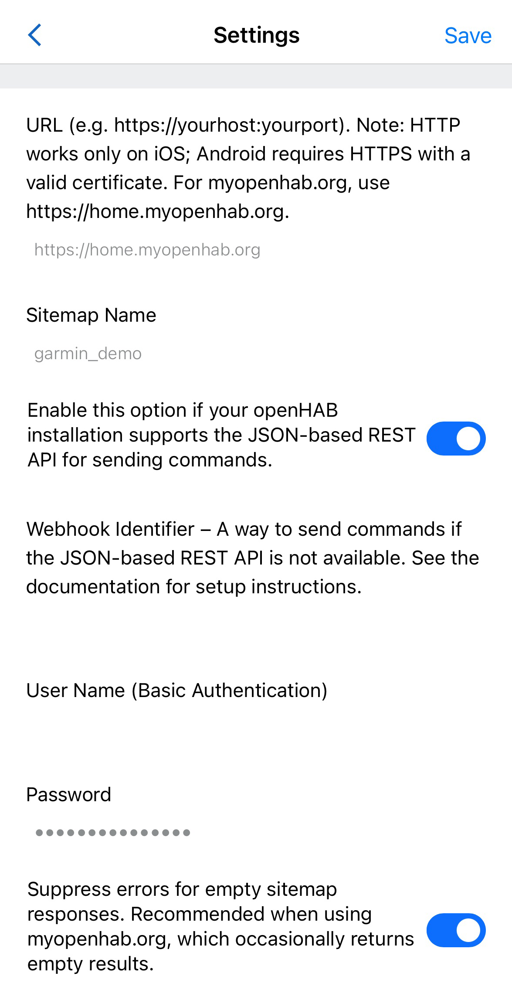
</div>

## Connectivity

This section explains how to connect your Garmin wearable to openHAB, covering network access (BLE via phone or Wi-Fi), the use of myopenHAB, and the available methods for sending commands (native REST APIs or webhooks).

### Network Access

All Garmin wearables can access your local network and the Internet via a BLE (Bluetooth Low Energy) connection to your phone.

#### BLE / Phone Connectivity

Using your phone for connectivity allows the app to take advantage of all network options available on the phone, including VPNs such as Tailscale. When connected via the phone, the openHAB app maintains a permanent connection to openHAB and is therefore able to display live item states.

**Platform-specific limitations:**

- **iOS**: HTTP and HTTPS are supported  
- **Android**: Only HTTPS with a valid certificate is supported due to Garmin SDK limitations

A green status indicator and a Bluetooth icon at the top of the menus and full-screen views indicate that a BLE connection is available. Also, the current connectivity mode can be checked in the [settings menu](#settings-menu).

<div class="garmin-screenshot-container">
  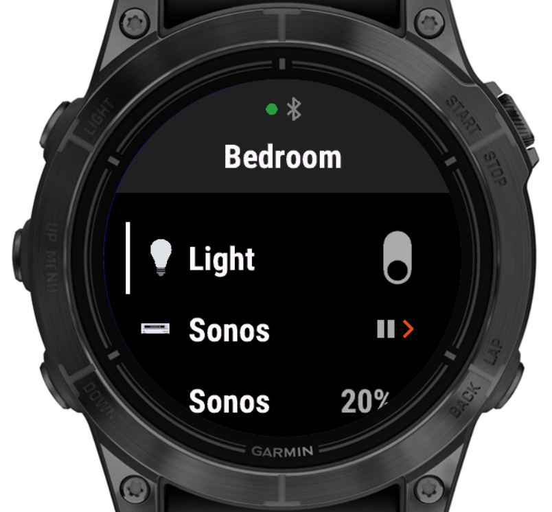
  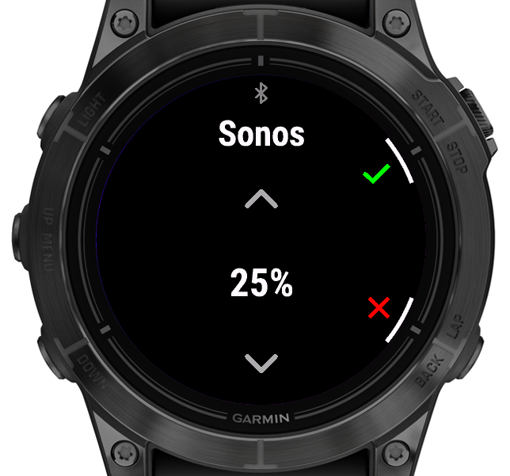
  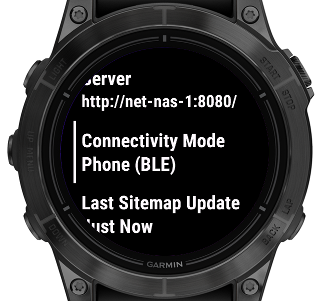
</div>

You can use [myopenHAB](https://www.myopenhab.org) to securely access your local openHAB instance over the Internet via HTTPS.

#### Wi-Fi

Some Garmin wearables can also connect directly to Wi-Fi. This allows access to the local LAN and, if Internet connectivity is available, to services such as myopenHAB.

When connected via Wi-Fi, both HTTP and HTTPS are supported.

Garmin does not allow a permanent Wi-Fi connection. Instead, the app must enter a dedicated sync mode, perform its network operations, and then close the Wi-Fi connection again. While this sync is active, Garmin displays system-provided views to inform the user about sync progress.

##### Automatic Wi-Fi Detection and Mode Switching

If no BLE connection to a phone is available, the app automatically checks whether a Wi-Fi connection can be used and, if so, switches to Wi-Fi mode. These checks continue while the app is running, and the app may switch between BLE and Wi-Fi connectivity at any time.

At startup, if no BLE connection is available, a red status indicator indicates that the app is offline. A Wi-Fi icon with a magnifying glass shows that the app is searching for a Wi-Fi connection. Once connected to Wi-Fi, the status indicator turns yellow, indicating Wi-Fi mode.

<div class="garmin-screenshot-container">
  
  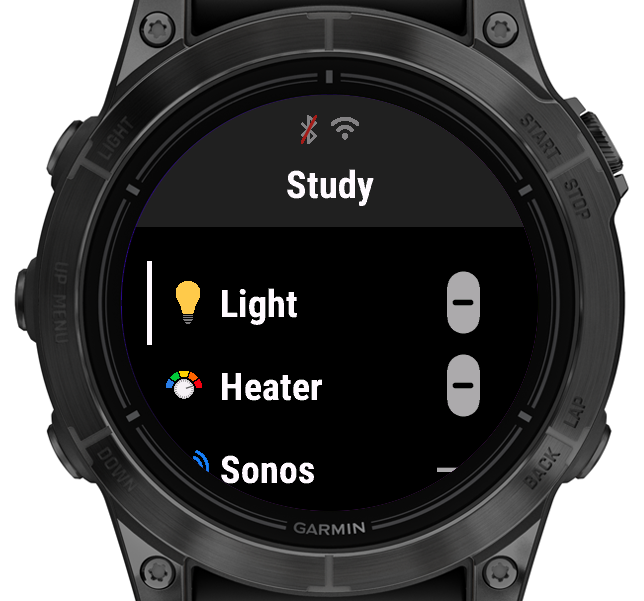
  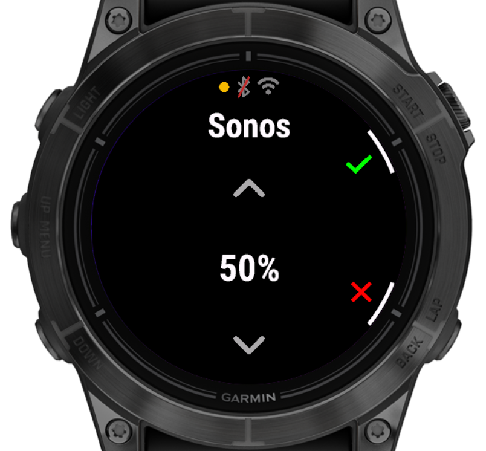
  
</div>

##### No Polling of Sitemap Changes and States

Due to the limitations of the Wi-Fi mode, the app does not regularly poll openHAB for sitemap changes or state updates while in Wi-Fi mode. As a result, item states are not displayed.

<div class="garmin-screenshot-container">
  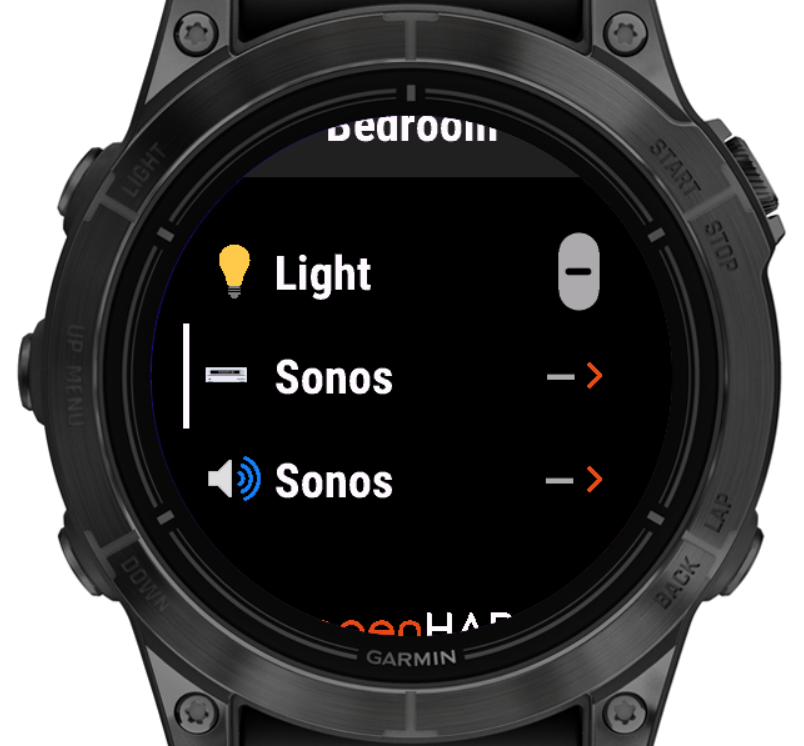
</div>

Only if no cached sitemap is available at startup, for example after settings changes or a fatal error, the app enters sync mode to retrieve the full sitemap. The [settings menu](#settings-menu) shows when the sitemap was last retrieved, and the user can also manually trigger an update via Wi-Fi, for example to download structural changes to the sitemap.

<div class="garmin-screenshot-container">
  
  
</div>

##### Sending Commands

Because current item states are not available in Wi-Fi mode, sending commands cannot rely on existing state information. For toggle switches, this means the user must explicitly choose whether the item should be switched on or off via an action menu.

Another example is the [`Slider`](#setpoint-and-slider). In Wi-Fi mode, the slider always starts at the middle of its range and operates in `releaseOnly` mode. The command is sent only when the new value is confirmed, not while the value is being adjusted.

#### Offline

While searching for Wi-Fi, and whenever neither BLE nor Wi-Fi is available, the app enters offline mode, indicated by a red status indicator. In offline mode, the menu structure can still be navigated. However, when attempting to send a command, an “OFFLINE” toast notification is displayed.

<div class="garmin-screenshot-container">
  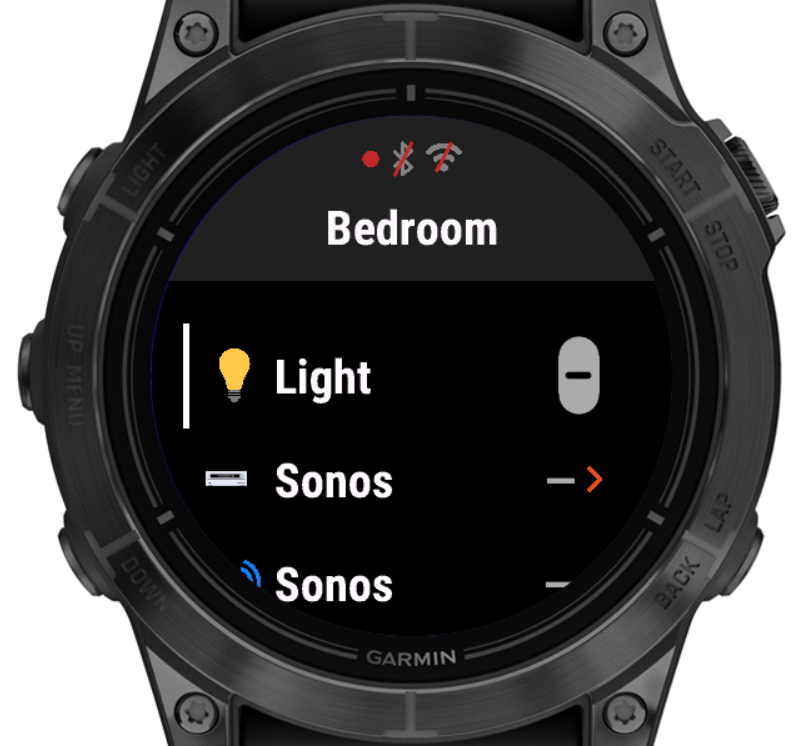
  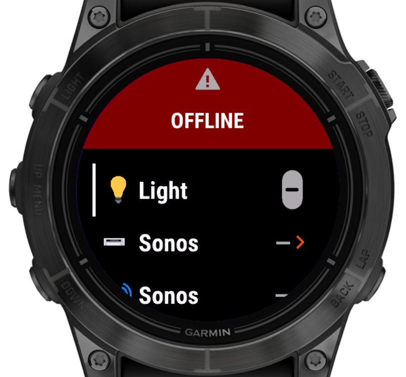
</div>

### Using myopenHAB

To connect using [myopenHAB](https://myopenhab.org):

1. Install the [openHAB Cloud Connector](/addons/integrations/openhabcloud/)
1. Register at [myopenhab.org](https://myopenhab.org)
1. Set the URL in the app to `https://home.myopenhab.org`
1. Use your myopenHAB username and password for authentication

### Sending Commands

Starting with openHAB 5.0, the REST API allows the app to send commands directly - no extra setup needed.

For earlier versions, you can either:

<details>
<summary>Install the backported API (available for openHAB 4.3.x)</summary>

To enable JSON-based command support on openHAB 4.3.x, install the backported API bundle.

Follow the instructions here: [Backport Installation Guide](https://github.com/florian-h05/openhab-core/releases/tag/4.3.x-command-json)

**Note:** If you update your openHAB version after installing the backport, you may need to reinstall the backport.

</details>

or

<details>
<summary>Set up a custom webhook</summary>

If your openHAB setup does not support the JSON-based REST API for sending commands, you can configure a custom Webhook using the Webhook binding instead.

Follow the steps below to set it up:

#### 1. Install the Webhook Binding

Install the [Webhook HTTP binding](https://community.openhab.org/t/webhook-http-binding/152184).

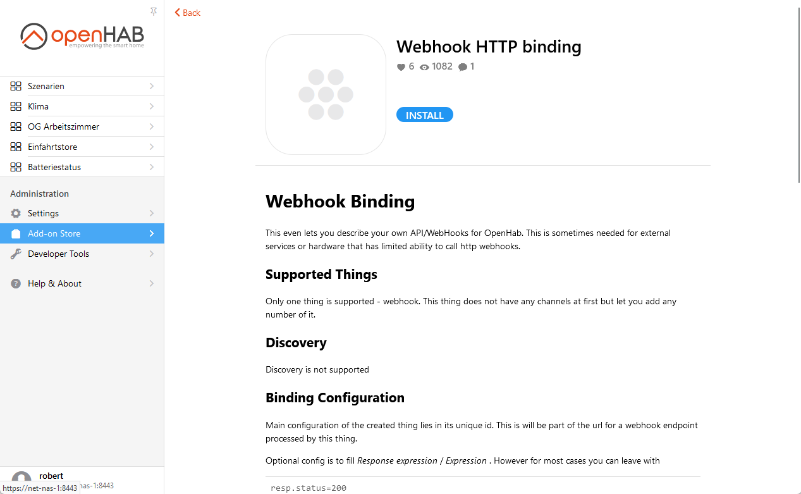

#### 2. Create a Webhook Thing

Create a new Webhook Thing.

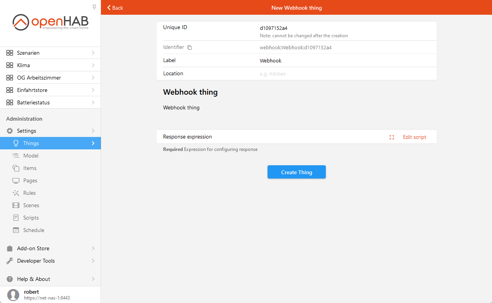

Go to the **Code** tab and enter the following YAML (replace `UID` with your own):

```yaml
UID: webhook:Webhook:d1097152a4
label: Webhook
thingTypeUID: webhook:Webhook
configuration:
  expression: resp.status=200
channels:
  - id: lastCall
    channelTypeUID: webhook:lastCall-channel
    label: Last request
    configuration: {}
  - id: trigger
    channelTypeUID: webhook:trigger-channel
    label: Trigger
    configuration:
      expression: >-
        {
          var gson = new("com.google.gson.Gson");
          var jsonRoot = {:}; var jsonBody = {:};
          if (!empty(req.body.text)) jsonBody.put("text", req.body.text);
          if (!empty(req.body.json)) jsonBody.put("json", req.body.json);
          jsonRoot.put("parameters", req.parameters);
          jsonRoot.put("body", jsonBody);
          jsonRoot.put("method", req.method);
          return gson.toJson(jsonRoot);
        }
```

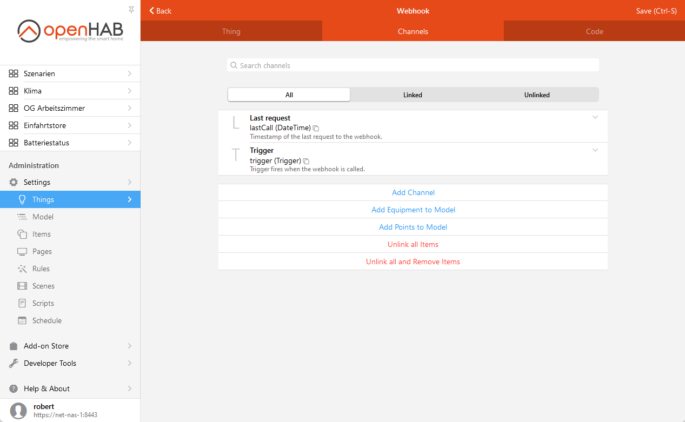

#### 3. Create a Rule with JavaScript

Create a [Rule]({{base}}/concepts/rules.html) that triggers on webhook and runs this JavaScript:

```javascript
var request = JSON.parse(event.event);

var action = request.parameters.action?.[0] ?? null;
var itemName = request.parameters.itemName?.[0] ?? null;
var command = request.parameters.command?.[0] ?? null;

if (action === "sendCommand") {
  if (itemName && command) {
    items.getItem(itemName).sendCommand(command);
  } else {
    console.warn(`Webhook: sendCommand missing parameters (itemName='${itemName}', command='${command}')`);
  }
} else if (action === "toggle") {
  if (itemName) {
    var item = items.getItem(itemName);
    item.sendCommand(item.state === "ON" ? "OFF" : "ON");
  } else {
    console.warn(`Webhook: toggle missing itemName`);
  }
} else {
  console.warn(`Webhook: invalid or missing action '${action}'`);
}
```

| Parameter  | Description                         |
|------------|-------------------------------------|
| `action`   | `"sendCommand"` or `"toggle"`       |
| `itemName` | Name of the item to control         |
| `command`  | Command to send (for `sendCommand`) |

#### 4. Test & Connect

You can test the webhook by visiting:

```text
https://yourserver:yourport/webhook/d1097152a4?action=toggle&itemName=LightBedroom
```

Then enter the Webhook ID (`d1097152a4`) in the app settings:

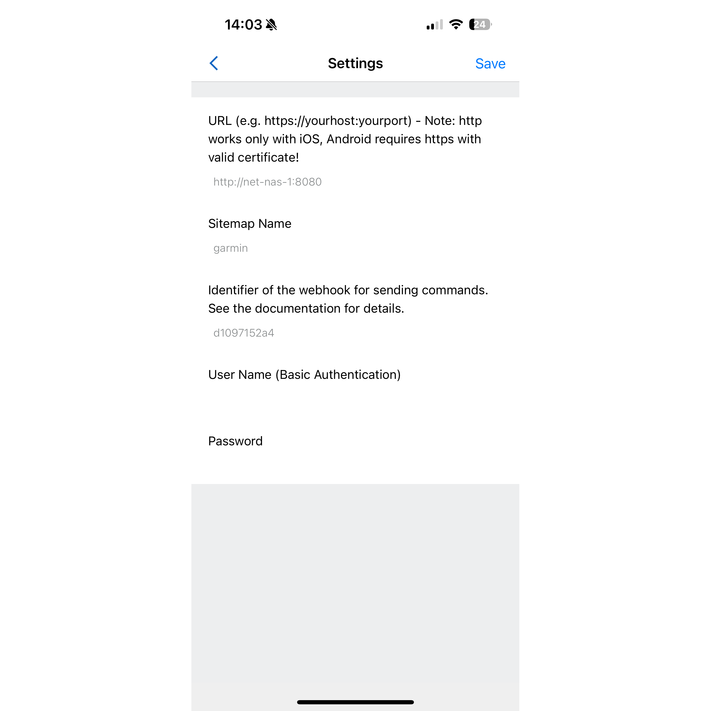

</details>

## Sitemap Setup

Check the [Sitemaps documentation]({{base}}/ui/sitemaps.html) to learn more about how sitemaps work.

The sitemap name configured in the app must match the filename of the sitemap, excluding the `.sitemap` extension.
For example, if the file is named `garmin_demo.sitemap`, set the sitemap name in the app settings to `garmin_demo`.

When creating the sitemap through the UI, the sitemap nam configured in the app is `uicomponents_` + sitemap name.
For example, if the sitemap is named `Garmin_Demo` in the UI, set the sitemap name in the app settings to `uicomponents_Garmin_Demo`.

The label defined within the sitemap file is displayed in the app UI, such as in glances and other views.

```java
sitemap garmin_demo label="My Home" {
}
```

### Supported Elements

The following element types are currently supported:

- [`Frame`](#frame)
- [`Default`](#default)
- [`Text`](#text)
- [`Group`](#group)
- [`Switch`](#switch-and-selection)
- [`Selection`](#switch-and-selection)
- [`Setpoint`](#setpoint-and-slider)
- [`Slider`](#setpoint-and-slider)

The following sections describe the supported parameters and the Sitemap Widget associated with each of these elements.

#### Nested Elements

Nested elements are fully supported.

Certain sitemap elements — namely `Frame`, `Text`, and `Group` — can contain nested elements to help structure your sitemap hierarchically.

In sitemaps, `Frame` elements are used to visually separate areas on a page, while nested elements under `Text` and `Group` are presented as navigable subpages.
The Garmin app adopts a menu-based navigation structure and implements nested elements under all three types as submenus.

- For `Frame` and `Text`, nested elements must be defined manually. The only functional difference is that `Text` displays the associated item’s state, whereas `Frame` does not.
- `Group` elements automatically populate their nested elements based on the members of the referenced group item.

For more details, refer to the [sitemap documentation on nested elements]({{base}}/ui/sitemaps.html#nested-elements).

#### `Frame`

The ➡️ [`Frame`]({{base}}/ui/sitemaps.html#element-type-frame) element is [one of three](#nested-elements) sitemap elements that support hierarchical structuring.

You can nest `Frame` elements within other `Frame` elements. While this is allowed by the specification, openHAB may log a warning when doing so — but it still functions as expected.

Technically, the specification does _not_ permit mixing `Frame` elements alongside other element types at the same hierarchy level. However, in practice, this does work in openHAB.
If you choose to use this unsupported approach, be aware that you're doing so at your own risk.

Here is an example of a sitemap containing three `Frame` elements.

```java
sitemap garmin_demo label="My Home" {
 Frame label="Entrance Gates" {
  Switch item=EntranceGatesTrigger label="Open/Close" mappings=[OFF="", ON="OK"]
  Text item=EntranceGateStatus label="Status"
 }
 Frame label="Ground Floor" {
    // ...
 }
 Frame label="First Floor" {
    // ...
 }
}
```

This configuration produces the following display in the UI:

<div class="garmin-screenshot-container">
  
  
</div>

#### `Default`

The ➡️ [`Default`]({{base}}/ui/sitemaps.html#element-type-frame) element displays an item using the default widget determined by its type.
This widget selection is handled automatically by openHAB.

The Garmin app supports `Default` only if the item’s type maps to one of the app’s supported widgets.
If this is not the case, an error will be shown instead.

#### `Text`

The ➡️ [`Text`]({{base}}/ui/sitemaps.html#element-type-text) Sitemap Widget is used to display the current state of an item without allowing any user interaction.

**Supported parameters:**

- `label`: the label shown in the UI.
- `item`: the name of the openHAB item whose state should be displayed.

This widget is ideal for showing read-only information, such as temperature, system status, or sensor readings.
It also supports [nested elements](#nested-elements), making it suitable for creating a hierarchical sitemap structure.

**Example configuration:**

In this example, the `Text` Sitemap Widget is used to display the status of entrance gates.
Triggering the gates is handled by a separate `Switch` element.

```java
Frame label="Entrance Gates" {
  Switch item=EntranceGatesTrigger label="Open/Close" mappings=[OFF="GO", ON="DONE"]
  Text item=EntranceGateStatus label="Status"
}
```

**Resulting UI:**

<div class="garmin-screenshot-container">
  
</div>

#### `Group`

The ➡️ [`Group`]({{base}}/ui/sitemaps.html#element-type-group) Sitemap Widget will present a submenu containing all the items in the associated item of type `Group`.
This also works recursively, if the `Group` item itself contains other `Group` items, those will again open their own submenus.

**Example configuration:**

In this example, the `CC_House_Lights` item represents a hierarchical structure: it contains groups for each floor (e.g., the first floor), which in turn contain groups for individual rooms, and those room groups include the actual light switch items.

```java
sitemap garmin_demo label="My Home" {
 Group item=CC_House_Lights label="All Lights"
  // ...
}
```

**Resulting UI:**

<div class="garmin-screenshot-container">
  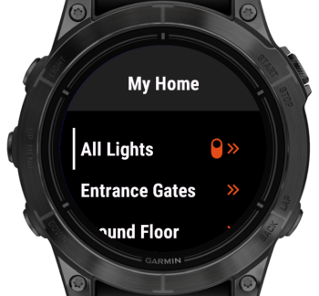
  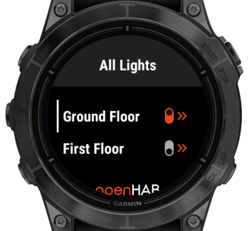
  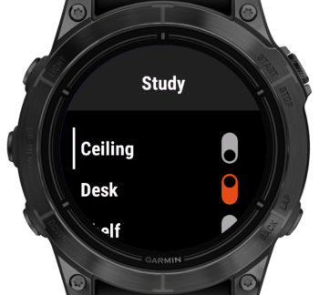
</div>

#### `Switch` and `Selection`

The ➡️ [`Switch`]({{base}}/ui/sitemaps.html#element-type-switch) and ➡️ [`Selection`]({{base}}/ui/sitemaps.html#element-type-switch) widgets display the current state of an item and allows the user to send commands to change it.

In other UIs, the `Switch` and `Selection` widgets behave differently:

- `Switch` presents all available options **inline** within the page.
- `Selection` opens a **dedicated selection dialog** to choose a value.

However, due to the limited screen space on wearables, the Garmin app always opens a dedicated action menu whenever there are more than one or two options.

As a result, `Selection` is treated as a **synonym for `Switch`**, and both behave identically in the Garmin app.

**Supported parameters:**

- `label`: Text displayed in the UI.
- `item`: Name of the associated openHAB item.
- `mappings` (optional): Defines command-to-label mappings for display and interaction.

The widget supports four usage variants:

1. **Toggle Switch** – for binary items (`ON`/`OFF`) and `Dimmer` items.
1. **Rollershutter Control** – a full-screen view for `Rollershutter` items with `UP`, `DOWN`, and `STOP` buttons.
1. **Player Control** – a full-screen view for `Player` items with `PLAY`/`PAUSE`, `NEXT`, and `PREVIOUS` buttons.
1. **Generic Switch** – for items with custom or multiple commands, defined via `mappings` or item metadata.

##### Toggle Switch

This is the default behavior when:

- No `mappings` are provided,
- The item has no command descriptions,
- The item is **not** of type `Rollershutter`.

The switch simply toggles between `ON` and `OFF`.

**Note:** If an item of type `Dimmer` is linked to a `Switch` and no state mappings are defined, a toggle switch will be displayed.
The toggle will send `ON` and `OFF` commands. For display purposes, a `Dimmer` state of `0` is treated as `OFF`, while any value from `1` to `100` is considered `ON`.

**Example:**

```openhab
Frame label="Switches" {
    Switch item=Light label="Light"
}
```

**UI Preview:**

<div class="garmin-screenshot-container">
  
</div>

##### Rollershutter

When the item type is `Rollershutter`, the widget opens a full-screen control with `UP`, `DOWN`, and `STOP` actions.

In the menu, the item displays a textual or percentage-based state:

- `mappings` can be used to map numeric states (e.g., `0="Open"`, `100="Closed"`), but **only affect the menu label**.
- The full-screen view **always** shows numeric percentages for clarity, since states like `0` and `100` can reflect transitional movement (e.g., “opening”) rather than final state (“open”).

**Example:**

```java
Frame label="Switches" {
    Switch item=Rollershutter label="Rollershutter" mappings=[0="Open", 100="Closed"]
}
```

**UI Preview:**

<div class="garmin-screenshot-container">
  
  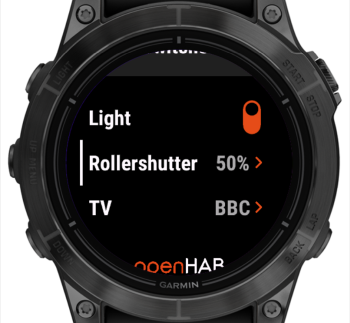
  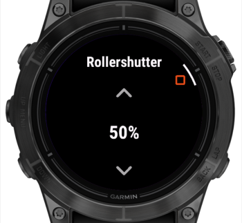
  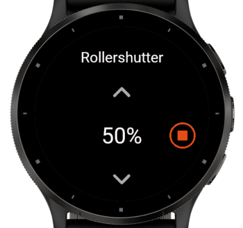
</div>

##### Player

When the item type is `Player`, the widget opens a full-screen control with `PLAY`/`PAUSE`, `NEXT`, and `PREVIOUS` actions. In the menu, the item displays the `PLAY`/`PAUSE` state.

**Example:**

```java
Frame label="Switches" {
    Switch item=MediaControl label="Audio"
}
```

**UI Preview:**

<div class="garmin-screenshot-container">
  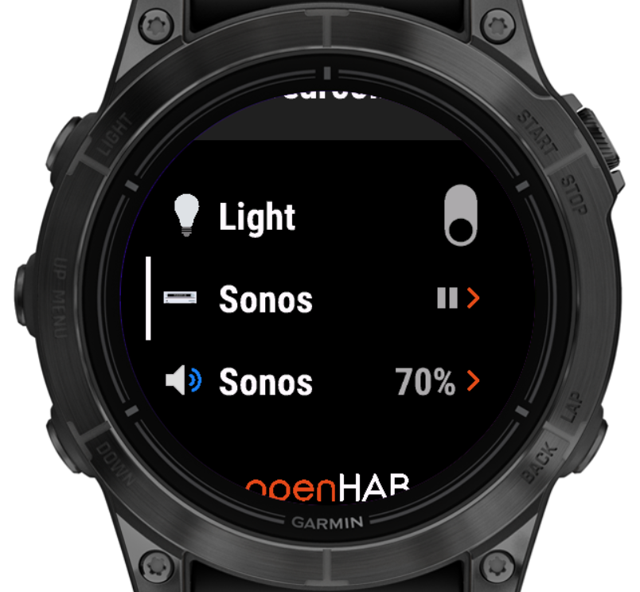
  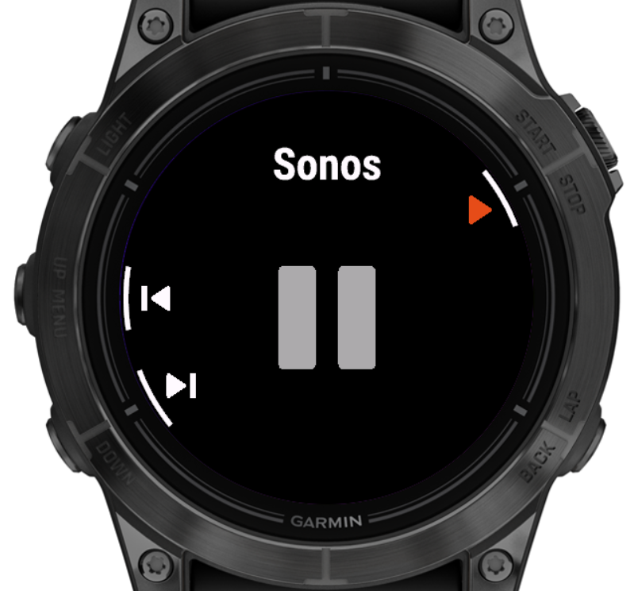
  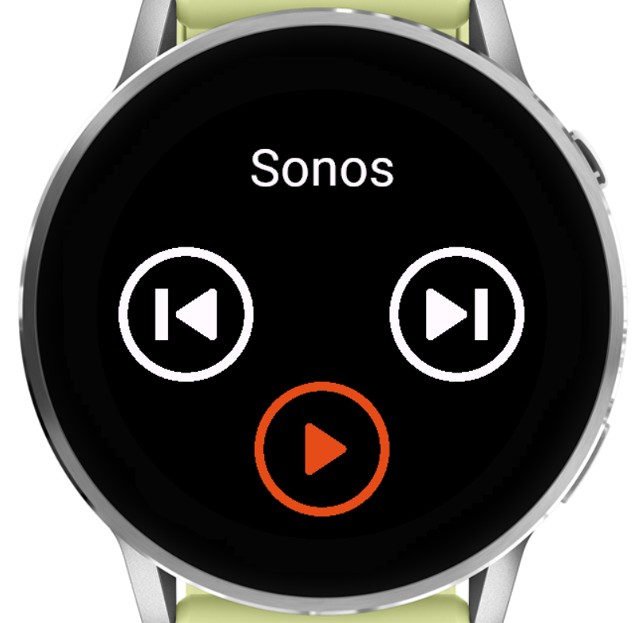
</div>

##### Generic Switch

This variant is used for items that don’t fall under the previous two cases.

It supports multiple custom commands, defined either via:

- `mappings` in the sitemap,
- or command/state descriptions on the item (e.g., from a channel or metadata).

In the menu, the widget displays the current state as text:

- If the state matches one of the mapped commands, the corresponding label is shown.
- Otherwise, the raw state is displayed.

**Tip:** You can use an empty label in `mappings` if the item's function is self-explanatory from context.

**Selection behavior:**

- If **one** command is defined, it is sent immediately when the item is selected.
- If **two** commands are defined and one of them matches the current state, the **other** is sent immediately.
- In all other cases, an **action menu** appears on the right side of the screen, allowing the user to select from the list of available commands.
  If the current state matches one of the commands, that command is **not shown** in the menu.

**Example:**

```java
Frame label="Switches" {
    Switch item=TV label="TV" mappings=[0="ABC", 1="BBC", 2="CNN"]
}
```

**UI Rendering:**

<div class="garmin-screenshot-container">
  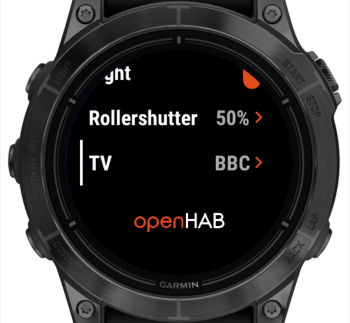
  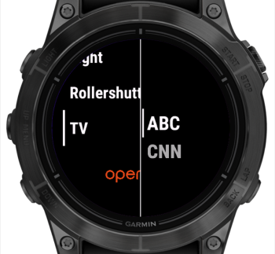
</div>

**Note:** The action menu shown in the right screenshot is a **mockup**.
The actual appearance may vary depending on the device, as it uses a native UI component.

**Example with Empty Mapping Entry:**

Consider a garage door opener that acts as a toggle switch: sending an `ON` command triggers the gate to open or close, and the switch automatically resets to `OFF` after one second.

This can be configured in the sitemap like so:

```java
sitemap garmin_demo label="My Home" {
 Frame label="Entrance Gates" {
  Switch item=EntranceGates_Operation label="Open/Close" mappings=[OFF="", ON="OK"]
  Text item=EntranceGates_Status label="Status"
 }
}
```

In this configuration:

- The switch typically stays in the `OFF` state, where the `"Open/Close"` label is sufficient.
- When pressed, it sends the `ON` command, briefly displays `"OK"` as feedback, then returns to `OFF`.

Here’s how the interface appears when the switch is in the `OFF` state:

<div class="garmin-screenshot-container">
  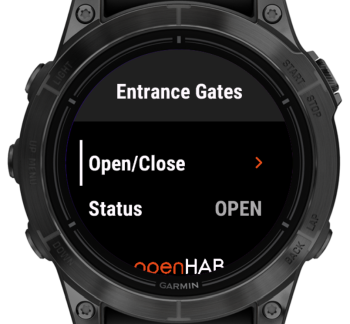
</div>

#### `Setpoint` and `Slider`

The ➡️ [`Setpoint`]({{base}}/ui/sitemaps.html#element-type-setpoint) and ➡️ [`Slider`]({{base}}/ui/sitemaps.html#element-type-slider) widgets are **numeric controls** used to display and adjust the numeric state of an item.

When selected, both widgets open a full-screen view for choosing a new value, which is then sent as a command to the item.

The only behavioral difference between the two is the `Slider` widget’s support for the `releaseOnly` parameter (see below).

**Supported parameters:**

- `label`: the label displayed in the UI.
- `item`: the name of the associated openHAB item.
- `minValue`: lower bound of the selectable range (default: `0`).
- `maxValue`: upper bound of the selectable range (default: `100`).
- `step`: interval between selectable values (default: `1`).
- `releaseOnly`: _(Slider only)_
  - **With `releaseOnly`:** The value is only sent when the dialog is confirmed. Cancelling leaves the value unchanged.
  - **Without `releaseOnly`:** Values are sent immediately as the slider is moved. Confirming keeps the current value; cancelling reverts to the value before the dialog was opened.

**Important note:**
While the default `step=1` is consistent with openHAB’s default, it often results in too many steps (e.g., 100 steps for a range of 0–100), which is impractical for wearable interfaces. Increasing `step` to `10` reduces the number of steps to 10, making interaction much more manageable.

**Example configuration:**

```java
Frame label="First Floor" {
  Slider item=Dimmer label="Dimmer" minValue=0 maxValue=100 step=10
  // ...
}
```

**Resulting UI:**

<div class="garmin-screenshot-container">
  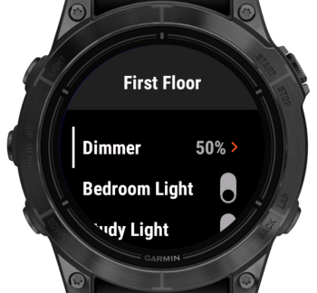
  
  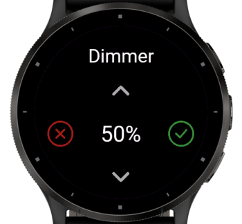
</div>

- The **lower-left** screenshot shows the slider on a button-based device.
- The **lower-right** screenshot shows the slider on a touch-based device.

Note: Even button-based devices may support touch input, and on those, the UI reacts to both.
On **button-based devices**, use **up/down** to scroll through the values, press **enter** (upper-right button) to confirm or **back** (lower-right button) to cancel.
On **touch-based devices** simply **tap the icons** corresponding to the desired action or value to make a selection.

### Dynamic Sitemaps

Of the available [Dynamic Sitemaps]({{base}}/ui/sitemaps.html#dynamic-sitemaps) features, the `visibility` parameter as well as label and icon colors are supported.

#### Visibility

For usage details and examples, see the [visibility documentation]({{base}}/ui/sitemaps.html#visibility).

Here's an improved version with clearer phrasing, smoother flow, and a slightly more polished tone, while preserving the original structure:

#### Label and Value Colors

For usage details and examples, refer to the [label & value colors documentation]({{base}}/ui/sitemaps.html#label-value-and-icon-colors).

The app supports both `labelcolor` and `valuecolor` attributes. Color values can be specified using either hexadecimal color codes (e.g., `#FF0000`) or named colors (e.g., `red`) as listed in the documentation.

Here’s an example configuration:

```java
sitemap garmin_demo label="My Home" {
 Frame label="Entrance Gates" {
  Switch item=Entrance_Gates_Power label="Open/Close" mappings=[OFF="", ON="DONE"]
  Text item=Entrance_Gates_Status label="Status" valuecolor=[==OPEN="red", ==CLOSED="green", ==MOVING="yellow"]
 }
}
```

This results in the following display:

<div class="garmin-screenshot-container">
  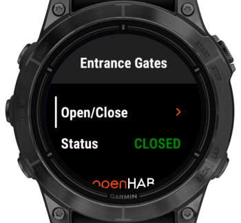
</div>

#### Icons

For detailed usage and examples, refer to the [sitemap icons documentation]({{base}}/ui/sitemaps.html#icons).

The Garmin app supports both the `icon` and `staticIcon` parameters, using a subset of the [classic icon set]({{base}}/configuration/iconsets/classic/).
Where applicable, the app automatically selects an icon variant based on the item's state—for example, showing different icons for a light that is `ON` or `OFF`.

Below is a screenshot illustrating this behavior:
The second menu item shows a filled lightbulb icon (indicating the light is ON), and the third item shows a state-aware rollershutter icon.

<div class="garmin-screenshot-container">
  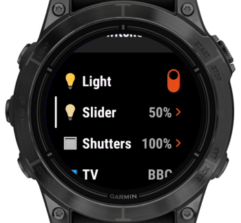
</div>

**Tip:** Even if you don't explicitly define icons in your sitemap, some may be applied automatically based on item metadata. To suppress this behavior, you can set the icon to an empty string in the sitemap: `icon=""`.

Currently supported icons are:

- `batterylevel`
- `blinds`
- `door`
- `frontdoor`
- `garagedoor`
- `heating`
- `humidity`
- `light`
- `lightbulb`
- `lowbattery`
- `mediacontrol`
- `player`
- `poweroutlet`
- `radiator`
- `rollershutter`
- `screen`
- `slider`
- `soundvolume`
- `temperature`
- `window`

More icons can be added upon request. If you need support for additional icons, please post a request in the [openHAB Community](https://community.openhab.org/t/request-additional-icons/164976).

## Settings Menu

To access the settings menu:

- On button-based devices, scroll down on the home screen and continue past the ⚙️ icon.
- On touch-based devices, tap the ⚙️ **Settings** entry in the home screen menu.

The settings menu currently displays the app version and server URL. Additional features may be added in the future when the app evolves.

<div class="garmin-screenshot-container">
  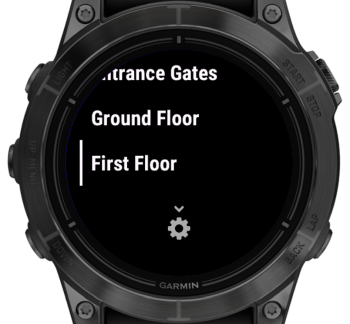
  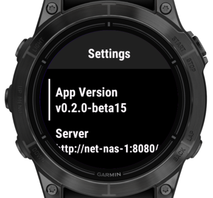
</div>

## Troubleshooting

This section explains how the app handles errors and lists common issues you might encounter.

### How the App Handles Errors

The app distinguishes between **temporary (non-fatal)** and **critical (fatal)** errors:

- **Non-fatal errors** trigger a toast notification at the top of the screen, allowing you to continue using the app.
- **Fatal errors** display a full-screen error view, halting further use until the issue is resolved.

**Non-fatal errors include:**

- Most communication-related issues when requesting the sitemap.
- All communication-related issues when sending a command.
- Issues that occur while processing user input

> Note: Non-fatal errors related to requesting the sitemap will become fatal if they persist for more than 10 seconds.

**Immediately fatal errors include:**

- Certain communication errors when requesting the sitemap, specifically:

  - Error `-1001` (see below)
  - HTTP error `404`
- Errors encountered while parsing the sitemap.
- Any other unexpected errors or exceptions.

> Note: Even after a fatal error, the app continues querying the sitemap. If a response is successfully processed, it returns to displaying the sitemap.

**If "Suppress Empty Response Errors" is enabled:**

When this option is enabled in the [Settings](#configuration), toast notifications for the following errors will be suppressed:

- `INVRES` – Invalid response (error code `-400`)
- `EMRES` – Empty response

However, if these errors persist for more than 10 seconds, they will be treated as fatal, and a full-screen error view will be shown.

### Communication Error Codes (Prefix: `S:`/`C:`)

To save space, communication errors shown in toast notifications follow this format:

`X:NNNNNN`

- `X` indicates the source of the error:

  - `S` = sitemap polling
  - `C` = command sending
- `NNNNNN` is the error code:

  - Positive values = HTTP status codes
  - Negative values = Garmin SDK error codes

For a full list of Garmin SDK error codes, see the **Constant Summary** section here: [Garmin Communications API Docs](https://developer.garmin.com/connect-iq/api-docs/Toybox/Communications.html)

**Special error codes:**

The following error codes are used for common communication issues and those without specific error codes:

- `NO PHONE` – The watch is not connected to the smartphone (error codes `-104` and `-2`).
- `INVRES` – The response was invalid (error code `-400`).
- `EMRES` – The response was empty.

### User Interface Error Codes (Prefix `UI:`)

All error codes with the `UI:` prefix currently indicate an internal programming error in the user interface. These errors are not caused by incorrect user interaction or configuration.

If you encounter a **UI:** error code, please report it to the development team, as it helps identify and fix issues in the application. Including the exact error code and the circumstances under which it occurred is especially helpful. Reports can be submitted in [the forum](https://community.openhab.org/t/announcing-openhab-for-garmin/163891) or by creating an issue on [GitHub](https://github.com/openhab/openhab-garmin/issues).

### Common Issues

| Error     | Description                                                                                                                                                                                                                                                                                                                                                                                                                                                                                       |
|-----------|---------------------------------------------------------------------------------------------------------------------------------------------------------------------------------------------------------------------------------------------------------------------------------------------------------------------------------------------------------------------------------------------------------------------------------------------------------------------------------------------------|
| `C:415`   | HTTP response code **415** means _Unsupported Media Type_. This usually occurs when **Native REST API Support** is enabled in the [Configuration](#configuration), but your openHAB instance doesn’t support it. If you're using the backport (see [Sending Commands](#sending-commands) and have recently updated openHAB to a newer version or installed a new binding, you may need to re-install the backport to restore compatibility.                                                       |
| `S:EMRES` | myopenHAB currently experiences an intermittent issue ([details here](https://github.com/openhab/openhab-cloud/issues/496)) where sitemap requests may return empty responses. When this happens, the app displays a non-fatal `S:EMRES` notification. Typically, the next request succeeds, so the issue doesn't escalate into a fatal error. To avoid seeing these notifications, you can enable the **Suppress empty response errors** option in the [Configuration](#configuration) settings. |
