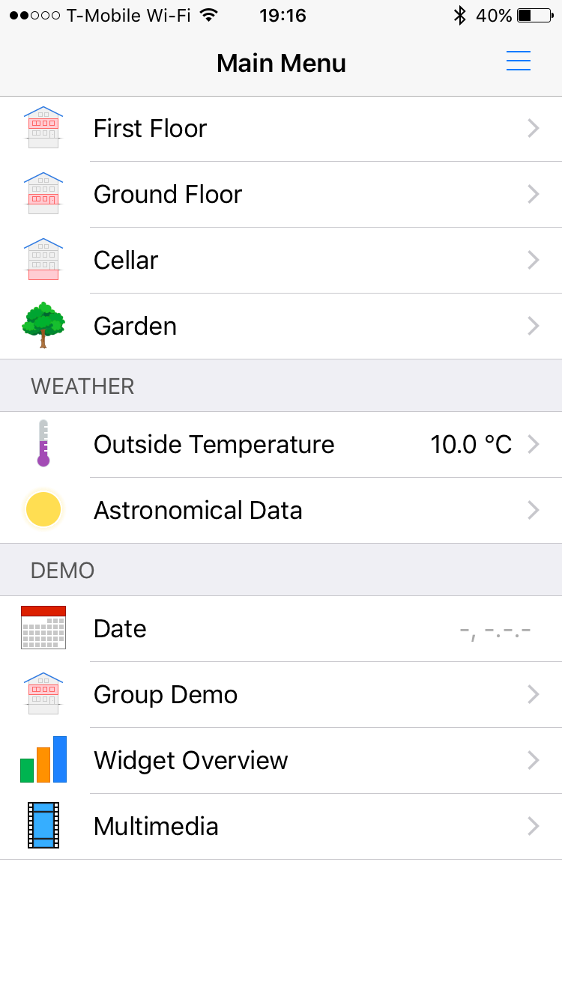
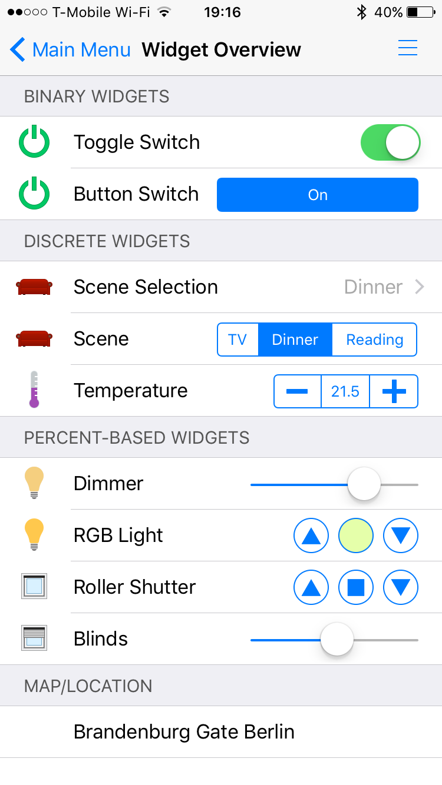
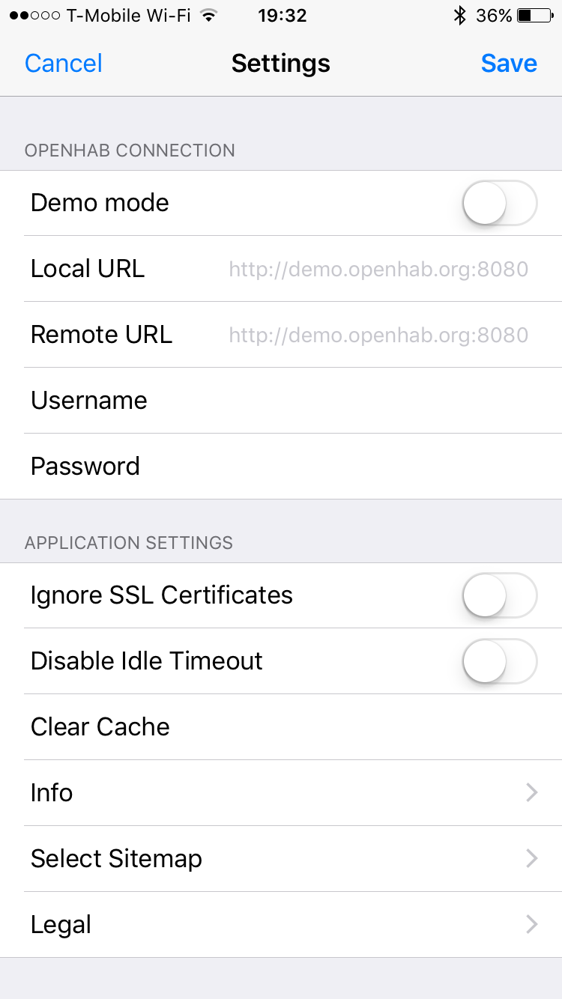



# iOS App

<!-- https://developer.apple.com/app-store/marketing/guidelines/de/#downloadOnAppstore -->

The openHAB iOS application is a native client for openHAB, compatible with iPhone and iPad.
It uses the REST API of openHAB to render sitemaps of your openHAB installation for a natural iOS feeling.

## Features

- View and control openHAB sitemaps
- Connect to local openHAB instances on the local network
- Connect to your openHAB instance remotely, either using a direct connection or via myopenHAB
- Receive push notifications on your iOS devices via myopenHAB
- Natively supports both iPhone and iPad

  

  

  

## Installation and Setup

The latest release version of the app is always available through the Apple App Store.

The app will start in Demo mode by default.
A demo home automation setup is shown.
This allows you to explore the possibilities of a typical openHAB installation.

To view and control your own devices, navigate to the Settings page, then disable the "Demo mode" checkbox.
In the "Local URL" field enter the base URL to your openHAB webinterface, either using its IP address (e.g. `http://192.168.1.125:8080`) or hostname (e.g. `http://openhabianpi:8080`).

You can also connect to openHAB remotely, using either a direct connection or an openHAB Cloud instance like myopenHAB.
Please see the [article on secure remote access](http://docs.openhab.org/installation/security.html) for more details.
Simply enter your "Remote URL" in the respective Settings field.
The openHAB app will henceforth first try connecting to the local URL, then fall back to the remote URL.

## Help and Resources

If your question or problem isn't covered here in the documentation pages, check the [openHAB Community Forum](https://community.openhab.org).

Also, please refer to the [openhab.ios project](https://github.com/openhab/openhab.ios) on GitHub for more technical details.
