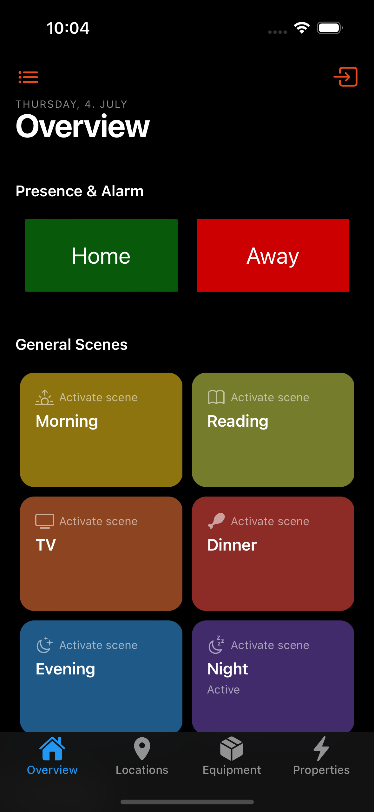
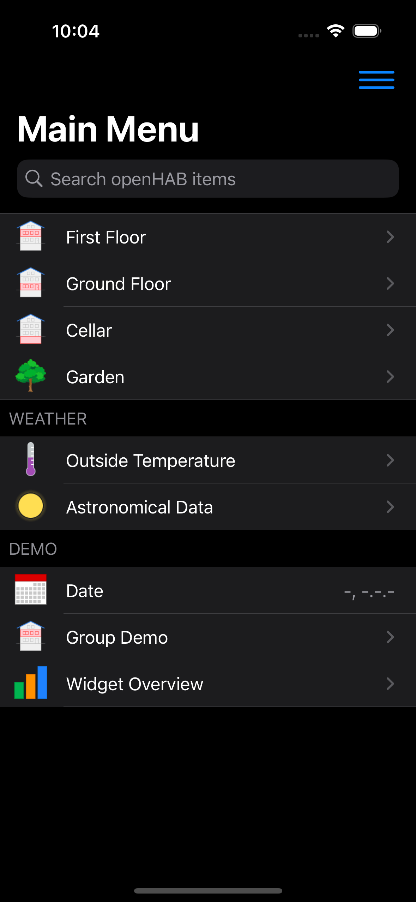
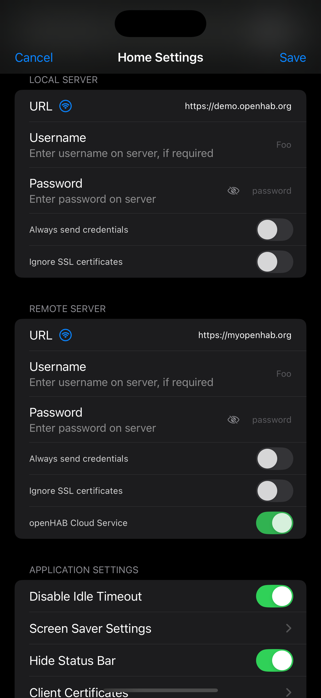
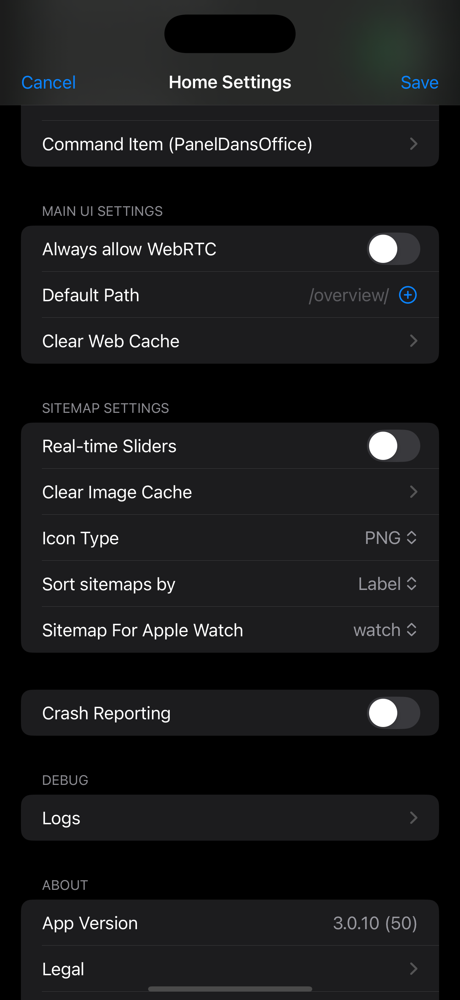
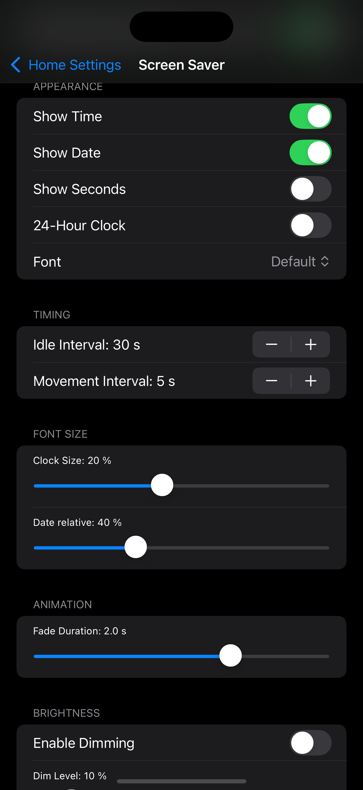
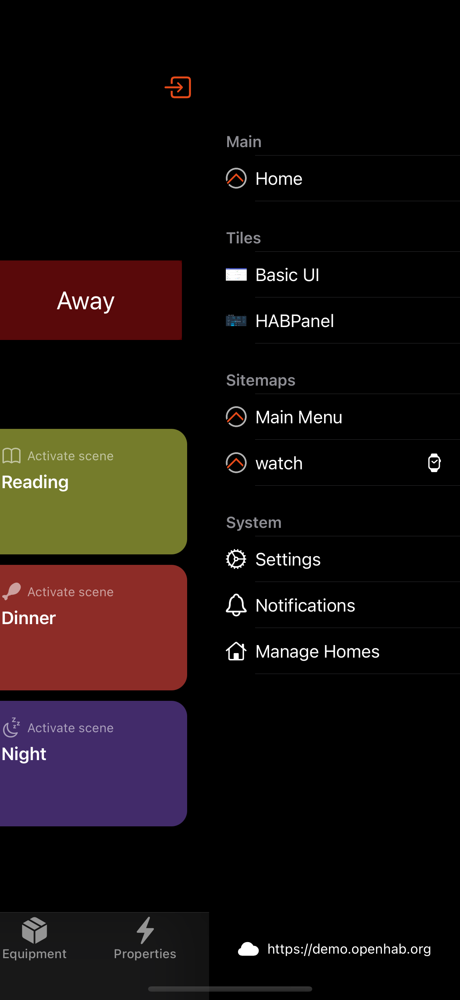
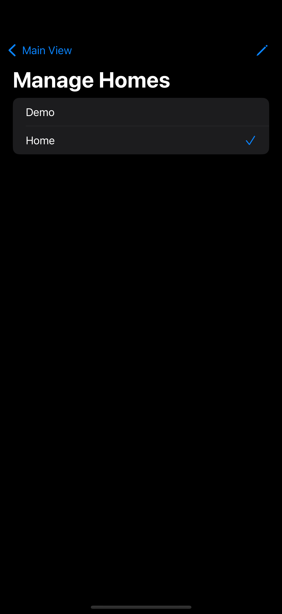
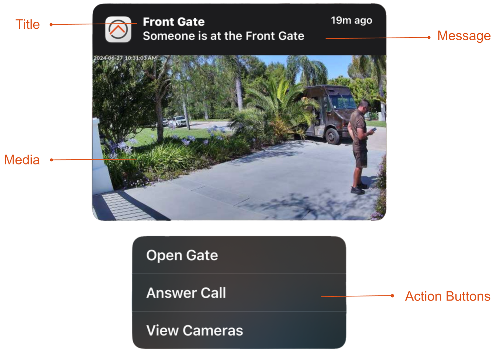

# iOS App

The openHAB iOS application is a native client for openHAB, compatible with iPhone and iPad.

## openHAB (Current)

This is the primary openHAB app which contains the latest features and is updated regularly. This includes Apple Watch support, enhanced notifications, shortcuts and more.
Requires at least iOS 16 and openHAB 2.x and later.

<a href="https://itunes.apple.com/us/app/openhab/id6505005945"></a>

Beta releases are available on [TestFlight](https://testflight.apple.com/join/0uFYONeF).

<a href="https://testflight.apple.com/join/0uFYONeF"></a>

## openHAB V1 (Legacy)

This is the legacy app for users on iOS 15 or earlier as well as openHAB system 1.x and later (tested to at least openHAB 4).
This app only receives security updates and minor fixes and is not intended for most users.

<a href="https://itunes.apple.com/us/app/openhab/id492054521?ls=1&mt=8"></a>

Beta V1 releases are available on [TestFlight](https://testflight.apple.com/join/563WBakc).

## Features

- Control your openHAB server directly and through a [openHAB Cloud instance](https://github.com/openhab/openhab-cloud)
- [Enhanced push notification](#push-notifications) from openHAB Cloud and the openHAB cloud binding
- [Apple Watch](#apple-watch-configuration) companion app
- [Shortcuts](#shortcuts)
- [Multiple Home Support](#multiple-homes)

<p float="left">
  
  
</p>

## App Configuration

<p float="left">



</p>

### Demo Mode

This sets up the app to use the openHAB demo server and can be used to experience the app without needing to install openHAB.

Disable this to use the app with your own openHAB instance.

### Connection Settings

#### Local URL

This is the primary connection to your openHAB instance, a fully qualified URL with a IP or host is required.

Example:
`https://openhab.local:8443`

#### Remote URL

This is the secondary connection to your openHAB instance, a fully qualified URL with a IP or host is required.
If using the openHAB cloud service, leave this as the default setting of `https://myopenhab.org`.
When set to the public cloud, the app will also register for push notifications (as long as credentials are correct)

The [Local URL](#local-url) will be used as the primary connection, and if that fails or is not reachable, falls back to the remote URL.

Example:
`https://myopenhab.org`

#### Username / Password

This will be sent if the local or remote server challenges for authentication, or if "Always Send Credentials" is checked on.
If using the openHAB cloud, these should be set to those login credentials.

### Application Settings

#### Certificates

Allows the installation of p12 formatted certificates for use in client side authentication setups.

To install a client certificate, rename the certificate with the extension `.ohp12`, then send it to your iOS device (airdrop, icloud, dropbox, etc..), then open/save and select `openHAB` from the "Open In" menu (you may need to select "More..." to see all apps).

To delete a certificate, swipe left on the certificate name in the certificate menu.

If using openssl v3 to generate certificates, make sure to add `-legacy -certpbe pbeWithSHA1And40BitRC2-CBC` to the pk12 export command.
See [Apple OpenSSL 3.0.x Issues](https://github.com/openssl/openssl/issues/19871) for more information on V3 compatibility with Apple products.

#### Idle Timeout

Useful for wall or fixed installations, will disable the Idle screen timeout.

#### Screensaver

The app includes a built-in screen saver that can be shown automatically after a period of inactivity.

Key options (Settings → Screen Saver):

- **Enable Screen Saver** – turns the feature on/off.
- **Appearance** – decide whether to show the time, date and/or seconds, choose 12- or 24-hour clock, and pick a custom font.
- **Idle Interval** – number of seconds of user inactivity before the screen saver appears (5 – 600 s).
- **Movement Interval** – how often the clock moves to a new random position to avoid burn-in (2 – 60 s).
- **Font Size** – independent sliders for clock and date size (relative to the screen).
- **Animation** – fade-in/out duration when the screen saver appears or disappears.
- **Brightness** – optional automatic dimming; set dim level, whether the previous brightness should be restored, and the brightness level to restore to.
- **Test Screen Saver** – instantly preview the current configuration.

You can also control the screen saver from the [command item](#command-item) using the `device:screensaver:<action>` syntax.  See [Action Syntax](#action-syntax) for more information.

#### Command Item

The iOS app can react to updates of a dedicated String Item so you can remotely control the device or navigate the UI from your openHAB server.

Whenever the state of the Item changes the app interprets the new value as an [Action String](#action-syntax) and executes it immediately – exactly the same mechanism that is used for push-notification actions.

**Setting up the Command Item**

1. Create a String Item in openHAB, for example:

```items
String Tablet_Command "iOS TabletCommand"
```

   Any existing String/Text Item will also work – just remember its name.

2. In the iOS app open **Settings → Application Settings → Command Item** and pick the Item you just created.
   The list shown in the picker is populated from your openHAB instance.

3. Send actions by updating the Item.

Example rules:

```rules
Tablet_Command.postUpdate("device:screensaver:activate")     // start the screensaver
Tablet_Command.postUpdate("device:brightness:0.3")           // set brightness to 30 %
Tablet_Command.postUpdate("device:tts:Hello there!:en-US:Samantha") // speak "Hello there!" using the Samantha voice for the en-US language
Tablet_Command.postUpdate("ui:/basicui/app?w=0000&sitemap=main") // open a sitemap page
Tablet_Command.postUpdate("ui:navigate:/page/my_floorplan_page") // navigate to a page in the Main UI
Tablet_Command.postUpdate("command:KitchenLights:ON")        // send ON to KitchenLights
```

Notes:

- The app receives Item updates via Server-Sent Events, and will only receive updates if the app is running in the foreground (like kiosk applications).
- If the app is unable to connect to the server and a SSE connection is not established, it will continue to try and reconnect, but messages sent to the app during this time will be lost.

#### Crash Reporting

Sends crash reports to Google / Firebase.

### Main UI Settings

#### WebRTC

Allows audio and video communications in the Main UI for views and widgets that require it.

#### Default Path

Allows the user to enter a path to act as the starting point when the Main UI is loaded.
Clicking the "+" button will prompt to enter the current path the of Main UI view.

#### Clear Cache

Clears the Main UI web cache.

### Sitemap Settings

#### Realtime Sliders

Allows sitemap sliders to send changes as the control is sliding in realtime.

#### Image Cache

Clears the sitemap cached images.

#### Icon Type

Select which type of icon the sitemap view will attempt to load for icons.

#### Sitemap Sorting

Sort order when presenting multiple sitemaps for selection.

### Apple Watch Configuration

Select the sitemap to use for the Apple Watch companion app.

Note that some advanced sitemap features may not be supported on the Apple watch and its recommended to keep this sitemap simple and appropriate for interaction on a small display.

When using the Watch app, slide left to bring up the configuration view and select "sync" to ensure the local, remote and username/password configurations are synced to the watch.

## Multiple Homes

<p float="left">


</p>

The app supports multiple homes, allowing you to connect to multiple openHAB instances and switch between them.

- To manage multiple homes, go to the side menu and select "Manage Homes".
- To add, remove or rename a home, click the edit button.
- To manage the current home settings, navigate to the settings screen and make changes. Any non global app specific settings will be applied to the current home.
- To switch homes, select the home to control and then navigate back.

## Main UI and Sitemap Usage


- Clicking "Home" will navigate to the Main UI from the user's openHAB system.
Clicking this when the Main UI is already visible will force a reload of the Main UI.

- Tiles are the alternative UIs installed on a user's system and will be opened in an embedded browser.

- Sitemaps show the available sitemaps on the users system.  Selecting a sitemap will present the native sitemap renderer view.

- Notifications is a list of push notification retrieved from the openHAB cloud (if configured).

- Settings opens the application settings view.

- The app will persist the last primary view opened (Main UI or Sitemaps) when the app is opened or restarted.

## Push Notifications

The [openHAB Cloud Connector](https://next.openhab.org/addons/integrations/openhabcloud/)  allows users to send push notifications mobile devices registered with an [openHAB Cloud instance](https://github.com/openhab/openhab-cloud) such as [myopenHAB.org](https://www.myopenhab.org).

<p float="left">

</p>

Push Notifications on iOS support:

- Title and message text
- Image and video attachments
- Up to 3 action buttons (long press notification)
- Collapsible / updated notifications
- Removing notifications

See [Cloud Push Notifications](https://www.openhab.org/addons/integrations/openhabcloud/#cloud-notification-actions) for more information on sending push notifications from rules.

Also see [Action Syntax](#action-syntax) for more information on actions that can be included in push notifications.

## Shortcuts

The app exposes several actions that let you control your openHAB installation from the Shortcuts app.

**Supported actions**

- **Get Item State** – Retrieves the current state of any item. Returns the item's state text so it can be used by later steps in a shortcut.
- **Set Switch State** – Sends an `ON` or `OFF` command to a Switch item.
- **Set Dimmer or Roller Shutter Value** – Sends an integer value (0-100) to Dimmer or Rollershutter items.
- **Set Number Item Value** – Writes a decimal value to any Number item.
- **Set String Item Value** – Writes an arbitrary text value to a String item.
- **Set Color Item Value** – Sends a color command in HSB format `Hue,Saturation,Brightness` (e.g. `240,100,100` for blue) to a Color item.
- **Set Contact Item State** – Sets a Contact item to `OPEN` or `CLOSED`.

## Help and Resources

If your question or problem isn't covered here in the documentation pages, check the [openHAB Community Forum](https://community.openhab.org).

Also, please refer to the [openhab-ios project](https://github.com/openhab/openhab-ios) on GitHub for more technical details.

## Appendix

### Action Syntax

The action syntax is a string containing the action type and the action payload separated by a colon.

There are several types of actions available:

- `command`: Sends a command to an Item by using the following syntax: `command:$itemName:$commandString` where `$itemName` is the name of the Item and `$commandString` is the command to be sent.
- `ui`: Controls the UI in two possible ways:
  - `ui:$path` where `$path` is either `/basicui/app?...` for navigating sitemaps (using the native renderer) or `/some/absolute/path` for navigating (using the web view).
  - `ui:$commandItemSyntax` where `$commandItemSyntax` is the same syntax as used for the [UI Command Item]({{base}}/mainui/about.html#ui-command-item).
- `http:` or `https:`: Opens the fully qualified URL in an embedded browser on the device.
- `rule`: Runs a rule by using the following syntax: `rule:$ruleId:$prop1Key=$prop1Value,$prop2Key=$prop2Value,...` where `$ruleId` is the id of the rule, and optional properties to send to the rule are in the format `name=value` separated by commas. Most rules can omit the properties.
- `app`: Launches a native app when possible using the following syntax: `app:android=$appId,ios=$appId:$path` where `$appId` on Android is a qualified app id like `com.acme.app`, and on iOS is the registered URL scheme along with an optional `$path` like `acme://foo`. Either `android` or `ios` can be omitted if that platform is not used.
- `device`: Performs actions on the iOS device itself using the syntax `device:$operation[:$value]`. Supported operations include:
  - `screensaver:activate` – activate the screensaver
  - `screensaver:disable` – disables the screensaver from running (call activate to re-enable)
  - `screensaver:wake` – wakes the screensaver if running
  - `idletimer:enable` – allow the device to auto-lock/dim again
  - `idletimer:disable` – keep the screen awake (useful for wall-mounted tablets)
  - `brightness:<0-1>` – set the display brightness, e.g. `brightness:0.25`
  - `tts:$text[:$language[:$voice]]` – text-to-speech; speaks `$text`.
    - `$language` (optional) – BCP-47 language tag such as `en-US`.
    - `$voice` (optional) – exact voice name reported by iOS (`AVSpeechSynthesisVoice`).
    - See [TTS Example Voices](#tts-example-voices) for a list of available voices and languages.

**Examples:**

- `command:KitchenLights:ON`
- `command:KitchenBlinds:50`
- `ui:/basicui/app?w=0000&sitemap=main` (use Basic UI to get sitemap URL locations)
- `ui:/some/absolute/path`: Navigates to the absolute path `/some/absolute/path`.
- `ui:navigate:/page/my_floorplan_page`: Navigates Main UI to the page with the ID `my_floorplan_page`.
- `ui:popup:oh-clock-card`: Opens a popup with `oh-clock-card`.
- `https://openhab.org`: Opens an embedded browser to the site `https://openhab.org`
- `rule:02ffc3a297:prop1=foo`: Runs the rule with an id of `02ffc3a297` passing in an optional parameter named `prop1` with a value of `foo`
- `app:android=com.sonos.acr2,ios=sonos-2://`: Opens the Sonos app depending on the device type (Android or iOS)
- `device:screensaver:activate`: Activates the device screen saver
- `device:brightness:0.3`: Sets the screen brightness to 30 %
- `device:tts:Hello there!:en-US:Samantha`: Speaks "Hello there!" using the Samantha voice for the en-US language
- `device:tts:Hello there!`: Speaks "Hello there!" using the default system voice and language

### TTS Example Voices

This is an example (partial) list of voices available on iOS.
See [AVSpeechSynthesisVoice](https://developer.apple.com/documentation/avfaudio/avspeechsynthesisvoice) for more information.

Additional voices, including custom and novelty voices can be downloaded in the iOS system settings.

| Voice Name | Language |
|------------|----------|
| Majed      | ar-001   |
| Daria      | bg-BG    |
| Montse     | ca-ES    |
| Zuzana     | cs-CZ    |
| Sara       | da-DK    |
| Sandy      | de-DE    |
| Helena     | de-DE    |
| Martin     | de-DE    |
| Anna       | de-DE    |
| Melina     | el-GR    |
| Karen      | en-AU    |
| Catherine  | en-AU    |
| Daniel     | en-GB    |
| Martha     | en-GB    |
| Arthur     | en-GB    |
| Moira      | en-IE    |
| Rishi      | en-IN    |
| Samantha   | en-US    |
| Nicky      | en-US    |
| Aaron      | en-US    |
| Fred       | en-US    |
| Mónica     | es-ES    |
| Paulina    | es-MX    |
| Satu       | fi-FI    |
| Amélie     | fr-CA    |
| Daniel     | fr-FR    |
| Thomas     | fr-FR    |
| Marie      | fr-FR    |
| Carmit     | he-IL    |
| Lekha      | hi-IN    |
| Lana       | hr-HR    |
| Tünde      | hu-HU    |
| Damayanti  | id-ID    |
| Alice      | it-IT    |
| Kyoko      | ja-JP    |
| O-ren      | ja-JP    |
| Yuna       | ko-KR    |
| Amira      | ms-MY    |
| Nora       | nb-NO    |
| Ellen      | nl-BE    |
| Xander     | nl-NL    |
| Zosia      | pl-PL    |
| Luciana    | pt-BR    |
| Joana      | pt-PT    |
| Ioana      | ro-RO    |
| Milena     | ru-RU    |
| Laura      | sk-SK    |
| Tina       | sl-SI    |
| Alva       | sv-SE    |
| Vani       | ta-IN    |
| Kanya      | th-TH    |
| Yelda      | tr-TR    |
| Lesya      | uk-UA    |
| Linh       | vi-VN    |
| Tingting   | zh-CN    |
| Sinji      | zh-HK    |
| Meijia     | zh-TW    |
