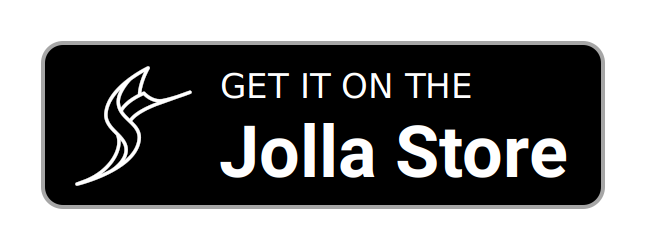
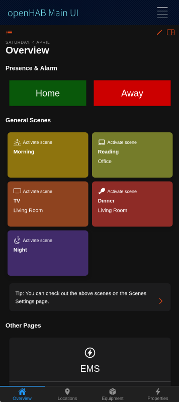
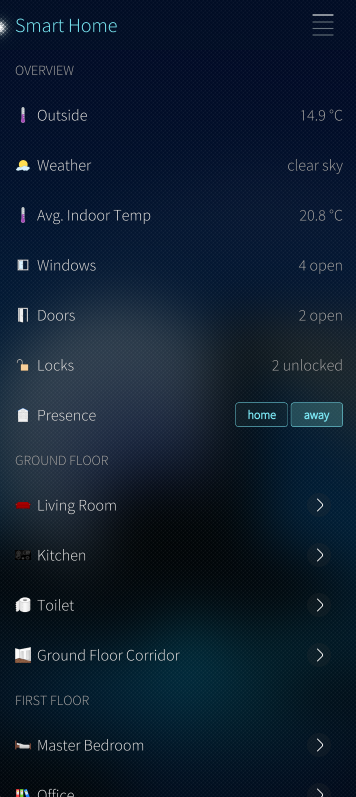
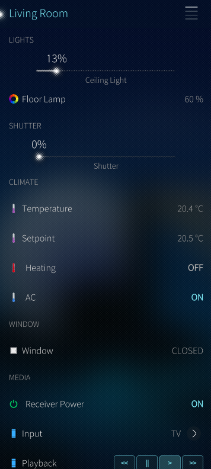
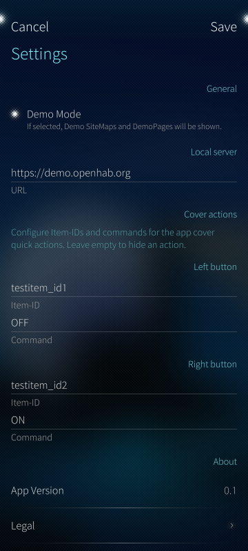
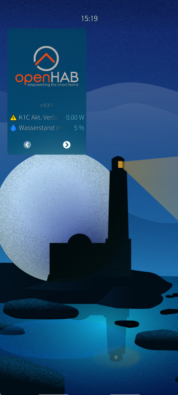
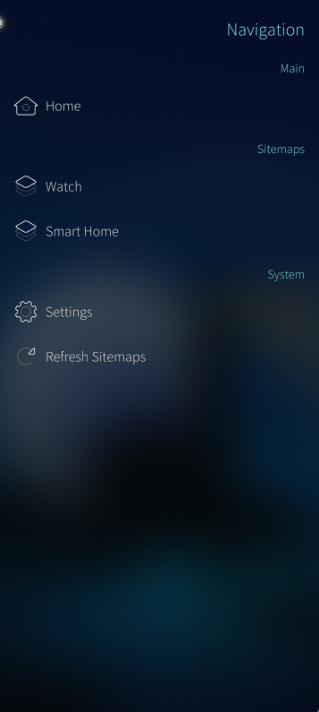

# Sailfish OS App

The openHAB Sailfish OS application is a native client for openHAB, compatible with phones and tablets.
The app follows the basic principles of the other openHAB UIs, like Basic UI, and presents your predefined openHAB [sitemap(s)](https://www.openhab.org/docs/ui/sitemaps.html) and other UIs, like Main UI.

[[toc]]

## Features

- Demo Mode: Explore the app without connecting to an openHAB server
- Display your Main UI Webview
- Display your sitemaps and widgets and control your devices from your mobile device
- Supported widgets/element-types within sitemap: Frame, Text, Group, Switch, Switches with Button-Mappings, Selections, Slider, Rollershutter
- Customizable CoverActions via Settings

  
  
  

## App Configuration

### Connection Settings

#### Demo Mode

This sets up the app to use the openHAB demo server and can be used to experience the app without needing to install openHAB.

Disable this to use the app with your own openHAB instance.

#### Local Server

This is the primary connection to your openHAB instance, a fully qualified URL with an IP address or hostname is required.

Example:
`http://192.168.0.10:8080`
`https://testdomain.com`

### Cover Actions

Allows you to set custom App-Cover-Quick-Actions for the cover widget when you view all open applications.

- Left button - Item-ID: The [Name](https://www.openhab.org/docs/configuration/items.html#name) (Item-ID -- **not** the label) of the item you want to send a command to when the left button is pressed.
- Left button - Command: The command (eg. ON, OFF, UP, DOWN) you want to send to the item when the left button is pressed.
- Right button - Item-ID: The [Name](https://www.openhab.org/docs/configuration/items.html#name) (Item-ID -- **not** the label) of the item you want to send a command to when the right button is pressed.
- Right button - Command: The command (eg. ON, OFF, UP, DOWN) you want to send to the item when the right button is pressed.

Note: If you don't want to use App-Cover-Quick-Actions, please leave the fields empty.
You can also use one button only, just leave the other button configuration empty.
It will be deactivated if no Item-ID AND command is provided.

## Navigation, Main UI and Sitemap Usage

Tap the hamburger menu at the top right to open the menu and navigate to the Main UI, sitemaps or settings.

  
  

Pull-Up: Use the native [Pulley Menu](https://docs.sailfishos.org/Develop/Apps/UI/#gestures-for-navigation-and-actions) gesture:

- Scroll to top: Scrolls to the top of the current view.

## Contributing to the project

We are happy about any contribution to the project, whether it's bug fixes, new features, translations or documentation.

Please check out our GitHub repository for more information on how to contribute.

## Trademark Disclaimer

Product names, logos, brands and other trademarks referred to within the openHAB website are the property of their respective trademark holders.
These trademark holders are not affiliated with openHAB or our website.
They do not sponsor or endorse our materials.

Sailfish OS and the Sailfish OS logo are trademarks of Jolla Group Ltd.
