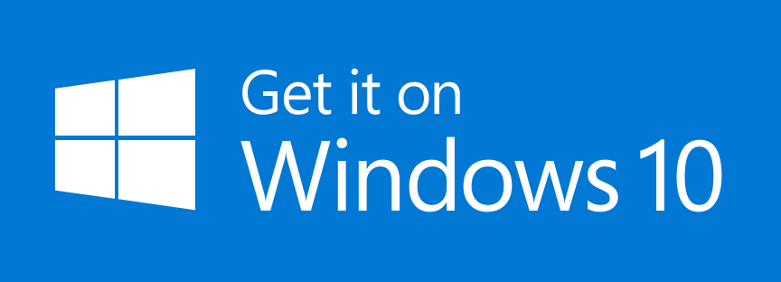



# Windows 10 App

We provide a native Windows 10 app for openHAB, compatible with Windows laptops, desktops, tablets and phones (Xbox, Raspberry Pi and Holographic coming soon).
It uses the REST API of openHAB to render sitemaps of your openHAB installation.
The latest release version of the app is always available through the Windows Store.

Please refer to the [openhab.windows project](https://github.com/openhab/openhab.windows) on GitHub for more technical details.


