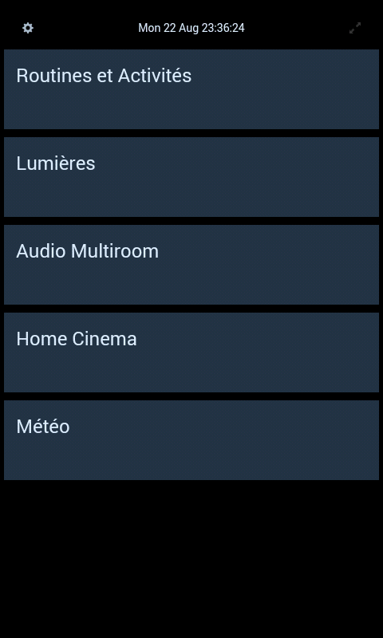
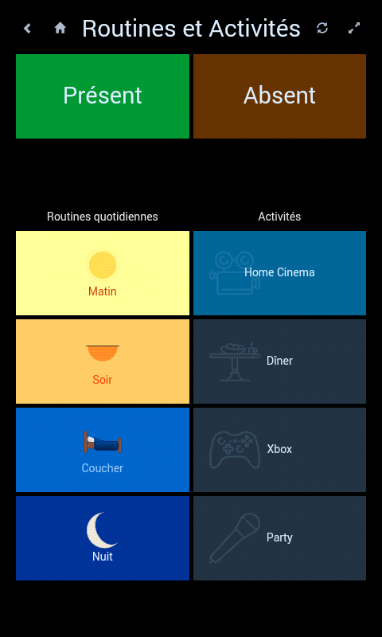
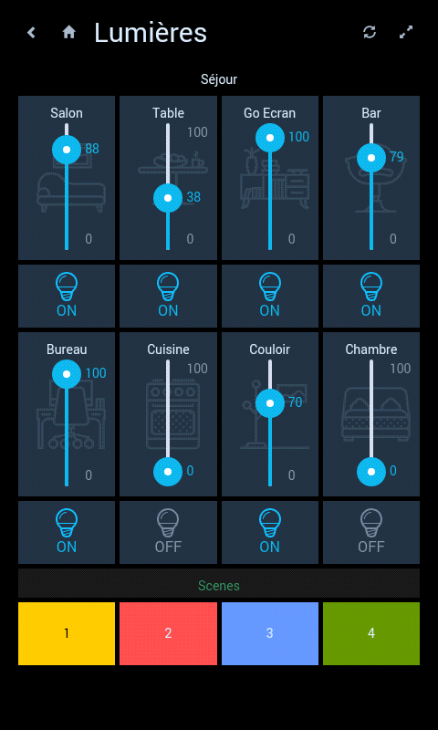
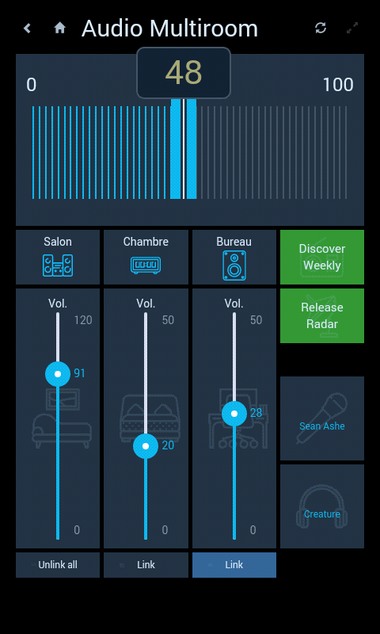
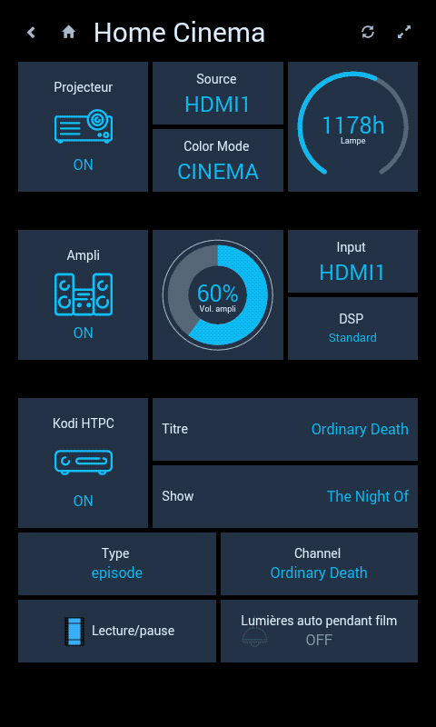
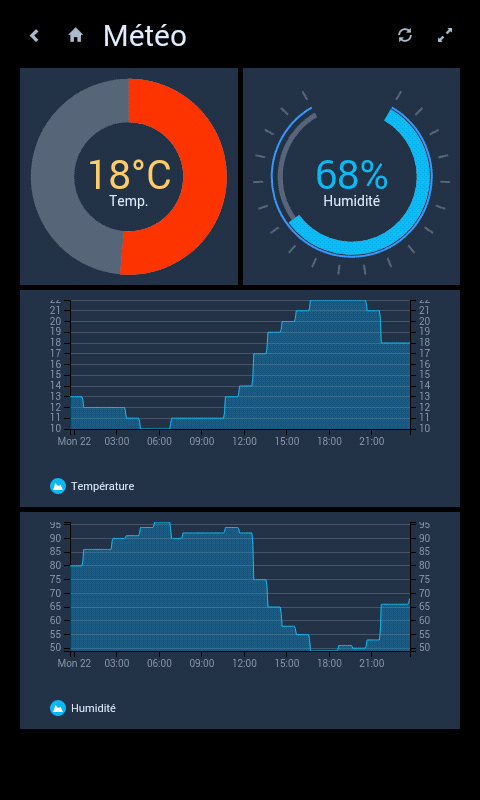



HABPanel
========

HABPanel is a lightweight dashboard interface for openHAB.

It notably features a quasi-WYSIWYG in-app editor allowing the user to design the dashboard directly on the target device.

## Configuration

HABPanel stores its configuration (including sets of dashboards, called panel configurations) as openHAB 2 service configuration variables.
This allows sharing of panel configurations between devices. You can also lock down editing globally to prevent accidental changes.

You can access the configuration in Paper UI, _Configuration > Services > HABPanel_.

Note: by default, HABPanel uses the local browser's storage until you save it in a new panel configuration as detailed below. 

## Getting started

- When accessing HABPanel for the first time on a new browser or device, you should be presented with a rather empty screen with a clock, a settings icon (gears) to the left. Click on the icon.
- You're now in edit mode, a link (**"Add new dashboard"**) appeared, as well as an "Advanced settings" link.
- If you previously used HABPanel, are using openHAB 2 and stored some panel configurations on the server, go to "Advanced settings" and click on your previous configuration. Otherwise, create your first dashboard: click on the "Add new dashboard" link and give it a name.
- Click on the dashboard tile to enter the dashboard editor
- Add your first widget: click on "Add Widget" and select the type in the menu (let's say Dummy)
- Move the widget by drag-and-drop and resize it with the white chevron - it appears when you click on the widget
- Click on the gears icon to bring up the widget's settings
- Rename the widget, bind it to a supported openHAB item, adjust some settings and click OK
- Save your configuration by clicking the Save button
- Click Run to see your dashboard in action - use your browser's back button or the arrow to go back to the drawing board
- When you're happy with your set of dashboards, go back to "Advanced settings" and either "Show the local configuration object" (the only available if using openHAB 1) and copy the JSON object somewhere to back it up, or click on "Save the current configuration to a new panel configuration"; this will store it on the openHAB 2 server and make it available for reuse.

## Screenshots

_(excuse the French, will make new ones in English later)_

 
 
 
