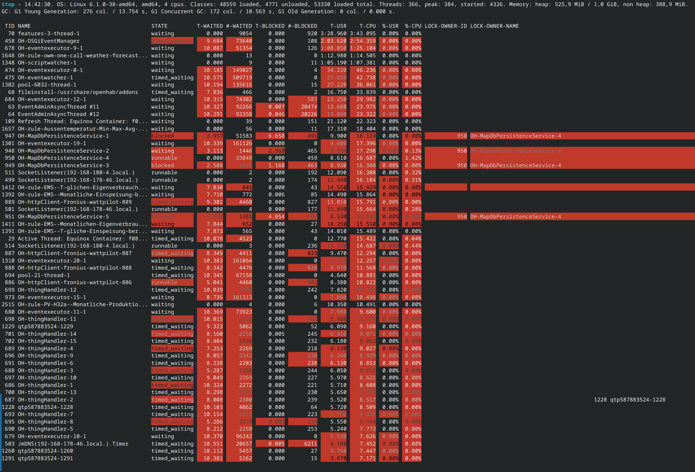

# Runtime Commands

It is possible to query and even change the state of entities like items or things. Therefore the console offers commands in various areas:

[[toc]]

::: tip Note
Some of the described commands are executed on the internal database and could break your installation. Please use this functionality only if you know what you are doing!
:::

## Examples

Query an item's state:

```shell
openhab> openhab:status Heating_GF_Corridor
OFF
```

Changing an item's state:

```shell
openhab> openhab:send Heating_GF_Corridor ON
Command has been sent successfully.
```

Get help for a command:

```shell
openhab> help openhab:send
Usage: openhab:send <item> <command> - sends a command for an item
```

## openHAB Commands

### Items

| Command                           | Description                                                         |
|-----------------------------------|---------------------------------------------------------------------|
| `openhab:status <item>`           | shows the current status of an item                                 |
| `openhab:update <item> <state>`   | sends a status update for an item                                   |
| `openhab:send <item> <command>`   | sends a command for an item                                         |
| `openhab:items list [<pattern>]`  | lists names and types of all items (matching the pattern, if given) |
| `openhab:items clear`             | removes all items                                                   |
| `openhab:items remove <itemName>` | removes the given item                                              |

### Discovery

| Command                                              | Description                                                                |
|------------------------------------------------------|----------------------------------------------------------------------------|
| `openhab:discovery start <thingTypeUID!bindingID>`   | runs a discovery on a given thing type or binding                          |
| `openhab:discovery enableBackgroundDiscovery <PID>`  | enables background discovery for the discovery service with the given PID  |
| `openhab:discovery disableBackgroundDiscovery <PID>` | disables background discovery for the discovery service with the given PID |

### Inbox

| Command                                    | Description                        |
|--------------------------------------------|------------------------------------|
| `openhab:inbox list`                       | lists all current inbox entries    |
| `openhab:inbox listignored`                | lists all ignored inbox entries    |
| `openhab:inbox approve <thingUID> <label>` | creates a thing for an inbox entry |
| `openhab:inbox clear`                      | clears all current inbox entries   |
| `openhab:inbox ignore <thingUID>`          | ignores an inbox entry permanently |

### Things

| Command                | Description                |
|------------------------|----------------------------|
| `openhab:things list`  | lists all things           |
| `openhab:things clear` | removes all managed things |

### Links

| Command                                      | Description                                                                      |
|----------------------------------------------|----------------------------------------------------------------------------------|
| `openhab:links list`                         | lists all links                                                                  |
| `openhab:links link <itemName> <channelUID>` | links an item with to channel                                                    |
| `openhab:links unlink <itemName> <thingUID>` | unlinks an item with to channel                                                  |
| `openhab:links clear`                        | removes all managed links                                                        |
| `openhab:links orphan <list\|purge>`         | lists/purges all orphaned - one missing element (either item or channel) - links |

### Audio

| Command                                         | Description                                                                                                             |
|-------------------------------------------------|-------------------------------------------------------------------------------------------------------------------------|
| `openhab:audio play [<sink>] <filename>`        | plays a sound file from the `$OPENHAB_CONF/sounds` folder through the optionally specified audio sink(s)                |
| `openhab:audio play <sink> <filename> <volume>` | plays a sound file from the `$OPENHAB_CONF/sounds` folder through the specified audio sink(s) with the specified volume |
| `openhab:audio stream [<sink>] <url>`           | streams the sound from the url through the optionally specified audio sink(s)                                           |
| `openhab:audio sources`                         | lists the audio sources                                                                                                 |
| `openhab:audio sinks`                           | lists the audio sinks                                                                                                   |

### Voice

| Command                             | Description                                                            |
|-------------------------------------|------------------------------------------------------------------------|
| `openhab:voice say <text>`          | speaks a text on the default audio sink with the default TTS and voice |
| `openhab:voice voices`              | lists available voices of the active TTS services                      |
| `openhab:voice interpret <command>` | interprets a human language command                                    |

### Automation

| Command                              | Description                                               |
|--------------------------------------|-----------------------------------------------------------|
| `openhab:script <script to execute>` | Executes a script from the `$OPENHAB_CONF/scripts` folder |

### Firmware

| Command                                                 | Description                                     |
|---------------------------------------------------------|-------------------------------------------------|
| `openhab:firmware list <thingTypeUID>`                  | Lists the available firmwares for a thing type. |
| `openhab:firmware status <thingUID>`                    | lists the firmware status for a thing           |
| `openhab:firmware update <thingUID> <firmware version>` | updates the firmware for a thing                |

### Users

| Command                                                 | Description                                                                                |
|---------------------------------------------------------|--------------------------------------------------------------------------------------------|
|`openhab:users list`                                     | lists all users                                                                            |
|`openhab:users add <userId> <password> <role>`           | adds a new user with the specified role                                                    |
|`openhab:users remove <userId>`                          | removes the given user                                                                     |
|`openhab:users changePassword <userId> <newPassword>`    | changes the password of a user                                                             |
|`openhab:users listApiTokens`                            | lists the API tokens for all users                                                         |
|`openhab:users addApiToken <userId> <tokenName> <scope>` | adds a new API token on behalf of the specified user for the specified scope               |
|`openhab:users rmApiToken <userId> <tokenName>`          | removes (revokes) the specified API token                                                  |
|`openhab:users clearSessions <userId>`                   | clear the refresh tokens associated with the user (will sign the user out of all sessions) |

## Karaf Commands

Apache Karaf itself also provides many useful commands, especially for debugging and development purposes.

### Bundle Management

Karaf provides a number of commands to manage bundles.

Use the `bundle --help` command to get a list of all available bundle management commands.
`bundle:<command> --help` provides more information about a specific command.

The following commands are particularly useful:

- `bundle:list`: Lists all installed bundles.
  `grep` may be used to filter the output, e.g.:

  ```text
  openhab> bundle:list | grep "Main UI"
  START LEVEL 100 , List Threshold: 50
   ID │ State  │ Lvl │ Version │ Name
  ────┼────────┼─────┼─────────┼──────────────────────────────────
  228 │ Active │  80 │ 5.1.0   │ openHAB UI :: Bundles :: Main UI
  ```

- `bundle:list <bundleName>`: Lists a bundle by name (see below on how to discover the name), e.g.:

  ```text
  openhab> bundle:list org.openhab.ui
  START LEVEL 100 , List Threshold: 50
   ID │ State  │ Lvl │ Version │ Name
  ────┼────────┼─────┼─────────┼──────────────────────────────────
  228 │ Active │  80 │ 5.1.0   │ openHAB UI :: Bundles :: Main UI
  ```

- `bundle:restart <bundleID>`: Restarts a bundle, e.g. `org.openhab.ui`:

  ```text
  openhab> bundle:restart 228
  ```

- `bundle:update <bundleID> <location>`: Updates a bundle.
  This command is especially useful for upgrading parts of openHAB without having to restart the whole system, e.g.:

  ```text
  openhab> bundle:update 228 https://ci.openhab.org/job/openHAB-WebUI/lastSuccessfulBuild/artifact/bundles/org.openhab.ui/target/org.openhab.ui-5.2.0-SNAPSHOT.jar
  ```

  The above command upgrades the `org.openhab.ui` bundle to the latest version from the CI build.

#### Bundle Upgrades

As mentioned above, bundles can be updated using the `bundle:update` command during runtime.

When a bug has been discovered in an add-on or Main UI and a fix is available and has been backported for your version of openHAB,
you can update the individual bundle to get the fix immediately without waiting for the next patch release.
Bundles can either be built locally (through Maven) or downloaded from the [CI build server](https://ci.openhab.org) or from our [JFrog Artifactory](https://openhab.jfrog.io):

1. Depending on the openHAB version, the following sources are available:
   1. openHAB stable release:
      - Add-ons: [Add-ons Artifactory](https://openhab.jfrog.io/ui/native/sandbox-snapshot/org/openhab/addons/bundles/)
      - UIs (Main UI, Basic UI): [WebUI Artifactory](https://openhab.jfrog.io/ui/native/sandbox-snapshot/org/openhab/ui/bundles/)
   1. Current openHAB milestone or snapshot:
      - Add-ons: [Add-ons Integration Build](https://ci.openhab.org/job/openHAB-Addons/lastSuccessfulBuild/artifact/bundles/)
      - UIs (Main UI, Basic UI): [WebUI Integration Build](https://ci.openhab.org/job/openHAB-WebUI/lastSuccessfulBuild/artifact/bundles/)
1. In your browser, navigate to the appropriate URL for your version of openHAB from the list above.
   Search for the general add-on name or scroll down the list to find the bundle name.
   Select the appropriate bundle, e.g. `org.openhab.ui` for Main UI or `org.openhab.binding.matter` for the Matter binding.
1. **Only for Artifactory:** Select the appropriate version from the list of available versions.
   For example, the latest `5.1.x-SNAPSHOT` version should be used for openHAB 5.1.x, e.g. [5.1.2-SNAPSHOT](https://openhab.jfrog.io/ui/native/sandbox-snapshot/org/openhab/ui/bundles/org.openhab.ui/5.1.2-SNAPSHOT/).
1. Get the bundle download link:
   1. Artifactory: Right-click the latest `.jar` file (not `-sources.jar`!) and copy the download link.
   1. Integration Build: Right-click the `.jar` file (not `-sources.jar`!) and copy the download link.

The download link can then be used with the `bundle:update` command, e.g.:

```text
openhab> bundle:update 228 https://openhab.jfrog.io/artifactory/sandbox-snapshot/org/openhab/ui/bundles/org.openhab.ui/5.1.2-SNAPSHOT/org.openhab.ui-5.1.2-20251228.141753-2.jar
```

### Thread Monitor

When experiencing high CPU usage by openHAB, one of its threads might be running wild.
Similarly to the familiar `htop` command on Linux, Karaf provides the `ttop` command to analyse CPU usage per thread.

The following example of the `ttop` command displays thread ID, name, state and various stats about each thread, all ordered by the CPU time:

```shell
ttop --stats=tid,name,state,waited_time,waited_count,blocked_time,blocked_count,user_time,cpu_time,user_time_perc,cpu_time_perc,lock_owner_id,lock_owner_name --order=cpu_time --millis=300
```

To get more information about a thread, you may use the following command, where `XXXX` is the thread ID:

```shell
threads XXXX
```

#### Example



As you can see, there are a few rule and MapDB threads consuming a good amount, as well as openHAB's `OSGiEventManager`.
To get more details about the `OH-OSGiEventManager` thread, use the `threads` command: `threads 458`<br>
The following information is printed to the console:

```text
Thread 458 OH-OSGiEventManager TIMED_WAITING
Stacktrace:
jdk.internal.misc.Unsafe.park line: -2
java.util.concurrent.locks.LockSupport.parkNanos line: 269
java.util.concurrent.locks.AbstractQueuedSynchronizer$ConditionObject.awaitNanos line: 1763
java.util.concurrent.LinkedBlockingQueue.poll line: 460
org.openhab.core.internal.events.ThreadedEventHandler.lambda$0 line: 59
org.openhab.core.internal.events.ThreadedEventHandler$$Lambda/0x0000000100b44258.run line: -1
java.lang.Thread.runWith line: 1596
java.lang.Thread.run line: 1583
```

### Heap & Thread Dumps

You can create a heap dump and thread dump of the JVM to analyse memory and thread leaks:

```shell
dev:dump-create
Created dump zip: 2025-08-08_171434.zip
```

You will find this ZIP in the `$OPENHAB_USERDATA` folder, usually `/var/lib/openhab/` on Linux systems.

Please refer to the [Karaf Developer Commands documentation](https://karaf.apache.org/manual/latest/#_developer_commands) for more information about all available developer commands.
