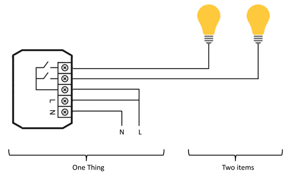



# Concepts

openHAB is built around two distinctly different views.
The first is the physical view - devices, configurations, connections, etc.
The second is the functional view.
This functional view consists of how information about the physical view is presented in User Interfaces, how automation operates on representations of physical devices, or how an action on a User Interface affects the software associated with the physical device it represents.
It can be helpful to know up front that these two views exist as you are learning about openHAB.

## Things, Channels, Items and Links

**Things** are the entities that can be physically added to a system.
Things may provide more than one function (for example, a z-wave multi-sensor may provide a motion detector and also measure room temperature).
It is important to note that Things do not have to be physical devices; they can also represent a web service or any other manageable source of information and functionality.

Things provide their functionality through a set of **Channels**.
Channels are "passive" and can be regarded as a declaration of a Thing; what it can offer.
Whether an openHAB installation takes advantage of a particular capability offered through a Thing's Channel depends on whether it has been configured to do so.
openHAB makes use of Channels through links you establish to Items when you configure your system (see below).

**Items** represent (fine-grained) functionality that can be used by applications, either in user interfaces or automation logic.
Items have a state and they can receive commands.

The glue between Things and Items are **Links**.
Links are associations between exactly one Thing Channel and one Item.
If a Channel is linked to an Item, it is "enabled", which means that the functionality the Item represents is accessible through the Channel.
Channels can be linked to multiple Items and Items can be linked to multiple Channels.

To illustrate these concepts, consider the example below of a two-channel actuator that controls two lights:

The actuator is a *Thing* that might be installed in an electrical cabinet.
It has a physical address and it must be configured in openHAB in order to be used (remember the physical view introduced at the beginning of this article?).

The user wants to control the two lights.
In order to achieve this functionality, two *Items* representing the lights are linked to *Channels* of the actuator, the *Thing*.
In this case, one can think of a *Link* being equivalent to a physical wire.
