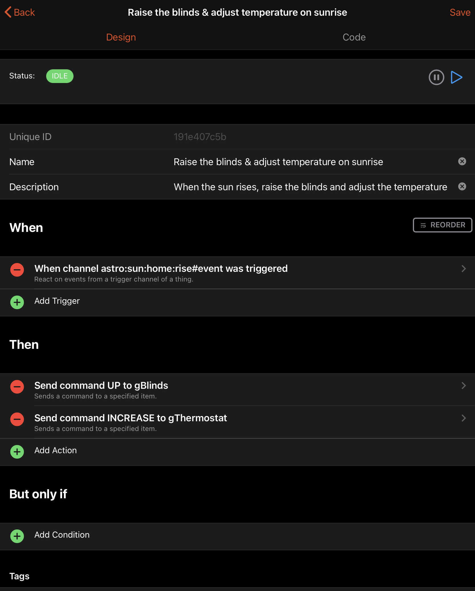
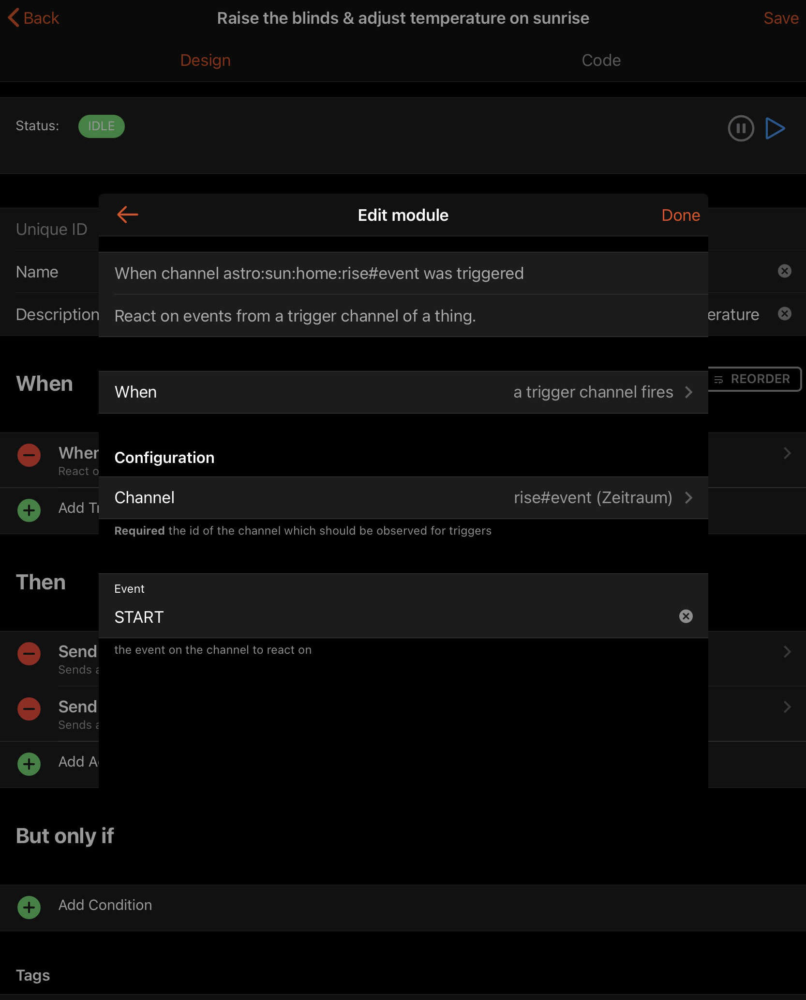
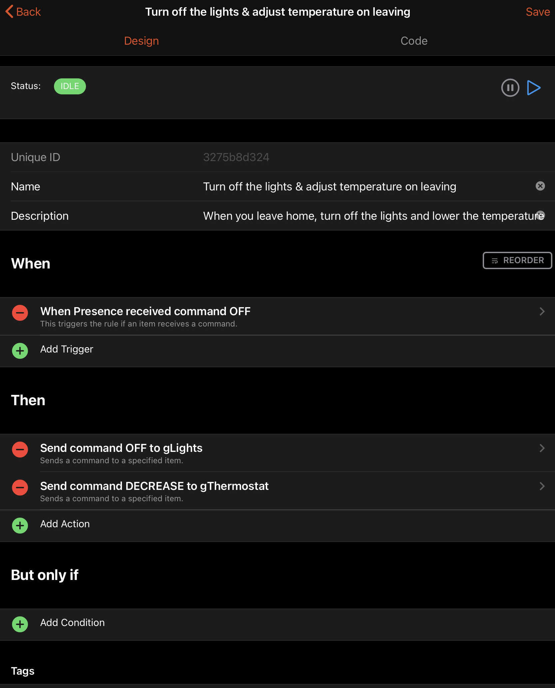
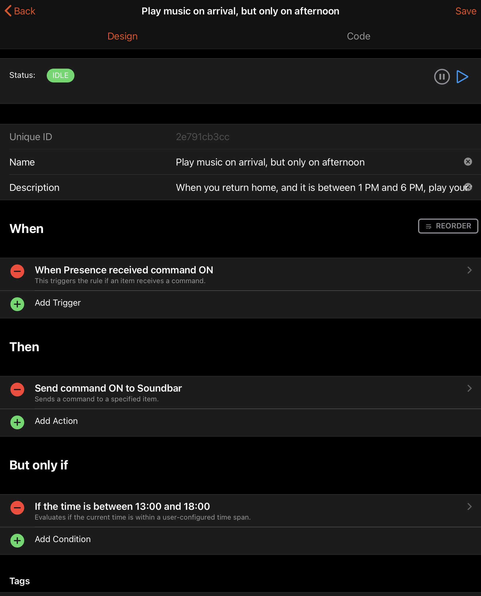
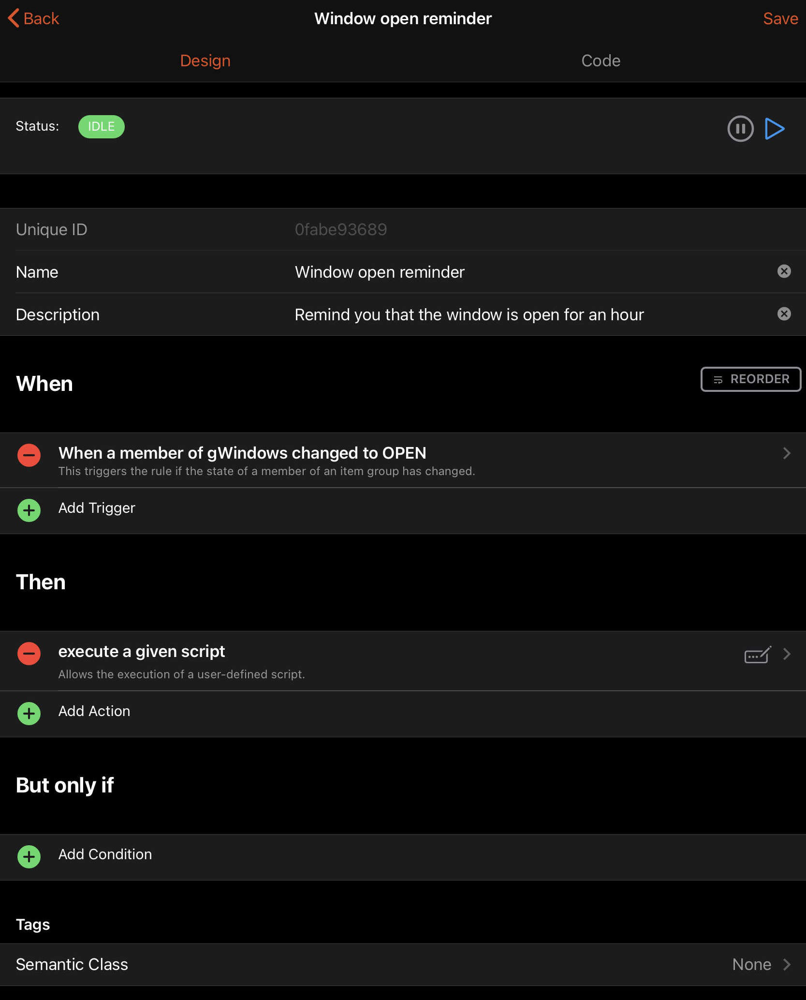
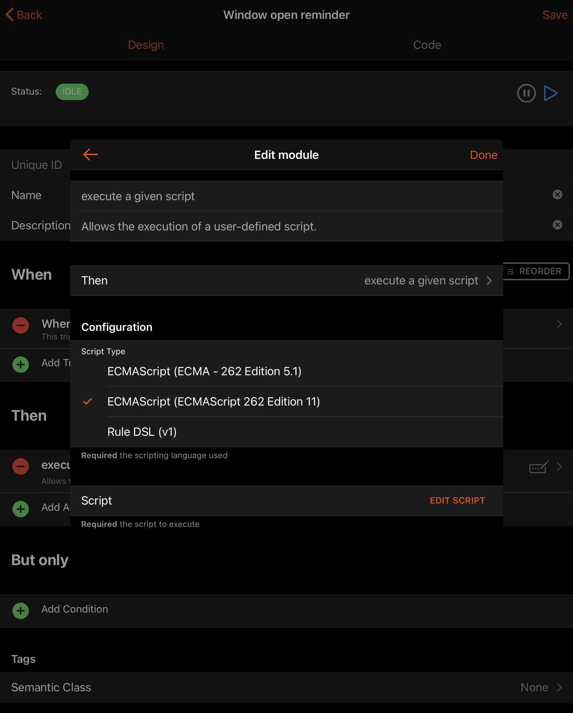
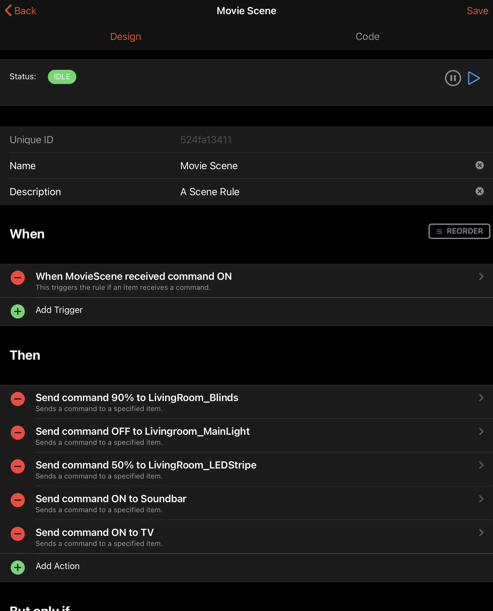

# Rules Concepts

openHAB is about home automation, but to create home automation we need to define rules.

{::options toc_levels="2..4"/}

- TOC
{:toc}

## What Are Rules

You can think of rules as routines or behaviours for your smart home.

Many people have a routine when they wake up in the morning: make the bed, make coffee, make and eat breakfast, brush their teeth, etc.
Similarly your smart home can have a routine: when the sun rises raise the blinds and adjust the temperature.
Another routine could be to turn off all the lights and turn down the temperature when you leave home:
openHAB can do that for you.
There is no need to open your app and switch of the lights manually.
Do you want to hear your favorite music when you arrive back at home?
No problem, openHAB can do that for you too.
Rules can also remind you of things, for example, that you opened the window hours ago and forgot that it is open?
openHAB can send a notification to your phone.

Other systems may have a concept of *Automations*, *Tasks*, and other terms.
In openHAB, rules are used to implement all of these concepts.

## Parts of a Rule

These rules take the high level form of *When __t__ happens, if __c__ then do __a__*,
where __t__ are the _triggers_ that cause the rule run,
__c__ are the _conditions_ that must be true for the rule to run, and __a__ are _actions_ to perform when the rule is triggered and allowed to run.
Note that both __t__ and __c__ can be optional.

To work with the *When __t__ happens, if __c__ then do __a__* principle, openHAB rules consist of three parts:

| Name        | Rule Part            | Purpose                                                  |
|-------------|----------------------|----------------------------------------------------------|
| `Trigger`   | *When __t__ happens* | Causes the rule run when the defined event happens.      |
| `Condition` | *if __c__*           | Which condition has to be met that the rule really runs? |
| `Action`    | *then do __a__*      | What should be done when the rule runs?                  |

Any single rule is not required to have all of these (although a rule without an action is not very sensible).
An individual rule can also have more than one of each.

A rule that should always run when triggered will have zero conditions.
An individual rule can respond to several different triggers by having multiple different triggers set up.

Even though it might not seem sensible first, as the rule would never run on it's own, one can also have a rule with no triggers.
But why would somebody want such a rule?
In some cases, it is useful to have a rule that is only manually triggered.
Sometimes there is advantage in a rule that calls another rule.
In both cases, the rule has no triggers and no conditions.

## Triggers

Now that we know the concept of rule triggers, let's look at them in more depth.
Triggers define those events that, when they occur, causes the rule to run.

These are the categories of rules that can be used to trigger a rule:

| Event       | Description                                                                                                                  |
|-------------|------------------------------------------------------------------------------------------------------------------------------|
| **Items**   | Commands, updates, and changes on an individual Item's state.                                                                |
| **Groups**  | Groups are special Items that have other Items as members. Rules can be triggered on any Item event from any of its members. |
| **Time**    | Rules can trigger based on specific times.                                                                                   |
| **Channel** | Some Things have Channels that can trigger rules directly instead of being linked to Items.                                  |
| **Thing**   | When Things change or update status they generate events (e.g. ONLINE, OFFLINE, etc.).                                       |
| **System**  | Events that occur during important activities internal to openHAB itself, such as startup complete.                          |

::: tip Triggers and Events - What's the difference?
An event is something that happens and is detectable by openHAB.
Some events for rules are time events, system events, Item state and command events, etc.

A few examples of events that could be used to trigger a rule:

- The time is midnight.
- openHAB reached a runlevel 80 indicating Things are initialized.
- The `Bedroom_Light` Item changed from OFF to ON.
- A member of the `Lights` Group received a command.
- Sunrise occurred based on an event Channel on an Astro Thing.
- The Zwave controller Thing changed to OFFLINE.

A Trigger is like a filter that, when it matches one or more events, causes the rule to run.
Triggers can therefore be very specific to match very specific events (e.g. a change in a Switch Item from `ON` to `OFF`, a Dimmer Item receives `57` as a command, etc.)
or relatively generic and match many events (e.g. every minute, a Color Item receives any type of command, a member of a Group Item changes in any way, etc.).
:::

Here are the details for each trigger type:

### **Items** Triggers

You can listen to commands for a specific Item, on state updates or on state changes (an update might leave the state unchanged).
You can decide whether you want to catch only a specific command/state or any.

The `command` event means a `command`, which controls an Item (e.g. turns the light on) was sent.
The `update` event means the Item's state got updated (e.g. the light turned to `ON`).

**Items** triggers provide some information, e.g. the received command or the received state update, see [Available Values](#available-values).

When using a `received command` trigger, the rule might trigger **before** the Item's state is updated.
Therefore, if the rule needs to know what the command was, there is an [Available Value](#available-values).

### **Groups** Triggers

As with Item based event-based triggers discussed above, you can listen for commands, state updates, or state changes on the direct members (but not the indirect members of a nested subgroup) of a given Group.
You can also decide whether you want to catch only a specific command/state or any.

The [Available Values](#available-values) are populated using the event on the Item that caused the trigger and that triggering Item's name is provided as an additional value.

Also, as with **Items** triggers, when using a `received command` trigger, the rule might trigger **before** the Item's state is updated.
Therefore, if the rule needs to know what the command was, there is an [Available Value](#available-values).

### **Time** Triggers

Time Triggers are provided as described in the table below, support may vary on the used rule language:

| Trigger          | Description                                                                                                                   |
|------------------|-------------------------------------------------------------------------------------------------------------------------------|
| cron expressions | cron allows you to create nearly any schedule you can think of, e.g. every second sunday in November and December at 04:05 h. |
| Time is Item     | It is a date and a time specified in an DateTime Item.                                                                        |
| Time of Day      | It is a fixed time of the day, e.g. 09:00 h.                                                                                  |

Time triggers do not provide any information in the [Available Values](#available-values).

Please be aware that openHAB is using the [Quartz Scheduler](https://www.quartz-scheduler.org/documentation/quartz-2.2.2/), which is using a slighly different form than the Unix cron scheduler, for [cron expressions](https://www.quartz-scheduler.org/documentation/quartz-2.2.2/tutorials/tutorial-lesson-06.html).
A Quartz cron expression takes the form of six or optionally seven fields:

1. Seconds
1. Minutes
1. Hours
1. Day of Month
1. Month
1. Day of Week
1. Year (optional field)

You may use the generator at [FreeFormatter.com](https://www.freeformatter.com/cron-expression-generator-quartz.html) or the openHAB WebUI rule setup to generate your cron expressions.

### **Channel** Triggers

Some add-ons provide trigger channels.

Your rules can take actions based upon trigger events generated by these trigger channels.
You can decide whether you want to catch only a specific or any trigger the channel provides.

When a binding provides such channels, you can find the needed information in the corresponding binding documentation.
There is no generic list of possible trigger events.
The `triggerEvent`(s) available depend upon the specific implementation details of the binding.

If the rule needs to know what the received event or the triggering channel was, use the [Available Values](#available-values).

### **Thing** Triggers

Your rules can take actions based upon status updates or status changes generated by Things.
You can decide whether you want to catch only a specific or any status the Thing can get updated too.

You can find all the possible values for status from [Thing Status](/docs/concepts/things.html).

The `thingUID` is the identifier assigned to the Thing, manually in your configuration or automatically during auto discovery.
You can find it from UI or from `.things` files.
For example, one z-wave device can be "zwave:device:c5155aa4:node14".

If the rule needs to know what the triggering Thing was, or access the previous or new status, use the [Available Values](#available-values).

<!-- TODO: Update reference when actions are included in the reworked rule docs. -->
Refer to [Thing Status Action](/docs/configuration/actions.html#thing-status-action) to find how to get the new thing status details or description in the script.

### **System** Triggers

The **System** triggers include the system start level trigger.

You may wish to use some start level to initialize values at startup if they are not already set.
You can then execute a rule on the next startup level which depends on the value set by the initialization rule.

| Start level | Meaning                                                                                                        |
|-------------|----------------------------------------------------------------------------------------------------------------|
| 00          | OSGi framework has been started.                                                                               |
| 10          | OSGi application start level has been reached, i.e. bundles are activated.                                     |
| 20          | Model entities (Items, Things, channel links, persist config) have been loaded, both from DB as well as files. |
| 30          | Item states have been restored from persistence service, where applicable.                                     |
| 40          | Rules are loaded and parsed, both from DB as well as DSL and script files.                                     |
| 50          | Rule engine is active.                                                                                         |
| 70          | User interface is up and running.                                                                              |
| 80          | All Things have been initialized.                                                                              |
| 100         | Startup is fully complete.                                                                                     |

Start levels less than 40 are not available as triggers because the rule engine needs to start up first before it can execute any rules.
Please keep in mind that rule engines provided by separately installed automation add-ons might not start executing rules until after start level 100 is reached.

## Conditions

With triggers, we have the *When __t__ happens* part completed, so next up is the *if __c__* part.
This part can limit when a rule can run by adding one or more condition(s).

Conditions as a separately definable part of a rule are supported by some rule engines.
In situations where the rule engine does not support conditions, you can implement your conditions using an `if`-statement in the rule action.

Available types of conditions include:

- An Item has a given state
- It’s a certain time of day
- It’s a certain day of week
- It’s a special day, e.g. holiday, weekday, weekend, etc. as defined by Ephemeris <!-- TODO: Add reference to Ephemeris docs which currently reside in the Actions page -->
- Script condition: A script evaluates to `true`

The script condition is the most universal one, as you can choose one of the many available script/rule languages to build any condition you can think of.
The only restriction is a script condition's last executed line of code must result in a boolean (i.e. `true` or `false`).

## Scripts

Unfortunately the term "Script" is overloaded in openHAB, and has multiple meanings based on the context:

- A UI rule consisting only of a single Script Action with the tag "Script".
  - These will appear in a specific "Scripts" section on MainUI.
  - They can be used to reuse code and logic across multiple other rules, one off experimentation to figure something out, create a catalog of examples, or to drive tests for other rules and behaviors.
- In text based rules, a script is a file that is processed by a script engine, see the [automation addons](/addons/#automation).
  Those scripts can be used to create (multiple) rules, or those are loaded by other script files a libraries.
  <!-- TODO: Update reference to executeCommandLine when the rules docs are reworked -->
- A script file that is executed on the command line with a script interpreter, e.g. `bash` or `python`, by using the [`executeCommandLine` action](/docs/configuration/actions.html#exec-actions) or the [Exec Binding](/addons/bindings/exec).
  <!-- TODO: Update reference to callScript when the rules docs are reworked -->
- A special piece of Rules DSL code in the `$OH_CONF/scripts` folder that is called from other rules using [`callScript`](/docs/configuration/actions.html#openhab-subsystem-actions).

These rule docs mainly refer to the first two meanings when talking about scripts.

## Script Actions

Script Actions are an action that allow you to run logic written in one of the available automation/rule languages, e.g. JavaScript, Rules DSL, Blockly.

Text based rules will typically allow only a single script action to be defined (e.g the code between the `then` and `end` in a text based Rules DSL or the function passed as the `execute` parameter in a JS Scripting rule is the script action for that rule).

## Available Values

When a rule is triggered, some information about the event that triggered the rule is provided to the rule.
There are many cases in which it is useful to know what triggered your rule, e.g. you have an Item group as trigger and you need to know which Group member triggered the rule.

The availablity of those values depends on the rule engine, but you can generally expect at least the following information (depending on the trigger):

- The name of triggering Item.
- The command that the triggering Item received.
- The state the Item got updated by.
- The state the Item was updated to.
- The state the Item was updated from.
- The Thing/Thing event that triggered the rule.

For further information which values are available and how to access them, refer to the documentation of the according rule engine.

## Rule Templates

At some point, when basic UI rules are not be sophisticated enough, rule templates can help.
Someone may have already written the rule and provided it as a template in the community marketplace.

To enable access to rule templates, navigate to *Settings* -> *Community Marketplace* and toggle *Enable Community Marketplace* to ON.
Then to install a rule template, visit the web UI and navigate: *Settings* -> *Add-Ons* -> *Automation* -> Scroll down to the *Rule Templates* section.
Click on a rule template to review it's documentation, open the community thread and install the template to your system.
Check the template's documentation for dependencies and install them!
Otherwise the rule won't work.

To instantiate a rule template, navigate to *Rules* and click the blue `+` icon.
Fill out the rule's metadata as usual and select an installed rule template from the *Create from Template* section.
Choose the rule template, and fill out the template configuration.

Once a rule is created, it is seperated from its template and can be further customized.
To update a rule template, return to the Automation menu in MainUI, select the rule template, remove it and then readd it.
Then to update a rule from the template, delete the rule(s) that were instantiated from the template and recreate them.
Note, when clicking on the "Code" tab of the rule, the properties used when instantiating the rule are preserved in the configuration section.

## Helper Libraries

Helper Libraries simplify the interaction with the openHAB runtime by providing convenient access to common functionality, and provide type conversion from Java types to native types of the chosen rule/script language.
By providing this functionality, they help avoid type errors and heavily reduce the amount of boilerplate code required to import and use openHAB classes.

Sometimes the helper library will come with the add-on, e.g. [JS Scripting](/addons/automation/jsscripting) with the [openhab-js](https://github.com/openhab/openhab-js) library.
Other times the helper library must be installed separately, searching in the community form might help.

## Comprehensive Examples

These following code snippets implement the examples from the top of this page using UI rules, [JRuby Scripting](/addons/automation/jrubyscripting/), [JS Scripting](https://openhab.org/addons/automation/jsscripting) and [DSL rules](/docs/configuration/rules-dsl).

The code from the JS Scripting examples can be used in file-based scripts that are created inside the `/automation/js` folder and have `.js` as their file extension.
The same applies for the JRuby examples, but they have to be placed inside `/automation/jsr223/ruby/personal` with `.rb` as the file extension.

Each UI rule will have a "code" tab showing the full rule definition.
When asking for help on the forum, the representation of the rule from this code tab will be the best way to show your full rule.

It is recommended to use helper libraries where they are available, as they provide an easy-to-use API to access openHAB functionality and avoid type problems related to the different languages combined.

### When the sun rises, raise the blinds and adjust the temperature

This example is using the [Astro Binding](/addons/bindings/astro) which calculates many values for sun and moon, including sunrise.

:::: tabs

::: tab UI Rule



The trigger in detail:



The code:

```yaml
configuration: {}
triggers:
  - id: "1"
    configuration:
      event: START
      channelUID: astro:sun:home:rise#event
    type: core.ChannelEventTrigger
conditions: []
actions:
  - inputs: {}
    id: "2"
    configuration:
      itemName: gBlinds
      command: UP
    type: core.ItemCommandAction
  - inputs: {}
    id: "3"
    configuration:
      itemName: gThermostat
      command: INCREASE
    type: core.ItemCommandAction
```

:::

::: tab DSL Rule

```java
rule "Raise the blinds & adjust temperature on sunrise"
when
  Channel 'astro:sun:home:rise#event' triggered START
then
  gBlinds.sendCommand(UP)
  gThermostat.sendCommand(INCREASE)
end
```

:::

::: tab JRuby

```ruby
require 'openhab'

rule 'Raise the blinds & adjust temperature on sunrise' do
  channel 'astro:sun:home:rise#event'
  run {
    gBlinds << up
    gThermostat << increase
  }
end
```

:::

::: tab JS Scripting

JS Scripting

```javascript
const { rules, triggers, items } = require('openhab');

rules.JSRule({
  name: 'Raise the blinds & adjust temperature on sunrise',
  description: 'When the sun rises, raise the blinds and adjust the temperature',
  triggers: [
    triggers.ChannelEventTrigger('astro:sun:home:rise#event', 'START') // Triggers when the sun starts to rise
  ],
  execute: (event) => {
      items.getItem('gBlinds').sendCommand('UP');
      items.getItem('gTheromstat').sendCommand('INCREASE');
  }
});
```

:::

::::

### When you leave home, turn off the lights and lower the temperature

Presence detection can be achieved in many ways, this example is not able to cover a mechanism used for presence detection.
Most presence detection mechanisms control a switch Item with `ON` for present and `OFF` for away.

Examples for presence detection include the [iCloud Binding](/addons/bindings/icloud/#icloud-rules), [Network Binding](/addons/bindings/network/#presence-detection-configure-target-device), [GPSTracker Binding](/addons/bindings/gpstracker/#distance-channel-and-presence-switch), etc., but you could also use a simple wall switch.

:::: tabs

::: tab UI Rule



The code:

```yaml
configuration: {}
triggers:
  - id: "1"
    configuration:
      itemName: Presence
      command: OFF
    type: core.ItemCommandTrigger
conditions: []
actions:
  - inputs: {}
    id: "2"
    configuration:
      itemName: gLights
      command: OFF
    type: core.ItemCommandAction
  - inputs: {}
    id: "3"
    configuration:
      itemName: gThermostat
      command: DECREASE
    type: core.ItemCommandAction
```

:::

::: tab DSL Rule

```java
rule "Turn off the lights & adjust temperature on leaving"
when
  Item Presence received command OFF
then
  gLights.sendCommand(OFF)
  gThermostat.sendCommand(DECREASE)
end
```

:::

::: tab JRuby

```ruby
require 'openhab'

rule 'Turn off the lights & adjust temperature on leaving' do
  received_command Presence, command: off
  run {
    gLights << off
    gThermostat << decrease
  }
end
```

:::

::: tab JS Scripting

JS Scripting

```javascript
const { rules, triggers, items } = require('openhab');

rules.JSRule({
  name: 'Turn off the lights & adjust temperature on leaving',
  description: 'When you leave home, turn off the lights and lower the temperature',
  triggers: [
    triggers.ItemCommandTrigger('Presence', 'OFF') // Triggers when Item Presence is commanded OFF
  ],
  execute: (event) => {
      items.getItem('gLights').sendCommand('OFF');
      items.getItem('gTheromstat').sendCommand('DECREASE');
  }
});
```

:::

::::

### When you return home, and it is between 1 PM and 6 PM, play your favorite music

:::: tabs

::: tab UI Rule



The code:

```yaml
configuration: {}
triggers:
  - id: "1"
    configuration:
      itemName: Presence
      command: ON
    type: core.ItemCommandTrigger
conditions:
  - inputs: {}
    id: "3"
    configuration:
      startTime: 13:00
      endTime: 18:00
    type: core.TimeOfDayCondition
actions:
  - inputs: {}
    id: "2"
    configuration:
      itemName: Soundbar
      command: ON
    type: core.ItemCommandAction
```

:::

::: tab JRuby

```ruby
require 'openhab'

rule 'Play music on arrival, but only on afternoon' do
  received_command Presence, command: on
  run {
    Soundbar >> on
  }
  only_if { TimeOfDay.now.between? ‘1pm’..’6pm’ }
end
```

:::

::: tab JS Scripting

JS Scripting

```javascript
const { rules, triggers, items, time } = require('openhab');

rules.JSRule({
  name: 'Play music on arrival, but only on afternoon',
  description: 'When you return home, and it is between 1 PM and 6 PM, play your favorite music',
  triggers: [
    triggers.ItemCommandTrigger('Presence', 'ON') // Triggers when Item Presence is commanded ON
  ],
  execute: (event) => {
      if (time.toZDT().isBetweenTimes('1:00 PM', '6:00 PM')) {
          items.getItem('Soundbar').sendCommand('ON');
      }
  }
});
```

:::

::::

### Remind you that the window is open for an hour

:::: tabs

::: tab UI Rule



The script action in detail (for the scipt see the YAML):



The code:

```yaml
configuration: {}
triggers:
  - id: "1"
    configuration:
      groupName: gWindows
      state: OPEN
    type: core.GroupStateChangeTrigger
conditions: []
actions:
  - inputs: {}
    id: "2"
    configuration:
      type: application/javascript;version=ECMAScript-2021
      script: >
        var windowName = event.itemName;

        var windowState = event.newState;

        // Use a function generator, otherwise the variable windowName can be mutated by later runs of the rule

        let generateNotificationFunction = (windowName) => {
            return function () {
                const window = items.getItem(windowName);
                // Check if the window is still open
                if (window.state === 'OPEN') {
                    actions.NotificationAction.sendBroadcastNotification(`${window.label} is open for an hour!`);
                }
            }
        }

        // Create a timer that expires in one hour and then sends a notification using myOpenHAB, e.g. "Livingroom window is open for an hour!"

        setTimeout(generateNotificationFunction(windowName), 3600 * 1000);
    type: script.ScriptAction
```

:::

::: DSL Rule

```java
rule "Window open reminder"
when
  Member of gWindows changed to OPEN
then
  createTimer(now.plusMinutes(60), [ |
    if (triggeringItem.state == OPEN) sendBroadcastNotification(triggeringItem.label + " is open for one hour!")
  ])
end
```

:::

::: tab JRuby

```ruby
require 'openhab'

rule 'Window open reminder' do
  changed: gWindows, to: open
  run {
    after 1.hour do
      if item.state.open?
        notify("#{item.label} is open for an hour!")
      end
    end
  }
end
```

:::

::: tab JS Scripting

JS Scripting

```javascript
const { rules, triggers, items, actions } = require('openhab');

rules.JSRule({
  name: 'Window open reminder',
  description: 'Remind you that the window is open for an hour',
  triggers: [
    triggers.GroupStateChangeTrigger('gWindows', 'OPEN') // Triggers when a member of the Windows group changes it's state to OPEN
  ],
  execute: (event) => {
      const windowName = event.itemName;
      const windowState = event.newState;
      // Use a function generator, otherwise the variable windowName can be mutated by later runs of the rule
      const generateNotificationFunction = (windowName) => {
          return function () {
              const window = items.getItem(windowName);
              // Check if the window is still open
              if (window.state === 'OPEN') {
                  actions.NotificationAction.sendBroadcastNotification(`${window.label} is open for an hour!`);
              }
          }
      }
      // Create a timer that expires in one hour and then sends a notification using myOpenHAB, e.g. "Livingroom window is open for an hour!"
      setTimeout(generateNotificationFunction(windowName), 3600 * 1000);
  }
});
```

:::

::::

### A "Scene" rule

This rule example allows you to set multiple Items to a defined state using a single action.

You might know this concept of "Scenes" from Apple HomeKit, Google Home, Philips Hue, etc.

:::: tabs

::: tab UI Rule



```yaml
configuration: {}
triggers:
  - id: "1"
    configuration:
      itemName: MovieScene
      command: ON
    type: core.ItemCommandTrigger
conditions: []
actions:
  - inputs: {}
    id: "2"
    configuration:
      itemName: LivingRoom_Blinds
      command: 90%
    type: core.ItemCommandAction
  - inputs: {}
    id: "3"
    configuration:
      itemName: Livingroom_MainLight
      command: OFF
    type: core.ItemCommandAction
  - inputs: {}
    id: "4"
    configuration:
      itemName: LivingRoom_LEDStripe
      command: 50%
    type: core.ItemCommandAction
  - inputs: {}
    id: "5"
    configuration:
      itemName: Soundbar
      command: ON
    type: core.ItemCommandAction
  - inputs: {}
    id: "6"
    configuration:
      itemName: TV
      command: ON
    type: core.ItemCommandAction
```

:::

::: DSL Rule

```java
rule "Movie Scene"
when
  Item MovieScene received command ON
then
  LivingRoom_Blinds.sendCommand(90%)
  LivingRoom_MainLight.sendCommand(OFF)
  LivingRoom_LEDStripe.sendCommand(50%)
  Soundbar.sendCommand(ON)
  TV.sendCommand(ON)
end
```

:::

::: tab JRuby

```ruby
require 'openhab'

rule 'Movie Scene' do
  received_command MovieScene, command: ON
  run {
    LivingRoom_Blinds >> '90%'
    LivingRoom_MainLight >> off
    LivingRoom_LEDStripe >> '50%'
    Soundbar >> on
    TV >> on
    Soundbar >> ON
  }
end
```

:::

::: tab JS Scripting

JS Scripting

```javascript
const { rules, triggers, items } = require('openhab');

rules.JSRule({
  name: 'Movie Scene',
  description: 'A Scene Rule',
  triggers: [
    triggers.ItemCommandTrigger('MovieScene', 'ON') // Triggers when Item MovieScene is commanded ON
  ],
  execute: (event) => {
      items.getItem('LivingRoom_Blinds').sendCommand('90%');
      items.getItem('LivingRoom_MainLight').sendCommand('OFF');
      items.getItem('LivingRoom_LEDStripe').sendCommand('50%');
      items.getItem('Soundbar').sendCommand('ON');
      items.getItem('TV').sendCommand('ON');
  }
});
```

:::

::::
