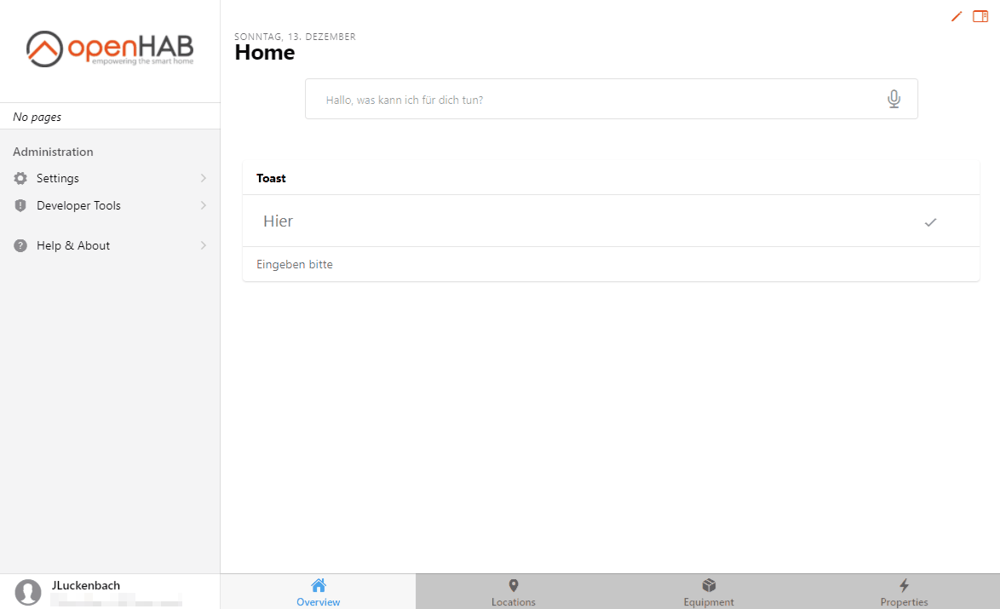



# Installation of Add-ons

Add-ons can be installed in different ways, described below.

## Through UI

Log into your admin account (if not already done).
Navigate to `Settings` and have a look for the add-ons section.
Search for the desired add-on in the categories and press install.



## Through Configuration Files

For this installation option you need to know the `id` of the desired add-on, e.g., network or mqtt.

You can find it out with the following command within [openHAB console](/docs/administration/console.html):

```sh
feature:list | grep ^openhab
```

A list of all available add-ons starting with "openhab" will be returned.
It could look similar to this example:

```text
...
openhab-binding-mqtt                      | 3.0.0.M5         |          | Started     | openhab-addons-3.0.0.M5 | MQTT Binding
openhab-binding-netatmo                   | 3.0.0.M5         |          | Started     | openhab-addons-3.0.0.M5 | Netatmo Binding
openhab-binding-onewire                   | 3.0.0.M5         |          | Uninstalled | openhab-addons-3.0.0.M5 | OneWire Binding
...
openhab-binding-network                   | 3.0.0.M5         |          | Uninstalled | openhab-addons-3.0.0.M5 | Network Binding
...
```

According to the [naming convention for bundles](/docs/administration/bundles.html#naming-convention-for-bundles) the *id* for the shown example is *network*.

Another way to find the correct `id` is to look at the URL of the add-on documentation page.
For example the url for the [Network Binding documentation](/addons/bindings/network/) is

```text
https://www.openhab.org/addons/bindings/network/
```

In this case, the `id` would be "network".

With this information we can now edit the *addons.cfg* file in the `$OPENHAB_CONF/services` folder on the machine you are running openHAB on.
The path depends on your installation.
You can find out the correct locations on the corresponding documentation pages, e.g. [Linux](/docs/installation/linux.html#file-locations) or [Windows](/docs/installation/windows.html#file-locations).

The file could look like this (depending on your chosen package and already installed add-ons):

```text
ui = basic,habpanel
action = pushover
binding = astro
transformation = jsonpath
persistence = influxdb
```

To install the network Binding like we want in this example, we just need to add the id *network* to the Binding section.

```text
binding = astro,network
```

After saving the file, the add-on will be installed.


## Through manually provided add-ons

::: warning Attention
This option is adressed to advanced users.
Installing add-on's with a `.jar`file can lead to problems, because add-on dependencies may not be installed.
Please make sure to use this option only in special cases (like add-on testing for an upcoming version) or when you know what you are doing.
:::
For this installation option you need a bundles `.jar` file.
One way of retrieving those files is mentioned above in the openHAB console part.

Place the `.jar` file in the `addons` folder on the machine you are running openHAB on.
As described already for the addons.cfg option, the path depends on your installation.
Place the .jar file in the folder Additional add-on files as described in File Locations ([Linux](/docs/installation/linux.html#file-locations), [Windows](/docs/installation/windows.html#file-locations) or [macOS](/docs/installation/macos.html#file-locations)).
