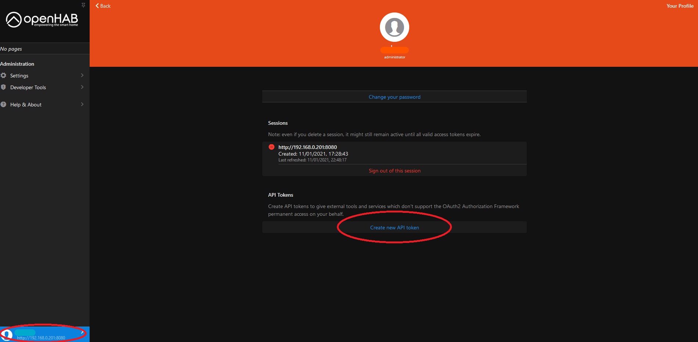
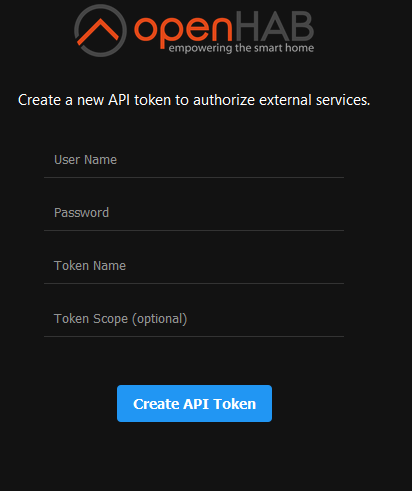
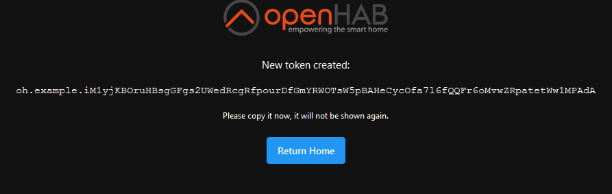
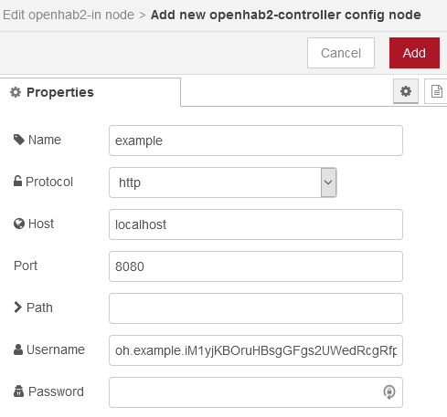
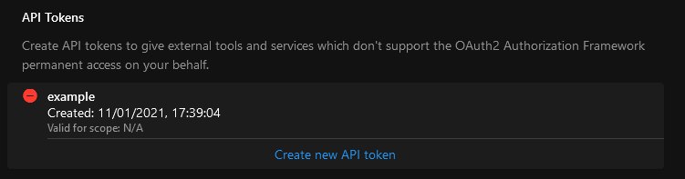

# openHAB API tokens

API tokens are an authentication method, like an username and password. 
Usually you would use an API token to authenticate an external service or script.

## Generate an API token
Sign in to openHAB with your administrator username and password, by clicking on the sign-in button (bottem left).

After signing in, click again on the profile button to access your profile page. 
Click on Create new API token.

Use your admin username and password and fill in the token name (e.g. the service you want to gain access for) and a Token Scope.

Now the token is created. 
Copy the complete token.

This token is in the used service your username, leave the password empty.
As example, below in NodeRed configuration the generated token is used as username.

## Overview of generated tokens
In your profile overview page you can find an overview of generated tokens. 
Additionally, they can be deleted here.

