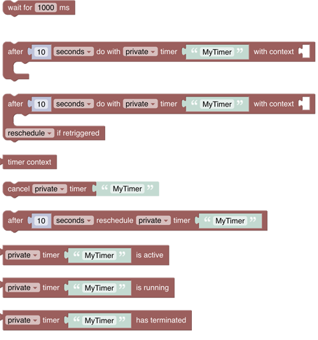

<!-- markdownlint-disable MD036 -->

# Blockly Reference 33

One of the core feature that OpenHAB provides is writing rules to allow specific behaviour with the home automation system.
The usual way of developing rules is by coding them like described in the [Textual Rules](/docs/configuration/rules-dsl.html).
However, this art of programming may become intimidating early on and shy away away people with few or almost no experience in programming.
Therefore openHAB also provides a graphical way of writing rules which allows to put together rules in a rather visual way (even though some programming background may still help).

{::options toc_levels="2..4"/}

- TOC
{:toc}

{: #blockly-introduction}

## Introduction

The basic idea behind the visual paradigm and representation within openHAB is based on the [Google Blockly Support](https://developers.google.com/blockly) which has been integrated and which provides the basic blocks for programming like the ones on the left and the right side of the below images

{: #blockly-toolbox}
*Blockly toolbox*

All of these provide general functionality that is not specific to openHAB itself. If you want to learn more about how to use them, search for the many blockly tutorials that are available.
However, to leverage the full capabilities more than *50 specific blocks* have been provided that are tailored for easy access of openHAB's capabilities.

This section provides a detailed description of the specific blocks and provides examples on how to use them. Note that some of the blocks (like voice, streaming or notifications) need some special setup within openHAB  - in these case links to the respective documentation is provided.
It should also be mentioned that each of the blocks do have a context sensitive menu which appears upon a right click on the block itself.

**Block context menu**

**Looking for help**

A special mention should go towards the **Help** entry that links to a resource that is usually very helpful to understand the context of that particular block.
Please read this information first before asking questions in the forum. *In case you ask for help please always post the respective code that is being generated.*

## Before using blockly

Please visit [Getting started with openHAB Blocklies](rules-blockly-before-using.html) before asking questions in the forum

## Blocks

### Items and Things

*Items* and *Things* are the [major entities of openHAB](https://www.openhab.org/docs/concepts/) to control and monitor the home.

See [Items & Things](rules-blockly-items-things.html) section

### Timers and Delays

Timers and Delays are a little more complex but add important functionality to rules. Whilst the “Wait-For”-block is straightforward, the timer blocks should be well understood before being used - they may behave differently than expected.
This chapter explains what these blocks do, sometimes displaying generated code to explain what is happening behind the scenes.

See [Timers and Delays](rules-blockly-timers-and-delays.html) section.

### Date Handling

Date blocks are used as input parameters for other blocks.
At the moment some of these blocks are found in the ephemeris section, whilst others are found in the persistence section - they may be equally useful for both. These blocks are *typed* to assure correct connection to other blocks.

 

See [Date Handling](rules-blockly-date-handling.html) section.

### Ephemeris

The ephemeris category provides blocks with calendar functionality. The blocks can be used to determine what type of day today is, or a number of days before or after today is.
For example, a way to determine if today is a weekend, a bank holiday, someone’s birthday, trash day, etc.

See [Ephemeris](rules-blockly-ephemeris.html) section.

### Voice and Multimedia

This section deals with *playing or streaming audio* to an audio sink e.g a speaker or *saying a text* via using any Text-to-Speech API (e.g. Google's API)

See [Voice and Multimedia](rules-blockly-voice-and-multimedia.html) section.

### Notifications

For use with your [openHAB cloud](https://www.openhab.org/addons/integrations/openhabcloud/) account, these blocks can be used to send notifications to relevant connected devices.
Notifications can be used as push message to devices running the openHAB client.

See [Notifications](rules-blockly-notifications.html) section.

### Persistence

Persistence blocks enable access of historical data stored by the default persistence service.

See [Persistence](rules-blockly-persistence.html) section.

### Value Storage

These blocks enable storing information *for a rule* that is kept after the rule has run, so it can be reused when the rule is run again later in stateful way.

See [Value Storage](rules-blockly-value-storage.html) section.

### Run & Process (Rules, Scripts and Transformations)

This section allows calling rules or other scripts, retrieving attributes provided by the rule context or transforming values via different conversion methods (e.g. map, regex, jsonpath)

See [Run and Process](rules-blockly-run-and-process.html) section.

### Logging

This section allows calling rules or other scripts, retrieving attributes provided by the rule context or transforming values via different conversion methods (e.g. map, regex, jsonpath)

See [Logging](rules-blockly-logging.html) section.

### openHAB Extensions to the Standard

This section explains only the blocks that have been added to the standard blocks by openHAB

See [openHAB Extensions to the standard](rules-blockly-standard-ext.html) section.

## Tutorials or other useful information

- [Getting Started: Rules - Blockly](https://community.openhab.org/t/getting-started-rules-blockly/132453)
- [How to write openHAB Blockly Libraries](https://community.openhab.org/t/tutorial-how-to-write-block-libraries/130074)
- [Extending Blockly with new openHAB commands](https://community.openhab.org/t/extending-blockly-with-new-openhab-commands/127169)
- [Published Blockly Libraries](https://community.openhab.org/c/marketplace/block-libraries/76)
