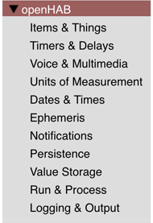

<!-- markdownlint-disable MD036 -->

# Blockly Reference

[[toc]]

## Introduction

openHAB provides a visual programming editor based on [Blockly](https://developers.google.com/blockly) by Google.
It enables the creation of automation rules by dragging and dropping graphical blocks instead of writing [textual code](/docs/configuration/rules-dsl.html).
It is ideal for those with little to no programming experience, yet powerful enough to perform most advanced automations with openHAB.

Check out the  [Quick Intro to Blockly Rules](https://youtu.be/EdllUlJ7p6k?t=295).

## Getting Started

Please visit [Getting started with Blockly](rules-blockly-before-using.html) to learn the basics of using Blockly.

## Blockly YouTube Tutorials

Three YouTube tutorials have been made available via the [openHAB YouTube channel](https://www.youtube.com/c/OpenhabOrg):

- [Episode 1](https://www.youtube.com/watch?v=EdllUlJ7p6k)
  - [Introduction](https://www.youtube.com/watch?v=EdllUlJ7p6k)
  - [Quick Intro Blockly Rules](https://youtu.be/EdllUlJ7p6k?t=295)
  - [Debugging Rules with openHAB Developer Tools to watch Item-Status](https://youtu.be/EdllUlJ7p6k?t=325)
  - [Creating a Blockly Rule](https://youtu.be/EdllUlJ7p6k?t=429)
  - [Overview of the Blockly Sections](https://youtu.be/EdllUlJ7p6k?t=558)
  - [Logging](https://youtu.be/EdllUlJ7p6k?t=670)
  - [Working with Items](https://youtu.be/EdllUlJ7p6k?t=790)
  - [Working with Text-Blocks](https://youtu.be/EdllUlJ7p6k?t=975)
  - [Sending Commands](https://youtu.be/EdllUlJ7p6k?t=1077)
  - [Using Color-Blocks and HSB-Conversion](https://youtu.be/EdllUlJ7p6k?t=1366)
  - [Waiting in Rules](https://youtu.be/EdllUlJ7p6k?t=1600)
  - [Various Help Documentation available in openHAB Blockly](https://youtu.be/EdllUlJ7p6k?t=1589)
  - [Blockly as an ECMA-Script code generator](https://youtu.be/EdllUlJ7p6k?t=1739)
  - [Loops in Blockly](https://youtu.be/EdllUlJ7p6k?t=1947)
  - [Playing sounds on audio sinks](https://youtu.be/EdllUlJ7p6k?t=2035)
  - [Using Text-to-speach easily with blocks](https://youtu.be/EdllUlJ7p6k?t=2395)
  - [Streaming Music](https://youtu.be/EdllUlJ7p6k?t=2538)
- [Episode 2](https://www.youtube.com/watch?v=hSRfooBKn9A)
  - [Introduction](https://youtu.be/hSRfooBKn9A)
  - [Functions](https://youtu.be/hSRfooBKn9A?t=60)
  - [Parameters](https://youtu.be/hSRfooBKn9A?t=170)
  - [Play Stream](https://youtu.be/hSRfooBKn9A?t=335)
  - [IF ELSE](https://youtu.be/hSRfooBKn9A?t=445)
  - [Timers](https://youtu.be/hSRfooBKn9A?t=630)
  - [Burglar Alarm Example](https://youtu.be/hSRfooBKn9A?t=1046)
  - [Disable Rules](https://youtu.be/hSRfooBKn9A?t=1668)
- [Episode 3](https://www.youtube.com/watch?v=KwhYKy1_qVk)
  - [Datetimes and Cron-Triggers](https://youtu.be/KwhYKy1_qVk?t=45)
  - [Copy-Of, Datetime-Now with Math-Operations](https://youtu.be/KwhYKy1_qVk?t=375)
  - [Datetime - Temporal Units](https://youtu.be/KwhYKy1_qVk?t=410)
  - [Date comparison](https://youtu.be/KwhYKy1_qVk?t=520)
  - [Creating Datetimes and other datetime blocks](https://youtu.be/KwhYKy1_qVk?t=2010)
  - [Convert item states to Datetimes](https://youtu.be/KwhYKy1_qVk?t=570)
  - [Send Notifications to the openHAB mobile app](https://youtu.be/KwhYKy1_qVk?t=930)
  - [Using Ephemeris information](https://youtu.be/KwhYKy1_qVk?t=1275)
  - [Using Persistence data](https://youtu.be/KwhYKy1_qVk?t=1440)
  - [Wrap up and short overview on basic blocks](https://youtu.be/KwhYKy1_qVk?t=1680)
  - [Basic: Logic, Loops, Variables overview](https://youtu.be/KwhYKy1_qVk?t=1730)
  - [Basic: Math](https://youtu.be/KwhYKy1_qVk)
  - [Basic: Text](https://youtu.be/KwhYKy1_qVk?t=1835)
  - [Basic: Lists, Colors](https://youtu.be/KwhYKy1_qVk?t=1910)
  - [openHAB Blocks Wrap up](https://youtu.be/KwhYKy1_qVk?t=1945)
  - [Global Value Storage](https://youtu.be/KwhYKy1_qVk?t=2060)
  - [Run & Process blocks, transform](https://youtu.be/KwhYKy1_qVk?t=2110)
  - [Inline Scripts](https://youtu.be/KwhYKy1_qVk?t=2165)
  - [Outro](https://youtu.be/KwhYKy1_qVk?t=2257)

## Blockly Toolbox

The toolbox contains the building blocks of a Blockly program. The following categories are available in the toolbox:

These include general functionalities to perform various operations such as loops, comparison and text manipulation.
Additionally, more than _50 special blocks_ are provided for performing openHAB related tasks.

### openHAB Specific Blocks

The following sections provide detailed descriptions of the openHAB-specific blocks and provide examples on how to use them.

Also view  [Overview of the Blockly Sections](https://youtu.be/EdllUlJ7p6k?t=558)

| Section                                                          | Description                                                                                                                 |
| ---------------------------------------------------------------- | --------------------------------------------------------------------------------------------------------------------------- |
| [Items & Things](rules-blockly-items-things.html)                | Control and monitor the status of Items and Things in the smart home.                                                       |
| [Timers & Delays](rules-blockly-timers-and-delays.html)          | Execute something in the future.                                                                                            |
| [Voice & Multimedia](rules-blockly-voice-and-multimedia.html)    | Play audio and synthesize speech.                                                                                           |
| [Units of Measurement](rules-blockly-uom.html)                   | Operations with numeric quantity and unit conversions.                                                                      |
| [Dates & Times](rules-blockly-date-handling.html)                | Information, operations, and conversions of Date and Time.                                                                  |
| [Ephemeris](rules-blockly-ephemeris.html)                        | Calendar functionality to determine holidays.                                                                               |
| [Notifications](rules-blockly-notifications.html)                | Send notifications using the [openHAB cloud](https://www.openhab.org/addons/integrations/openhabcloud/).                    |
| [Persistence](rules-blockly-persistence.html)                    | Access historical data.                                                                                                     |
| [Value Storage](rules-blockly-value-storage.html)                | Variable storage that is kept after the rule has run, so it can be reused when the rule is run again later in stateful way. |
| [Run & Process](rules-blockly-run-and-process.html)              | Call other scripts, access rule context, and perform data transformations.                                                  |
| [Logging](rules-blockly-logging.html)                            | Write to the system logs for debugging purposes.                                                                            |
| [Extensions to Standard Blocks](rules-blockly-standard-ext.html) | Additions to complement the standard blocks.                                                                                |

### Community Provided Blocks

The core openHAB are meant to cover most of the functionality that is needed to write rules.
However, there might be functionality that is not available (yet).
These can be provided by the community.

A good explanation on how to write custom blocks can be found at [How to write openHAB Blockly Libraries](https://community.openhab.org/t/tutorial-how-to-write-block-libraries/130074)

All published custom blocks can be found at [Published Blockly Libraries](https://community.openhab.org/c/marketplace/block-libraries/76) and can be directly downloaded within your openHAB installation in the [Settings -> Automation section](/docs/settings/addons.html#automation)

## Blockly is a Code Generator

Even though you may not notice it directly, the blocks are automatically converted into code that can run on the openHAB server. The generated code can be viewed when clicking the button  on the lower right corner of the Blockly editor.

Please watch the video  [Blockly as an ECMA-Script code generator](https://youtu.be/EdllUlJ7p6k?t=1739) for a live demo.

### openHAB 3 to openHAB 4 Migration

#### Background

Blockly generates JavaScript (ECMAScript) code, which exists in two different major implementations and versions:

- The older **NashornJS**, a.k.a. **ECMAScript 5.1**, released in 2011
- The newer **GraalJS**, currently supporting the **ECMAScript 2022** version, released in 2022

The ECMAScript version that is used by Blockly in **openHAB 3** is **ECMAScript 5.1**, a.k.a. [Nashorn JS](https://www.oracle.com/technical-resources/articles/java/jf14-nashorn.html) which was a part of Java until Java 14.

As **openHAB 4** is based on Java 17, the old ECMAScript 5.1 is no longer available by default in the JVM and must be installed as a separate add-on. A replacement for the NashornJS is **GraalJS** ("the holy grail"), which is currently running **ECMAScript 2022** and therefore supports all modern JavaScript features, like arrow functions. This is now the default JavaScript engine for Blockly in openHAB 4.

[**GraalJS**](https://github.com/oracle/graaljs) is already available in openHAB 3 when the [JS Scripting Addon](https://www.openhab.org/addons/automation/jsscripting/) is installed.

::: tip

Please convert your old rules as quickly as possible because only with GraalJS you can leverage the openHAB JavaScript library (`openhab-js`) in Blockly.
Using this library you can not only create much simpler code, it also allows **new functionalities** that are not available with NashornJS.
**Note that some blocks are only available with the openhab-js library on GraalJS.**

:::

From a technical perspective a rule internally holds a MIME-type that tells openHAB how the generated JavaScript language has to be interpreted.
The default MIME-type `application/javascript` in openHAB 3 runs the rule with NashornJS, while this same MIME-type will run the Blocky rule with GraalJS in openHAB 4.
As a result when running an unconverted openHAB 3 Blocky rule on openHAB 4, openHAB 4 will run a rule that was meant for NashornJS with GraalJS, and it will fail.

There is the choice to

- Convert each rule to GraalJS, or
- Keep them as NashornJS

Either way, some work on each rule needs to be done.

#### Conversion to GraalJS (recommended)

- Make sure the [JS Scripting Addon](https://www.openhab.org/addons/automation/jsscripting/) is installed.
- **Open each Blockly rule in openHAB 4 and save it - that's it!**
- After all scripts of all rules have been converted to GraalJS, uninstall the `JavaScript Scripting (Nashorn)` addon to save memory.

#### Running openHAB 3 Blockly rules without migrating them right away

- If you still want to run the Blockly rules that were created in openHAB 3 for the time being without changing them (see above), you have to install the [JavaScript Scripting (Nashorn) Addon](https://www.openhab.org/addons/automation/jsscriptingnashorn/) which provides backwards compatibility until you have converted all rules.
- Open each Blockly rule or go to the Code TAB or Search for type: application/javascript;
- Replace it by `application/javascript;version=ECMAScript-5.1`.
Open the Blockly rule, find the following symbol and click on it.

Choose the old version of JavaScript and then save the rule.

- After the installation of the Addon, both the old rules created in openHAB 3 and the new rules created in openHAB 4 can run on openHAB 4 at the same time.
- Note that this allows you to mix rules that run with NashornJS and some that run with GraalJS (see above).

## Tutorials and other useful information

- [Getting Started: Rules - Blockly](https://community.openhab.org/t/getting-started-rules-blockly/132453)
- [Extending Blockly with new openHAB commands](https://community.openhab.org/t/extending-blockly-with-new-openhab-commands/127169)
