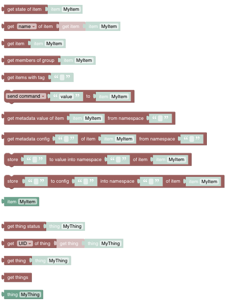
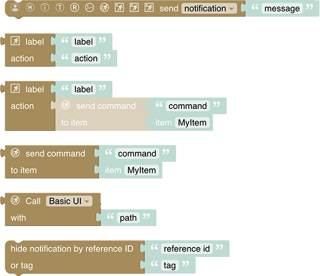
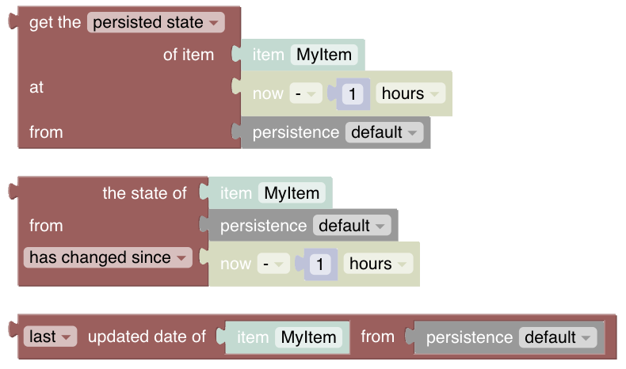

<!-- markdownlint-disable MD036 -->

# Blockly Reference

One of the core feature that openHAB provides is writing rules to allow specific behaviour with the home automation system.
The usual way of developing rules is by coding them like described in the [Textual Rules](/docs/configuration/rules-dsl.html).

The art of textual programming may become intimidating early on and shy away people with few or almost no experience in programming. So, if you are not a member of the professional coder community or do not have equivalent skills, the ability to create your programs visually might be the ideal option (even though some programming background may still help or can evolve over time). Therefore openHAB also provides a graphical way of writing rules which allows to put together rules in a visual way: Welcome to the world of openHAB Blockly.

[[toc]]

## Introduction

The basic idea behind the visual paradigm and representation within openHAB is based on the [Google Blockly Support](https://g.co/dev/blockly) which has been integrated and which provides the basic blocks for programming like the ones on the left and the right side of the below images
_Blockly toolbox_.

All of these provide general functionality that is not specific to openHAB itself. If you want to learn more about how to use them, search for the many blockly tutorials that are available.
However, to leverage the full capabilities more than _50 specific blocks_ have been provided that are tailored for easy access of openHAB's capabilities.

This section provides a detailed description of the specific blocks and provides examples on how to use them. Note that some of the blocks (like voice, streaming or notifications) need some special setup within openHAB  - in these case links to the respective documentation is provided.
Also see this  [Intro](https://youtu.be/EdllUlJ7p6k?t=295) Quick Intro Blockly Rules

## Blockly is a code generator or how the 🦏 found the holy Grail

Even though you may not notice it directly, the blocks are eventually used to automatically create code that can run on the openHAB server.
Please watch the  video [Blockly as an ECMA-Script code generator](https://youtu.be/EdllUlJ7p6k?t=1739) for a live demo.
The code that is generated can be viewed when clicking the button  on the lower right corner of the blockly editor.
In general, the code that Blockly generates is JavaScript (aka ECMAScript).

::: tip

Important: For Blockly to work, you need to have the [Javascript Scripting Addon](https://www.openhab.org/addons/automation/jsscripting/) (aka GraalJS) installed.

:::

### openHAB 3 / openHAB 4  to openHAB 4.3 or Later - Migration

From openHAB 4 onwards, the script engine is GraalJS provided by the [JS Scripting Addon](https://www.openhab.org/addons/automation/jsscripting/), **ECMAScript 2022**, when Blockly creates new scripts.
openHAB versions before 4.3 could use **ECMAScript 2022** or **NashornJS** with **ECMAScript 5.1**, either installed by default or installed through an Addon.
**NashornJS** is no longer an option with openHAB 4.3 or later. Therefore the generated Blockly code needs to be converted to **ECMAScript 2022**.

Converting is as easy as making sure the [JS Scripting Addon](https://www.openhab.org/addons/automation/jsscripting/) is installed, and opening your Blockly script.
The UI will indicate your script has been generated with an older version and needs to be saved again.
From that point onwards, things should work as before.

## Looking for help

A special mention should go towards the **Help** entry in a block context menu [right click on any block](rules-blockly-before-using.html#block-context-menu) that links to a resource that is usually very helpful to understand the context of that particular block.
To retrieve the particular help for a block right click on a block to open the context menu and click on the **help**-entry:

There is also a help-button available in each section that links to the documentation of the whole section.

Please read this information first before asking questions in the forum. _In case you ask for help please always post the respective code that is being generated._

Also there is a good  intro about that topic can be viewed at  [Various Help Documentation available in openHAB Blocky](https://youtu.be/EdllUlJ7p6k?t=1589)

## Before using blockly

Please visit [Getting started with openHAB Blocklies and creating a rule](rules-blockly-before-using.html) before asking questions in the forum.

## Blockly YouTube Tutorials

Three YouTube tutorials have been made available via the [openHAB YouTube channel](https://www.youtube.com/c/OpenhabOrg):

- [Episode 1](https://www.youtube.com/watch?v=EdllUlJ7p6k)
  - [Introduction](https://www.youtube.com/watch?v=EdllUlJ7p6k)
  - [Quick Intro Blockly Rules](https://youtu.be/EdllUlJ7p6k?t=295)
  - [Debugging Rules with openHAB Developer Tools to watch Item-Status](https://youtu.be/EdllUlJ7p6k?t=325)
  - [Creating a Blockly Rule](https://youtu.be/EdllUlJ7p6k?t=429)
  - [Overview of the Blockly Sections](https://youtu.be/EdllUlJ7p6k?t=558)
  - [Logging](https://youtu.be/EdllUlJ7p6k?t=670)
  - [Working with Items](https://youtu.be/EdllUlJ7p6k?t=790)
  - [Working with Text-Blocks](https://youtu.be/EdllUlJ7p6k?t=975)
  - [Sending Commands](https://youtu.be/EdllUlJ7p6k?t=1077)
  - [Using Color-Blocks and HSB-Conversion](https://youtu.be/EdllUlJ7p6k?t=1366)
  - [Waiting in Rules](https://youtu.be/EdllUlJ7p6k?t=1600)
  - [Various Help Documentation available in openHAB Blockly](https://youtu.be/EdllUlJ7p6k?t=1589)
  - [Blockly as an ECMA-Script code generator](https://youtu.be/EdllUlJ7p6k?t=1739)
  - [Loops in Blockly](https://youtu.be/EdllUlJ7p6k?t=1947)
  - [Playing sounds on audio sinks](https://youtu.be/EdllUlJ7p6k?t=2035)
  - [Using Text-to-speach easily with blocks](https://youtu.be/EdllUlJ7p6k?t=2395)
  - [Streaming Music](https://youtu.be/EdllUlJ7p6k?t=2538)
- [Episode 2](https://www.youtube.com/watch?v=hSRfooBKn9A)
  - [Introduction](https://youtu.be/hSRfooBKn9A)
  - [Functions](https://youtu.be/hSRfooBKn9A?t=60)
  - [Parameters](https://youtu.be/hSRfooBKn9A?t=170)
  - [Play Stream](https://youtu.be/hSRfooBKn9A?t=335)
  - [IF ELSE](https://youtu.be/hSRfooBKn9A?t=445)
  - [Timers](https://youtu.be/hSRfooBKn9A?t=630)
  - [Burglar Alarm Example](https://youtu.be/hSRfooBKn9A?t=1046)
  - [Disable Rules](https://youtu.be/hSRfooBKn9A?t=1668)
- [Episode 3](https://www.youtube.com/watch?v=KwhYKy1_qVk)
  - [Datetimes and Cron-Triggers](https://youtu.be/KwhYKy1_qVk?t=45)
  - [Copy-Of, Datetime-Now with Math-Operations](https://youtu.be/KwhYKy1_qVk?t=375)
  - [Datetime - Temporal Units](https://youtu.be/KwhYKy1_qVk?t=410)
  - [Date comparison](https://youtu.be/KwhYKy1_qVk?t=520)
  - [Creating Datetimes and other datetime blocks](https://youtu.be/KwhYKy1_qVk?t=2010)
  - [Convert item states to Datetimes](https://youtu.be/KwhYKy1_qVk?t=570)
  - [Send Notifications to the openHAB mobile app](https://youtu.be/KwhYKy1_qVk?t=930)
  - [Using Ephemeris information](https://youtu.be/KwhYKy1_qVk?t=1275)
  - [Using Persistence data](https://youtu.be/KwhYKy1_qVk?t=1440)
  - [Wrap up and short overview on basic blocks](https://youtu.be/KwhYKy1_qVk?t=1680)
  - [Basic: Logic, Loops, Variables overview](https://youtu.be/KwhYKy1_qVk?t=1730)
  - [Basic: Math](https://youtu.be/KwhYKy1_qVk)
  - [Basic: Text](https://youtu.be/KwhYKy1_qVk?t=1835)
  - [Basic: Lists, Colors](https://youtu.be/KwhYKy1_qVk?t=1910)
  - [openHAB Blocks Wrap up](https://youtu.be/KwhYKy1_qVk?t=1945)
  - [Global Value Storage](https://youtu.be/KwhYKy1_qVk?t=2060)
  - [Run & Process blocks, transform](https://youtu.be/KwhYKy1_qVk?t=2110)
  - [Inline Scripts](https://youtu.be/KwhYKy1_qVk?t=2165)
  - [Outro](https://youtu.be/KwhYKy1_qVk?t=2257)

## Blocks Overview

Also view  [Overview of the Blockly Sections](https://youtu.be/EdllUlJ7p6k?t=558)

### Using Variables

For a long time Blockly only provided untyped variables.
Even though this seems to be more straight forward and provides the flexibility to put any type into that variable, it creates some challenges to openHAB Blockly to generate the right code.

All blocks in Blockly have input and output types defined which allows the editor to check whether one particular block can be used as input for a different block.
This becomes challenging with the standard untyped variables because the type of these is basically none which means that the Blockly editor is not able to check whether this block is allowed or not.
This requires Blockly to make a default guess on the variable's type, which often is the wrong type guess and therefore causes wrong code to be generated - your rule will not work.

Therefore, a new variable section was introduced:

**In general, always prefer Typed Variables over normal Variables!**

In the very seldom case where you may mix types or you want to use a type that is not provided in the dialog, only then choose non-typed variables.

Create a typed variable by clicking on the following button:

This will open up the following dialog:

Hint: Always choose the type of the variable first because it is not possible to change the type afterwards!

- Enter the name of the variable: it is recommended to use a concatenation of the variable name plus the type like _powerItemName_ as it is hard to know later on what type the variable has.
- Don't forget to select the right type (here "Item name") before clicking ok because it cannot be changed later.
- Click ok to create the variable

You will notice that this typed variable can only be used in inputs where normally an Item (name) block would have been allowed.

Here are some examples how these typed variable can or even should be used:

- In the above example the variable name postfix _Var_ was sometimes used which is more like a personal taste and isn't necessary.
- Blockly loops can also take typed variables, and it is especially useful in these cases to make sure the type that is returned by the list (e.g. "get members of group") matches the type of the variable because it allows blocks that use the list items (e.g. "get state of item") to behave correctly.
- As it can be seen in the loop example it is very helpful if the variable name contains the type.

### Items and Things

_Items_ and _Things_ are the [major entities of openHAB](https://www.openhab.org/docs/concepts/) to control and monitor the home.

See [Items & Things](rules-blockly-items-things.html) section

### Timers and Delays

Timers and Delays are a little more complex but add important functionality to rules. Whilst the “Wait-For”-block is straightforward, the timer blocks should be well understood before being used - they may behave differently than expected.
This chapter explains what these blocks do, sometimes displaying generated code to explain what is happening behind the scenes.

See [Timers and Delays](rules-blockly-timers-and-delays.html) section.

### Voice and Multimedia

This section deals with _playing or streaming audio_ to an audio sink e.g a speaker or _saying a text_ via using any Text-to-Speech API (e.g. Google's API)

See [Voice and Multimedia](rules-blockly-voice-and-multimedia.html) section.

### Units of Measurements

See [Units of Measurement](rules-blockly-uom.html) section.

### Date Handling

Date blocks are used as input parameters for other blocks.
Some of these blocks are used by ephemeris blocks, whilst others are used in the persistence section. Therefore blocks are _typed_ to assure correct connection to other blocks.

 

See [Date Handling](rules-blockly-date-handling.html) section.

### Ephemeris

The ephemeris category provides blocks with calendar functionality. The blocks can be used to determine what type of day today is, or a number of days before or after today is.
For example, a way to determine if today is a weekend, a bank holiday, someone’s birthday, trash day, etc.

See [Ephemeris](rules-blockly-ephemeris.html) section.

### Notifications

For use with your [openHAB cloud](https://www.openhab.org/addons/integrations/openhabcloud/) account, these blocks can be used to send notifications to relevant connected devices.
Notifications can be used as push message to devices running the openHAB client.

See [Notifications](rules-blockly-notifications.html) section.

### Persistence

Persistence blocks enable access of historical data stored by the default persistence service.

See [Persistence](rules-blockly-persistence.html) section.

### Value Storage

These blocks enable storing information _for a rule_ that is kept after the rule has run, so it can be reused when the rule is run again later in stateful way.

See [Value Storage](rules-blockly-value-storage.html) section.

### HTTP

These blocks allow sending HTTP requests and receiving the response.

See [HTTP](rules-blockly-http.html) section.

### Run & Process (Rules, Scripts and Transformations)

This section allows calling rules or other scripts, retrieving attributes provided by the rule context or transforming values via different conversion methods (e.g. map, regex, jsonpath)

See [Run and Process](rules-blockly-run-and-process.html) section.

### Logging

This section allows calling rules or other scripts, retrieving attributes provided by the rule context or transforming values via different conversion methods (e.g. map, regex, jsonpath)

See [Logging](rules-blockly-logging.html) section.

### openHAB Extensions to the Standard

This section explains only the blocks that have been added to the standard blocks by openHAB

See [openHAB Extensions to the standard](rules-blockly-standard-ext.html) section.

### openHAB Blocks provided by the community

The core openHAB are meant to cover most of the functionality that is needed to write rules.
However, there might be functionality that is not available (yet).
These can be provided by the community.

A good explanation on how to write custom blocks can be found at [How to write openHAB Blockly Libraries](https://community.openhab.org/t/tutorial-how-to-write-block-libraries/130074)

All published custom blocks can be found at [Published Blockly Libraries](https://community.openhab.org/c/marketplace/block-libraries/76) and can be directly downloaded within your openHAB installation in the [Settings -> Automation section](/docs/settings/addons.html#automation)

## Tutorials or other useful information

- [Getting Started: Rules - Blockly](https://community.openhab.org/t/getting-started-rules-blockly/132453)
- [Extending Blockly with new openHAB commands](https://community.openhab.org/t/extending-blockly-with-new-openhab-commands/127169)
