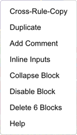
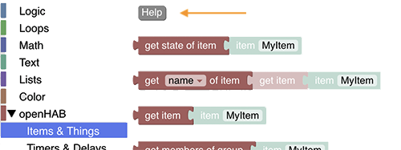
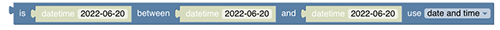

<!-- markdownlint-disable MD036 -->

# Getting Started with Blockly in openHAB

[Return to Blockly Reference](index.html#getting-started)

## Preface

Blocklies are an easy entry to the world of writing rules.
However, after some times, you end up writing more and more complex rules, so more sooner than later you will encounter some challenges.
This section intends to provide some hints to get started and how to deals with those challenges.
Please read them carefully before asking questions in the forum.

[[toc]]

## openHAB Configuration Files

Some openHAB blocks rely on particular configuration files found in the openHAB configuration folder.
This folder is referred to as `$OPENHAB_CONF` throughout this documentation.
The location of this folder can be found via the UI when logged in as an admin: _Help & About_ -> _Technical Information_ -> _Configuration folder_.

When using openHABian, a [samba share](https://github.com/openhab/openhabian/blob/main/includes/smb.conf) called `openHAB-conf` is created for the configuration folder.
This share can be mounted on your computer for easy access.

### Mounting the openHAB-conf share in Windows

- Find your openHAB-Server via the network share functionality
- Find the `openHAB-conf` folder and assign it to a network drive

### Mounting the openHAB share in macOS

- Finder -> Go -> Connect to Server
- Enter the username and server name to connect to the openHAB Server
  
- Then choose the folder you want to mount
  

### Finding it on Linux

- Access the folder directly on the openHAB server at `/etc/openhab`

All methods reveal the following folders

- html
- icons
- items
- services
- html
- persistence
- rules
- scripts
- sitemaps
- sounds
- things
- transform

## Creating a Blockly

Video tutorial  [Creating a Blockly Rule](https://youtu.be/EdllUlJ7p6k?t=429)

Steps:

- Go to `Settings` -> `Rules`
- Press  on bottom right
- Enter a unique id and rule name for your new Blockly rule
- Under `When`, click `Add Trigger` to define a trigger for the rule.
  - Choose `Item Event` (or something else) that should trigger the rule.
  - Select the item from your model and the click `Pick` on the upper right corner.
  - (Optional) Enter a title for the trigger. A suitable default title will used when none was provided.
  - Choose "received a command", "was updated" or "changed" accordingly.
- Under `Then`, click `Add Action`
  - Click 
  - Click 
  - You should now see this screen:
    
- Drag and Drop the blocks to the white area
- Press <kbd>Ctrl</kbd>+<kbd>S</kbd> (Windows) or <kbd>Command</kbd>+<kbd>S</kbd> (macOS) to save your rule
- Press <kbd>Ctrl</kbd>+<kbd>R</kbd> (Windows) or <kbd>Command</kbd>+<kbd>R</kbd> (macOS) to directly run your rule with the trigger
- Press <kbd>Ctrl</kbd>+<kbd>D</kbd> (Windows) or <kbd>Command</kbd>+<kbd>D</kbd> (macOS) to disable / enable your rule.
  See the following video on  [How to disable Rules](https://youtu.be/hSRfooBKn9A?t=1668)
- **Click on**  **on the lower right of the bottom toolbar to see the generated code** and it will transition to (click again to come back to the blocks).

::: Note

Multiple triggers may be added to the rule.
The rule will be executed once for each trigger that occurred.
This means that if multiple trigger occurred, the rule will be executed multiple times.

:::

More about the topic of code generation can be viewed at  [Blockly as an ECMA-Script code generator](https://youtu.be/EdllUlJ7p6k?t=1739)

### Panning and Zooming

You can move around Blockly's workspace by clicking and dragging on the empty space, or by using two fingers on a touch screen or a trackpad.

Zooming can be done using either of these methods:

- By pinching or stretching on a touch screen or a trackpad.
- By holding <kbd>Ctrl</kbd> while dragging or moving with two fingers on the touch screen or trackpad.
- With the on-screen controls:
  
  

### Context Menu

A context menu is available when right-clicking on a block.

Right-clicking on an empty area in the workspace will pop up a slightly different context menu.
In particular, `Clean up Blocks` will automatically move and arrange your blocks neatly.

### Getting Help

Each block offers a **Help** link in its [context menu](#context-menu).
It will open a page that provides further information about the function of that particular block.

There is also a help button available in each section of the toolbox that links to the documentation of the whole section.

_When asking for help in the community forums, please include the respective code that is being generated._

See also:  [Various Help Documentation available in openHAB Blocky](https://youtu.be/EdllUlJ7p6k?t=1589)

### Selecting Blocks

Click on a block to select it.

You can select multiple blocks by holding the <kbd>Shift</kbd> key while clicking on other blocks.
Alternatively, hold down the <kbd>Shift</kbd> key, click on an empty area and start dragging to select the blocks within the selection rectangle.

Child blocks are automatically selected when their parent is selected.

Once selected, the blocks can be copied, duplicated, deleted, or moved around.

### Copying & Pasting

Copy-pasting can be used as a quick way to duplicate a set of blocks within the same script.
You can also copy a set of blocks into your clipboard, and paste them into another script.

### Other Operations

- **Duplicate**: Clones the block
- **Add comment**: Adds a comment to the block
- **Inline Inputs** / External inputs: Switches between horizontal or vertical alignment of inputs

  Inline:
  

  External:
  

- **Collapse (expand) block**: Shrinks the block to get a better overview

  Normal block view:
  

  Collapsed view:

  

- **Disable (enable) block**: Disables the block, so no code is generated and its functionality switched off
- **Delete**: delete the blocks (this can be reverted via Command/Ctrl-Z)

### Searching the workspace

Sometimes Blockly rules become pretty big, and it is hard to find particular blocks in the rule.
Therefore, a search functionality has been provided by pressing Cmd/Ctrl-F which opens a small search window in the top right (just below the "save"-label).
After pressing _Enter_ all found blocks that contain the search term are marked in black.

## Use Frontail for viewing log files

The log block can be used to write information into the log file during development.

- To view the log file, it is recommended to setup _frontail_ which can be installed easily with [openhabian-config](https://www.openhab.org/docs/installation/openhabian.html#optional-components)
- Start `openhabian-config` on your server and choose option 20 and then option 21
- After installation you can view your logs under [openhabian-config](http://myopenhab-server:9001) (adapt the server name)
- See [Logging in openHAB](https://www.openhab.org/docs/administration/logging.html) for more details.

More on that topic can be viewed at  [Logging](https://youtu.be/EdllUlJ7p6k?t=670)

## Show an item status watch list besides the Blockly rules

In the developer section there is the possibility to add a sidebar to the Blockly rules development workspace that allows to watch live status of an item.
View the chapter  [Debugging Rules with openHAB Developer Tools to watch Item-Status](https://youtu.be/EdllUlJ7p6k?t=325) for more information.

## Return to Blockly Reference

[Return to Blockly Reference](index.html#before-using-blockly)
