<!-- markdownlint-disable MD036 -->

# Date Handling

[return to Blockly Reference](index.html#date-handling)

## Introduction

Date blocks are used as input parameters for other blocks or can be used to create or compare date.
With 3.3.0M6 many blocks were introduced to allow complex tasks with dates

[[toc]]

## Overview of the Date Handling blocks

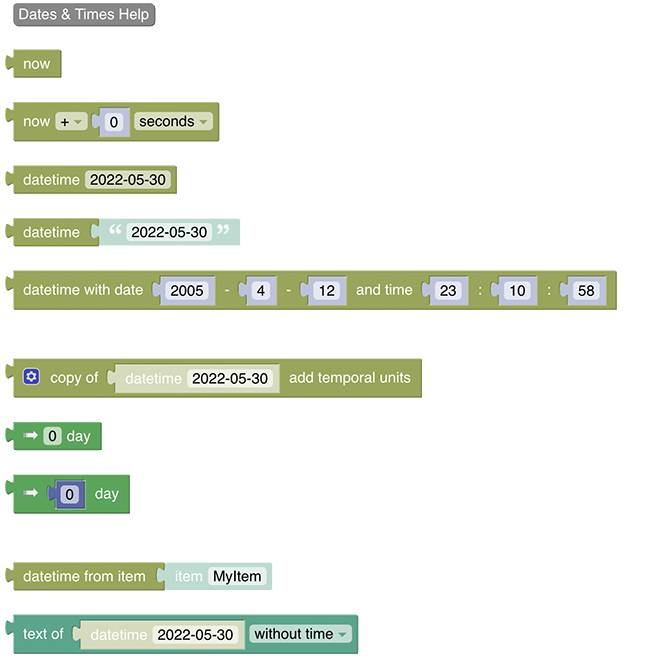

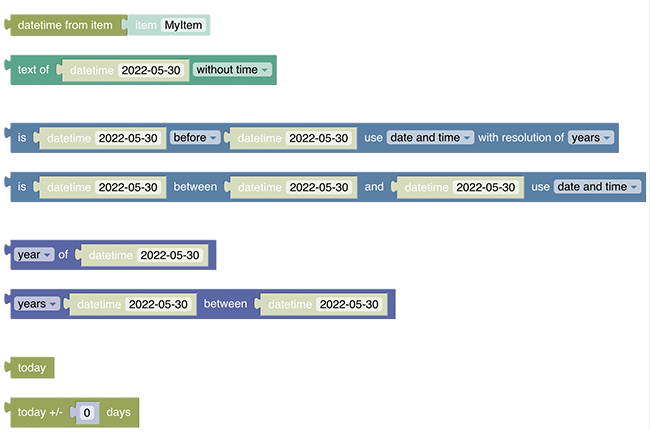

Note: There is _no need_ for a special block to set a datetime of an openHAB item.
This can be directly done via the ["send command" / "post command" block](rules-blockly-items-things.html#send-command)

## Date Handling Blocks

More about that topic can be viewed at  [Datetimes and Cron-Triggers](https://youtu.be/KwhYKy1_qVk?t=45)

### Help


Type: Link to openHAB documentation

This button serves as a link to this documention page

### Get Datetime now


Type: _ZonedDateTime_

Obtains the current datetime from the system clock in the default timezone as _ZonedDateTime_

### Get Datetime now with offset


Type: _ZonedDateTime_

Obtains the current datetime as _ZonedDateTime_ with an offset relative to the current date _and_ time.

The options for the time period base are

- seconds
- minutes
- hours
- days
- months
- years

### Date-picker


Type: _ZonedDateTime_

Returns a date as _ZonedDateTime_.
The date can be selected from a date picker.
The time is set to `00:00:00`.

### Get date


Type: _ZonedDateTime_

This block will return the date as _ZonedDateTime_ based on the given String.
The String may be one of the following formats (since 3.3) the following formats are supported)

- yyyy-MM-dd
- yyyy-MM-dd HH:mm
- yyyy-MM-dd HH:mm:ss
- yyyy-MM-dd HH:mm:ss +HH:mm
- yyyy-MM-dd HH:mm:ss.SSS
- yyyy-MM-dd HH:mm:ss.SSSSS
- yyyy-MM-dd HH:mm:ss.SSS+HH:mm
- yyyy-MM-dd HH:mm:ss.SSSSSS+HH:mm  (local date time standard output)
- yyyy-MM-dd HH:mm:ss.SS+HHmm (OH standard output format)

The input String may also be provided via variable-block or a date from an item state.
In case parts of the date are not provided due to shorter pattern, the others are set to 0

Tip: if you want to create a datetime with your time zone use the "copy of"-block and overwrite its values

More about that topic can be viewed at  [Creating Datetimes and other datetime blocks](https://youtu.be/KwhYKy1_qVk?t=2010)

### Datetime with date and time values


Type: _ZonedDateTime_

Creates a ZonedDateTime by providing all necessary six values

- year of day
- month of day
- day
- hour of time
- minute of time
- second of time

Tip: if you want to create a datetime with your time zone use the "copy of"-block and overwrite its values

### Create Datetime based on a specific date ("Copy Of")

since 3.3

More about that topic can be viewed at  [Copy-Of, Datetime-Now with Math-Operations](https://youtu.be/KwhYKy1_qVk?t=375)

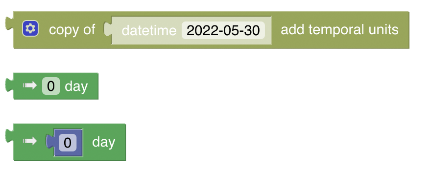

Type: _ZonedDateTime_

This block allows to create a new ZonedDateTime based on a given ZonedDateTime and then either

- overwrites
- adds
- or subtracts

**Temporals:** parts of that datetime are called temporals


More about that topic can be viewed at  [Datetime - Temporal Units](https://youtu.be/KwhYKy1_qVk?t=410)

It is therefore a bit more complex block which is on the other hand very flexible to use.
It consists of the main "copy of"-block and the other two temporal-Blocks that can be added.

The following short video explains how the block can be used

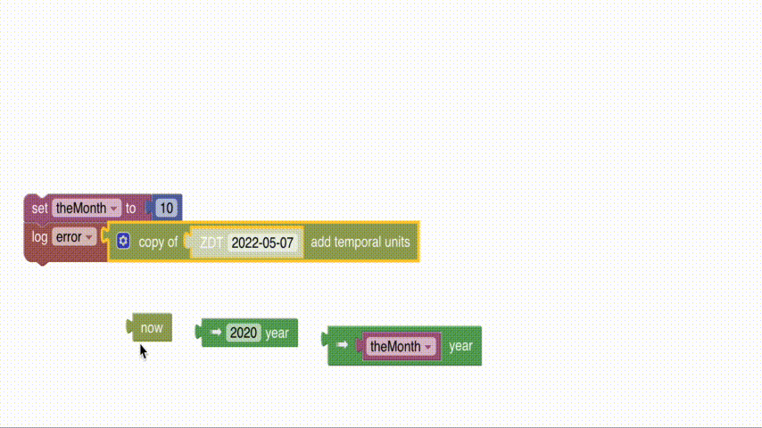

- first drag the main copyOf-Block to the workspace
- choose the datetime you want to base your _new_ datetime on and drag it into the position (in the above video the now block is used)
- select if you want to set (overwrite), add or subtract values via the dropdown
- open the settings icon and drag as many "temporal units" into the block as you want to modify later, which will create the "holes" into which you can apply the temporal blocks
- now drag one of the temporal blocks (see description below) in each of these blocks.
Note that these can be mixed
- Select the temporal unit by clicking on the arrow of that blocks which allows you to choose from one of the following
  - year
  - month
  - day
  - hour
  - minute
  - second
  - milli
  - micro
  - nano
  - day of year
- Modify the values of the temporal unit blocks

**The two different temporal unit blocks**


There are two different blocks that can be dragged into the main block which have both advantages and disadvantages.

**The dense and simple temporal block**


This is the more dense block which is very suitable to create a "lightweight" block itself like so:


You can achieve the exact same result with the following but it looks more bulky and bit more complicated:


**The bulky but powerful temporal block**


This block also provides a temporal value to the main block but it contains an additional indirection for the value of the temporal block.
While the first block only takes a constant, this block allows and even requires the value to be provided by another block which in the standard case is a number block.

Using just the number would be the same like providing a constant value but instead, any number-returning block can be used, hence any math operation can be applied like depicted inte following image:

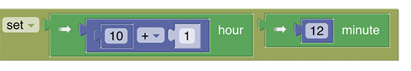

The main power arrives when using variables, which allows to calculate values that should be applied to the datetime.

In the following two values are retrieved from items, added and assigned to a variable.
This variable is then used as the value to amend the lastUpdatedTime of an item which is posted to the target item to be processed.

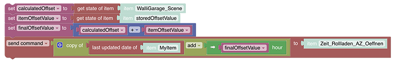

### Datetime from item

since 3.3


Type: _ZonedDateTime_

This is a convenience block that retrieves the state of an item (at best of item type datetime) which is then automatically converted to a ZonedDateTime, so it can be easily used as shown in the following example:


More about that topic can be viewed at  [Convert item states to Datetimes](https://youtu.be/KwhYKy1_qVk?t=570)

### Get String representation of date ("text of")

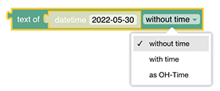

Type: _String_

Returns the String representation of a given _ZonedDateTime_-block, with or without the time.

since 3.3: also returns the same datetime format that is used by openHAB itself

**Example**

Assuming this block is run at `20:47:36` on `31/01/2022`

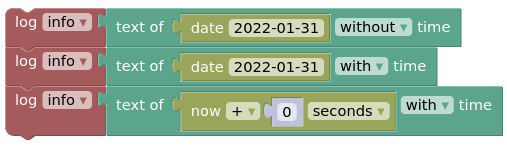

The output in the log will be.

```text
2022-01-31
2022-01-31 00:00:00
2022-01-31 20:47:36
```

### Date Comparison

since 3.3

An introduction to that topic can be viewed at  [Date comparison](https://youtu.be/KwhYKy1_qVk?t=520)

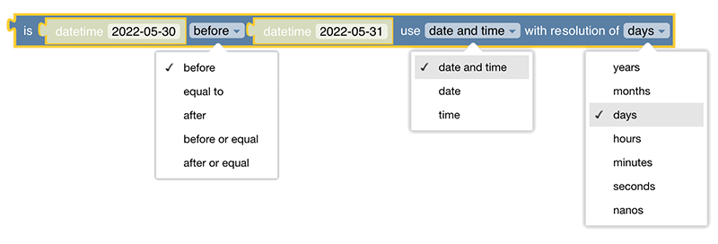

Checks if the instant of the first ZonedDateTime is before, after or equal to the second ZonedDateTime.
In the third drop-down list, the accuracy on which the comparison is based can be selected.

Type: _boolean_

Returns true/false based on the comparison

### Date Comparison Between

since 3.3

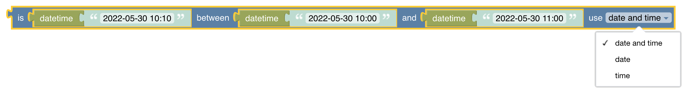

Check if the instant of the first datetime is between the two other datetimes.
The drop-down decides if all components, date only or time only should be used for the comparison.

Type: _boolean_

Returns true/false based on the comparison

### Get part of datetime

since 3.3

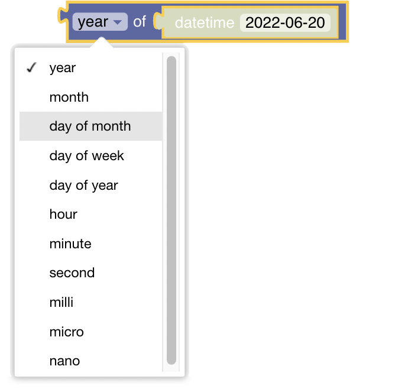

Type: _Number_

Returns the selected part of the datetime as a number.

### Get difference between datetimes

since 3.3

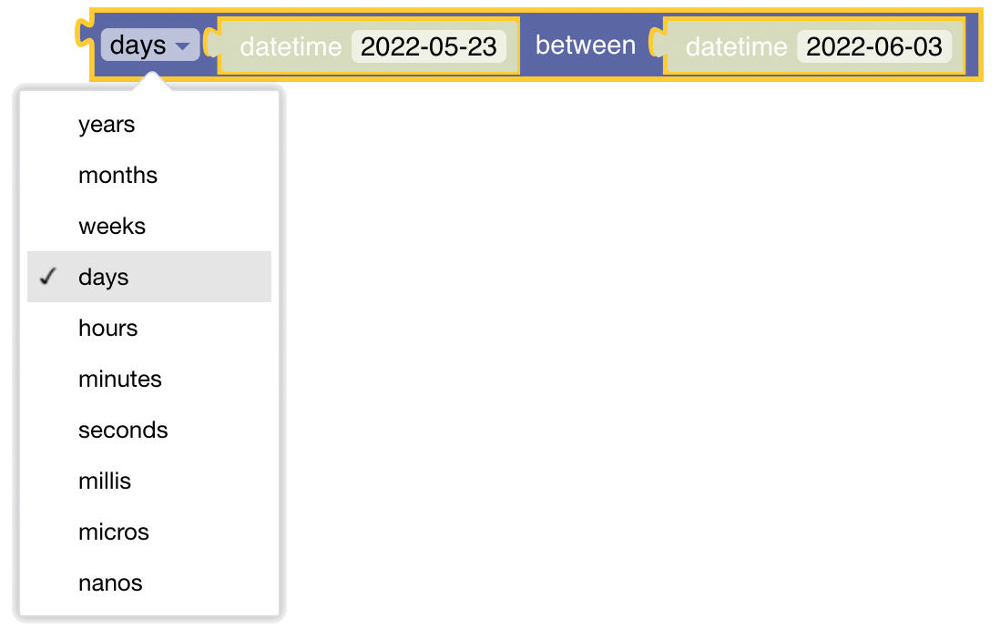

Calculates the amount of time between two datetimes.
The result will be negative if the second object is before the first one.

Type: _Number_

Returns the difference between the two datetimes.

---

### today (ephemeris block)


Type: _DayOffset_

Ephemeris blocks expect a date formatted as the number of days since today.
As a result, this block always returns 0.
Used for Emphemeris blocks only.

### today +/- x days (ephemeris block)


Type: _DayOffset_

Returns the number of days since today, as configured in the number block.
The number can be positive (offset into the future) or negative (offset into the past).
Used for Emphemeris blocks only.

## Return to Blockly Reference

[return to Blockly Reference](index.html#date-handling)
