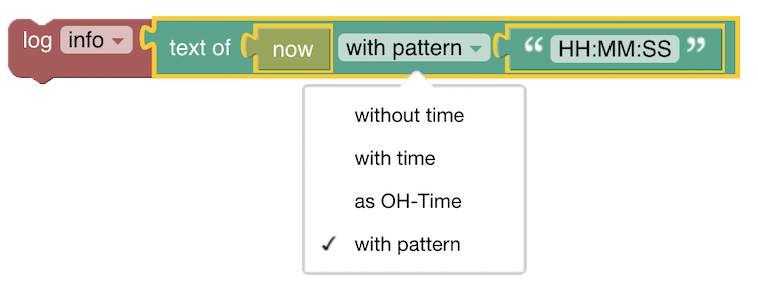
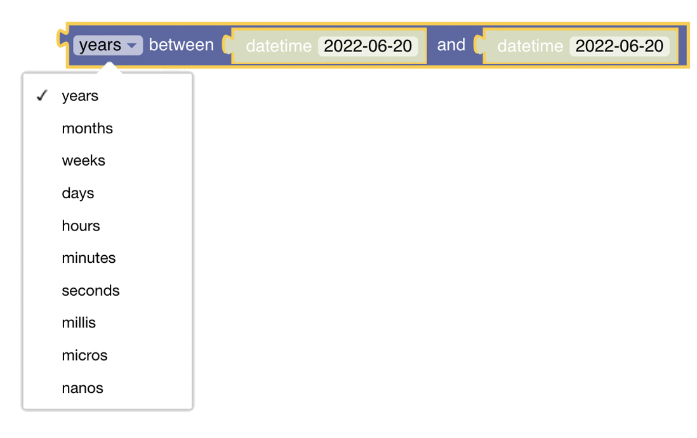

<!-- markdownlint-disable MD036 -->

# Date & Time Handling

[Return to Blockly Reference](index.html#date-handling)

## Introduction

Date & time blocks are used as input parameters for other blocks or to compare date values.

[[toc]]

## Overview of the Date Handling blocks


Note: There is _no need_ for a special block to set a datetime of an openHAB item.
This can be directly done using the ["send command" / "post command" block](rules-blockly-items-things.html#send-command)

## Date Handling Blocks

More about this topic is discussed in this video:  [Datetimes and Cron-Triggers](https://youtu.be/KwhYKy1_qVk?t=45).

---

### Help


Type: Link to openHAB documentation

This button serves as a link to this documentation page.

---

### Get Datetime now


Type: `ZonedDateTime`

Obtains the current datetime from the system clock in the default timezone as `ZonedDateTime`

---

### Get Datetime now with offset


Type: `ZonedDateTime`

Obtains the current datetime as `ZonedDateTime` with an offset relative to the current date _and_ time.

The options for the time period base are

- seconds
- minutes
- hours
- days
- months
- years

---

### Date-picker


Type: `ZonedDateTime`

Returns a date as `ZonedDateTime`.
The date can be selected from a date picker.
The time is set to `00:00:00`.

---

### Convert a String to Date Time


Type: `ZonedDateTime`

This block will convert the given input string into a `ZonedDateTime`.
The input string may be in one of the following format:

- `HH:mm`
- `HH:mm:ss`
- `yyyy-MM-dd`
- `yyyy-MM-dd HH:mm`
- `yyyy-MM-dd HH:mm:ss`
- `yyyy-MM-dd HH:mm:ss +HH:mm`
- `yyyy-MM-dd HH:mm:ss.SSS`
- `yyyy-MM-dd HH:mm:ss.SSSSS`
- `yyyy-MM-dd HH:mm:ss.SSS+HH:mm`
- `yyyy-MM-dd HH:mm:ss.SSSSSS+HH:mm`  (local date time standard output)
- `yyyy-MM-dd HH:mm:ss.SS+HHmm` (openHAB standard output format)

The input string may also be provided by a variable-block or a date from an item state.
In case parts of the date are not provided due to shorter pattern, the other parts are set to 0.

:::tip

if you want to create a datetime with your time zone use the "copy of"-block and overwrite its values

:::

More about this topic can be viewed at  [Creating Datetimes and other datetime blocks](https://youtu.be/KwhYKy1_qVk?t=2010)

---

### Date Time with date and time values


Type: `ZonedDateTime`

Creates a ZonedDateTime by providing all necessary six values

- year of day
- month of day
- day
- hour of time
- minute of time
- second of time

:::tip

if you want to create a datetime with your time zone use the "copy of"-block and overwrite its values

:::

---

### Create Datetime based on a specific date ("Copy Of")

since 3.3

More about this topic can be viewed at  [Copy-Of, Datetime-Now with Math-Operations](https://youtu.be/KwhYKy1_qVk?t=375)


Type: `ZonedDateTime`

This block creates a `ZonedDateTime` based on a given `ZonedDateTime` and then either

- overwrites
- adds
- or subtracts

**Temporals:** parts of that datetime are called temporals


More about this topic can be viewed at  [Datetime - Temporal Units](https://youtu.be/KwhYKy1_qVk?t=410)

It is a more complex block which offers more flexibility.
It consists of the main "copy of"-block and the other two temporal-Blocks that can be added.

The following short video explains how the block can be used


- Drag the main copyOf-Block to the workspace.
- Choose the datetime you want to base your _new_ datetime on and drag it into the position (in the above video the now block is used).
- Select if you want to set (overwrite), add or subtract values via the dropdown.
- Open the settings icon and drag as many "temporal units" into the block as you want to modify later.
  This will create the input slots into which you can apply the temporal blocks.
- Drag one of the temporal blocks (see the description below) into each of these slots.
  Note that these can be mixed.
- Select the temporal unit by clicking on the arrow on the blocks.
  This allows you to choose from one of the following
  - year
  - month
  - day
  - hour
  - minute
  - second
  - milli
  - micro
  - nano
  - day of year
- Modify the values of the temporal unit blocks

**The two different temporal unit blocks**:

1. The dense and simple temporal block:

   

   It is suitable for creating a "lightweight" block such as:

   

1. The bulky but more powerful temporal block:

   

   This block also provides a temporal value to the main block but it contains an additional indirection for the value of the temporal block.
   While the simple block above only takes a constant, the bulky block requires the value to be provided by another block.

   The simple block above can be implemented using the bulky temporal block:

   

   Any number-returning block can be used, hence any math operation can be applied, for example:

   

   The main power arrives when using variables, which allows to calculate values that should be applied to the datetime.

   The following example shows two values retrieved from items, then added and assigned to a variable.
   This variable is then used as the value to amend the lastUpdatedTime of an item which is posted to the target item to be processed.

   

---

### Datetime from Item

since 3.3


Type: `ZonedDateTime`

This is a convenience block that converts the state of an Item (preferably a DateTime Item) to a `ZonedDateTime`, so it can be easily used as shown in the following example:


More about this topic can be viewed at  [Convert item states to Datetimes](https://youtu.be/KwhYKy1_qVk?t=570)

---

### Convert Date to String ("text of")




Type: `String`

Returns a String representation of a given `ZonedDateTime`-block, with, without the time or formatted in openHAB time (like in the logs).
It also allows to return the date in a custom format which can be provided in a separate block.

since 3.3: also returns the same datetime format that is used by openHAB itself

**Example**

Assuming this block is run at `20:47:36` on `31/01/2022`


The output in the log will be.

```text
2022-01-31
2022-01-31 00:00:00
2022-01-31 20:47:36
```

---

### Date Comparison

since 3.3

An introduction to this topic can be viewed at  [Date comparison](https://youtu.be/KwhYKy1_qVk?t=520)


Checks if the instant of the first `ZonedDateTime` is before, after or equal to the second `ZonedDateTime`.
In the third drop-down list, the accuracy of the comparison can be selected.

Type: `boolean`

Returns `true` or `false` based on the comparison.

---

### Date Comparison Between

since 3.3


Checks if the instant of the first datetime is between the two other datetimes.
The drop-down decides if all components, date only or time only should be used for the comparison.

Type: `boolean`

Returns `true` or `false` based on the comparison.

---

### Get a part of datetime

since 3.3


Type: `Number`

Returns the selected part of the datetime as a number.

---

### Get the difference between datetimes

since 3.3



Calculates the amount of time between two datetimes.
The result will be negative if the second object is before the first one.

Type: `Number`

Returns the difference between the two datetimes.

---

### today (ephemeris block)


Type: `DayOffset`

[Ephemeris](rules-blockly-ephemeris.html) blocks expect a date formatted as the number of days since today.
As a result, this block always returns 0.
Used for Ephemeris blocks only.

---

### today +/- x days (ephemeris block)


Type: `DayOffset`

Returns the number of days since today, as configured in the number block.
The number can be positive (offset into the future) or negative (offset into the past).
Used for Emphemeris blocks only.

---

## Return to Blockly Reference

[Return to Blockly Reference](index.html#date-handling)
