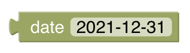

# Date Handling
[return to Blockly Reference](index.html#date-handling)

## Introduction

Date blocks are used as input parameters for other blocks.
At the moment some of these blocks are found in the ephemeris section, whilst others are found in the persistence section - they may be equally useful for both. These blocks are *typed* to assure correct connection to other blocks.

{::options toc_levels="2..4"/}

- TOC
{:toc}

{: #blockly-date-handling-overview}

## Overview of the Date Handling blocks

**Blocks in the ephemeris section**


**Blocks in the persistence section**


## Date Handling Blocks
### today


Type: _DayOffset_

Ephemeris blocks expect a date formatted as the number of days since today. As a result, this block returns 0.

### today +/- x days


Type: _DayOffset_

Returns the number of days since today, as configured in the number block. The number can be positive (offset into the future) or negative (offset into the past).

### date-picker



Type: _ZonedDateTime_

Returns a date as *ZonedDateTime*. The date can be selected from a date picker. The time is set to `00:00:00`.

### Get date


Type: _ZonedDateTime_

From a String in the format `yyyy-MM-dd`, this block will return the date as *ZonedDateTime*. The input String  may be a variable-block. The time will be `00:00:00`.

### Get Date now with offset


Type: _ZonedDateTime_

Returns a date as *ZonedDateTime* with offset relative to the current date *and* time.

### Get String representation of date


Type: _String_

Returns the String representation of a given *ZonedDateTime*-block, with or without the time.

### Example
Assuming this block is run at `20:47:36` on `31/01/2022`


The output in the log will be.

```text
2022-01-31
2022-01-31 00:00:00
2022-01-31 20:47:36
```


## Return to Blockly Reference

[return to Blockly Reference](index.html#date-handling)
