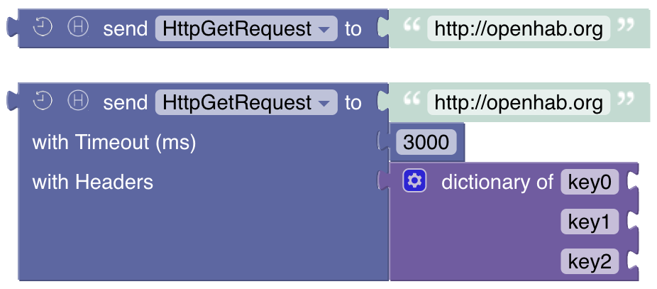
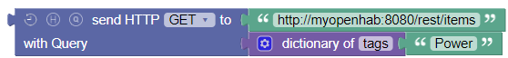
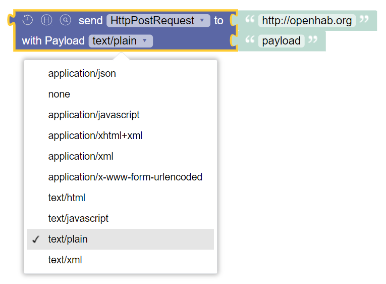
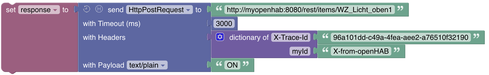
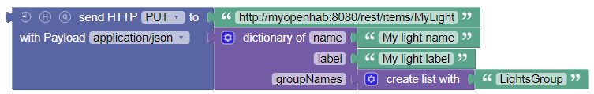

<!-- markdownlint-disable MD036 -->

# HTTP

[return to Blockly Reference](index.html#http)

## Introduction

This section explains the blocks that allow sending HTTP requests.

## HTTP Requests

There is one block that handles all type of requests.
Depending on the required functionality it changes its design.

### Option Toggles

There are three toggle buttons that allow the block to be small for simple requests and add further options to be used:

- Clock: enables the timeout option
- H: enables the header option and allows to provide headers during the request via a [Dictionary](rules-blockly-standard-ext.md#dictionary-for-managing-key--value-pairs)
- Q: enables the query option and allows to provide URI query parameters during the request via a [Dictionary](rules-blockly-standard-ext.md#dictionary-for-managing-key--value-pairs), the query parameters will be URI encoded

### HTTP Request GET

_Function:_ Send an HTTP GET request to a server and receive the response

The simplest form is shown by default and accepts the destination URI as String.

By activating the toggles the timeout, request headers and query parameters can be provided.
Instead of creating a URI containing the query parameters, you can use the query parameter option and provide a [Dictionary](rules-blockly-standard-ext.md#dictionary-for-managing-key--value-pairs) of query parameters.
The provided parameters will automatically be URI encoded.

Here is an example also using a query parameter.

See the [POST-Request](#http-request-post) below for an example showing the use additional fields.

### HTTP Request POST

_Function:_ Send an HTTP POST request to a server and receive the response

The simplest form is shown by default and accepts the destination URI as String and in comparison to the [GET-Request](#http-request-get) adds a section for the payload which takes two parameters:

- the MIME-type of the content to be sent
- the content to be sent to the destination

For MIME-type `application/json` you can provide an object as content, and it will be converted to a JSON string.
For `application/x-www-form-urlencoded`, you can provide a [Dictionary](rules-blockly-standard-ext.md#dictionary-for-managing-key--value-pairs) and it will be URI encoded.

Here is a more complex example that additionally sets a header and a timeout:

### HTTP Request PUT

_Function:_ Send an HTTP PUT request to a server and receive the response

The simplest form is shown by default and accepts the destination URI as String and is similar in functionality to the [POST-Request](#http-request-post):

- the MIME-type of the content to be sent
- the content to be sent to the destination

Notice the construction of an object with a [Dictionary](rules-blockly-standard-ext.md#dictionary-for-managing-key--value-pairs) also containing a List for the JSON payload. 

### HTTP Request DELETE

_Function:_ Send an HTTP DELETE request to a server and receive the response

The simplest form is shown by default and accepts the destination URI as String.

## Return to Blockly Reference

[return to Blockly Reference](index.html#http)
