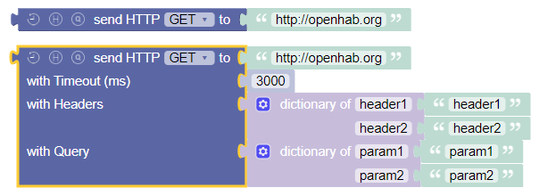
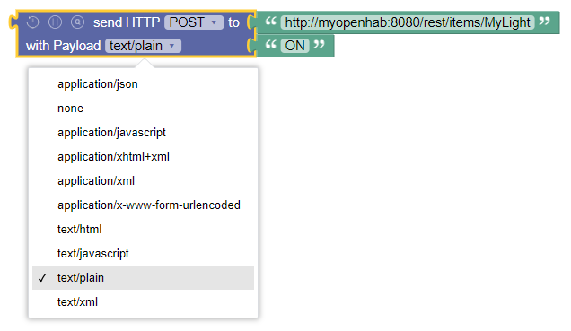

<!-- markdownlint-disable MD036 -->

# HTTP

[return to Blockly Reference](index.html#http)

## Introduction

This section explains the blocks that allow sending HTTP requests.

## HTTP Requests

There is one block that handles all type of requests.
Depending on the required functionality it changes its design.

### Option Toggles

There are two toggle buttons that allow the block to be small for simple requests and add further options to be used:

- Clock: enables the timeout option
- H: stands for header and allows to provide headers during the request via a [Dictionary](rules-blockly-standard-ext.md#dictionary-for-managing-key--value-pairs)

### HTTP Request GET

_Function:_ Send an HTTP GET request to a server and receive the response

The simplest form is shown by default and accepts the destination URI as String.

By activating the toggles the timeout and request headers can be provided.
See the [POST-Request](#http-request-post) below for an example showing these additional fields.

### HTTP Request POST

_Function:_ Send an HTTP POST request to a server and receive the response

The simplest form is shown by default and accepts the destination URI as String and in comparison to the [GET-Request](#http-request-get) adds a section for the payload which takes two parameters:

- the MIME-type of the content to be sent
- the content to be sent to the destination

Here is a more complex example that additionally uses the header and the timeout:

### HTTP Request PUT

_Function:_ Send an HTTP PUT request to a server and receive the response

The simplest form is shown by default and accepts the destination URI as String and is similar in functionality to the [POST-Request](#http-request-post):

- the MIME-type of the content to be sent
- the content to be sent to the destination

### HTTP Request DELETE

_Function:_ Send an HTTP DELETE request to a server and receive the response

The simplest form is shown by default and accepts the destination URI as String.

## Return to Blockly Reference

[return to Blockly Reference](index.html#http)
