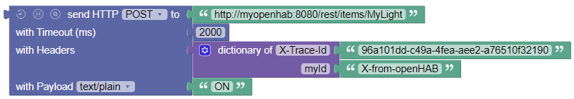

<!-- markdownlint-disable MD036 -->

# HTTP

[return to Blockly Reference](index.html#http)

## Introduction

This section explains the blocks that allow sending HTTP requests.

## HTTP Requests

There is one block that handles all type of requests.
Depending on the required functionality it changes its design.

### Option Toggles

There are three toggle buttons that allow the block to be small for simple requests and add further options to be used:

- Clock: enables the timeout option
- H: enables the header option and allows to provide headers during the request via a [Dictionary](rules-blockly-standard-ext.md#dictionary-for-managing-key--value-pairs)
- Q: enables the query option and allows to provide URI query parameters during the request via a [Dictionary](rules-blockly-standard-ext.md#dictionary-for-managing-key--value-pairs), the query parameters will be URI encoded

**Query Parameters** are used to provide additional information to the server, for example, to filter results or specify options for the request.
These are typically provided in the URI as key-value pairs, like `?key1=value1&key2=value2`.
Instead of manually constructing the URI with query parameters, you can use the query option to provide a [Dictionary](rules-blockly-standard-ext.md#dictionary-for-managing-key--value-pairs) of query parameters, which will be automatically URI encoded.

### HTTP Request GET

_Function:_ Send an HTTP GET request to a server and receive the response

The simplest form is shown by default and accepts the destination URI as String, e.g., GET `http://openhab.org.
See below for an example of a GET request with query parameters (like`<http://example.com/api?param1=value1&param2=value2`>).

By activating the toggles the timeout, request headers and query parameters can be provided.
Instead of creating a URI containing the query parameters, you can use the query parameter option and provide a [Dictionary](rules-blockly-standard-ext.md#dictionary-for-managing-key--value-pairs) of query parameters.
The provided parameters will automatically be URI encoded.

Here is an example also using a query parameter.

Another example shows how several query parameters can be provided using a [Dictionary](rules-blockly-standard-ext.md#dictionary-for-managing-key--value-pairs):

If you want to send a request with parameters like `http://example.com/api?param1=value1&param2=value2`, the request can be constructed as follows:

- URI: <http://example.com/api> with two query parameters `param1` and `param2`
  - where `param1` has a value that contains special characters, like `EncodedValueWithSpecialCharacters->!`
  - and `param2` has a value of `value2`

you can use the following block:

which results in the following request:

> <http://example.com/api?param1=EncodedValueWithSpecialCharacters-%3E!&param2=value2>

See the [POST-Request](#http-request-post) below for an example showing the use additional fields.

### HTTP Request POST

_Function:_ Send an HTTP POST request to a server and receive the response

The simplest form is shown by default and accepts the destination URI as String and in comparison to the [GET-Request](#http-request-get) adds a section for the payload which takes two parameters:

- the MIME-type of the content to be sent
- the content to be sent to the destination

For MIME-type `application/json` you can provide an object as content, and it will be converted to a JSON string.
For `application/x-www-form-urlencoded`, you can provide a [Dictionary](rules-blockly-standard-ext.md#dictionary-for-managing-key--value-pairs) and it will be URI encoded.

Here is a more complex example that additionally sets a header and a timeout:

### HTTP Request PUT

_Function:_ Send an HTTP PUT request to a server and receive the response

The simplest form is shown by default and accepts the destination URI as String and is similar in functionality to the [POST-Request](#http-request-post):

- the MIME-type of the content to be sent
- the content to be sent to the destination

Notice the construction of an object with a [Dictionary](rules-blockly-standard-ext.md#dictionary-for-managing-key--value-pairs) also containing a List for the JSON payload.

### HTTP Request DELETE

_Function:_ Send an HTTP DELETE request to a server and receive the response

The simplest form is shown by default and accepts the destination URI as String.

## Return to Blockly Reference

[return to Blockly Reference](index.html#http)
