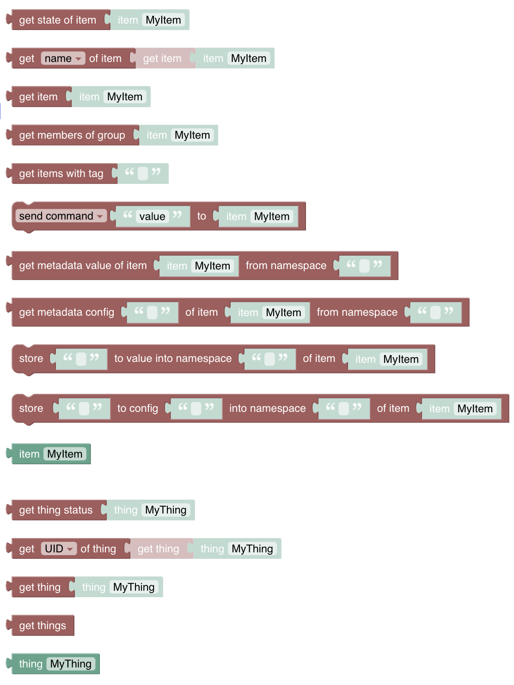

<!-- markdownlint-disable MD036 -->

# Item & Things

[return to Blockly Reference](index.html#items-and-things)

## Introduction

*Items* and *Things* are the [major entities of openHAB](https://www.openhab.org/docs/concepts/) to control and monitor the home.
These can be accessed via the "Items & Things" section of the [Blockly Toolbox](/docs/configuration/index.html#blockly-toolbox).

{::options toc_levels="2..4"/}

- TOC
{:toc}

{: #blockly-items-and-things-overview}

## Overview of the Items and Things category

> 

### Item and Thing Blocks

Most of the time you will want to get and set the state of an *item* - set a switch to ON, or get a temperature.
Sometimes you may want to access the *thing* directly.
Both are possible using the item-block and thing-block

> 

However, **these blocks are not useful by themselves** - they are always used together with another block.
The example below uses the *get state of item* block to retrieve the *MainSwitch* *item* state, before checking if that is equal to ON within a standard comparison block


## Items

### Item


Function: Retrieves a specific **Item** or **Group** for use in other item related functions.

- **Tip:** never use this block alone as it only returns the items name which alone does not make sense.
Instead use the get-Item-Block below.
- Clicking 'MyItem' displays a list of **Items** to pick from
- Technically this block returns the *name* of the item as a String.
- As a result, this block can be used wherever the item name is required as a String.
- Learn more about items [here](https://www.openhab.org/docs/configuration/items.html)

### Get Item


Function: Gets an **Item** for use in other item related functions

- Clicking 'MyItem' displays a list of **Items** to pick from.
- Technically this block returns an item *object*, to be used to retrieve specific attributes using other blocks (see below).
- As this block does not return a String it cannot be directly attached to a log-block, as demonstrated below.
  - **Tip:** Often you do want to retrieve the state, hence use the "Get State of Item"-block below
  - The block returns the item itself.
If you want to log the items information you can assign it to a variable first and the log the variable.


### Get State of Item


Function: Get the current state of an **Item** or **Group**

- Returns the [state](https://www.openhab.org/docs/configuration/items.html#state) of an item like ON/OFF, the temperature value etc.

Note that most of the states can and will be directly **converted automatically to a String** but be careful that some of the **more complex states may instead return a complex object instead**.

**Tip:** it is recommended in this case to assign this to a variable and use the "String-Append-Text" with an empty "" to convert it into a String for further processing.

See the [Item-State documentation](https://www.openhab.org/docs/configuration/items.html#state) for more information

Note: currently a String is not always returned.
[See this thread](https://community.openhab.org/t/blockly-cannot-split-text-string-from-string-item/130819) for reference and potential workaround.

### Get Members of Group


Function: Gets the members of a **group**

- returns a collection of items which should be used with a for-each-block to loop over the items
- it can be attached to a log-block which would list all items in that block in the form a string representation as follows

```json
GF_IndirectLights (Type=GroupItem, BaseType=SwitchItem, Members=9, State=OFF, Label=Indirekten Lichter, Category=light, Tags=[Lightbulb], Groups=[Lights]),LichterOG (Type=GroupItem, BaseType=SwitchItem, Members=4, State=ON, Label=Lichter OG, Category=light, Groups=[Lights]),LichterEG (Type=GroupItem, BaseType=SwitchItem, Members=5, State=ON, Label=Lichter EG, Category=light, Groups=[Lights])
```

- Alternatively you can use the item block var the loop variable to send a command to the items of the group

The following example depicts the above possibilities:


### Get particular attributes of an item


Function: Get either the current name, label, state, category, tags, groups, or type of an item as a String

These attributes are returned with the following types:

- name: String
- label: String
- state: State
- category: String
- tag: Array, e.g.

```json
[plannedTimes]
```

- groups: Array, e.g.

```json
[plannedTimes, timers]
```

- type: String

Depending on your openHAB version (pre-3.3) this block may not connect as expected.
As a workaround attach the block to a variable first, and use the variable in the rest of the script.


**Special handling for Arrays**

The attributes *groups* and *tags* return an Array of entries.
Therefore

- they *cannot* be connected to a block that expects a String (e.g. log-block)
- they *must* be handled using a for-loop as follows


### Send Command


Function: Sends a command or posts an update to an **Item** or **Group**.

- value: any state value that is allowed for that item, eg. ON or OFF for a switch.
- Clicking 'MyItem' displays a list of **Items** to pick one item from

For the difference between *send command* and *post update* see ["Manipulating States"](https://www.openhab.org/docs/configuration/rules-dsl.html#manipulating-item-states) and ["Event Bus Actions"](https://www.openhab.org/docs/configuration/actions.html#event-bus-actions).

**Item-block examples**

**Example 1:**

- Check if *MainSwitch* is ON.
- If ON, send ON command to *livingroomLight* item.


**Example 2:**

- Get the state of *MainSwitch* and
- Immediately send it as a command to *F2_Office_Main_Light*


Ensure that the receiving item can handle the state of the 'sending' item.

## Things

### Thing


Function: Retrieves a specific **Thing** for use in other thing related functions.

- Clicking 'MyThing' displays a list of **Things** to pick from
- Technically this block returns the thingUid of the thing as a String
- Learn more about [things](https://www.openhab.org/docs/configuration/things.html) or [thing-concepts](https://www.openhab.org/docs/concepts/things.html)

**Example**


will write the following into the log

```text
thing name = nanoleaf:controller:645E3A484A83
```

### Get Thing Status


Function: Gets a **Thing Status** for use in other Thing related functions

- Clicking 'MyThing' displays a list of **Things** to pick from.
- Technically this block returns a [ThingStatus](https://www.openhab.org/docs/concepts/things.html#thing-status)  - a String with one of the following statuses
  - UNINITIALIZED
  - INITIALIZING
  - UNKNOWN
  - ONLINE
  - OFFLINE
  - REMOVING
  - REMOVED

## Return to Blockly Reference

[return to Blockly Reference](index.html#items-and-things)
