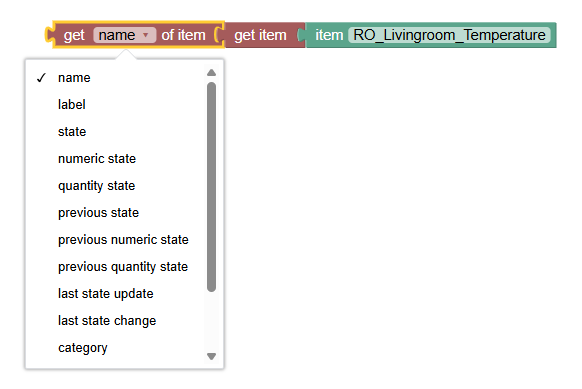

<!-- markdownlint-disable MD036 -->

# Item & Things

[return to Blockly Reference](index.html#items-and-things)

## Introduction

_Items_ and _Things_ are the [major entities of openHAB](https://www.openhab.org/docs/concepts/) to control and monitor the home.
These can be accessed via the "Items & Things" section of the [Blockly Toolbox](/docs/configuration/index.html#blockly-toolbox).

[[toc]]

## Overview of the Items and Things category

> 

### Item and Thing Blocks

Most of the time you will want to get and set the state of an _item_ - set a switch to ON, or get a temperature.
Sometimes you may want to access the _thing_ directly.
Both are possible using the item-block and thing-block

> 

However, **these blocks are not useful by themselves** - they are always used together with another block.
The example below uses the _get state of item_ block to retrieve the _MainSwitch_ _item_ state, before checking if that is equal to ON within a standard comparison block


## Items

See a video introduction at  [Working with Items](https://youtu.be/EdllUlJ7p6k?t=790)

### Item


Function: Retrieves a specific **Item** or **Group** for use in other item related functions.

:::tip

never use this block alone as it only returns the items name which alone does not make sense.
Instead use the get-Item-Block below.

:::

- Clicking 'MyItem' displays a list of **Items** to pick from
- Technically this block returns the _name_ of the item as a String.
- As a result, this block can be used wherever the item name is required as a String.
- Learn more about items [here](https://www.openhab.org/docs/configuration/items.html)

### Get Item


Function: Gets an **Item** for use in other item related functions

- Clicking 'MyItem' displays a list of **Items** to pick from.
- Technically this block returns an item _object_, to be used to retrieve specific attributes using other blocks (see below).
- In openHAB3 this block does not return a String, so it cannot be directly attached to a log-block, as demonstrated below.
  - **Tip:** Often you do want to retrieve the state, hence use the "Get State of Item"-block below
  - The block returns the item itself.


### Get State of Item


Function: Get the current state of an **Item** or **Group**

- Returns the [state](https://www.openhab.org/docs/configuration/items.html#state) of an item like ON/OFF, the temperature value etc.

Note that most of the states can and will be directly **converted automatically to a String** but be careful that some of the **more complex states may instead return a complex object instead**.

:::tip

it is recommended in this case to assign this to a variable and use the "String-Append-Text" with an empty "" to convert it into a String for further processing.

:::

See the [Item-State documentation](https://www.openhab.org/docs/configuration/items.html#state) for more information

Note: currently a String is not always returned.
[See this thread](https://community.openhab.org/t/blockly-cannot-split-text-string-from-string-item/130819) for reference and potential workaround.

### Get Members of Group


Function: Gets the members of a **group**

- returns a collection of items which should be used with a for-each-block to loop over the items
- it can be attached to a log-block which would list all items in that block in the form a string representation as follows

**Hint**: Make sure you are using [typed variables](./index.html#using-variables)!

```json
GF_IndirectLights (Type=GroupItem, BaseType=SwitchItem, Members=9, State=OFF, Label=Indirekten Lichter, Category=light, Tags=[Lightbulb], Groups=[Lights]),LichterOG (Type=GroupItem, BaseType=SwitchItem, Members=4, State=ON, Label=Lichter OG, Category=light, Groups=[Lights]),LichterEG (Type=GroupItem, BaseType=SwitchItem, Members=5, State=ON, Label=Lichter EG, Category=light, Groups=[Lights])
```

- Alternatively you can use the item block var the loop variable to send a command to the items of the group

The following example depicts the above possibilities:


### Get Items with Tag


Function: Gets all items with the given tags which you can iterate over via a loop

- returns a collection of items which have the given tags
- multiple tags can be provided which then need to be separated with a comma
- if multiple tags are given, the item must have all of the tags ("and"-condition)

**Hint**: Make sure you are using [typed variables](./index.html#using-variables)!

:::tip

If you need an item that has one of multiple tags, then you need to use one block of each and then use the ["concatenate list block"](https://www.openhab.org/docs/configuration/blockly/rules-blockly-standard-ext.html#concatenate-list) to combine the results.

:::

### Get particular attributes of an Item



Function: Get either the current name, label, state, category, tags, groups, or type of an item as a String

It requires an [item object](#get-item) to be connected.

These attributes are returned with the following types:

- name: String
- label: String
- state: State
- numeric state: Number
- quantity state: [Quantity](rules-blockly-uom.html#unit-of-measurement-blocks)
- previous state: State
- previous numeric state: Number
- previous quantity state: [Quantity](rules-blockly-uom.html#unit-of-measurement-blocks)
- last state update: ZonedDateTime
- last state change: ZonedDateTime
- category: String
- tags: Array, e.g.

```json
[plannedTimes]
```

- groups: Array, e.g.

```json
[plannedTimes, timers]
```

- type: String


**Simplified usage**

Since openHAB 4.1 an optimization was introduced that simplifies the usage:


It allows to attach the item block directly instead of having to use the intermediate getItem-Block.
Internally Blockly detects the added type and applies the right code generation.

_Use typed variables:_

Due to the fact that Blockly provides untyped variables it is then not able to detect the type of the value that has been assigned to a variable which may result into unexpected behaviour.
Therefore, always use a [typed variable](./index.html#using-variables) instead

**Special handling for Arrays**

The attributes _groups_ and _tags_ return an Array of entries.
Therefore

- they _cannot_ be connected to a block that expects a String (e.g. log-block)
- they _must_ be handled using a for-loop as follows


- See more infos in the section about [typed variables](./index.html#using-variables)!

### Send Command


Function: Sends a command or posts an update to an **Item** or **Group**.

- value: any state value that is allowed for that item, eg. ON or OFF for a switch.
- Clicking 'MyItem' displays a list of **Items** to pick one item from

For the difference between _send command_ and _post update_ see ["Manipulating States"](https://www.openhab.org/docs/configuration/rules-dsl.html#manipulating-item-states) and ["Event Bus Actions"](https://www.openhab.org/docs/configuration/actions.html#event-bus-actions).

More about that topic can be viewed at  [Sending Commands](https://youtu.be/EdllUlJ7p6k?t=1077)

**Item-block examples**

**Example 1:**

- Check if _MainSwitch_ is ON.
- If ON, send ON command to _livingroomLight_ item.


**Example 2:**

- Get the state of _MainSwitch_ and
- Immediately send it as a command to _F2_Office_Main_Light_


Ensure that the receiving item can handle the state of the 'sending' item.

## Item Metadata

The **metadata blocks**  provide an easy way of accessing namespace metadata information both for reading and writing.
Accessing config metadata on hierarchical levels as well as variable support that allows iteration over computed names is supported (see the examples below).

Note: Metadata blocks are not available for Nashorn but only for GraalJS / JS Scripting.

Here is an _expire_ metadata definition which is visualized as


and modelled in YAML as

```yaml
value: 0h3m0s
config:
  ignoreStateUpdates: "true"
  ignoreCommands: "true"
with the blocks that can access it:


There a two different type of blocks:
The value block is the main one for the _value_ of the namespace, which is also directly shown in the MainUI's list of an item's metadata, while the _config_ part holds more complex configuration of that metadata structure below the entry _config_.

The following blocks allow to _change_ the config values in the namespace _expire_:


Here is a definition of a more complex metadata namespace:

```yaml
value: ON
config:
  ooone: "123"
  oone:
    two: "456"
  one:
    two:
      three: "756"
  field1: 1
  field2: 2
  field3: 3
```

which allows deep hierarchy property access via a configkey-dot-notation like `one.two.three`


Using variables and loops properties like field1, field2, field3 can even be accessed in a computed way:


## Things

### Thing


Function: Retrieves a specific **Thing** for use in other thing related functions.

- To be specific this only provides a thing picker that provides the ID of that thing (and not the thing object itself that holds several properties)
- Clicking 'MyThing' displays a list of **Things** to pick from
- Technically this block returns the thingUid of the thing as a String
- Learn more about [things](https://www.openhab.org/docs/configuration/things.html) or [thing-concepts](https://www.openhab.org/docs/concepts/things.html)

**Example**


will write the following ID of the thing into the log

```text
thing name = nanoleaf:controller:645E3A484A83
```

### Get Thing


Function: Gets a **Thing** for use in other thing related functions

- Clicking 'MyThing' displays a list of **Things** to pick from.
- Technically this block returns a thing _object_, to be used to retrieve specific attributes using other blocks (see below).

### Get Thing Status


Function: Gets the **Thing Status**

- Clicking 'MyThing' displays a list of **Things** to pick from.
- Technically this block returns a [ThingStatus](https://www.openhab.org/docs/concepts/things.html#thing-status)  - a String with one of the following statuses
  - UNINITIALIZED
  - INITIALIZING
  - UNKNOWN
  - ONLINE
  - OFFLINE
  - REMOVING
  - REMOVED

### Get particular attributes of a Thing


Function: Get particular attributes of a Thing

It requires a [thing object](#get-thing) to be connected.

These attributes are returned with the following types:

- UID (unique Thing ID): String
- label: String
- status (like ONLINE/OFFLINE): String
- status info (status plus further info like "light not reachable"): String
- location: String
- thing type UID (unique ID of the Thing type): String
- bridge UID (unique ID of the Bridge): String

### Get Things

Function: Gets all things and returns a list of [Thing-Objects](#get-thing).


The following loop iterates over all things and logs out the status.
Note that it uses a [typed variable](./index.html#using-variables) for that.


## Return to Blockly Reference

[return to Blockly Reference](index.html#items-and-things)
