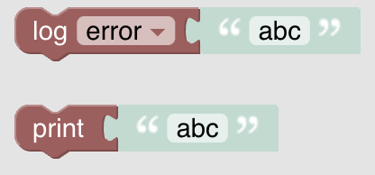
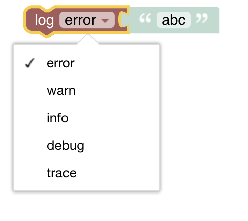

<!-- markdownlint-disable MD036 -->

# Logging

[Return to Blockly Reference](index.html#logging)

## Introduction

This section explains only the blocks that have been added to the standard blocks by openHAB

[[toc]]

## Logging and Output

These blocks enable arbitrary content to be published to the [openHAB log](https://www.openhab.org/docs/administration/logging.html).

More about that topic can be viewed at  [Logging](https://youtu.be/EdllUlJ7p6k?t=670)

### Log Statement

_Function:_ Sends an entry to the openHAB log file with a defined severity level.

- A [severity level](https://www.openhab.org/docs/administration/logging.html#defining-what-to-log) can be provided via the dropdown list for the log statement

  - error
  - warn
  - info
  - debug
  - trace

Since 3.3: The block attached to the log-block is not restricted to a string type block anymore

### Print Statement

_Function:_ creates a print statement with the given text in the rule that logs to _stdout_

## Return to Blockly Reference

[Return to Blockly Reference](index.html#logging)
