<!-- markdownlint-disable MD036 -->

# Notifications

[return to Blockly Reference](index.html#notifications)

## Introduction

By using your [openHAB Cloud](https://www.openhab.org/addons/integrations/openhabcloud/) account, these blocks can be used to send notifications to relevant connected mobile devices.
Notifications can be used as push message to devices running the openHAB client.
The reason why this is done via the openHAB cloud is that it allows to send notifications via Apple's and Google's push notification services, which is the only way to reliably send notifications to mobile devices as openHAB's cloud is a trusted source for both.

General information on cloud notification actions can be found at [Actions: Cloud Notification Actions](https://www.openhab.org/docs/configuration/actions.html#cloud-notification-actions).

[[toc]]

## Overview of the Notification blocks

The main block provides a very comprehensive way to send notifications to the openHAB mobile app.
Notifications can also be viewed at <https://myopenhab.org/notifications>

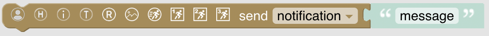

The following four blocks work as additional options to the notification block.

### Label / Action combination blocks

These blocks allow to create a notification with labeled button and an action that is executed when the button is clicked.

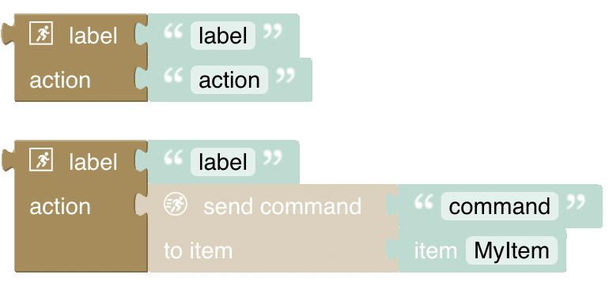

### Action support blocks

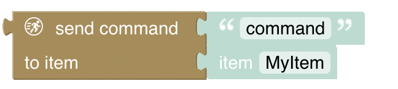
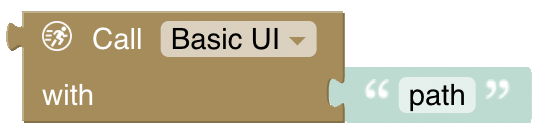

### Hide Notification

The last block allows hiding a notification based on a reference or a tag that was provided to the original notification.

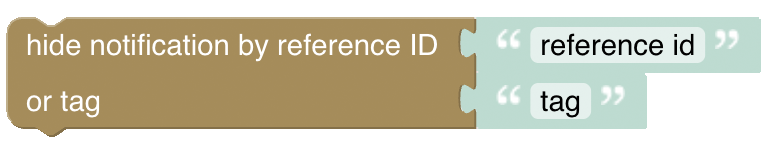

## Send Notification

As the notification block allows a lot of flexibility, it provides many options to be switched on or off.
Let's, therefore, start with the simplest form of the block by just dragging it into the workspace.
This will create the following block and will send a notification "My message" to all devices and users:

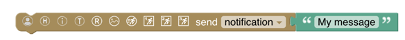

Note that the block can also send to "log" instead of "notification" which sends the message to [myopenhab.org](https://myopenhab.org)'s log only but not to the devices.
In this case:

- This notification is _only_ sent to the openHAB cloud log (for example at <https://myopenhab.org/notifications>), **not the local openHAB log**.
- Notifications are not sent to users' devices.
- Neither the log level nor the icon is shown in the log of the cloud.
- The notification is not logged on the openHAB server!

### Notification Block Options

The block has several icons that allow additional options to be revealed.

- person: send Notification to specific cloud email user
- H: allows specifying a Header Title
- i: allows specifying an icon that should be shown with the notification.
Use the [icon names of the openHAB iconset](https://www.openhab.org/docs/configuration/iconsets/classic/).
- T and R: allow providing a tag and a reference to the notification
- Picture: allows attaching a link to a publicly accessible image URL
- Running person: allows attaching an action to the notification when clicking the notification
- Running person 1 / 2 / 3: allows attaching up to three buttons to the notification which can result in a particular action when clicked

After having clicked on all of these icons, the block will look like this:

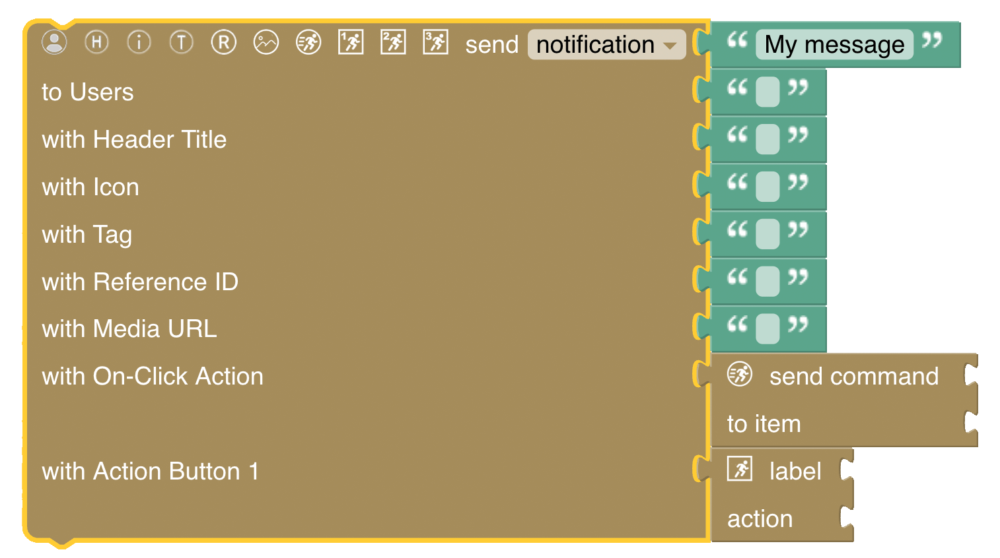

### Send Notification to specific cloud email user

Send a notification to the openHAB mobile app via openHAB cloud to a specific user signed up under the given email address.

- **This block does not use the mail binding**, and it is not possible to send a notification to a user who does not have an openHAB cloud account.
- Notification will only work if devices have the openHAB mobile app installed (either iOS or Android)

if not chosen (unclick the person icon), it will automatically send the notification to all users that are registered with the openHAB cloud service.

### Header Title and Icon

By activating the header title option, the block will allow setting a title for the notification.

By activating the icon option, the block will allow attaching an icon to the message.
To see all icons that can be used, see the table [openHAB icons]({{base}}/configuration/icons.html).

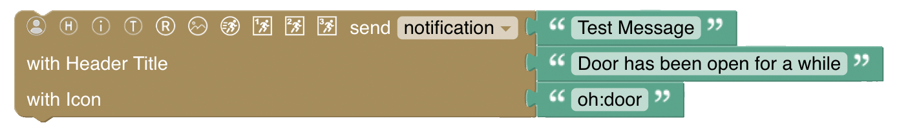

results into

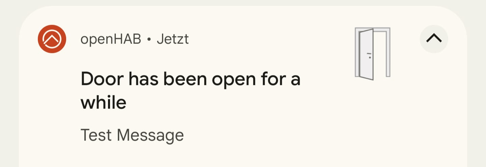

### Tags and Reference

The idea behing tags and references is to allow to group notifications together or make them unique to be identified.
This is in particular useful when you want to hide a notification later on (see the block below).

A good example would be to monitor a window sensor and send a notification when the door has been opened for some time that would result into a notification with a unique reference; a good idea would be to use the name of the window's Item.
Then, when the window is closed again, you can hide the notification by using the unique reference.

Tags on the other hand can be used to group notifications together which would allow hiding all notifications with a specific tag.

### Media URL

By activating the media URL option, the block will allow attaching a publicly accessible image URL to the notification.
The following example also shows that variables can be used to provide blockly information to the notification.
In this case, the user to send the notification to is provided by a variable called `userName`.

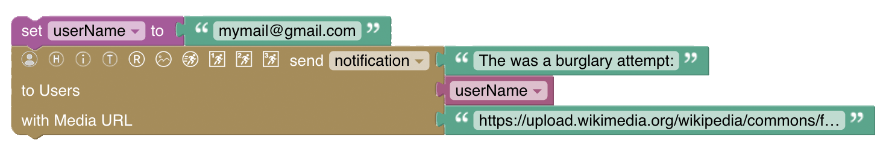

results into

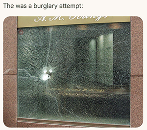

The public media image URL used here has been taken from [Wikimedia](https://upload.wikimedia.org/wikipedia/commons/f/f9/Bulletproof_glass_window_after_a_burglary_attempt.jpg).

### Actions: On-Click Action

When choosing the Person icon, the block will allow attaching an action to the notification.
In general, an openHAB action as specified in [openHAB Cloud Connector: Cloud Notification Actions](/addons/integrations/openhabcloud/#cloud-notification-actions) can be attached to the notification.
If you want to create such an action yourself, you can use just use a Blockly text block to provide the action.

However, this usually isn't recommended as Blockly already provides blocks that allow to create these actions conveniently.

Therefore, when clicking on the action-option by default, it will bring up the following send-command block that still needs to be configured (and might result in an error on saving if not configured).

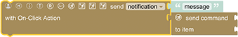

For convenience, it automatically connects a "send command" block to the notification block which requires to be configured (it can be replaced by [open / call Page Block]({{base}}/configuration/blockly/rules-blockly-notifications.html#actions-open-call-page) instead later on):

- The command to be sent, e.g. "ON" or "OFF"
- the Item to send the command to, e.g. "My Light Switch"

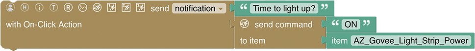

This will result in a notification, but with a special functionality:
When the notification is sent, it will show a button with the text "ON" and when clicked, it will send the command "ON" to the given Item, in this case the configured light.

### Actions: On-Click Button Actions

This is similar to the On-Click Action, but allows to attach up to three buttons to the notification that can be chosen from.
An example would be to send a notification that a windows has been open for some time and then provide the user with the following three options:

- Close the roller shutter
- Remind me in two hours.
- Suspend the notification until the window is closed

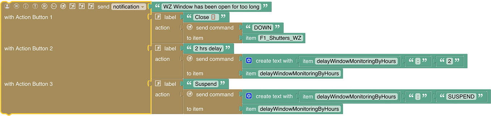

results into a notification that looks like this:

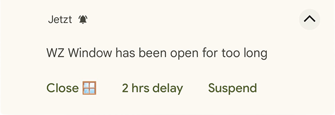

A few notes on the button configuration above:

- The first button sends a DOWN command to the specified roller shutter Item.
- The other two buttons are configured to send a command to a specific virtual String Item which includes a combination of the Item name and what should be done.
There is a rule that listens to that virtual Item, extracts the Item and specific command that has been separated by the colon (e.g., myitem:2 which is interpreted to delay monitoring for that Item by two hours) and processed it accordingly.

**Attach a generic action command**

In case you want to provide your own String-based generic command, you can use the following block instead.
It provides a combination of Label and String action command:

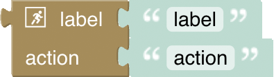

### Actions: Open / Call Page

Instead of sending a command, the notification can also open a specific page in the openHAB mobile app.

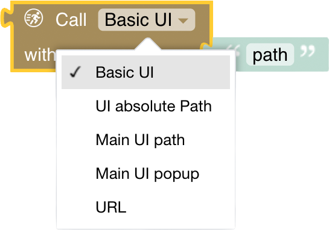

The options are:

- Basic UI: opens the specified Basic UI page
- UI Absolute path: opens the specified UI absolute path
- Main UI: opens the specified Main UI page
- Main UI popup: Allows opening a popup in the Main UI
- URL: opens an arbitrary specified URL

For more information, see [openHAB Cloud Connector: Cloud Notification Actions](/addons/integrations/openhabcloud/#cloud-notification-actions).

Here is an example of a notification that opens the Main UI page "page_rolllaeden" (the rollershutter page) when clicked, so the user can choose which rollershutter(s) to close:

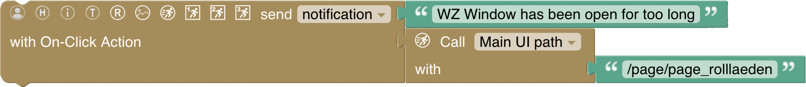

This allows comprehensive action options for the user in case a notification requires multiple user interaction options that cannot be easily provided by the notification buttons.

## Hide Notification

The last block allows hiding a notification that has been sent before.
A notification can be either hidden by providing a tag or a reference.
A tag can be used to hide all notifications that have been sent with the same tag.
A reference can be used to hide a specific notification that has been sent with the same unique reference.

Usually, hiding a notification is done when the condition that has triggered the notification is no longer valid, e.g. a window that has been open for some time is now closed again.

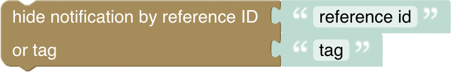

Tip: A good convention is to use the Item name as reference in the original notification, so you can hide the notification when the Item changes state, e.g. a window sensor that has been open for some time and then closed again.

## Return to Blockly Reference

[return to Blockly Reference](index.html#notifications)
