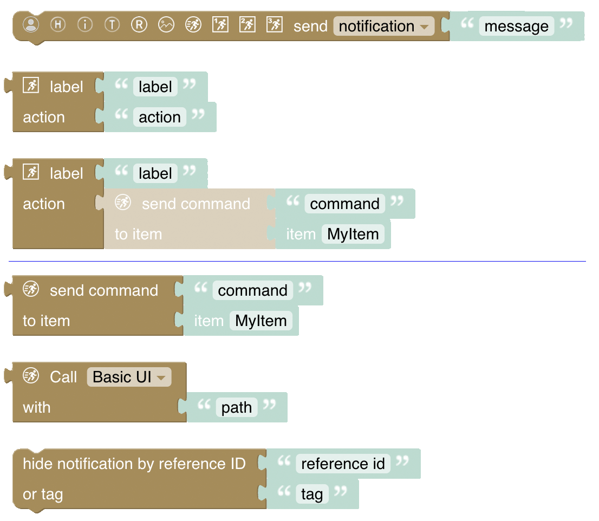

# Notifications
[return to Blockly Reference](index.html#notifications)

## Introduction

For use with your [openHAB cloud](https://www.openhab.org/addons/integrations/openhabcloud/) account, these blocks can be used to send notifications to relevant connected devices. Notifications can be used as push message to devices running the openHAB client.

General information on cloud notification actions can be found [here](https://www.openhab.org/docs/configuration/actions.html#cloud-notification-actions).

{::options toc_levels="2..4"/}

- TOC
{:toc}

{: #blockly-notifications-overview}

## Overview of the Notification blocks

## Notification Blocks

### Send Notification to specific cloud email user

*Function:* Sends a notification to the openHAB mobile app via openHAB cloud to a specific user signed up under the given email address

* **This block does not use the mail binding**, and it is not possible to send a notification to a user who does not have an openHAB cloud account.
* Notification will only work if devices have the openHAB mobile app installed (either iOS or Android)

### Send Notification to All Devices and users

*Function:* Sends a notification to all devices and all users to the openHAB mobile app.

Example Push Message shown under Android:

* A message can be provided together with an icon that should be shown on the device. Use the [icon names of the openHAB iconset](https://www.openhab.org/docs/configuration/iconsets/classic/).
* The notification can also be viewed at https://myopenhab.org/notifications

### Send Notification to Log Only

*Function:* Sends a notification to myopenhab.org only

* This notification is *only* sent to the openHAB cloud log (for example at https://myopenhab.org/notifications), **not the local openHAB log**.
* Notifications are not sent to users' devices.
* For the time being neither the log level nor the icon is shown in the log of the cloud
* The notification is not logged on the openhab server

## Return to Blockly Reference

[return to Blockly Reference](index.html#notifications)
