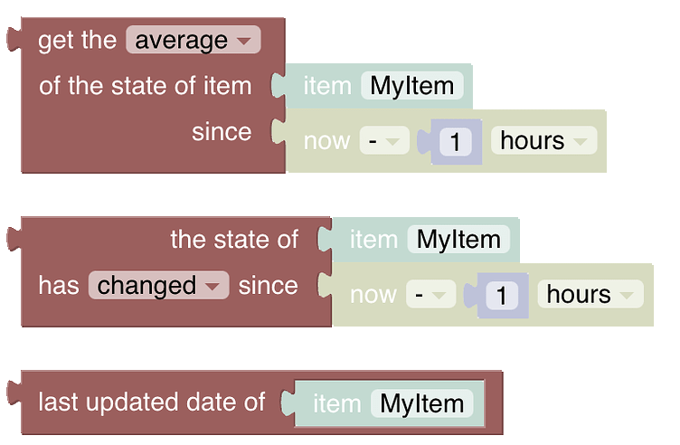
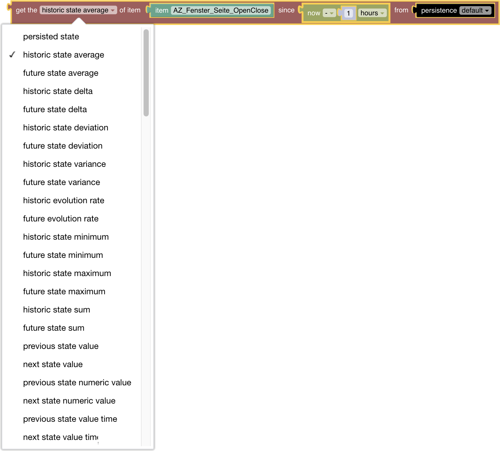
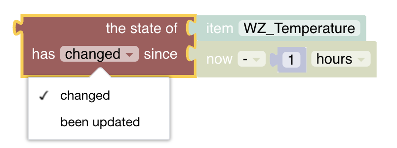

# Persistence

[return to Blockly Reference](index.html#persistence)

## Introduction

Persistence blocks enable access to and manipulation of historical data stored by the default persistence service.
For more information on persistence, the default service, and its configuration see the [persistence documentation](https://www.openhab.org/docs/configuration/persistence.html).

The date-blocks shown in this section are described previously in [Date handling blocks](https://community.openhab.org/t/blockly-reference/128785#date-handling-blocks-31).

{::options toc_levels="2..4"/}

- TOC
{:toc}

{: #blockly-persistence-overview}

## Overview of the Persistence blocks

## Persistence Blocks

Persistence blocks enable access of historical data stored by the default persistence service.
For more information on persistence, the default service, and its configuration see the [persistence documentation](https://www.openhab.org/docs/configuration/persistence.html).

The date-blocks shown in this section are described previously in [Date handling blocks](https://community.openhab.org/t/blockly-reference/128785#date-handling-blocks-31).

### Get statistical value of an item

*Function:* computes any of the below functions for the given item since the time provided by *ZonedDateTime*-Block

- average: gets the average value of the State of a persisted Item since a certain point in time.
This method uses a time-weighted average calculation
- delta: gets the difference in value of the State of a given Item since a certain point in time
- deviation: gets the standard deviation of the state of the given Item since a certain point in time
- variance: gets the variance of the state of the given item since a certain point in time
- evolution rate: gets the evolution rate of the state of the given Item in percent since a certain point in time (may be positive or negative)
- minimum: gets the minimum value of the State of the given Item since a certain point in time
- maximum: gets the maximum value of the State of the given Item since a certain point in time
- maximum: gets the sum of the State of the given Item since a certain point in time

Note:  in case no or 0 values are retrieved, make sure that the item in question is actually persisted.

### Check item change / update since a point in time

*Function:* checks if an item was updated or changed since a certain point in time
Type: boolean `true` or `false`

### Provide last updated date of an Item

*Function:* Provides the last updated date (including time) of an Item
Type: ZonedDateTime

## Return to Blockly Reference

[return to Blockly Reference](index.html#persistence)
