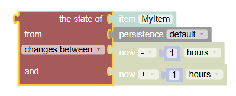

<!-- markdownlint-disable MD036 -->

# Persistence

[return to Blockly Reference](index.html#persistence)

## Introduction

Persistence blocks enable access to and manipulation of historical data stored by the default persistence service.
For more information on persistence, the default service, and its configuration see the [persistence documentation](https://www.openhab.org/docs/configuration/persistence.html).

The date-blocks shown in this section are described previously in [Date handling blocks](https://community.openhab.org/t/blockly-reference/128785#date-handling-blocks-31).

[[toc]]

## Overview of the Persistence blocks

## Persistence Blocks

Persistence blocks enable access of historical data stored by the default persistence service.
For more information on persistence, the default service, and its configuration see the [persistence documentation](https://www.openhab.org/docs/configuration/persistence.html).

The date-blocks shown in this section are described in [Date handling blocks](https://community.openhab.org/t/blockly-reference/128785#date-handling-blocks-31).

More about that topic can be viewed at  [Using Persistence data](https://youtu.be/KwhYKy1_qVk?t=1440)

### Get statistical value of an item

_Function:_ computes any of the below functions for the given item since the time provided by _ZonedDateTime_-Block, until the time provided by _ZonedDateTime_-Block, or between 2 timepoints provided by _ZonedDateTime_-Blocks.

openHAB supports history and future values.
A typical example for future values is a weather forecast.

For each of the functions, you can choose the output type:

- String: output as a string value
- Quantity: output as a quantity type with unit
- Number: output as a number
- Timestamp: time of the persisted value (when applicable)

**Important:** **Due to a breaking change of the internal methods in openHAB 4.2, Blockly rules that use persistence methods need to be migrated once.**
This does not happen automatically but needs to be done opening the blockly rule once and re-save it.
Blockly then automatically rewrites the rule to be compatible.
When opening the rule, you will be warned it has been created using an older version.

Values:

- persisted state: gets the persisted state at a certain point in time (can be historic or future)

The following values are available as _historic_, _future_ and _between_ representations.

- average: gets the average value of the State of a persisted Item.
This method uses a time-weighted average calculation
- median: gets the median value of the State of a persisted Item
- delta: gets the difference in value of the State of a given Item
- deviation: gets the standard deviation of the state of the given Item
- variance: gets the variance of the state of the given item
- evolution rate: gets the evolution rate of the state of the given Item in percent (may be positive or negative)
- minimum: gets the minimum value of the State of the given Item
- maximum: gets the maximum value of the State of the given Item
- Riemann sum: gets a Riemann sum of the states of the given Item.
This is an approximation of the integral of a continuous function represented by discrete values.
- sum: gets the sum of the State of the given Item
- state updates count: gets the count of State updates of the given Item
- state changes count: gets the count of State changes of the given Item
- all states: gets all States of the given Item

Some statistical values using time-weighted averages (Riemann sum, average, variance, deviation) have an extra parameter representing the approximation type for the calculation.
Possible values are `left`, `right`, `trapezoidal` or `midpoint`.
For more information, see: [Time-weighted calculations - Riemann Sums]({{base}}/configuration/persistence.html#time-weighted-calculations-riemann-sums)

In the case of the following two functions the block changes its appearance by replacing the time with an option to chose if the equal value should be skipped or not:

- previous state value: gets the previous state with option to skip to different value as current
- next state value: gets the next state with option to skip to different value as current

The persistence dropdown allows to select the persistence storage from which the value should be retrieved.
It automatically shows only the storage types that are currently installed on your openHAB instance.

Note that not all persistence storage types (i.e. the default rrd4j) support all statistical methods.

The **skip option** set to true allows to search for first state that is different from the current state.

_Important:_ This option is not supported by all persistence databases and may throw an error in that case (for example the standard rrd4j does _not_ support it while influxdb does support it).

Notes: in case no or 0 values are retrieved, make sure that the item in question is actually persisted.

**Previous State Example**

### Check item change / update

_Function:_ checks if an item was updated or changed since the time provided by _ZonedDateTime_-Block, will be updated or changed until the time provided by _ZonedDateTime_-Block, or between 2 timepoints provided by _ZonedDateTime_-Blocks.

Type: boolean `true` or `false`

### Provide last or next updated or changed date of an Item

_Function:_ Provides the last or next updated or changed date (including time) of an Item
Type: ZonedDateTime

### Persist State or States for an Item

Persist State or States for an Item.

Multiple options are available:

- state (at current time): persist given State at the current time

Following options are not supported by all persistence services (for example the standard rrd4j does _not_ support this).

- state (at specific time): persist given State at given time
- list of states (adding): persist list of States, not replacing the already persisted States.
- list of states (replacing): persist list of States, replacing the already persisted States in the same time period

As an example for persisting a list of States, one could calculate timephased future values such as expected electricity availability below a specific price point from multiple inputs, and store these in one operation as a future timeseries.
The adding operation would keep what is already in persistence, while the replacing operation would replace anything already in persistence for the item between the first and last timestap in the series.
With a forecast persistence strategy, these future persisted values of the item would become actual values as time moves forward.

The _list of states_ input is a Blockly _List_ of _List_.
The inner _List_ represent pairs of time provided by a _ZonedDateTime_-Block and a _String_ representation of the State.

### Remove all States for an Item

Remove all States for an Item since the time provided by _ZonedDateTime_-Block, until the time provided by _ZonedDateTime_-Block, or between 2 timepoints provided by _ZonedDateTime_-Blocks..

This is not supported by all persistence services (for example the standard rrd4j does _not_ support this).

## Return to Blockly Reference

[return to Blockly Reference](index.html#persistence)
