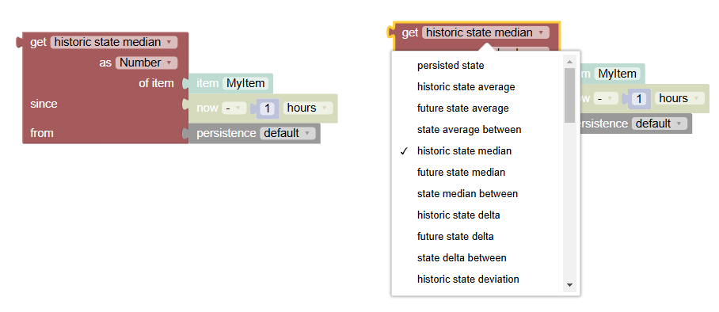

<!-- markdownlint-disable MD036 -->

# Persistence

[return to Blockly Reference](index.html#persistence)

## Introduction

Persistence blocks enable access to and manipulation of historical data stored by the default persistence service.
For more information on persistence, the default service, and its configuration see the [persistence documentation](https://www.openhab.org/docs/configuration/persistence.html).

The date-blocks shown in this section are described previously in [Date handling blocks](https://community.openhab.org/t/blockly-reference/128785#date-handling-blocks-31).

[[toc]]

## Overview of the Persistence blocks

## Persistence Blocks

Persistence blocks enable access of historical data stored by the default persistence service.
For more information on persistence, the default service, and its configuration see the [persistence documentation](https://www.openhab.org/docs/configuration/persistence.html).

The date-blocks shown in this section are described in [Date handling blocks](https://community.openhab.org/t/blockly-reference/128785#date-handling-blocks-31).

More about that topic can be viewed at  [Using Persistence data](https://youtu.be/KwhYKy1_qVk?t=1440)

### Get statistical value of an item

_Function:_ computes any of the below functions for the given item since the time provided by _ZonedDateTime_-Block

openHAB supports history and future values.
A typical example for future values is a weather forecast.
Due to adding future values in openHAB the amount of attributes has been vastly increased and the names had to be renamed to become more specific in terms of historic and future states.

**Important:** **Due to a breaking change of the internal methods in openHAB 4.2, Blockly rules that use persistence methods need to be migrated once.**
This does not happen automatically but needs to be done opening the blockly rule once and re-save it.
Blockly then automatically rewrites the rule to be compatible.

Values:

The following values are available as _historic_ and _future_ representations.

- persisted state: gets the persisted state at a certain point in time
- average: gets the average value of the State of a persisted Item since a certain point in time.
This method uses a time-weighted average calculation
- delta: gets the difference in value of the State of a given Item since a certain point in time
- deviation: gets the standard deviation of the state of the given Item since a certain point in time
- variance: gets the variance of the state of the given item since a certain point in time
- evolution rate: gets the evolution rate of the state of the given Item in percent since a certain point in time (may be positive or negative)
- minimum: gets the minimum value of the State of the given Item since a certain point in time
- maximum: gets the maximum value of the State of the given Item since a certain point in time
- sum: gets the sum of the State of the given Item since a certain point in time

In the case of the following two functions the block changes its appearance by replacing the time with an option to chose if the equal value should be skipped or not:

- previous state value: Gets the previous state with option to skip to different value as current
- next state value: Gets the next state with option to skip to different value as current
- previous state numeric value: same as above but directly returns a number without a unit
- previous state value time: Gets the time when previous state last occurred with option to skip to different value as current
- next state value time: Gets the time for which the next state is available with option to skip to different value as current

The persistence dropdown allows to select the persistence storage from which the value should be retrieved.
It automatically shows only the storage types that are currently installed on your openHAB instance.

Note that not all persistence storage types (i.e. the default rrd4j) support all statistical methods.

The **skip option** set to true allows to search for first state that is different from the current state.

_Important:_ This option is not supported by all persistence databases and may throw an error in that case (for example the standard rrd4j does _not_ support it while influxdb does support it).

Notes: in case no or 0 values are retrieved, make sure that the item in question is actually persisted.

**Previous State Example**

### Check item change / update since a point in time

_Function:_ checks if an item was updated or changed since a certain point in time
Type: boolean `true` or `false`

### Provide last updated date of an Item

_Function:_ Provides the last updated date (including time) of an Item
Type: ZonedDateTime

## Return to Blockly Reference

[return to Blockly Reference](index.html#persistence)
