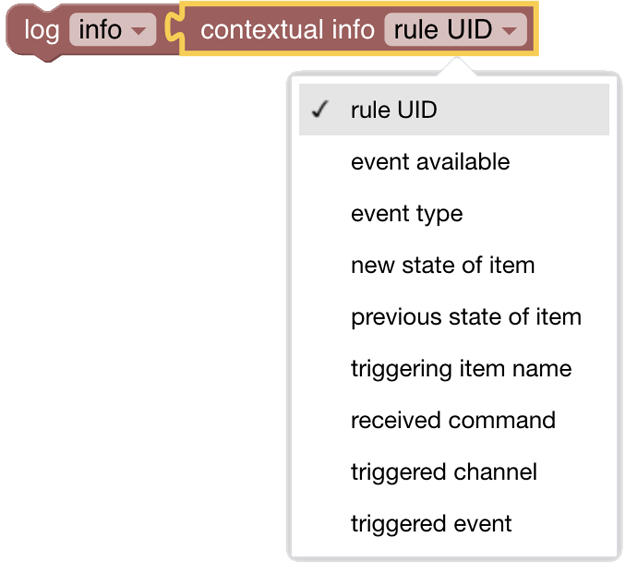

# Run & Process (Rules and Scripts)

[return to Blockly Reference](index.html#run-process-rules-and-scripts)

## Introduction

This section contains several possibilities

- Calling Rules or other scripts either located as files on the server or provided via the UI
- Retrieving attributes provided by the rule context or from the own caller rule.
- Transforming values via different conversion methods (map, regex, jsonpath)

**A note about Rules and Scripts**

A Script *is* a Rule too. It’s just a special type of rule that only has a single script action and a “Script” tag.

{::options toc_levels="2..4"/}

- TOC
{:toc}

{: #blockly-value-storage-overview}

## Overview of the Run & Process blocks


## Run & Process Blocks

### Call Script File


*Function:* Calls a script file with the given name which must be located in the *$OPENHAB_CONF/scripts/* folder.

- No parameters can be provided

### Run Rule or Script created in UI


*Function:* calls another *rule* or *script* that was created via the openHAB UI.

The  *ruleUID* can be found in the list of rules or scripts in the second line of the list (like here *helloBlockly* or *helloWorld*)


Parameters are optional:

- If not providing parameters leave the *with context* section as is.
- If providing parameters you **must** replace the *create empty dictionary* block with [the *dictionary* block from the Lists section](https://community.openhab.org/t/blockly-reference/128785#lists-76), modifying the number of key/value pairs to suit.

Notes:

- parameters can be retrieved in the called script via the "get context attribute"-block (see below)
- the called rule / script cannot return any value
- it is not possible to access a particular function in another script or rule as scripts / rules have to be perceived as completely autonomous
- the called rule / script is run synchronously

### Retrieve context attribute from rule

Function: Retrieve context attributes passed by a calling rule/script (see above)


This retrieves the value for the key "myKey1" that was passed by the calling rule.

*Example*


### Retrieve rule context information



*Function:* Retrieve event context related information of the rule

A rule carries contextual information when triggered - this block can retrieve that information.

- The rule trigger type defines which of the attributes are available to the rule - they will not all be available.
- For more detailed information see [Event Object Attributes](https://openhab-scripters.github.io/openhab-helper-libraries/Guides/Event%20Object%20Attributes.html)

## Transform values via Map, Regex or JsonPath and others

OpenHAB provides many [transformations](https://www.openhab.org/docs/configuration/transformations.html):

- [Map](https://www.openhab.org/addons/transformations/map/)
- [Regex](https://www.openhab.org/addons/transformations/regex/)
- [JsonPath](https://www.openhab.org/addons/transformations/jsonpath/)
- [Binary to Json](https://www.openhab.org/addons/transformations/bin2json/)
- [Exec](https://www.openhab.org/addons/transformations/exec/)
- [JavaScript](https://www.openhab.org/addons/transformations/javascript/)
- [Jinja](https://www.openhab.org/addons/transformations/jinja/)
- [Scale](https://www.openhab.org/addons/transformations/scale/)
- [XPath](https://www.openhab.org/addons/transformations/xpath/)
- [XSLT](https://www.openhab.org/addons/transformations/xslt/)

The following describes examples for Map, Regex, and JsonPath


Function: Transform the given value via one of the different transformation methods

### Example 1: Regex

Convert  #123456 into rgb(12,34,56)


### Example 2: JsonPath transformation

Extract the temperature from the following JSON

```json
{ "device": { "location": "Outside", "status": { "temperature": 23.2 }}}
```

by using the jsonpath

```json
$.device.status.temperature
```


### Example 3: Map transformation

This example applies a map transformation from the map file nanoleaf.map in *$OPENHAB-CONF/transform/*


The above, with the below map file

```text
ON=Ja
OFF=Nein
effects=Effekte
-=?
NULL=n/a
hs = Hue/Saturation
ct = Color Temperature
```

would result in the following log entry

```bash
Hue/Saturation
```

## Inline Script


*Function:* execute arbitrary ECMAScript content

Provides the possibility to inject any ECMAScript at a given position.
This should be used in cases when Blockly does not provide the desired functionality.
Use with diligence.

### Example:


## Return to Blockly Reference

[return to Blockly Reference](index.html#run-process-rules-and-scripts)
